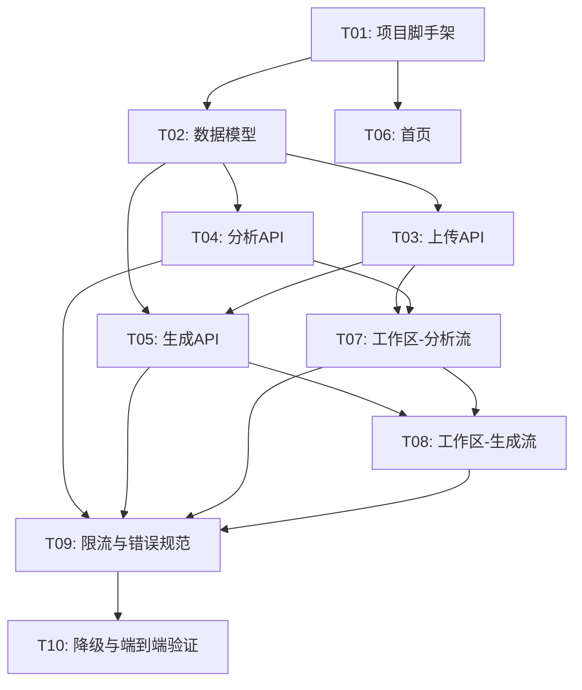

# 实现计划：参考图风格提取与再创作

## 1. 概览

- **项目**: 参考图风格提取与再创作
- **来源架构**: docs/01-1-架构文档-参考图风格再创作.md
- **项目类型**: greenfield
- **技术栈**: Next.js + TypeScript, Tailwind CSS, React Query, PostgreSQL, Cloudflare R2, Gemini 3 Flash, fal.ai / FLUX.2
- **总阶段数**: 4
- **总任务数**: 10
- **总任务文件数**: 10
- **最大并行度**: 2
- **关键路径**: T01 → T02 → T04 → T07 → T08 → T09 → T10

## 2. 输入摘要

### 2.1 核心闭环与目标

**Reference → Recipe → Render**：用户上传参考图 → 两阶段 AI 链路提取结构化视觉配方 → 用户确认/编辑 Prompt → 一键生成同风格新图。

首版验证目标：证明"结构化视觉配方"能稳定驱动同风格再创作。

成功标准：

| 指标 | 首版目标 | 度量方式 |
| --- | --- | --- |
| 分析完成率 | >= 95% | 服务端日志统计 |
| 生成完成率 | >= 95% | 服务端日志统计 |
| 首轮闭环完成率 | >= 35% | Phase B 通过 GA4 埋点度量 |
| Prompt 直接采纳或轻编辑后使用率 | >= 60% | Phase B 通过 GA4 埋点度量 |
| 上传到首张结果图中位耗时 | <= 90 秒 | 服务端日志统计 |
| 分析结果主观有效性 | >= 70% | Phase B 通过反馈收集度量 |

### 2.2 关键 ADR 与实施护栏

| ADR | 决策 | 实施约束 |
| --- | --- | --- |
| ADR-1 | Next.js 单体 | 前端页面 + API Routes 同仓，不拆独立后端服务 |
| ADR-2 | 两阶段串行 AI | 视觉理解 → LLM 结构化，不并行不合并 |
| ADR-3 | DB 轮询 | 不引入 Redis / Queue / Worker |
| ADR-4 | 预签名 URL 直传 R2 | 图片二进制不经过 API 层 |
| ADR-5 | VisualRecipe 是核心 | Prompt 是派生产物，配方是 source of truth |
| ADR-6 | 无 Prompt 版本表 | 每次生成快照 Prompt 到 GenerationTask |

### 2.3 现有代码快照

Greenfield 项目，无现有代码。仅有 `docs/` 目录下的需求设计和架构文档。

### 2.4 架构约束

- 首版不强制登录，匿名即可完成闭环
- 首版不做会话持久化，刷新页面后不恢复工作区状态
- 首版不引入 SSE / WebSocket，使用轮询（分析 2s，生成 3s）
- 所有模型 API Key 仅服务端持有
- 按 IP 限流：上传 10 次/小时，分析 10 次/小时，生成 20 次/小时
- 分析超时 60s，生成超时 120s
- 文件类型限制 JPG/PNG/WebP，<= 10MB

## 3. 模块地图

| 模块 | 类型 | 职责 | 对应任务 |
| --- | --- | --- | --- |
| Upload API | service | 签发预签名 URL，确认上传，创建 Asset 记录 | T03 |
| Analysis API | service | 创建分析任务，编排两阶段 AI 调用，保存配方和 Prompt | T04 |
| Generation API | service | 创建生成任务，调用生图模型，保存结果图 | T05 |
| Task Query API | service | 分析/生成任务状态查询（合并到 T04/T05 各自的 GET 端点） | T04, T05 |
| 首页 | ui | 价值展示 + 上传入口 | T06 |
| 工作区 | ui | 上传、分析展示、Prompt 编辑、生成、对比、迭代 | T07, T08 |
| 数据访问层 | data | PostgreSQL 连接、表定义、Repository | T02 |
| 对象存储集成 | platform | Cloudflare R2 客户端 | T03 |
| AI 模型集成 | platform | Gemini 视觉理解 + LLM 结构化 + fal.ai 生图 | T04, T05 |

## 4. 依赖图



## 5. 阶段摘要

### Phase 1: 基础设施

搭建项目脚手架和数据层，为所有后续任务提供运行基础。

- T01: 项目脚手架（Next.js + TypeScript + Tailwind 初始化）
- T02: 数据模型与访问层（PostgreSQL 表、TypeScript 接口、Repository）

### Phase 2: 核心 API

实现三个核心后端 API，完成服务端全部能力。

- T03: 上传 API（预签名 URL + R2 集成）
- T04: 分析 API（两阶段 AI 链路 + 状态查询）
- T05: 生成 API（异步生图 + 状态查询）

### Phase 3: 前端页面

实现首页和工作区两个页面，覆盖完整用户交互。

- T06: 首页（价值展示 + 上传入口）
- T07: 工作区 - 上传与分析流（上传、分析进度、配方展示、Prompt 编辑）
- T08: 工作区 - 生成与对比流（生成、结果展示、对比视图、迭代）

### Phase 4: 集成与验证

补齐横切关注点，贯通全链路验证。

- T09: 限流与错误规范（按 IP 限流、统一错误格式、超时处理、结构化日志）
- T10: 降级与端到端验证（降级开关、前端错误展示、全链路验证）

## 6. 任务总览

| 任务 | 阶段 | 拆分文件（含状态） | 依赖 |
| --- | --- | --- | --- |
| T01: 项目脚手架 | Phase 1 | backend(done) | 无 |
| T02: 数据模型与访问层 | Phase 1 | backend(done) | T01 |
| T03: 上传 API | Phase 2 | backend(done) | T02 |
| T04: 分析 API | Phase 2 | backend(done) | T02 |
| T05: 生成 API | Phase 2 | backend(done) | T02, T03 |
| T06: 首页 | Phase 3 | frontend(done) | T01 |
| T07: 工作区-上传与分析流 | Phase 3 | frontend(done) | T03, T04 |
| T08: 工作区-生成与对比流 | Phase 3 | frontend(done) | T05, T07 |
| T09: 限流与错误规范 | Phase 4 | integration(done) | T04, T05, T07, T08 |
| T10: 降级与端到端验证 | Phase 4 | integration(done) | T09 |

## 7. 未决策项

| 编号 | 问题 | 影响任务 | 需要谁决策 | 阻塞等级 |
| --- | --- | --- | --- | --- |
| 无 | 架构文档已覆盖所有必要决策 | - | - | - |

## 8. 执行前置

### 8.1 环境准备

- Node.js >= 18
- pnpm（包管理器）
- PostgreSQL 实例可用（本地或托管）
- Cloudflare R2 Bucket 已创建，拥有 Access Key
- Gemini API Key（用于视觉理解和 LLM 结构化）
- fal.ai API Key（用于 FLUX.2 生图）
- 创建 `.env.local` 文件，填写所有 API Key 和数据库连接串

### 8.2 执行顺序

1. **Step 1**: T01（项目脚手架）
2. **Step 2**: T02 + T06（数据层与首页可并行）
3. **Step 3**: T03 + T04（上传 API 与分析 API 可并行）
4. **Step 4**: T05 + T07（生成 API 与工作区分析流可并行）
5. **Step 5**: T08（工作区生成流）
6. **Step 6**: T09（限流与错误规范）
7. **Step 7**: T10（降级与端到端验证）

### 8.3 全局验证

所有任务完成后执行以下命令进行全局验证：

```bash
pnpm build
pnpm lint
pnpm type-check
```

## 9. 变更记录

| 日期 | 变更类型 | 任务 | 说明 |
| --- | --- | --- | --- |
| 2026-03-20 | 初始生成 | 全部 | 首次生成实现计划 |
| 2026-03-21 | 质检修复 | README | 补全 6 项成功标准（原仅列 3 项），标注度量方式 |
| 2026-03-21 | 质检修复 | T04 | 增加 L3 降级路径：LLM 失败时降级返回原始视觉分析结果 |
| 2026-03-21 | 质检修复 | T08 | 文件清单补充 page.tsx 和 use-workspace-state.ts 的 modify 项 |
| 2026-03-21 | 任务拆分 | T09, T10 | 原 T09 拆为 T09（限流+错误规范+日志）和 T10（降级+前端错误展示+全链路验证） |
| 2026-03-21 | 新增 | T10 | 新增降级开关机制（L1/L2/L4 前端降级），补充 L3 降级场景验证 |
