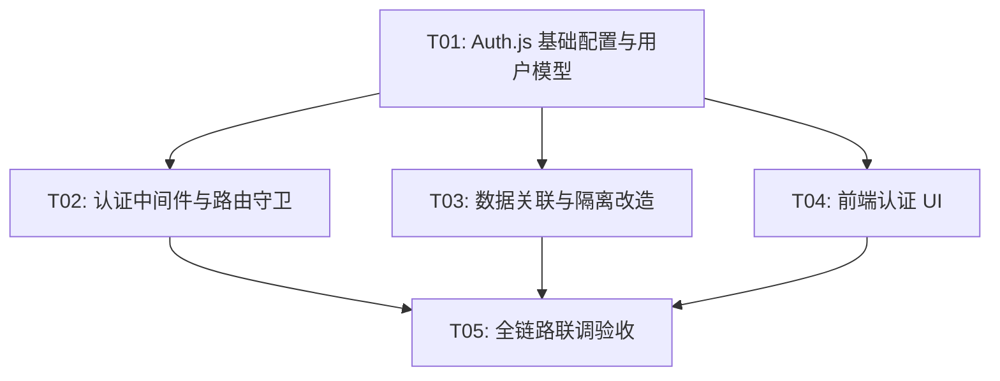

# 实现计划：用户登录与数据打通

## 1. 概览

- **项目**: 用户登录与数据打通
- **来源架构**: docs/02-1-架构文档-用户登录与数据打通.md
- **项目类型**: brownfield
- **技术栈**: Next.js 15 (App Router) + React 19 + Auth.js v5 + PostgreSQL + JWT
- **总阶段数**: 3
- **总任务数**: 5
- **总任务文件数**: 6
- **最大并行度**: 3
- **关键路径**: T01 → T03 → T05

## 2. 输入摘要

### 2.1 核心闭环与目标

**OAuth → Identify → Isolate**：通过 Google OAuth 实现一键登录，所有业务数据关联到用户，实现数据跨会话持久化和用户级隔离。

首版定位：最小可用的用户身份基础设施。不做复杂用户管理，只做身份识别和数据关联。

### 2.2 成功标准

| 指标 | 首版目标 | 验证方式 |
| --- | --- | --- |
| 登录成功率 | >= 99% | 上线后通过认证日志监控验证 |
| 登录到可操作耗时 | <= 5s（中位时间） | 上线后通过性能监控验证 |
| 数据关联准确率 | 100% | T05 E2E 测试验证：所有新建数据 user_id 非空 |
| 数据隔离准确率 | 100% | T05 data-isolation.spec.ts 验证：跨用户查询返回 404 |
| 会话恢复率 | >= 95% | 上线后通过埋点数据验证 |
| CTA 登录转化率 | >= 80% | 上线后通过产品分析工具验证 |

### 2.3 关键 ADR 与实施护栏

| ADR | 决策 | 实施影响 |
| --- | --- | --- |
| ADR-7 | Auth.js v5 + Google OAuth + JWT 会话策略 | 不自建 OAuth，安装 `next-auth` 包 |
| ADR-8 | JWT 存储在 httpOnly cookie，不引入 Redis/DB session store | Auth.js 默认配置，零额外依赖 |
| ADR-9 | 新增 users 表 + 现有表加 user_id FK（允许 NULL） | 3 张表各加一个 nullable 外键列 |
| ADR-10 | Next.js Middleware 统一拦截认证 | 在现有 `src/middleware.ts` 中扩展 |
| ADR-11 | 匿名数据不迁移，新数据强制关联用户 | user_id 默认 NULL，应用层强制写入 |
| ADR-12 | Rate Limit key 从 IP 升级为 userId（已登录）/ IP（未登录） | 改造 `checkRateLimit` 调用方式 |

### 2.4 现有代码快照

| 模块 | 路径 | 现状 |
| --- | --- | --- |
| Middleware | `src/middleware.ts` | 仅 IP 限流，无认证逻辑 |
| Providers | `src/components/providers.tsx` | QueryClient + FileStore，无 SessionProvider |
| Asset Repository | `src/lib/repositories/asset-repository.ts` | 无 userId 参数 |
| AnalysisTask Repository | `src/lib/repositories/analysis-task-repository.ts` | 无 userId 参数 |
| GenerationTask Repository | `src/lib/repositories/generation-task-repository.ts` | 无 userId 参数 |
| API Routes | `src/app/api/` | 5 个路由，均无认证检查 |
| Landing Page | `src/app/page.tsx` | Hero + UploadEntry + ValueSection，无登录按钮 |
| Workspace Page | `src/app/workspace/page.tsx` | 无访问控制 |
| DB Schema | `src/lib/schema.sql` | 3 张表，无 users 表，无 user_id 列 |
| Rate Limit | `src/lib/rate-limit.ts` | 按 IP 限流，`checkRateLimit(ip, action, config)` |
| Layout | `src/app/layout.tsx` | Providers 包裹 children |

### 2.5 架构约束

- 不自建 OAuth 客户端，全部使用 Auth.js 封装
- JWT payload 保持最小（userId、email、name、avatarUrl）
- 不存储 Google access/refresh token
- 数据隔离在 Repository 层实现，WHERE user_id = ?
- 现有匿名数据 user_id 保持 NULL，不迁移

## 3. 模块地图

| 模块 | 类型 | 维度 | 职责 |
| --- | --- | --- | --- |
| Auth API (Auth.js) | service | backend | OAuth 回调、JWT 签发/验证、会话管理 |
| User Repository | data | backend | 用户记录 CRUD，按 google_id 查找或创建 |
| Auth Middleware | platform | backend | 页面路由守卫、API 认证前置检查、限流 key 升级 |
| 现有业务 Repository（改造） | data | backend | 增加 userId 参数，创建时写入、查询时过滤 |
| 现有业务 API（改造） | service | backend | 从 session 获取 userId，传递给 Repository |
| 前端认证 UI | ui | frontend | 登录按钮、CTA 登录触发、用户头像下拉框、SessionProvider |

## 4. 依赖图



## 5. 阶段摘要

### Phase 1：认证基础

安装 Auth.js v5，配置 Google OAuth Provider 和 JWT 策略，创建 users 表和 User Repository，跑通登录/回调/退出流程。

**验证目标**：能通过 Google 登录，JWT 正确签发，用户记录自动创建/更新。

### Phase 2：路由守卫 + 数据关联 + 前端 UI（可并行）

- T02：在 Middleware 中增加认证拦截，升级限流 key 策略
- T03：现有 3 张业务表加 user_id，Repository 和 API Route 改造
- T04：前端 SessionProvider、登录按钮、CTA 逻辑、用户下拉框

**验证目标**：未登录无法访问工作区和业务 API；已登录数据正确关联和隔离；前端正确展示登录状态。

### Phase 3：全链路联调验收

端到端验证完整用户旅程：登录 → 创作 → 数据隔离 → 退出。确保 01 期创作闭环不受影响。

## 6. 任务总览

| 任务 | 阶段 | 拆分文件（含状态） | 依赖 |
| --- | --- | --- | --- |
| T01: Auth.js 基础配置与用户模型 | Phase 1 | backend(in-progress) | 无 |
| T02: 认证中间件与路由守卫 | Phase 2 | backend(review) | T01 |
| T03: 数据关联与隔离改造 | Phase 2 | backend(in-progress) | T01 |
| T04: 前端认证 UI | Phase 2 | frontend(in-progress) | T01 |
| T05: 全链路联调验收 | Phase 3 | frontend(review), integration(review) | T02, T03, T04 |

## 7. 未决策项

| 编号 | 问题 | 影响任务 | 需要谁决策 | 阻塞等级 |
| --- | --- | --- | --- | --- |
| 无 | — | — | — | — |

## 8. 执行前置

### 8.1 环境准备

- Google OAuth Client ID 和 Secret 已获取（Google Cloud Console）
- 在 `.env.local` 中配置 `AUTH_SECRET`、`AUTH_GOOGLE_ID`、`AUTH_GOOGLE_SECRET`
- AUTH_SECRET 可通过 `npx auth secret` 生成
- Google OAuth 回调 URL 配置为 `http://localhost:3000/api/auth/callback/google`（本地开发）
- 本地 PostgreSQL 已启动：`pnpm db:up`

### 8.2 执行顺序

Phase 1: T01 单独执行 → Phase 2: T02、T03、T04 可并行执行 → Phase 3: T05 最后执行

### 8.3 全局验证

所有任务完成后执行以下命令进行全局验证：

```bash
pnpm type-check && pnpm lint && pnpm test && pnpm build
```

## 9. 变更记录

| 日期 | 变更类型 | 任务 | 说明 |
| --- | --- | --- | --- |
| 2026-03-29 | 初始生成 | 全部 | 首次生成实现计划 |
| 2026-03-29 | 质检修补 | README | 增加成功标准表格（架构 2.4） |
| 2026-03-29 | 质检修补 | T01 | 增加认证日志（架构 8.5） |
| 2026-03-29 | 质检修补 | T02 | 增加 AUTH_REQUIRED 降级开关（架构 8.2 L3） |
| 2026-03-29 | 质检修补 | T03 | 增加分析流程事务化说明（架构 8.2 错误处理） |
| 2026-03-29 | 质检修补 | T04 | 增加前端埋点 + signOut 失败兜底（架构 8.5 + 6.3） |
| 2026-03-29 | 质检修补 | T05 | 401 拦截传入 callbackUrl 保留目标页（架构 4.3） |
| 2026-04-04 | 状态校正 | README | 计划存在 review 任务，且 T01/T03/T04 仍有待处理边界项，frontmatter 调整为 in_review |
