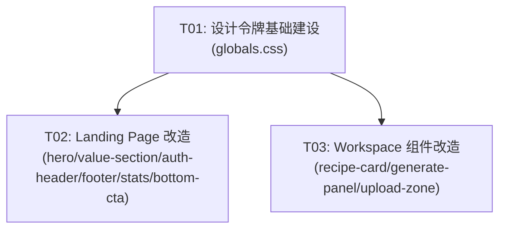

# 实现计划：视觉设计改造

## 1. 概览

- **项目**: 视觉设计改造
- **来源架构**: docs/03-1-架构文档-视觉设计改造.md
- **项目类型**: 前端样式工程（纯视觉改造，无后端逻辑变更）
- **技术栈**: Next.js 15 + React 19 + TypeScript + Tailwind CSS 4
- **总阶段数**: 3
- **总任务数**: 3
- **总任务文件数**: 3
- **最大并行度**: 2（T02 和 T03 可并行）
- **关键路径**: T01 → T02/T03

## 2. 输入摘要

### 2.1 核心闭环与目标

Design Tokens → 组件样式 → 页面视觉 → 品牌感知。通过 Luminescent Darkroom 配色体系 + Stitch Obsidian Core 布局规范，对 Landing Page 和 Workspace 进行全栈视觉改造，强化"精密专业工具"品牌认知。

**边界**：纯前端样式改造，不涉及后端逻辑、数据模型或 API 契约变更。

### 2.2 关键 ADR 与实施护栏

| ADR | 核心选择 | 约束 |
|-----|---------|------|
| ADR-1 | 设计令牌集中定义在 `globals.css` CSS 变量中 | 组件零硬编码 |
| ADR-2 | Ghost Border 统一为 `border-[var(--border)]/{ratio}` | 全站统一透明度 15%/20%/10% |
| ADR-3 | 技术标签统一为 `.label-tech` 工具类 | `font-mono` + uppercase + tracking-widest |
| ADR-4 | Hero Radial Gradient 使用 Tailwind arbitrary value + CSS 变量 | 背景不硬编码 |
| ADR-5 | 增量修改而非重写 | 只改 JSX className，不重写逻辑 |
| ADR-6 | 不引入新 npm 依赖 | 仅使用 `@tabler/icons-react` + 内联 SVG |

### 2.3 现有代码快照

| 文件 | 状态 | 说明 |
|------|------|------|
| `src/app/globals.css` | 存在，已含部分 tokens | 需补充 `.label-tech`、gradient token |
| `src/components/landing/hero.tsx` | 存在 | 需改 radial-gradient + 徽章 + 双 CTA |
| `src/components/landing/value-section.tsx` | 存在 | 需改功能卡片装饰 + hover |
| `src/components/auth/auth-header.tsx` | 存在 | 需改 sticky + backdrop-blur + 图标 |
| `src/components/workspace/recipe-card.tsx` | 存在 | 需改 `.label-tech` 标签样式 |
| `src/components/workspace/generate-panel.tsx` | 存在 | 需改 Aspect Ratio 可视化 |
| `src/components/workspace/upload-zone.tsx` | 存在 | 需改宽屏比例 + hover 边框 |
| `src/components/landing/stats-section.tsx` | 不存在 | 需新建（P1） |
| `src/components/landing/bottom-cta.tsx` | 不存在 | 需新建（P1） |
| `src/components/landing/footer.tsx` | 不存在 | 需新建（P2） |

### 2.4 架构约束

- 不引入侧边栏导航
- 不重新设计全站配色（Luminescent Darkroom 体系保留）
- 不做移动端优先响应式重构（仅必要适配）
- 不引入新 npm 依赖包
- 不修改 `VisualRecipe`、`AnalysisTask`、`GenerationTask` 数据结构

## 3. 模块地图

| 模块 | 类型 | 职责 |
|------|------|------|
| `globals.css` | 基础设施 | 全站设计令牌（颜色、字体、边框、gradient、.label-tech） |
| `hero.tsx` | UI | Landing Hero：radial-gradient 背景、徽章、双 CTA |
| `value-section.tsx` | UI | 功能卡片网格：底部装饰区、hover 效果 |
| `stats-section.tsx` | UI（新建） | 数据统计区：左右布局（文案 + 数据卡） |
| `bottom-cta.tsx` | UI（新建） | 底部 CTA：深底浅字反转按钮 |
| `footer.tsx` | UI（新建） | Footer：版权和链接 |
| `auth-header.tsx` | UI | 导航栏：sticky + backdrop-blur + 功能链接 + 图标 |
| `recipe-card.tsx` | UI | Recipe Card：技术标签样式（.label-tech） |
| `generate-panel.tsx` | UI | 生成面板：Aspect Ratio 可视化、生成按钮 |
| `upload-zone.tsx` | UI | 上传区：宽屏比例、hover 边框效果 |

## 4. 依赖图



## 5. 阶段摘要

| 阶段 | 内容 | P0/P1/P2 | 关键任务 |
|------|------|----------|---------|
| Phase A | 设计令牌基础建设 | P0 | T01 |
| Phase B | Landing Page 改造 | P0 + P1 + P2 | T02 |
| Phase C | Workspace 组件改造 | P0 + P1 | T03 |

## 6. 任务总览

| 任务 | 阶段 | 拆分文件 | 状态 | 依赖 |
|------|------|---------|------|------|
| T01 | Phase A | `T01-design-tokens.md` | done | - |
| T02 | Phase B | `T02-landing-page.md` | done | T01 |
| T03 | Phase C | `T03-workspace.md` | done | T01 |

## 7. 未决策项

| 编号 | 问题 | 影响任务 | 需要谁决策 | 阻塞等级 |
|------|------|---------|---------|---------|
| - | 无 | - | - | - |

> 架构文档 `open_questions` 为空，所有决策已由 ADR 锁定。

## 8. 执行前置

### 8.1 环境准备

- Node.js 18+
- pnpm 8+
- `.env.local` 配置正确（参考 `.env.example`）
- 本地开发服务器可用：`pnpm dev`

### 8.2 执行顺序

1. **T01**（必须先行）：补充 `globals.css` 中的设计令牌，定义 `.label-tech` 工具类，记录 Bundle Size 基线
2. **T02** 和 **T03**（可并行）：在 T01 就绪后分别改造 Landing Page 和 Workspace 组件
3. 全部完成后执行全局验证：`pnpm type-check && pnpm lint && pnpm test && pnpm build`

### 8.3 全局验收（Phase D）

全部任务完成后，执行以下验收：

```bash
# 类型 + 规范 + 测试
pnpm type-check && pnpm lint && pnpm test

# Bundle Size 对比（架构 §8.1：增量不超过 5KB gzipped）
pnpm build 2>&1 | grep -E "(Route|Page)"

# Lighthouse Performance（架构 §8.1：不低于改造前基准 10 分）
# 使用 Chrome DevTools > Lighthouse，记录 Performance 分数，对比改造前基准
```

> **手动验收清单**：
> - [ ] Landing Page Hero radial-gradient + 徽章 + 双 CTA 正常展示
> - [ ] 功能卡片 hover 效果和底部装饰条正常
> - [ ] 导航栏功能链接和图标正常
> - [ ] Recipe Card 标签使用 `.label-tech` 样式（10px/uppercase/mono）
> - [ ] 全站 Ghost Border 透明度统一为 `/15`
> - [ ] 新增文本对比度满足 WCAG AA（axe 插件抽查）
> - [ ] Lighthouse Performance ≥ 改造前基准（记录基线）

## 9. 变更记录

| 日期 | 变更类型 | 任务 | 说明 |
|------|---------|------|------|
| 2026-04-02 | 初始生成 | 全部 | 首次生成实现计划 |
| 2026-04-02 | 移除 | T04 | 集成验收任务冗余，已删除；验证命令分散至各任务文件 |
| 2026-04-09 | 状态校正 | README + T01 + T03 | T01 design tokens 已完整（.label-tech + --gradient-primary），T03 workspace Ghost Border /15 统一完成，全部任务标记 done，计划 status 更新为 accepted |
| 2026-04-04 | 状态校正 | README | T02 已进入 review，T01/T03 仍有未闭合任务项，frontmatter 调整为 in_review |
