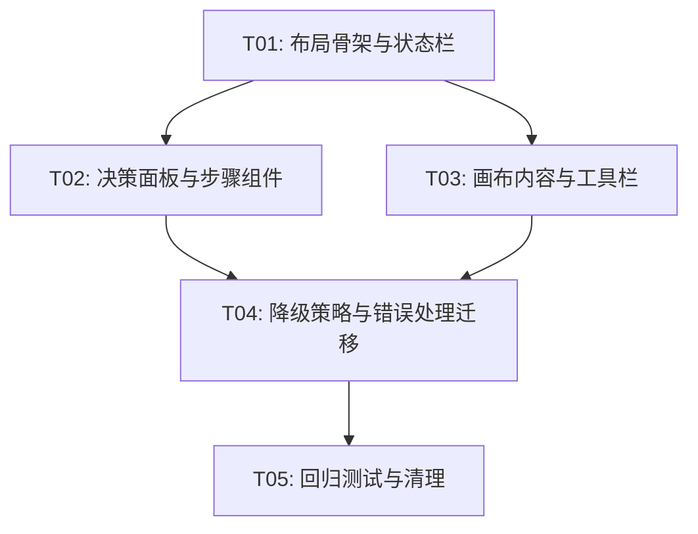

# 实现计划：Workspace 页面重构

## 1. 概览

- **项目**: Workspace 页面重构 — 三栏布局升级为两段式专业工作台
- **来源架构**: docs/04-1-架构文档-workspace页面重构.md
- **项目类型**: brownfield
- **技术栈**: Next.js 15 (App Router) + React 19 + TypeScript + Tailwind CSS 4 + Vitest + Playwright
- **总阶段数**: 5
- **总任务数**: 5
- **总任务文件数**: 7
- **最大并行度**: 2
- **关键路径**: T01 → T02 → T03 → T04 → T05

## 2. 输入摘要

### 2.1 核心闭环与目标

将 Workspace 从三栏并列布局（`grid-cols-[5fr_5fr_3fr]`）升级为两段式工作台（内容画布 60-65% + 决策面板 35-40%），核心闭环：**Upload → Analyze → Render → Iterate**。纯前端信息架构重构，不涉及后端 API 或数据模型变更。

### 成功标准

| 指标 | 首版目标 | 度量方式 |
|------|---------|---------|
| 功能完整性 | US-01~US-09 交互路径可走通 | E2E 测试覆盖 |
| 布局正确性 | 桌面端 ≥1280px 两段式布局正确渲染，画布占 60-65% | 视觉回归测试 |
| 状态流转正确 | idle→generation_ready 全链路无误 | E2E 状态机测试 |
| 降级策略完整 | L1-L4 四种降级场景正确展示 | E2E 降级场景测试 |
| 错误处理完整 | 三种错误态均有 ErrorDisplay | E2E 错误场景测试 |
| 首轮生成完成率 | ≥50%（间接验证：E2E 全链路可走通） | 自动度量依赖后续接入分析工具 |
| 页面首屏渲染 FCP | ≤1.5s（参考目标，首版不做自动化度量） | 后续接入性能监控 |

### 2.2 关键 ADR 与实施护栏

| ADR | 要点 | 实施约束 |
|-----|------|---------|
| ADR-1 | CSS Grid 两栏布局（`grid-cols-[1fr_380px]`），画布最小宽度 55% | 不做拖拽调整宽度，不做移动端适配 |
| ADR-2 | 统一 `WorkspaceCanvas` 组件，内部按状态切换子视图 | `ComparisonView` 降级为画布内部视图模式 |
| ADR-3 | Recipe 渐进披露：5 字段摘要 + 按需展开完整配方 | 画布底部展示 3-5 个 StyleTag |
| ADR-4 | 复用 UploadZone/PromptEditor/ErrorDisplay/RetryButton；改造 RecipeCard→RecipeStep；新建 WorkspaceCanvas/StatusBar/DecisionPanel/CanvasToolbar/StyleTagBar/OutputSettings | 不新建自定义 Hook 封装 canvasView |
| ADR-5 | 在 useWorkspaceState 基础上增量扩展，不引入新状态管理库 | canvasView 采用派生计算，isRecipeExpanded 为独立 UI 状态 |
| ADR-6 | WorkspacePage 保持薄编排层，条件渲染逻辑下沉到子组件 | page.tsx 目标 ≤150 行 |
| ADR-7 | 降级/错误态嵌入对应 Step 区域 | ErrorDisplay 使用紧凑模式 |

### 2.3 现有代码快照

| 类别 | 文件 | 说明 |
|------|------|------|
| 页面 | `src/app/workspace/page.tsx` | 当前 543 行，含大量条件渲染和回调定义 |
| 状态管理 | `src/hooks/use-workspace-state.ts` | 含 WorkspaceState 枚举、降级状态、sessionStorage 持久化 |
| 上传 | `src/hooks/use-upload.ts` | 文件上传 hook |
| 分析轮询 | `src/hooks/use-analysis.ts` | 分析任务轮询 |
| 生成轮询 | `src/hooks/use-generation.ts` | 生成任务轮询 |
| 组件-复用 | `src/components/workspace/upload-zone.tsx` | 上传区（直接复用） |
| 组件-复用 | `src/components/workspace/prompt-editor.tsx` | Prompt 编辑器（直接复用） |
| 组件-复用 | `src/components/workspace/error-display.tsx` | 错误展示（直接复用） |
| 组件-复用 | `src/components/workspace/retry-button.tsx` | 重试按钮（直接复用） |
| 组件-改造 | `src/components/workspace/recipe-card.tsx` | 需拆分为 RecipeSummary + RecipeDetail |
| 组件-改造 | `src/components/workspace/generate-panel.tsx` | 改造为 OutputSettings，调整按钮文案 |
| 组件-降级 | `src/components/workspace/comparison-view.tsx` | 对比能力吸收进 WorkspaceCanvas |
| 组件-降级 | `src/components/workspace/result-display.tsx` | 下载和放大能力吸收进 CanvasToolbar |
| 组件-辅助 | `src/components/workspace/analysis-progress.tsx` | 分析进度 |
| 组件-辅助 | `src/components/workspace/generation-progress.tsx` | 生成进度 |
| 组件-辅助 | `src/components/workspace/empty-analysis.tsx` | 空态提示 |

### 2.4 架构约束

1. 纯前端重构，所有 API 调用和数据结构保持不变
2. 全局导航 AuthHeader（layout.tsx 渲染）保留不变
3. 不引入新依赖或大规模组件库替换
4. 不引入特性开关 / feature flag
5. 聚焦桌面端 ≥1280px
6. canvasView 派生计算，不独立存储为状态

## 3. 模块地图

| 模块 | 类型 | 职责 | 维度 |
|------|------|------|------|
| WorkspacePage | ui/编排 | 薄编排层：初始化 hook、跨组件回调、顶层布局 | frontend |
| StatusBar | ui | 顶部状态栏：标题、说明、状态标签、更换参考图按钮 | frontend |
| WorkspaceCanvas | ui | 左侧内容画布：按 canvasView 切换子视图 | frontend |
| DecisionPanel | ui | 右侧决策面板容器：组织 Step 1/2/3 | frontend |
| RecipeStep | ui | Step 1 风格拆解：摘要+展开+降级 | frontend |
| OutputSettings | ui | Step 3 输出设置：宽高比、画质、按钮 | frontend |
| CanvasToolbar | ui | 画布工具栏：结果图/对比/下载 | frontend |
| StyleTagBar | ui | 画布底部风格标签 | frontend |
| useWorkspaceState | hook | 状态管理增量扩展 | frontend |
| 回归与清理 | integration | 测试迁移、E2E、视觉回归、废弃代码清理 | integration |

## 4. 依赖图



## 5. 阶段摘要

### Phase 1: 布局骨架与状态栏（T01）

搭建两段式 Grid 布局骨架，创建 StatusBar 组件，重构 page.tsx 为薄编排层。这是所有后续任务的基础。

### Phase 2: 决策面板与画布内容（T02 + T03，可并行）

- T02：创建 DecisionPanel 容器，拆分 RecipeCard 为 RecipeStep，改造 GeneratePanel 为 OutputSettings，集成 PromptEditor 为 Step 2
- T03：创建 WorkspaceCanvas 统一画布，集成 UploadZone/参考图/结果图/对比视图，创建 CanvasToolbar 和 StyleTagBar

### Phase 3: 降级策略与错误处理迁移（T04）

将 L1-L4 降级提示和 ErrorDisplay 从 page.tsx 内联代码迁移到对应 Step 区域，确保所有降级场景在新布局中正确展示。

### Phase 4: 回归测试与清理（T05）

迁移现有组件测试到新组件，补充 E2E 测试覆盖完整状态流转，清理废弃的旧布局代码。

## 6. 任务总览

| 任务 | 阶段 | 拆分文件（含状态） | 依赖 |
| --- | --- | --- | --- |
| T01: 布局骨架与状态栏 | Phase 1 | frontend(done) | 无 |
| T02: 决策面板与步骤组件 | Phase 2 | frontend(done) | T01 |
| T03: 画布内容与工具栏 | Phase 2 | frontend(done) | T01 |
| T04: 降级策略与错误处理迁移 | Phase 3 | frontend(done) | T02, T03 |
| T05: 回归测试与清理 | Phase 4 | frontend(done), integration(done) | T04 |

## 7. 未决策项

| 编号 | 问题 | 影响任务 | 需要谁决策 | 阻塞等级 |
| --- | --- | --- | --- | --- |
| 无 | — | — | — | — |

## 8. 执行前置

### 8.1 环境准备

- 安装依赖：`pnpm install`
- 确保 `pnpm dev` 能正常启动
- 确保 `pnpm build && pnpm type-check` 通过

### 8.2 执行顺序

Phase 1: T01 单独执行 → Phase 2: T02 和 T03 可并行执行 → Phase 3: T04 → Phase 4: T05

### 8.3 全局验证

所有任务完成后执行以下命令进行全局验证：

```bash
pnpm type-check && pnpm lint && pnpm build && pnpm test
```

## 9. 变更记录

| 日期 | 变更类型 | 任务 | 说明 |
| --- | --- | --- | --- |
| 2026-04-05 | 初始生成 | 全部 | 首次生成实现计划 |
| 2026-04-05 | 质检修补 | README, T01, T02, T03, T05-integration | 补充成功标准表（含首轮完成率+FCP）；T01 completeGeneration 重置 isRecipeExpanded；T02 展开动画 ≤300ms + RecipeSummary 接口定义位置；T03 画布切换 ≤200ms + StyleTag 接口定义位置；T05-integration 补充 US-07~US-09 E2E 覆盖 |

<!-- 保留目录：reviews/。当 task-review、dev-plan-check 等开始运行时创建。 -->
