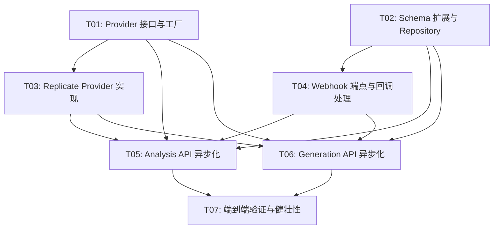

# 实现计划：AI Provider 扩展与异步通信升级

## 1. 概览

- **项目**: AI Provider 扩展与异步通信升级
- **来源架构**: docs/05-1-架构文档-AI-Provider扩展与异步通信升级.md
- **项目类型**: brownfield
- **技术栈**: Next.js 15 (App Router) + React 19 + TypeScript + PostgreSQL/Drizzle + Replicate SDK + Cloudflare R2
- **总阶段数**: 3
- **总任务数**: 7
- **总任务文件数**: 7
- **最大并行度**: 2
- **关键路径**: T01 → T03 → T05 → T07

## 2. 输入摘要

### 2.1 核心闭环与目标

在已有 **Reference → Recipe → Render** 核心闭环基础上完成两项技术升级：

1. 视觉分析和图像生成引入 Replicate 作为可配置的默认 Provider
2. 后端通过 Replicate Webhook 异步接收结果，释放服务端长连接占用

前端通信方式不变（React Query 轮询），用户操作流程不变，不新增领域对象。

### 2.2 关键 ADR 与实施护栏

| ADR | 要点 | 护栏 |
| --- | --- | --- |
| ADR-1 | Provider 接口抽象 + 环境变量切换 | 接口 + 工厂函数，不用注册中心 |
| ADR-2 | Replicate Webhook 异步接收结果 | 5 分钟超时；Gemini/fal.ai 保留同步 |
| ADR-3 | 前端保留 React Query 轮询 | 不引入 SSE/WebSocket |
| ADR-4 | 分析链路异步化（Replicate 模式） | Webhook 处理中同步调用 Gemini 结构化 |
| ADR-5 | Webhook 安全与任务关联 | 签名验证 + URL query 参数传递 taskType/taskId |

### 2.3 现有代码快照

| 模块 | 路径 | 说明 |
| --- | --- | --- |
| 视觉分析 | `src/lib/ai/vision.ts` | Gemini 视觉模型调用，返回原始分析文本 |
| 结构化整理 | `src/lib/ai/structurer.ts` | Gemini LLM 结构化，返回 VisualRecipe + Prompt |
| 图像生成 | `src/lib/ai/image-gen.ts` | fal.ai FLUX 调用，返回临时图片 URL |
| Prompt 模板 | `src/lib/ai/prompts.ts` | 两阶段系统提示词 |
| DB Schema | `src/lib/db/schema.ts` | analysisTasks、generationTasks 表定义 |
| 分析 Repository | `src/lib/repositories/analysis-task-repository.ts` | CRUD + 状态更新 |
| 生成 Repository | `src/lib/repositories/generation-task-repository.ts` | CRUD + 状态更新 |
| 资产 Repository | `src/lib/repositories/asset-repository.ts` | 资产记录管理 |
| Analysis API | `src/app/api/analysis/route.ts` | 同步两阶段分析，请求内返回结果 |
| Analysis Query | `src/app/api/analysis/[id]/route.ts` | 状态轮询 |
| Generation API | `src/app/api/generation/route.ts` | fire-and-forget 异步生成 |
| Generation Query | `src/app/api/generation/[id]/route.ts` | 状态轮询 |
| 领域类型 | `src/types/models.ts` | AnalysisTask / GenerationTask 等接口 |
| R2 客户端 | `src/lib/r2.ts` | 上传 / 预签名 URL |

### 2.4 架构约束

- 不引入 Provider 注册中心 / 动态发现
- 不引入 SSE / WebSocket / EventEmitter
- 不做 Provider 自动降级 / 熔断器
- 不做 Webhook 重试队列（Replicate 自带重试）
- 结构化整理阶段不切换 Provider（仅用 Gemini）
- 保持现有 Rate Limit 策略不变（上传 10/h，分析 10/h，生成 20/h）

## 3. 模块地图

| 模块 | 类型 | 维度 | 对应任务 |
| --- | --- | --- | --- |
| Provider 接口与工厂 (`ai/providers/`) | service | backend | T01 |
| DB Schema 扩展 | data | backend | T02 |
| Replicate Provider 实现 | service | backend | T03 |
| Webhook API (`/api/webhooks/replicate`) | service | backend | T04 |
| Analysis API 改造 | service | backend | T05 |
| Generation API 改造 | service | backend | T06 |
| 端到端验证 | integration | integration | T07 |

## 4. 依赖图



## 5. 阶段摘要

### Phase A：Provider 抽象层（T01 + T02，可并行）

建立 Provider 接口抽象、工厂函数、环境变量配置，将现有 Gemini/fal.ai 包装为 Provider 实现。同时扩展 DB Schema 新增 provider/externalId/modelName 字段。

**验证目标**：Provider 工厂能根据配置返回正确 Provider 实例；Schema 迁移成功。

### Phase B：Replicate 接入 + Webhook（T03 + T04，可并行）

实现 Replicate Vision 和 ImageGen Provider，实现 Webhook 端点接收回调。

**验证目标**：Replicate Provider 单元测试通过；Webhook 签名验证和回调处理逻辑正确。

### Phase C：API 改造 + 端到端验证（T05 + T06 可并行 → T07）

改造 Analysis/Generation API 路由使用 Provider 工厂，支持 Replicate 异步模式。最后进行端到端联调验证。

**验证目标**：默认 Replicate 配置下全链路跑通；切换回 Gemini/fal.ai 后功能正常；异常路径全覆盖。

## 6. 任务总览

| 任务 | 阶段 | 拆分文件（含状态） | 依赖 |
| --- | --- | --- | --- |
| T01: Provider 接口与工厂 | Phase A | backend(done) | 无 |
| T02: Schema 扩展与 Repository | Phase A | backend(done) | 无 |
| T03: Replicate Provider 实现 | Phase B | backend(done) | T01 |
| T04: Webhook 端点与回调处理 | Phase B | backend(done) | T02 |
| T05: Analysis API 异步化 | Phase C | backend(done) | T01, T02, T03, T04 |
| T06: Generation API 异步化 | Phase C | backend(done) | T01, T02, T03, T04 |
| T07: 端到端验证与健壮性 | Phase C | integration(done) | T05, T06 |

## 7. 未决策项

| 编号 | 问题 | 影响任务 | 需要谁决策 | 阻塞等级 |
| --- | --- | --- | --- | --- |
| 无 | — | — | — | — |

## 8. 执行前置

### 8.1 环境准备

- `pnpm install` 安装依赖
- Docker 运行本地 PostgreSQL：`pnpm db:up`
- `.env` 配置以下环境变量：
  - `REPLICATE_API_TOKEN`：Replicate API 令牌
  - `REPLICATE_WEBHOOK_SECRET`：Webhook 签名验证密钥
  - `VISION_PROVIDER`：视觉分析 Provider（`replicate` | `gemini`，默认 `replicate`）
  - `IMAGE_GEN_PROVIDER`：图像生成 Provider（`replicate` | `fal`，默认 `replicate`）
  - 保留现有 `GEMINI_API_KEY`、`FAL_KEY`、`DATABASE_URL`、`R2_*` 配置

### 8.2 执行顺序

```
Wave 1: T01 + T02（并行）
Wave 2: T03 + T04（并行，T03 依赖 T01，T04 依赖 T02）
Wave 3: T05 + T06（并行，均依赖 T01-T04）
Wave 4: T07（依赖 T05 + T06）
```

### 8.3 全局验证

所有任务完成后执行以下命令进行全局验证：

```bash
pnpm type-check && pnpm lint && pnpm test && pnpm build
```

## 9. 变更记录

| 日期 | 变更类型 | 任务 | 说明 |
| --- | --- | --- | --- |
| 2026-04-06 | 初始生成 | 全部 | 首次生成实现计划 |
| 2026-04-06 | 任务完成 | T06 | Generation API 异步化（Backend）验收通过，23/23 测试通过 |

<!-- 保留目录：reviews/。当 task-review、dev-plan-check 等开始运行时创建。 -->
