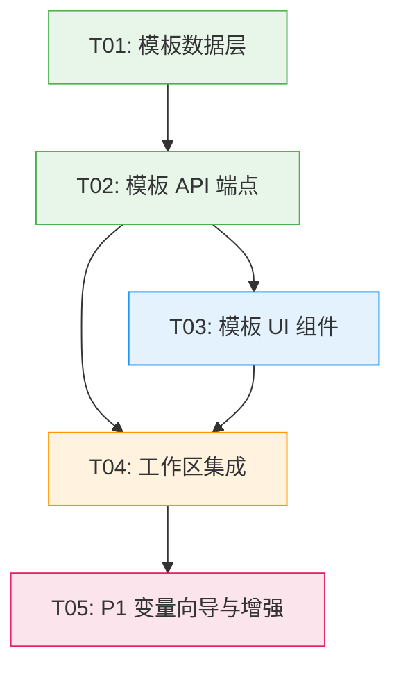

# 实现计划：Prompt 模板化与变量系统

## 1. 概览

- **项目**: Prompt 模板化与变量系统
- **来源架构**: `docs/06-1-架构文档-Prompt模板化与变量系统.md`
- **项目类型**: Brownfield（在现有 Next.js 工作台基础上扩展）
- **技术栈**: Next.js 15 + React 19 + TypeScript + Tailwind CSS 4 + Drizzle ORM + PostgreSQL + NextAuth
- **总阶段数**: 3（Phase A: 数据层 + API → Phase B: UI 闭环 → Phase C: P1 增强）
- **总任务数**: 5
- **总任务文件数**: 7
- **最大并行度**: 2（T03 与 T04 可并行）
- **关键路径**: T01 → T02 → T03 → T04

## 2. 输入摘要

### 2.1 核心闭环与目标

在已有 **Reference → Recipe → Render** 工作台基础上新增 **Template** 能力层。核心闭环：**Recipe → Template → Render**。

首版验证目标：证明「模板保存 → 变量填值 → 一键生成」的闭环能显著降低同风格换主体的操作成本。

### 2.2 关键 ADR 与实施护栏

| ADR | 决策 | 约束 |
| --- | --- | --- |
| ADR-1 | 模板存储于 PostgreSQL 新建 `templates` 表 | 独立表，JSONB 存储变量定义 |
| ADR-2 | 变量机制采用「正则提取 + 字符串替换」 | 不引入 Mustache/Handlebars 等模板引擎库 |
| ADR-3 | 模板 API 采用 RESTful CRUD，4 个端点 | POST/GET list/GET detail/DELETE |
| ADR-4 | 变量定义作为正文派生数据 | 保存时自动提取，不维护双向绑定 |
| ADR-5 | Drawer + 内嵌向导双组件架构 | Drawer ~320px，向导内嵌替换编辑区 |
| ADR-6 | 模板与用户归属沿用 userId 关联模式 | 复用 NextAuth session |
| ADR-7 | 「保存为模板」读取编辑器当前内容 | 非分析任务快照 |

### 2.3 现有代码快照

| 层 | 文件/目录 | 关键模式 |
| --- | --- | --- |
| DB Schema | `src/lib/db/schema.ts`（149 行） | pgTable + varchar/text/jsonb/timestamp + index |
| Repository | `src/lib/repositories/`（4 个文件） | rowToXxx 转换 + generateId() + userId 隔离 |
| API Route | `src/app/api/analysis/route.ts`（270 行） | auth() 认证 + validateBody + { error, code, retryable } |
| 类型定义 | `src/types/models.ts`（101 行） | interface 定义：Asset, AnalysisTask, GenerationTask 等 |
| Workspace 页面 | `src/app/workspace/page.tsx`（490 行） | 三列网格布局，含状态管理 |
| Prompt Editor | `src/components/workspace/prompt-editor.tsx`（67 行） | 双 textarea 受控组件 |
| 工作区组件 | `src/components/workspace/`（17 个组件） | canvas, recipe, prompt, output 等 |
| 认证 | `src/auth.ts`（75 行） | NextAuth → auth() → session.user.id |
| ULID | `src/lib/ulid.ts`（6 行） | generateId() 导出 |
| DB 连接 | `src/lib/db/index.ts`（36 行） | getDb() + db Proxy 实例 |

### 2.4 架构约束

- 无新增 npm 依赖（纯数据库操作 + 原生 RegExp）
- 复用现有错误格式 `{ error, code, retryable }`
- 复用现有认证模式 `auth()` → `session.user.id`
- ID 策略沿用 ULID（`generateId()` from `@/lib/ulid`）
- 模板功能不调用外部 AI 服务，故障隔离性好

## 3. 模块地图

| 模块 | 类型 | 职责 | 对应任务 |
| --- | --- | --- | --- |
| Template API (`/api/templates`) | service | 模板 CRUD 的 HTTP 入口，认证/校验/日志 | T02 |
| Template Repository | data | `templates` 表的数据访问层，CRUD + 变量提取 | T01 |
| 变量解析模块 (`lib/template-parser`) | data | 从模板正文提取/替换 `{{var}}` 标记 | T01 |
| 模板保存对话框组件 | ui | 收集名称、编辑文本、插入变量标记 | T03 |
| 模板 Drawer 组件 | ui | 展示模板列表、使用/删除/复制操作 | T03 |
| 变量向导组件（P1） | ui | 变量填值表单、执行替换并输出最终 prompt | T05 |
| 工作区集成 | integration | 入口按钮、Drawer/Dialog 状态管理、加载逻辑 | T04 |

## 4. 依赖图



## 5. 阶段摘要

### Phase A：模板数据层 + 核心 CRUD

建立模板系统的数据基础设施和全部 4 个 RESTful API 端点。

**任务**: T01（数据层）→ T02（API 端点），串行执行
**验证目标**: `pnpm db:push` 成功 + `pnpm type-check` 通过 + curl 可走通全部 CRUD

### Phase B：模板 UI 闭环

实现 P0 全部前端交互：保存对话框、模板 Drawer、加载到编辑器、删除确认。

**任务**: T03（UI 组件）+ T04（工作区集成），T03 先行，T04 依赖 T03
**验证目标**: 浏览器可完成完整「保存 → 列表 → 加载 → 删除」循环

### Phase C：体验增强（P1）

变量向导填值面板、模板重命名/复制接口与 UI。

**任务**: T05（P1 增强），串行于 T04 之后
**验证目标**: 「检测变量 → 向导填值 → 替换 → 生成」全链路走通

## 6. 任务总览

| 任务 | 阶段 | 拆分文件（含状态） | 依赖 |
| --- | --- | --- | --- |
| T01: 模板数据层 | Phase A | [backend](T01-模板数据层-backend.md) (done) | 无 |
| T02: 模板 API 端点 | Phase A | [backend](T02-模板API端点-backend.md) (done) | T01 |
| T03: 模板 UI 组件 | Phase B | [frontend](T03-模板UI组件-frontend.md) (done) | T02 |
| T04: 工作区集成 | Phase B | [frontend](T04-工作区集成-frontend.md) (done) | T02, T03 |
| T05: P1 变量向导与增强 | Phase C | [integration](T05-P1变量向导与增强-integration.md) (done) | T04 |

## 7. 未决策项

| 编号 | 问题 | 影响任务 | 需要谁决策 | 阻塞等级 |
| --- | --- | --- | --- | --- |
| — | 无 | — | — | — |

## 8. 执行前置

### 8.1 环境准备

- 数据库已启动：`pnpm db:up`
- 依赖已安装：`pnpm install`
- 确认 `DATABASE_URL` 环境变量已配置

### 8.2 执行顺序

```
Phase A（串行）:
  T01 模板数据层 → T02 模板 API 端点

Phase B（T03 先行，T04 依赖 T03）:
  T03 模板 UI 组件 → T04 工作区集成

Phase C（串行）:
  T05 P1 变量向导与增强
```

### 8.3 全局验证

所有任务完成后执行以下命令进行全局验证：

```bash
pnpm type-check && pnpm lint && pnpm test && pnpm build
```

## 9. 变更记录

| 日期 | 变更类型 | 任务 | 说明 |
| --- | --- | --- | --- |
| 2026-04-09 | 全量重写 | 全部 | 基于架构文档重新生成实现计划，确认所有文件路径与仓库现状一致 |

<!-- 保留目录：reviews/。当 task-review、dev-plan-check 等开始运行时创建。 -->
