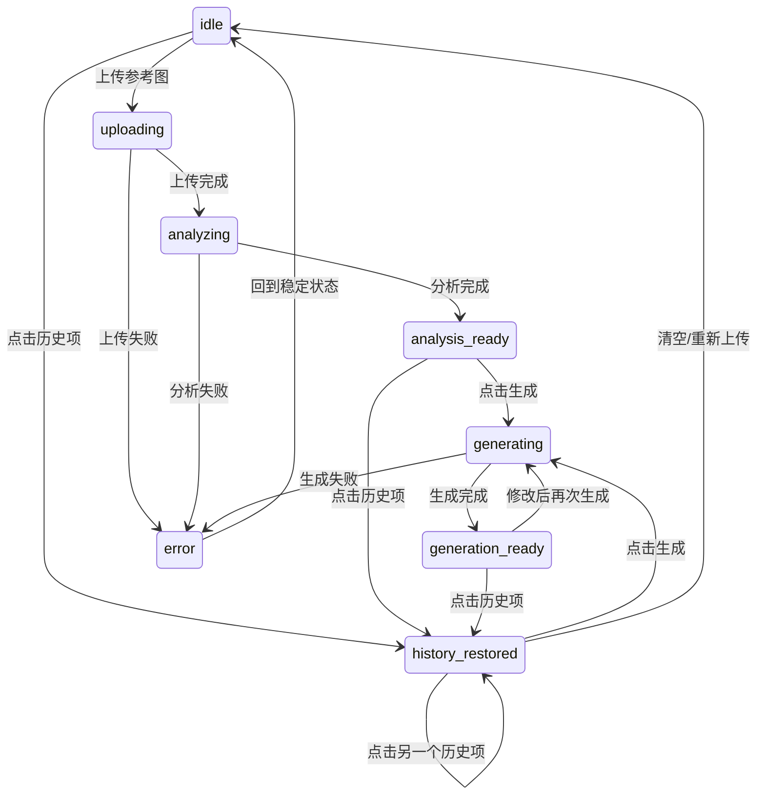

# 架构设计文档：工作台交互改造

_本文件只保留当前版本真正影响实现的架构决策、边界和契约；DDL、目录树、环境变量、实施故事等内容默认不放入正文。_

## 1. 系统摘要

Visoryn 工作台的交互架构升级。将两段式布局改为三段式专业工作台（左导航 + 中央工作区 + 右侧历史面板），新增生成历史回溯能力和 Recipe 4 行编辑模式，模板库独立为页面。

核心闭环不变：**Reference → Recipe → Render**

本期验证目标：三段式布局能否在保持核心闭环不变的前提下，显著提升多次迭代生成的效率——用户能否通过历史回溯 + Recipe 快编 + 模板复用形成连续创作循环。

## 2. 范围、非目标与成功标准

### 2.1 范围

1. 三段式布局：Header + Left Sidebar + 中央工作区 + Right History Panel
2. Left Sidebar：品牌标题 + Generate/Library 导航 + 底部辅助链接；workspace 与 templates 共享；支持折叠为 icon-only 模式（48px）
3. 布局过渡动画：面板出现/消失使用过渡动画，消除硬切跳变
4. Recipe 4 行编辑模式：Subject/Style/Lighting/Composition，每行可内联编辑，保留展开完整配方
5. 生成历史面板：后端列表 API + 前端缩略图列表 + 点击恢复工作区状态
6. 模板库独立页面：`/workspace/templates`，搜索 + 卡片网格 + Use Template 跳转
7. 废弃组件清理：移除旧版决策面板中已替代的组件
8. Left Sidebar / Right History Panel 可折叠/隐藏：折叠时中央工作区自动扩展，展开后恢复；折叠状态不持久化（默认展开）

### 2.2 明确不做

- 面板宽度可拖拽调整
- 真实上传进度（替换模拟进度条）— 延续 04 期模拟进度方案，本期聚焦布局和交互架构升级；进度真实性改造涉及上传链路重构，优先级低于布局改造，延至后续版本
- 替换参考图确认流程修复 — 属于边界场景修复，本期聚焦架构升级，延至后续版本
- 模板库全文搜索 / 标签过滤 / 排序
- 历史面板参考-结果配对展示
- 快捷键支持
- 浏览器临时缓存恢复（已改为服务端持久化）
- Landing Page 改造
- 移动端适配
- 对话式交互 / 节点编辑器

### 2.3 成功标准

| 指标 | 首版目标 |
| --- | --- |
| 三段式布局渲染 | ≥ 1280px 宽度下三列同时可见，无跳变 |
| 核心用户故事 | US-01 ~ US-07 全部可正常走通 |
| 历史恢复 | 点击历史项后工作区正确恢复 Recipe + Prompt + 结果图 |
| 模板库跳转 | Use Template 后跳转至工作台并加载模板内容 |
| 降级策略 | 现有降级策略在新布局中正确呈现 |
| 面板折叠 | Sidebar 折叠为 icon-only 后中央工作区自动扩展，展开后恢复三段式；History Panel 同理 |

### 2.4 验收标准承接矩阵

| AC-ID | PRD 原文摘要 | 承接模块 | 关键链路/状态 | 风险/降级 |
|-------|------------|---------|-------------|----------|
| AC-01 | 三段式布局渲染（≥ 1280px） | WorkspaceLayout + LeftSidebar + HistoryPanel | §3.1 主流程：进入工作台即渲染三段式 | — |
| AC-02 | 4 行编辑卡片平滑过渡 | RecipeEditor | §3.3 analyzing→analysis_ready + CSS transition | — |
| AC-03 | 编辑 Recipe 不覆盖 Prompt | RecipeEditor | ADR-10，§4.2 明确"不自动重新生成 Prompt" | — |
| AC-04 | 生成后历史面板自动新增 | HistoryPanel + useGeneration | §6.1，React Query invalidation 触发刷新 | — |
| AC-05 | 历史恢复完整状态 | useHistoryRestore | §6.2 历史恢复链路 | 历史恢复失败 → Toast（§8.2） |
| AC-06 | 历史恢复后新生成不覆盖 | WorkspacePage 状态机 | §3.3 history_restored→generating | — |
| AC-07 | 模板库页面 | TemplateLibraryPage | §4.2, ADR-11 | — |
| AC-08 | Use Template 跳转 | TemplateLibraryPage + WorkspacePage | §6.3 模板使用跳转 | — |
| AC-09 | Sidebar 折叠（224px↔48px） | LeftSidebar + WorkspaceLayout | §4.2，WorkspaceLayout 管理折叠状态 | — |
| AC-10 | 分析失败错误处理 | WorkspacePage + RecipeEditor | §8.2 L3, §3.2 关键分支 | — |
| AC-11 | 生成失败错误处理 | WorkspacePage | §8.2 L2, §3.2 关键分支 | — |
| AC-12 | 排队 > 60s 提示 | 决策面板 | §8.2 L1 amber 提示条 | — |

## 3. 用户流程与状态

### 3.1 主流程

本期不改变核心闭环，而是在闭环基础上增加迭代循环和模板切换两条支线。

```
首页 → 工作台（三段式布局）→ 上传参考图 → 自动分析 → 4 行 Recipe 编辑 + Prompt 编辑 → 生成 → 结果图 + 历史面板新增条目 → 修改参数重新生成（迭代循环）
                                                                                                    ↗
                                                                    历史面板点击恢复 → 工作区加载历史状态 ─┘
Left Sidebar 切换 → 模板库页面 → 搜索/浏览 → Use Template → 跳回工作台 + 加载模板 → 继续创作
```

关键节点说明：

- 进入工作台时三段式布局立即完整渲染（Left Sidebar + 中央工作区 + Right History Panel），不随状态增减列数
- 分析完成后决策面板内部平滑过渡出 4 行编辑卡片，外层布局不变
- 生成完成后历史面板顶部自动插入新条目（React Query invalidation 触发刷新）
- 历史恢复操作不创建新任务，只加载已有数据到工作区；用户修改后点击生成才创建新任务

### 3.2 关键分支

| 分支 | 入口 / 触发条件 | 架构处理方式 |
| --- | --- | --- |
| 历史回溯 | 点击 Right History Panel 中的缩略图 | 前端调用 `GET /api/generation/:id`（含 Recipe join），将结果图、Recipe、Prompt 加载到工作区，状态切为 `history_restored` |
| 模板使用 | 模板库页面点击 Use Template | 路由跳转至 `/workspace`，URL query 携带 `templateId`；workspace page 检测到 query 后调用 `GET /api/templates/:id` 加载内容到 Prompt 编辑器 |
| 模板搜索 | 模板库页面输入搜索关键词 | 前端 debounce 后调用 `GET /api/templates?search=xxx`，复用现有 cursor 分页 |
| 分析/生成失败 | 外部模型报错或超时 | 延续 01-1 策略：保留已有稳定结果，展示失败原因和重试入口 |
| 空态历史 | 用户首次使用，无历史记录 | Right History Panel 显示空态提示文案 |

### 3.3 工作区前端状态机

在 01-1 状态机基础上新增 `history_restored` 状态：



关键规则：

- `history_restored` 不创建新任务，只加载历史数据到工作区前端状态
- 进入 `history_restored` 时，画布显示历史结果图，4 行编辑加载关联 Recipe，Prompt 编辑器加载 promptSnapshot
- 用户在 `history_restored` 修改参数后点击"生成"，视为新生成任务（与正常 generating 流程一致）
- 三段式外层布局始终保持，不随状态切换变化列数
- `error` 退出路径在图中简化为 `error → idle`。实际上前端根据失败来源决定回退目标：分析失败重试等效于 `error → analyzing`，生成失败重试等效于 `error → generating`。状态机不为每种错误画独立转换线，由前端 error handler 内部处理
- 面板出现/消失使用 CSS transition（duration 约 200-300ms），不使用 JavaScript 动画库
- Left Sidebar 折叠/展开：由 WorkspaceLayout 管理 isCollapsed 状态，折叠后宽度从 224px 过渡到 48px icon-only。折叠状态不持久化，每次进入页面默认展开
- Right History Panel 折叠/隐藏：由 WorkspacePage 管理 isPanelHidden 状态，折叠后中央工作区自动扩展填满。折叠状态不持久化，每次进入页面默认展开

按钮文案规则（延续 04 期，补充 history_restored）：

| 工作区状态 | 主按钮文案 | Step 1 标题 | Step 2 标题 |
| --- | --- | --- | --- |
| analysis_ready（首次） | 生成 | 风格拆解 | 生成指令 |
| generating | 正在生成... | 风格拆解 | 生成指令 |
| generation_ready | 重新生成 | 本次生成参数 | 继续调整指令 |
| history_restored | 生成 | 历史参数 | 调整指令 |

## 4. 系统上下文与模块职责

### 4.1 系统上下文

本期不新增外部依赖，仅变更前端布局和新增一个 API 端点。系统上下文图与 01-1 一致，此处不重复。

变更点：

- 前端：两段式布局 → 三段式布局 + 新增 `/workspace/templates` 路由
- API：新增 `GET /api/generation`（历史列表）；扩展 `GET /api/templates`（增加 search 参数）；扩展 `GET /api/generation/:id`（响应体增加关联 Recipe）

### 4.2 模块职责

| 模块 | 职责 | 上游输入 | 下游输出 |
| --- | --- | --- | --- |
| WorkspaceLayout | 渲染三段式外壳：Left Sidebar + content slot。管理 Sidebar 展开/折叠状态和导航高亮 | Next.js 路由 pathname | 渲染 LeftSidebar + children |
| LeftSidebar | 品牌标题、Generate/Library 导航项、底部辅助链接。当前页高亮。支持折叠为 icon-only（48px），默认展开（224px），折叠状态不持久化 | pathname（判断高亮）、isCollapsed（折叠状态） | 导航点击 → 路由跳转；折叠切换 → 中央工作区宽度自适应 |
| HistoryPanel | 展示生成历史缩略图列表（时间倒序）。支持滚动分页加载。当前正在进行的生成任务显示进度动画。点击条目触发历史恢复。支持折叠/隐藏，默认展开（224px），折叠状态不持久化 | `GET /api/generation` 列表数据；当前 generationTaskId（判断进行中状态）；isHidden（折叠状态） | 点击事件 → workspace page 执行历史恢复（调 `GET /api/generation/:id` 获取详情 + Recipe，更新工作区状态为 `history_restored`）；折叠切换 → 中央工作区宽度自适应 |
| RecipeEditor（原 RecipeStep 改造） | 将 VisualRecipe 展示为 4 行可编辑摘要。每行默认一行截断文本 + 编辑图标；点击编辑图标 → 该行就地展开为编辑区，显示该行对应的所有子字段，可逐字段修改；同时只能展开一行（点击另一行时自动收起当前行）。底部"查看完整配方"按钮展开剩余只读维度。**编辑 Recipe 不自动重新生成 Prompt**（避免覆盖用户手动编辑的内容） | VisualRecipe 对象 | 编辑后的 VisualRecipe（本地状态，不写回后端） |
| TemplateLibraryPage | 模板库独立页面。顶部搜索框（debounce 300ms）+ 卡片网格（每行 3-4 张响应式）。卡片 hover 浮现"Use Template"按钮。卡片右上角 overflow menu 提供编辑/复制/删除 | `GET /api/templates?search=` | Use Template 点击 → `router.push('/workspace?templateId=xxx')` |
| WorkspacePage（改造） | 协调三段式中央工作区 + Right History Panel。检测 URL query `templateId` 参数并加载模板。管理 `history_restored` 状态 | 路由 query、HistoryPanel 事件、用户操作 | 调用现有 hooks（useUpload、useAnalysis、useGeneration）+ 新增 useHistoryList |

### 4.3 需要刻意避免的过度设计

| 不引入的内容 | 原因 |
| --- | --- |
| 全局状态管理库（Zustand / Redux） | 工作区状态仍由 WorkspacePage 通过 hooks 管理，加 `history_restored` 状态不增加本质复杂度 |
| 独立 History 数据表 | generation_tasks 已包含所有字段（ADR-8） |
| Recipe 编辑持久化 API | V1 编辑是本地状态，不需要后端存储（ADR-9） |
| LeftSidebar 服务端组件 | Sidebar 仅渲染静态导航项和 pathname 高亮，不需要服务端数据获取 |
| 模板卡片预览图生成服务 | V1 模板卡片使用关联分析任务的参考图或占位图，不自动生成预览 |
| WebSocket / SSE 推送历史更新 | 生成完成后通过 React Query invalidation 刷新历史列表即可 |

## 5. 关键架构决策（ADR）

本期是增量改造，01-1 架构文档中的 ADR-1 ~ ADR-6 继续有效。以下仅记录本期新增或调整的决策。

### ADR-7：Workspace Layout 层实现共享导航

- **选择**：新增 `workspace/layout.tsx`，在 Layout 层渲染 Left Sidebar；`/workspace` 和 `/workspace/templates` 共享该 Layout。Right History Panel 由 workspace page 自行渲染，不放入 Layout
- **理由**：Left Sidebar 在两个页面间共享且交互一致（导航 + 高亮）；Right History Panel 仅存在于 workspace 页面，放入 Layout 会让 templates 页面也承担不必要的渲染。不用更重的全局 Layout 是因为只有 workspace 子路由需要侧边栏
- **风险与对策**：Layout 层变更影响两个页面的渲染树。开发时需确保 Layout 不引入阻塞性的服务端数据获取

### ADR-8：生成历史复用现有 generation_tasks 表

- **选择**：不新建历史表。新增 `GET /api/generation` 列表端点，从 `generation_tasks` 按 `user_id` 过滤、`created_at DESC` 排序、cursor 分页返回已完成任务
- **理由**：`generation_tasks` 已包含所有历史所需字段（prompt_snapshot、params、result_asset_id、analysis_task_id）。新建表只会引入数据同步问题
- **演进余地**：若后续需要收藏/标签/分组，可在 generation_tasks 上加列或建关联表

### ADR-9：历史恢复通过 FK 关联获取 Recipe

- **选择**：历史恢复时，Recipe 通过 `generation_task.analysis_task_id → analysis_task.recipe` FK 关联获取，不在 generation_tasks 中增加 recipe_snapshot 字段
- **理由**：Recipe 在分析完成后不可变，FK 关联稳定可靠。V1 的 Recipe 编辑是前端本地状态，不持久化，因此没有"某次生成时的编辑后 Recipe"需要快照。增加 recipe_snapshot 是无消费场景的冗余
- **演进余地**：若后续 Recipe 编辑需要持久化（用户想恢复"修改过的 Recipe"），可在那时加 snapshot 列

### ADR-10：Recipe 4 行映射为纯前端逻辑

- **选择**：VisualRecipe Schema 不变。4 行映射关系（Subject = subject + scene，Style = styleTags + mood + texture，Lighting = lighting + color，Composition = composition + cameraLanguage）在前端组件中硬编码
- **理由**：映射关系是 UI 展示层决策，不影响数据存储和 API 契约。放到后端会引入不必要的耦合——如果未来调整映射关系，只需改前端组件
- **风险与对策**：映射关系需与 PRD 中的定义严格一致。用常量定义映射表，避免分散在组件中

### ADR-11：模板库页面复用现有模板 API

- **选择**：模板库页面使用现有 `GET /api/templates` 端点，仅扩展一个 `search` query 参数实现名称搜索（ILIKE）。不新建 API
- **理由**：现有模板 API 已支持 cursor 分页和完整 CRUD。独立页面只是 UI 层变化，数据层完全复用
- **演进余地**：后续需要标签过滤/排序时，在同一端点扩展 query 参数即可

### 5.x 待确认问题

无。Q1（Sidebar 折叠持久化）已决策：不持久化，默认展开。Q2（历史面板 pageSize）已决策：20 条足够。

## 6. 运行链路

本期新增两条运行链路。上传与分析链路、生成链路延续 01-1 定义不变。

### 6.1 历史列表加载

1. 用户进入 workspace 页面
2. HistoryPanel 组件挂载时调用 `GET /api/generation?pageSize=20`
3. API 查询 `generation_tasks` 表：`WHERE user_id = :userId AND status = 'completed' ORDER BY created_at DESC`，join `assets` 表获取 `result_file_url`
4. 返回 `{ items: GenerationHistoryItem[], nextCursor: string | null }`
5. 前端渲染缩略图列表
6. 用户滚动到底部时，前端携带 `cursor` 参数请求下一页

这条链路的实现原则：

- 仅返回 `status = 'completed'` 的任务，失败和进行中的任务不进入历史列表
- 当前正在进行的生成任务（`status = 'pending' | 'processing'`）由 workspace page 的 `useGeneration` hook 独立管理，HistoryPanel 通过 props 接收进行中状态用于展示进度动画
- 生成完成后，workspace page 调用 `queryClient.invalidateQueries(['generation-history'])` 触发列表刷新，新条目自动出现在顶部

### 6.2 历史恢复

1. 用户点击 HistoryPanel 中的某条缩略图
2. 前端调用 `GET /api/generation/:id`
3. API 返回 GenerationTask 完整数据，额外 join `analysis_tasks` 表附带 `recipe` 字段
4. 前端将返回数据加载到工作区状态：
   - 画布 → 显示 `resultFileUrl`（结果图）
   - RecipeEditor → 加载 `recipe`（VisualRecipe 对象）
   - Prompt 编辑器 → 加载 `promptSnapshot`
   - Negative Prompt → 加载 `negativePromptSnapshot`
   - 输出设置 → 加载 `params`（aspectRatio 等）
5. 工作区状态切为 `history_restored`
6. 用户修改参数后点击"生成" → 走正常生成链路（POST /api/generation），视为新任务

这条链路的实现原则：

- 恢复操作是只读的，不修改任何后端数据
- `GET /api/generation/:id` 的响应体扩展一个 `recipe` 字段（通过 `analysis_task_id` FK join 获取），避免前端再发一次 analysis 请求
- 前端在 `history_restored` 状态下，主按钮文案为"生成"（非"重新生成"），表明这是基于历史参数的新生成

### 6.3 模板使用跳转

1. 用户在模板库页面 hover 模板卡片，点击"Use Template"
2. 前端执行 `router.push('/workspace?templateId=xxx')`
3. WorkspacePage 检测到 URL query 中的 `templateId` 参数
4. 调用 `GET /api/templates/:id` 获取模板完整内容
5. 如果模板包含变量（`{{variable}}`），进入变量填充流程（复用现有 TemplateWizard 组件）
6. 填充完成后，将最终内容加载到 Prompt 编辑器
7. 清除 URL query 中的 `templateId`（`router.replace`），避免刷新重复加载

这条链路的实现原则：

- 跨页面数据传递通过 URL query 参数，不依赖全局状态或 sessionStorage
- 模板加载不影响当前工作区的其他状态（参考图、Recipe 等保持不变）

## 7. 领域对象与关键契约

### 7.1 核心对象

本期不新增领域对象。所有对象延续 01-1 定义。变更点：

| 对象 | 变更 | 说明 |
| --- | --- | --- |
| GenerationTask | 响应体扩展 | `GET /api/generation/:id` 响应增加 `recipe` 字段（FK join，非 schema 变更） |
| GenerationTask | 新增列表查询 | `GET /api/generation` 返回 `GenerationHistoryItem[]` |
| Template | 列表查询扩展 | `GET /api/templates` 增加 `search` query 参数 |

### 7.2 推荐最小 Schema

Schema 无变更。现有 `generation_tasks`、`analysis_tasks`、`assets`、`templates` 表结构完全满足本期需求。

新增前端类型定义：

```typescript
// 历史面板列表项（GET /api/generation 返回）
interface GenerationHistoryItem {
  id: string                    // generation_task ULID
  resultFileUrl: string         // 结果图 URL（join assets 获取）
  createdAt: string             // ISO 8601
}

// 历史恢复详情（GET /api/generation/:id 扩展响应）
interface GenerationTaskDetail {
  id: string
  analysisTaskId: string
  status: 'completed'
  promptSnapshot: string
  negativePromptSnapshot: string
  params: GenerationParams
  modelName: string
  resultAssetId: string
  resultFileUrl: string
  recipe: VisualRecipe          // ← 新增：通过 FK join 获取
  createdAt: string
  updatedAt: string
}

// Recipe 4 行映射常量（前端使用）
const RECIPE_ROW_MAPPING = [
  { key: 'subject',     label: 'Subject',     fields: ['subject', 'scene'] },
  { key: 'style',       label: 'Style',       fields: ['styleTags', 'mood', 'texture'] },
  { key: 'lighting',    label: 'Lighting',    fields: ['lighting', 'color'] },
  { key: 'composition', label: 'Composition', fields: ['composition', 'cameraLanguage'] },
] as const

// 展开完整配方时的剩余只读字段
const RECIPE_EXTRA_FIELDS = ['imageSummary', 'visualKeywords', 'mustKeep', 'replaceable'] as const
```

### 7.3 API 边界

现有端点（不变）：

| 接口 | 方法 | 用途 |
| --- | --- | --- |
| `/api/upload/presign` | POST | 获取预签名上传 URL |
| `/api/analysis` | POST | 创建分析任务并触发分析 |
| `/api/analysis/:id` | GET | 查询分析任务状态和结果 |
| `/api/generation` | POST | 创建生成任务 |
| `/api/templates` | POST | 创建模板 |
| `/api/templates/:id` | GET / PUT / DELETE | 模板 CRUD |
| `/api/templates/:id/duplicate` | POST | 复制模板 |

**新增端点**：

| 接口 | 方法 | 用途 | 请求参数 | 响应体 | 数据来源说明 |
| --- | --- | --- | --- | --- | --- |
| `/api/generation` | GET | 历史列表 | `pageSize`(默认20), `cursor`(可选) | `{ items: GenerationHistoryItem[], nextCursor: string \| null }` | 查询 generation_tasks JOIN assets，WHERE status='completed' AND user_id=当前用户 |

**变更端点**：

| 接口 | 方法 | 变更内容 | 说明 |
| --- | --- | --- | --- |
| `/api/generation/:id` | GET | 响应体增加 `recipe: VisualRecipe` 字段 | 通过 `analysis_task_id` FK JOIN `analysis_tasks.recipe` 获取。仅在 status='completed' 时附带 |
| `/api/templates` | GET | 新增 `search` query 参数 | `search` 非空时，对 `name` 列执行 ILIKE `%search%` 过滤。与现有 cursor 分页兼容 |

### 7.4 状态流转

分析任务和生成任务的后端状态机无变更，延续 01-1 定义。

前端新增 `history_restored` 状态（见 §3.3），不影响后端状态流转。

### 7.5 数据边界

延续 01-1，变更点：

| 存储层 | 变更 | 说明 |
| --- | --- | --- |
| 浏览器内存 | 新增 history_restored 相关状态 | 历史恢复的 Recipe/Prompt/结果图加载到前端状态 |
| 浏览器内存 | 新增 Recipe 编辑本地状态 | 4 行编辑的修改仅存在于前端，不持久化 |
| PostgreSQL | 无 schema 变更 | 历史查询和 Recipe 关联均基于现有表结构 |

### 7.6 命名与标识规则

延续 01-1 规则，新增术语映射：

| 业务概念 | 代码 / API 术语 | 说明 |
| --- | --- | --- |
| 历史面板 | `HistoryPanel` | 不使用 `HistorySidebar`（避免与 LeftSidebar 混淆） |
| 历史列表项 | `GenerationHistoryItem` | 不使用 `HistoryEntry`（明确关联 generation） |
| Recipe 4 行编辑 | `RecipeEditor` | 替代旧的 `RecipeStep`，强调可编辑性 |
| 4 行映射 | `RECIPE_ROW_MAPPING` | 常量名，不使用 `RECIPE_SECTIONS`（避免与文档章节混淆） |

## 8. 非功能需求、风险与运行策略

### 8.1 性能与吞吐量目标

| 指标 | 目标 | 说明 |
| --- | --- | --- |
| 历史列表首次加载 | ≤ 500ms | 20 条数据 + 缩略图 URL，DB 查询简单 |
| 历史恢复响应 | ≤ 300ms | 单条 generation_task JOIN analysis_task |
| 模板搜索响应 | ≤ 500ms | ILIKE 查询，数据量小 |
| 布局过渡动画 | 200-300ms | CSS transition，不阻塞主线程 |
| 缩略图加载 | 渐进式 | 使用现有 R2 URL，浏览器原生 lazy loading |

### 8.2 可靠性、错误处理与降级策略

延续 01-1 降级策略（L1-L5），在新布局中的呈现位置变更：

| 级别 | 触发条件 | 新布局中的呈现位置 |
| --- | --- | --- |
| 排队提示 | 分析/生成排队 > 60s | 决策面板内 amber 提示条（位置不变） |
| 生成不可用 | 生图模型不可用 | 输出设置区错误提示（位置不变） |
| 风格拆解失败 | LLM 不可用 | RecipeEditor 区域降级提示（原 RecipeStep 位置） |
| 分析不可用 | 视觉模型不可用 | 决策面板错误 + 重试按钮（位置不变） |
| 全站不可用 | 数据库不可用 | 整页维护提示（位置不变） |

新增错误场景：

| 场景 | 处理方式 |
| --- | --- |
| 历史列表加载失败 | HistoryPanel 显示"加载失败，点击重试"。不影响中央工作区 |
| 历史恢复加载失败 | Toast 提示错误，保持当前工作区状态不变 |
| 模板搜索失败 | 搜索框下方提示"搜索失败"，保留上次结果 |

### 8.3 安全与反滥用策略

延续 01-1 策略。本期新增端点的安全要求：

| 端点 | 安全要求 |
| --- | --- |
| `GET /api/generation` | 必须鉴权，仅返回当前 user_id 的数据 |
| `GET /api/generation/:id` | 必须鉴权，user_id 校验（现有逻辑已有） |
| `GET /api/templates?search=` | 必须鉴权，ILIKE 参数做长度限制（≤ 100 字符），防止 ReDoS |

### 8.4 成本控制预期

本期无新增外部付费服务调用。历史列表和模板搜索均为内部 DB 查询，成本可忽略。

### 8.5 可观测性

在 01-1 基础上补充：

- 历史列表 API 记录查询耗时和返回条数
- 模板搜索 API 记录搜索词和返回条数（用于后续评估搜索质量）

### 8.6 主要风险

| 风险 | 影响 | 缓解方式 |
| --- | --- | --- |
| 三段式布局在中等宽度屏幕（1280-1440px）下内容拥挤 | 中央工作区可用宽度不足 | Left Sidebar 和 Right Panel 默认 224px，中央区域自适应。用户可折叠 Sidebar（至 48px）或隐藏 History Panel 获得更多中央空间 |
| 布局改造影响现有功能回归 | 核心闭环断裂 | 保留现有 hooks 和 API 不变，仅改 UI 层。改造完成后跑完整 E2E |
| 历史面板数据量增长后性能下降 | 列表查询变慢 | generation_tasks 已有 `(user_id, created_at DESC)` 索引需求，需确认索引存在 |
| 废弃组件清理遗漏 | 打包体积不降反升 | 清理后检查 bundle analyzer，确认无死代码引用 |

## 9. 实施方案

延续 01-1 技术栈，无新增选型。分三个阶段交付，每个阶段有独立的验证闭环。

### Phase A：布局骨架 + 历史后端

**后端**

1. `src/app/api/generation/route.ts` — 新增 GET handler，实现历史列表查询
   - `generation_tasks` JOIN `assets`，WHERE `status='completed'` AND `user_id=当前用户`，`ORDER BY created_at DESC`
   - cursor 分页（基于 `created_at` + `id`），默认 pageSize=20
   - 返回 `{ items: GenerationHistoryItem[], nextCursor: string | null }`
   - 前置检查：确认 `generation_tasks` 表存在 `(user_id, created_at DESC)` 索引，不存在则创建
2. `src/app/api/generation/[id]/route.ts` — 扩展 GET handler
   - 现有响应体增加 `recipe` 字段：通过 `analysis_task_id` FK JOIN `analysis_tasks.recipe`
   - 仅 `status='completed'` 时附带 recipe
3. `src/lib/repositories/generation-tasks.ts` — 新增 `listCompleted(userId, cursor, pageSize)` 和 `findByIdWithRecipe(id)` 查询方法

**前端**

4. `src/app/workspace/layout.tsx` — 新建 Workspace Layout
   - 渲染 LeftSidebar + `{children}` 两列结构
   - `/workspace` 和 `/workspace/templates` 共享此 Layout
   - 管理 LeftSidebar 折叠状态（isCollapsed），通过 props 传递给子组件以调整布局宽度
5. `src/components/workspace/LeftSidebar.tsx` — 新建侧边栏组件
   - 默认 224px 宽度，品牌标题 + Generate/Library 导航 + 底部 Docs/Help
   - 根据 `usePathname()` 判断当前页高亮
   - 折叠/展开切换：折叠后 48px icon-only，展开恢复 224px；CSS transition 200ms
   - 折叠状态不持久化（每次进入页面默认展开）
6. `src/components/workspace/HistoryPanel.tsx` — 新建历史面板组件
   - 默认 224px 宽度，缩略图列表（时间倒序）
   - 支持折叠/隐藏，折叠时中央工作区自动扩展；CSS transition 200ms
   - 折叠状态不持久化（每次进入页面默认展开）
   - `useHistoryList` hook 封装 React Query 的 `useInfiniteQuery`，滚动触底加载下一页
   - 通过 props 接收当前进行中的 generationTaskId，顶部展示进度动画
   - 空态："还没有生成记录"
7. WorkspacePage 改造 — 接入三段式布局
   - 中央工作区 + 右侧 HistoryPanel 并排渲染
   - Left Sidebar 由 Layout 层提供

**验证目标**：三段式布局在 ≥ 1280px 下正确渲染三列；历史列表可加载、可翻页。

### Phase B：Recipe 改造 + 历史恢复

**前端**

8. `src/components/workspace/RecipeEditor.tsx` — 新建（替代 RecipeStep）
   - 4 行摘要渲染：遍历 `RECIPE_ROW_MAPPING`，每行截断 ~60 字符 + 编辑图标
   - 内联编辑：点击编辑图标 → 该行展开为子字段编辑区；`expandedRow` 状态控制同时只展开一行
   - 底部"查看完整配方"：展开 `RECIPE_EXTRA_FIELDS` 只读展示
   - 编辑 Recipe 不触发 Prompt 重新生成
   - 输出：编辑后的 VisualRecipe（本地状态）
9. `src/hooks/useHistoryRestore.ts` — 新建历史恢复 hook
   - 调用 `GET /api/generation/:id`（含 recipe join）
   - 将返回数据分发到工作区各状态位：画布(resultFileUrl) / RecipeEditor(recipe) / Prompt(promptSnapshot) / NegativePrompt(negativePromptSnapshot) / 输出设置(params)
   - 切换工作区状态为 `history_restored`
10. WorkspacePage 状态机扩展
    - 新增 `history_restored` 状态及其进入/退出转换（见 §3.3 状态机图）
    - HistoryPanel 点击 → 调用 `useHistoryRestore`
    - `history_restored` 下点击"生成" → 走正常 `POST /api/generation` 创建新任务
    - 生成完成后 `queryClient.invalidateQueries(['generation-history'])` 刷新历史面板
11. 决策面板过渡动画
    - 状态切换时使用 Tailwind CSS `transition-all duration-200`
    - 面板内容区域 `opacity` + `translate-y` 组合过渡

**验证目标**：首次生成主旅程 + 历史回溯迭代旅程可完整走通。

### Phase C：模板库页面 + 清理

**后端**

12. `src/app/api/templates/route.ts` — GET handler 扩展
    - 新增 `search` query 参数，非空时对 `name` 列执行 `ILIKE '%search%'`
    - 参数长度限制 ≤ 100 字符
    - 与现有 cursor 分页兼容

**前端**

13. `src/app/workspace/templates/page.tsx` — 新建模板库页面
    - 顶部搜索框（debounce 300ms，调用 `GET /api/templates?search=`）
    - 卡片网格（CSS Grid，每行 3-4 张响应式）
    - 卡片内容：预览图（或占位图）+ 模板名称 + 标签 chips
    - Hover 态：半透明覆盖层 + "Use Template" 按钮
    - 卡片右上角 overflow menu：编辑 / 复制 / 删除（复用现有模板 CRUD API）
14. 模板使用跳转实现
    - Use Template 点击 → `router.push('/workspace?templateId=xxx')`
    - WorkspacePage 检测 `templateId` query → 调用 `GET /api/templates/:id`
    - 如模板含变量 → 复用 TemplateWizard 组件完成填充
    - 加载完成后 `router.replace('/workspace')` 清除 query
15. 废弃组件清理
    - 移除旧版：决策面板、生成面板、配方卡片（RecipeStep）、结果展示、对比视图、模板抽屉
    - 清理对应的 import 和路由引用
    - bundle analyzer 验证无死代码残留

**验证目标**：US-01 ~ US-07 全部走通；废弃组件已移除，无回归。

## 10. 架构结论

本期架构围绕 **最小变更实现最大交互升级** 设计，关键判断如下：

1. **Schema 零变更**：所有新功能（历史列表、历史恢复、Recipe 4 行编辑、模板搜索）均基于现有表结构实现。历史数据来自 generation_tasks 现有记录，Recipe 通过 FK 关联获取，4 行映射是纯前端逻辑。不引入新表、不增加列。

2. **API 最小扩展**：仅新增 1 个端点（`GET /api/generation` 列表），变更 2 个端点（generation 详情加 recipe join、templates 列表加 search 参数）。总 API 端点从 10 个增至 11 个。

3. **布局层分离正确**：Left Sidebar 在 Layout 层共享（两个页面都需要），Right History Panel 在 Page 层渲染（仅 workspace 需要）。这避免了 templates 页面承担不必要的组件和数据获取。

4. **前端状态机最小扩展**：仅新增 `history_restored` 一个状态，其进入和退出路径明确。不引入全局状态管理库。

5. **不提前优化**：不为 Recipe 编辑做持久化、不为历史面板做 WebSocket 推送、不为模板库做全文搜索。这些都可以在用户反馈驱动下按需追加，当前架构不阻碍演进。
