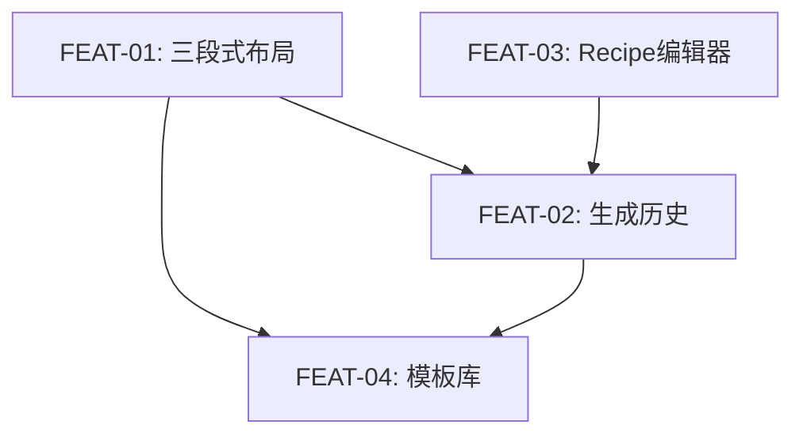

# 实现计划：工作台交互改造

## 1. 概览

- **项目**: 工作台交互改造（三段式布局 + 历史面板 + Recipe 编辑 + 模板库）
- **来源架构**: `docs/07-1-架构文档-工作台交互改造.md`
- **组织方式**: 功能维度（Feature-based）
- **项目类型**: Brownfield（在现有 style-gen 项目上增量改造）
- **技术栈**: Next.js 15 (App Router) + React 19 + TypeScript + Tailwind CSS 4 + Drizzle ORM + React Query
- **总阶段数**: 3
- **总功能数**: 4
- **最大并行度**: 2
- **关键路径**: FEAT-02 → FEAT-04

## 2. 输入摘要

### 2.1 核心闭环与目标

核心闭环不变：**Reference → Recipe → Render**

本期目标：将两段式布局升级为三段式专业工作台，新增生成历史回溯、Recipe 4 行编辑模式、模板库独立页面。验证目标——用户能否通过历史回溯 + Recipe 快编 + 模板复用形成连续创作循环。

### 2.2 关键 ADR 与实施护栏

| ADR | 决策 | 实施约束 |
| --- | --- | --- |
| ADR-7 | Workspace Layout 层实现共享导航 | Left Sidebar 在 layout.tsx 渲染，Right History Panel 在 page 层渲染 |
| ADR-8 | 历史复用 generation_tasks 表 | 不新建表，新增 GET 列表端点 |
| ADR-9 | 历史恢复通过 FK 关联获取 Recipe | GET /api/generation/:id 响应体增加 recipe 字段 |
| ADR-10 | Recipe 4 行映射为纯前端逻辑 | 映射常量在前端定义，Schema 不变 |
| ADR-11 | 模板库复用现有模板 API | 仅扩展 search 参数 |
| 额外约束 | 不引入全局状态管理库 | 工作区状态仍由 hooks 管理 |
| 额外约束 | Schema 零变更 | 所有功能基于现有表结构 |

### 2.3 现有代码快照

| 文件/目录 | 状态 | 说明 |
| --- | --- | --- |
| `src/app/api/generation/route.ts` | 已有，仅 POST（250 行） | 需新增 GET handler |
| `src/app/api/generation/[id]/route.ts` | 已有，GET 存在（67 行） | 需扩展响应体加 recipe |
| `src/lib/repositories/generation-task-repository.ts` | 已有（125 行） | 需新增 listCompleted / findByIdWithRecipe 方法 |
| `src/app/workspace/page.tsx` | 已有（587 行） | 需改造接入三段式布局 + 状态机扩展 |
| `src/app/workspace/layout.tsx` | **不存在** | 需新建 |
| `src/components/workspace/recipe-step.tsx` | 已有（325 行） | 将被 RecipeEditor 替代 |
| `src/components/workspace/template-drawer.tsx` | 已有 | 废弃清理时移除 |
| `src/hooks/use-workspace-state.ts` | 已有（426 行） | 需扩展 history_restored 状态 |
| `src/app/api/templates/route.ts` | 已有，GET+POST（211 行） | 需扩展 search 参数 |
| `src/app/workspace/templates/` | **不存在** | 需新建 |

### 2.4 架构约束

- 三段式布局 ≥ 1280px 下三列同时可见，Left Sidebar 和 Right Panel 固定 224px
- 面板过渡动画使用 CSS transition（200-300ms），不引入动画库
- 历史列表仅返回 status='completed' 的任务
- 模板搜索参数长度限制 ≤ 100 字符
- 跨页面数据传递通过 URL query 参数

## 3. 模块地图

按功能聚合展示：

| 功能 | 包含模块 | 类型 | 对应文件 |
| --- | --- | --- | --- |
| FEAT-01 | WorkspaceLayout + LeftSidebar + HistoryPanel骨架 | ui (frontend) | FEAT-01 |
| FEAT-02 | Generation History API + HistoryPanel数据 + 历史恢复 + 状态机 | service + ui (backend+frontend) | FEAT-02 |
| FEAT-03 | RecipeEditor + 4行映射常量 | ui (frontend) | FEAT-03 |
| FEAT-04 | Template Search API + TemplateLibraryPage + 清理 | service + ui (backend+frontend) | FEAT-04 |

## 4. 依赖图



## 5. 阶段摘要

| 阶段 | 功能 | 目标 | 可并行度 |
| --- | --- | --- | --- |
| Phase 1 | FEAT-01 + FEAT-03 | 布局骨架就位 + RecipeEditor 组件就绪（两者无依赖，纯前端） | 2 |
| Phase 2 | FEAT-02 | 历史API + 历史面板数据对接 + 历史恢复全流程 | 1 |
| Phase 3 | FEAT-04 | 模板搜索API + 模板库页面 + 废弃组件清理 | 1 |

## 6. 任务总览

| 功能 | 阶段 | 包含维度 | 依赖 | 独立验收标准 |
| --- | --- | --- | --- | --- |
| FEAT-01: 三段式工作台布局 | Phase 1 | frontend | 无 | 三段式布局渲染正确，导航跳转正常 |
| FEAT-02: 生成历史面板 | Phase 2 | backend, frontend | FEAT-01, FEAT-03 | 历史列表加载/翻页/恢复全流程走通 |
| FEAT-03: Recipe编辑器改造 | Phase 1 | frontend | 无 | 4行编辑器替代RecipeStep，编辑交互完整 |
| FEAT-04: 模板库与清理 | Phase 3 | backend, frontend | FEAT-01, FEAT-02 | 模板库页面可用，Use Template 跳转加载成功 |

### 6.2 开发状态机

| FEAT | 当前步骤 | red_e2e | implement | green_e2e | review | 最近证据 | 阻塞原因 | 更新时间 |
| --- | --- | --- | --- | --- | --- | --- | --- | --- |
| FEAT-01 | done | waived | done | waived | waived | code exists, build pass | - | 2026-04-20 |
| FEAT-03 | done | waived | done | waived | waived | code exists, build pass | - | 2026-04-20 |
| FEAT-02 | done | waived | done | waived | waived | code exists, build pass | - | 2026-04-20 |
| FEAT-04 | done | waived | done | waived | waived | code exists, build pass | - | 2026-04-20 |

## 7. 未决策项

| 编号 | 问题 | 影响功能 | 需要谁决策 | 阻塞等级 |
| --- | --- | --- | --- | --- |
| 无 | 无 | 无 | 无 | 无 |

> 架构文档中 Q1（Sidebar 折叠持久化）和 Q2（历史面板 pageSize）均已决策，无遗留未决项。

## 8. 执行前置

### 8.1 环境准备

- 安装依赖：`pnpm install`
- 数据库连接已配置（`pnpm db:up`）
- 开发服务器可启动（`pnpm dev`）

### 8.2 执行顺序

1. **Phase 1**：FEAT-01 和 FEAT-03 可并行执行（均为纯前端，互不依赖）
2. **Phase 2**：FEAT-01 和 FEAT-03 均完成后执行 FEAT-02（依赖布局骨架和 RecipeEditor）
3. **Phase 3**：FEAT-02 完成后执行 FEAT-04（依赖历史功能和布局）

### 8.3 全局验证

所有功能完成后执行以下命令进行全局验证：

```bash
pnpm type-check
pnpm lint
pnpm test
pnpm build
```

## 9. 变更记录

| 日期 | 变更类型 | 功能 | 说明 |
| --- | --- | --- | --- |
| 2026-04-12 | 全量重写 | 全部 | 基于架构文档 v1 重新生成实现计划（功能维度组织） |

<!-- 保留目录：reviews/。当 task-review、dev-plan-check 等开始运行时创建。 -->
