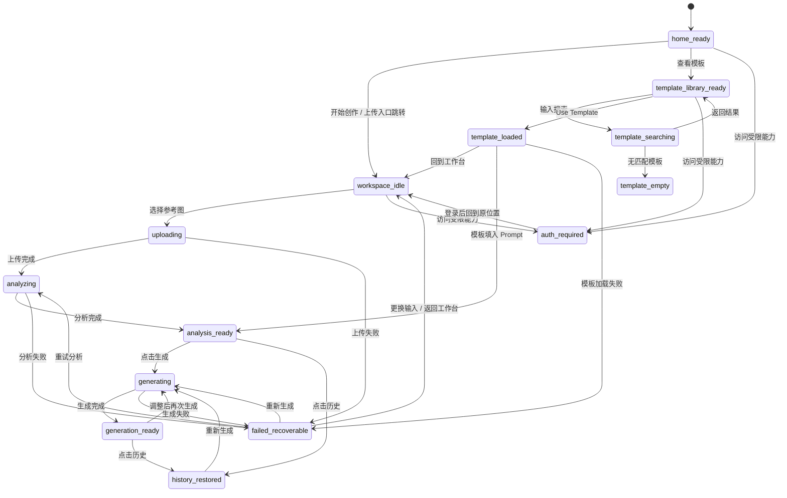
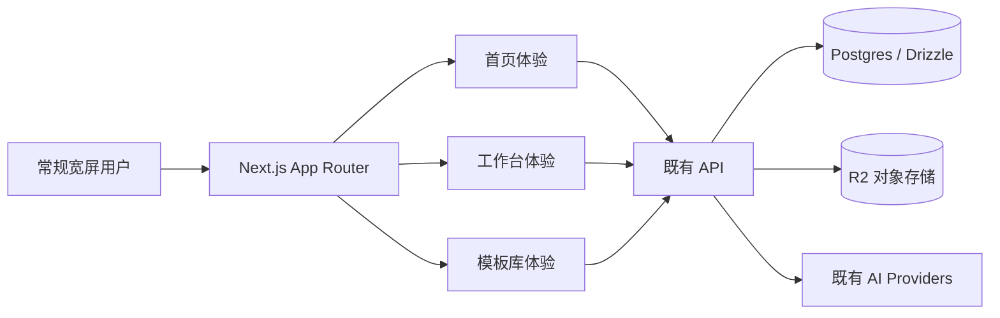
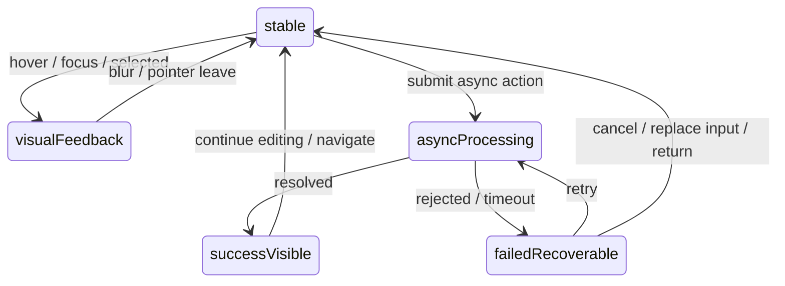

# 架构设计文档：全站交互与 UI 样式改造

_本文件只保留当前版本真正影响实现的架构决策、边界和契约；DDL、目录树、环境变量、实施故事等内容默认不放入正文。_

## 1. 系统摘要

08 期把 Visoryn 从局部深色工具界面升级为统一的 Precision Glass 全站体验，覆盖首页、工作台、模板库、导航、浮层、控件反馈和状态文案；核心创作业务链路不变，仍沿用既有上传、分析、生成、模板和历史能力。

核心闭环锚点：**Surface -> State -> Action**。首版验证目标是让常规宽屏用户在首页、工作台和模板库之间切换时，始终看到一致的轻质表面层级、可判断的控件状态和可恢复的过程状态。

## 2. 范围、非目标与成功标准

### 2.1 范围

1. 全站设计 token 与基础样式：将 `src/app/globals.css` 从深色工具基调迁移到 Precision Glass 明亮、通透、低噪音口径。
2. 全站导航与页面壳层：统一 `AuthHeader`、工作台 `LeftSidebar`、工作区状态栏和模板库页面壳层的品牌、导航选中和表面层级。
3. 首页体验改造：重绘 Hero、上传入口、价值区、状态预览和底部 CTA，让首屏同时具备品牌信任、产品预览、开始创作和上传入口。
4. 工作台体验改造：保留 07 期三段式信息架构，统一画布、Recipe、Prompt、输出设置、历史面板、进度和错误状态的视觉语言。
5. 模板库体验改造：模板搜索、空态、卡片、悬停操作、使用模板流程与工作台共用状态和表面规则。
6. 统一控件状态：按钮、图标按钮、上传区、输入区、模板卡片、历史缩略图、选择器、菜单和弹窗覆盖默认、悬停、按下、选中、禁用、处理中、错误状态。
7. 统一过程状态和文案：空态、加载、排队、处理中、成功、失败、恢复、未登录或无权限状态说明正在发生什么以及用户可执行的下一步。
8. 常规宽屏布局验收：以桌面常规宽屏为目标，稳定首页、工作台和模板库的主任务、辅助信息和历史区域比例。

### 2.2 明确不做

- 不改变参考图上传、风格分析、提示编辑、图片生成、模板使用和历史回溯的核心业务流程。
- 不新增后端数据表、业务 API、AI Provider、队列、WebSocket 或 SSE。
- 不引入新的创作模式，例如对话式创作、节点编辑、多人协作或运营看板。
- 不把首页改造成长篇营销站；首页仍服务于快速理解产品价值和开始创作。
- 不重新定义产品名称、付费策略、认证体系或权限模型。
- 不处理窄屏、小屏或移动端适配；首版本期仅验收常规宽屏。
- 不引入完整 UI 组件库、Storybook 或设计 token 发布服务；先以本仓库 CSS token 和少量共享样式完成统一。

### 2.3 成功标准

| 指标 | 首版目标 |
| --- | --- |
| 首页首屏 | 首屏同时呈现产品价值、主要行动、产品视觉预览和上传入口，无复杂说明干扰 |
| 跨页面一致性 | 首页、工作台、模板库的导航、表面层级、控件状态、图片承载和文字层级一致 |
| 控件可判断性 | 可点击、可编辑、选中、禁用、处理中和错误状态能被用户明确区分 |
| 工作台流程 | 上传、分析、编辑、生成、历史回溯过程中布局稳定，用户输入和上下文不丢失 |
| 模板库流程 | 搜索、空结果、卡片操作、Use Template 跳回工作台均可正常完成 |
| 失败恢复 | 上传、分析、生成、模板加载、未登录或权限不足都保留上下文并提供恢复入口 |
| 常规宽屏布局 | >= 1280px 宽度下主任务、辅助信息和历史区域比例稳定，无主操作位置大幅漂移 |
| 文案一致性 | 状态文案简洁、确定、可行动，不出现只报错但不给恢复路径的提示 |

### 2.4 验收标准承接矩阵

| AC-ID | PRD 原文摘要 | 承接模块 | 关键链路 / 状态 | 风险 / 降级说明 |
| --- | --- | --- | --- | --- |
| AC-01 | 首页首屏展示产品价值、主行动、预览和上传入口，符合 Precision Glass | LandingExperience + DesignTokenLayer | §6.1 首页进入与上传入口链路；`home_ready` 状态 | 若上传入口失败，保留首页上下文并展示同区错误 |
| AC-02 | 首页、工作台、模板库视觉语言一致 | DesignTokenLayer + AppShell + WorkspaceExperience + TemplateLibraryExperience | §6.4 跨页面切换链路；导航选中和表面层级 | 通过共享 token 和状态规则降低页面局部样式漂移 |
| AC-03 | 控件默认、悬停、按下、选中、禁用、处理中状态一致 | SharedInteractionPrimitives | §7.2 `InteractiveState` 契约；§6.5 控件状态链路 | 对暂未抽为共享组件的旧组件，用 CSS token 和测试清单逐项约束 |
| AC-04 | 工作台上传、分析、编辑、生成、完成状态布局稳定且输入不丢失 | WorkspaceExperience + StatePresenter | §3.3 状态机；§6.2 工作台创作链路 | 失败时沿用现有 `useWorkspaceState` 错误恢复路径 |
| AC-05 | 模板库资产浏览、空结果、Use Template 回到工作台并加载内容 | TemplateLibraryExperience + WorkspaceExperience | §6.3 模板库使用链路；`template_loaded` 状态 | 模板加载失败时保留模板库/工作台上下文并提供重试或返回 |
| AC-06 | 上传、分析、生成、模板加载失败时保留上下文并提供可行动入口 | StatePresenter + WorkspaceExperience + TemplateLibraryExperience | §8.2 降级链；`failed_recoverable` 状态 | 外部 AI 失败不清空参考图、Prompt、模板内容或历史选择 |
| AC-07 | 常规宽屏下首页、工作台、模板库主次区域比例稳定 | AppShell + LandingExperience + WorkspaceExperience + TemplateLibraryExperience | §7.2 `PageLayoutContract`；>=1280px 验收 | 小屏不作为本期验收目标，但不得出现桌面横向溢出 |
| AC-08 | 空态、加载、排队、处理中、成功、失败、未登录、无结果文案一致 | StatePresenter | §7.2 `StatusCopy` 契约；§6.6 状态文案链路 | 文案集中到状态映射表，减少组件内自行造句 |

## 3. 用户流程与状态

### 3.1 主流程

本期不改变业务主流程，只重绘体验层：

```text
首页首屏
  -> 点击开始创作 / 上传参考图
  -> 工作台保持三段式布局
  -> 上传参考图
  -> 分析中状态稳定反馈
  -> 分析完成后展示 Recipe + Prompt + 输出设置
  -> 生成中状态稳定反馈
  -> 生成完成后结果成为视觉中心，历史面板新增记录
  -> 用户下载、对比、回溯历史或再次生成
  -> 可切换模板库继续复用资产
```

模板库延伸流程：

```text
首页或工作台
  -> 进入模板库
  -> 搜索 / 浏览模板卡片
  -> 空结果则清空搜索或返回工作台
  -> 点击 Use Template
  -> 回到工作台并加载模板内容
  -> 继续编辑 Prompt、上传参考图或生成
```

异常恢复流程统一为：

```text
进入处理中或受限状态
  -> 出现失败 / 超时 / 未登录 / 权限不足
  -> 当前页面不强制跳离，保留文件、参考图、Prompt、模板或历史上下文
  -> 同区展示可理解原因
  -> 提供重试、更换输入、返回编辑、登录或回到工作台等可行动入口
```

### 3.2 关键分支

| 分支 | 入口 / 触发条件 | 架构处理方式 |
| --- | --- | --- |
| 首页上传 | 用户在首页拖放或选择参考图 | `UploadEntry` 校验文件；已登录则放入 `useFileStore` 并跳转工作台，未登录则触发登录并回到工作台 |
| 工作台空态 | 用户进入工作台且无参考图 | `WorkspaceCanvas` 展示上传入口；右侧辅助区展示简短流程，不抢当前任务视觉重量 |
| 等待过久 | 分析或生成超过用户明显感知时间 | 沿用 07 期 60s 排队提示，状态说明当前在排队或处理中，并提供继续等待/更换输入 |
| 分析失败 | `POST /api/analysis` 或轮询失败 | 保留参考图和上传上下文，展示失败原因，提供重试分析和更换参考图 |
| 生成失败 | `POST /api/generation` 或轮询失败 | 保留 Prompt、输出设置和参考内容，提供重新生成和返回编辑 |
| 模板空结果 | 搜索后返回空列表 | 模板库显示无结果说明，提供清空搜索和返回工作台 |
| 模板加载失败 | `GET /api/templates/:id` 失败 | 工作台保留当前状态，提示模板不可用，允许重新选择模板或继续当前编辑 |
| 历史恢复 | 点击历史缩略图 | `useHistoryRestore` 拉取详情并进入 `history_restored`，结果、Recipe、Prompt 可继续编辑和生成 |
| 未登录或权限不足 | 用户访问受限能力 | 不突然带离当前页面；展示限制原因，提供登录、返回可浏览内容或回到工作台 |

### 3.3 状态机



关键规则：

- `home_ready`、`workspace_idle`、`template_library_ready` 三个页面入口共享同一套导航选中、表面层级和互动反馈。
- `failed_recoverable` 不清空用户已输入或系统已生成的可复用上下文；失败组件只接管当前区域，不替换整页。
- `auth_required` 不直接破坏当前任务；登录完成后回到原受限页面或原任务位置。
- 常规宽屏下，页面状态切换不能改变主任务区域的相对位置，只允许局部内容和状态层变化。

## 4. 系统上下文与模块职责

### 4.1 系统上下文

本期是前端体验层改造，不新增外部依赖。系统边界如下：



变更点：

- 前端视觉系统：替换暗色 `surface-*` token 语义，新增玻璃表面、轻边界、状态和交互反馈规则。
- 前端页面：重绘首页、工作台、模板库和全站状态，但保留既有业务 hooks、API 和数据模型。
- 测试边界：增加组件状态测试和常规宽屏 E2E/视觉验收，不把移动端纳入本期通过条件。

### 4.2 模块职责

| 模块 | 职责 | 上游输入 | 下游输出 |
| --- | --- | --- | --- |
| DesignTokenLayer | 在 `src/app/globals.css` 定义 Precision Glass 颜色、表面、文字、焦点、状态和共享 utility class；为 Tailwind 类提供统一变量 | `docs/design/DESIGN.md`、Stitch 参考方向 | 全站组件可复用的 CSS token 和状态 class |
| AppShell | 统一 `AuthHeader`、`WorkspaceLayout`、`LeftSidebar`、页面背景和导航选中；保证首页、工作台、模板库像同一产品 | 当前 pathname、登录态、页面 children | 顶部/侧边导航、品牌入口、受限状态入口 |
| LandingExperience | 重绘首页 Hero、产品预览、上传入口、价值区、状态示例和底部 CTA；首屏直接支持开始创作 | 登录态、用户上传文件、导航点击 | 跳转 `/workspace`、保存 pending file、展示首页状态 |
| WorkspaceExperience | 保留三段式工作台和现有 hooks，统一画布、Recipe、Prompt、OutputSettings、HistoryPanel 的表面、状态和操作反馈 | 上传/分析/生成/历史/模板 query 状态 | 可继续创作的工作区视图和恢复入口 |
| TemplateLibraryExperience | 统一模板搜索、卡片、空态、错误态、Use Template、复制/删除浮层的资产库体验 | `useTemplateSearch`、模板操作 API、用户输入 | 模板列表、空结果恢复、跳转工作台 |
| StatePresenter | 集中定义空态、加载、排队、处理中、成功、失败、恢复、未登录/权限不足文案和视觉等级；被三大页面复用 | 业务状态、错误码、可执行动作 | 一致的状态说明、主行动、次行动和降级表现 |

交互细节补充：

- 上传区触发条件：点击、键盘 Enter/Space、拖放文件。状态变化：default -> hover/dragover -> validating -> uploading -> analyzing 或 failed。回调：`onFileSelected(file)`。数据更新：`useFileStore` 或 `useWorkspaceState` 保存文件上下文。
- 模板卡片触发条件：hover/focus 显示 Use Template 与 overflow menu。状态变化：default -> hover -> selected/actionMenuOpen -> duplicating/deleting/error。回调：`onUse(id)`、`onDuplicate(id)`、`onDelete(id)`。数据更新：React Query/路由刷新或跳转 `/workspace?templateId=...`。
- 历史缩略图触发条件：点击历史项。状态变化：default -> hover -> restoring -> history_restored 或 failed。回调：`onRestore(id)`。数据更新：`useHistoryRestore` 将 result、Recipe、Prompt、analysisTaskId 写回工作台状态。
- 失败状态触发条件：上传校验、API 返回错误、轮询失败、模板加载失败、未登录限制。状态变化：active -> failed_recoverable。回调：重试、更换输入、登录或返回。数据更新：只更新错误对象，不清空可复用上下文。

### 4.3 需要刻意避免的过度设计

| 不引入的内容 | 原因 |
| --- | --- |
| 新后端 API / 数据表 | PRD 只要求体验统一，现有分析、生成、模板、历史 API 足够承接 |
| 新 UI 组件库 | 引入会带来迁移成本和视觉二次适配；首版用 CSS token + 局部共享组件即可 |
| Storybook / token 发布管线 | 当前单仓库单应用，文档和测试即可约束，暂不需要组件平台化 |
| 动画库 | 本期只需要 hover、focus、状态切换和轻微抬升，CSS transition 足够 |
| 移动端布局系统 | PRD 明确仅验收常规宽屏；移动端另行立项 |
| 复杂埋点或增长看板 | 本期目标是体验一致性和恢复路径，不新增运营指标模块 |
| 全局状态管理库 | 现有 `useWorkspaceState`、React Query 和组件本地状态足够，新增库会扩大改造面 |

## 5. 关键架构决策（ADR）

### ADR-1：前端体验层改造，不重写业务链路

- **选择**：保留现有上传、分析、生成、模板、历史 API 和 hooks，只改页面壳层、组件状态、视觉 token 与文案。
- **理由**：PRD 的痛点是跨页面体验割裂，不是核心链路不可用；不用更重的业务重构，可降低回归风险。
- **风险与对策**：旧组件样式分散。通过 DesignTokenLayer 和组件级验收清单逐步收敛。

### ADR-2：用全局 CSS token 承载 Precision Glass

- **选择**：在 `src/app/globals.css` 定义明亮表面、文字、焦点、状态和玻璃 utility，组件通过 CSS 变量消费。
- **理由**：当前组件已大量使用 `var(--surface-*)`；替换 token 比逐文件硬编码更短链路。不引入 token 服务或 CSS-in-JS。
- **风险与对策**：token 语义变化会影响全站。先以首页、工作台、模板库截图回归验证。

### ADR-3：页面壳层分两级统一

- **选择**：`AuthHeader` 负责全站顶部品牌和用户入口；`WorkspaceLayout`/`LeftSidebar` 负责工作台与模板库的专业工具导航。
- **理由**：首页和工作台信息密度不同，强行一个壳层会削弱工作台效率；不用新全局 shell 重写全部路由。
- **风险与对策**：顶部与侧边导航可能重复。通过 pathname 高亮和视觉层级区分全站入口与工作区入口。

### ADR-4：状态呈现集中为 StatePresenter 契约

- **选择**：把空态、加载、排队、处理中、成功、失败、恢复、未登录文案与主/次行动映射到共享状态契约，页面按需渲染。
- **理由**：PRD 明确要求状态语气统一；组件各自写文案会持续漂移。不做复杂消息系统，只抽最小映射。
- **演进余地**：未来国际化或 toast 系统可复用同一状态文案源。

### ADR-5：常规宽屏作为唯一布局验收目标

- **选择**：以 >=1280px 桌面宽度定义首页、工作台、模板库布局比例；小屏只保证不破坏基本访问，不作为本期验收。
- **理由**：PRD 明确质量优先于多端覆盖；同步做移动端会扩大范围并稀释宽屏体验质量。
- **风险与对策**：小屏用户体验仍可能不足。文档明确非目标，后续独立立项。

### ADR-6：控件状态优先通过共享样式而非组件大重构收敛

- **选择**：先定义按钮、图标按钮、输入、卡片、缩略图、浮层的状态 class 和使用规则；只在重复严重处新增小型共享组件。
- **理由**：当前组件边界清晰，大规模抽象会拖慢交付；共享样式能更快统一外观并保持业务组件稳定。
- **风险与对策**：局部组件可能漏改。通过 AC-03 组件测试和 E2E hover/focus 验收兜底。

### ADR-7：不新增按量服务和运行成本

- **选择**：本期不新增外部服务、图片处理服务、A/B 平台或分析平台；沿用既有 AI Provider 调用链。
- **理由**：UI 改造不需要新增按量依赖；不用更重平台可避免成本和安全面扩大。
- **演进余地**：如果后续需要真实视觉回归服务，可在测试阶段单独引入，不进入运行链路。

### 5.x 待确认问题

无。PRD 已明确常规宽屏范围、核心业务流程不变、Precision Glass 视觉方向和失败状态范围。

## 6. 运行链路

### 6.1 首页进入与上传入口

1. 用户打开 `/`，`src/app/page.tsx` 渲染 LandingExperience：Hero、产品预览、上传入口、价值区和底部 CTA。
2. `AuthHeader` 根据登录态展示登录按钮或用户菜单，导航与页面背景共用 Precision Glass token。
3. 用户点击主行动按钮时直接进入 `/workspace`。
4. 用户在首页上传入口选择或拖放文件时，`UploadEntry` 校验类型和大小。
5. 已登录用户：文件写入 `useFileStore`，路由跳转 `/workspace`，工作台消费 pending file 并自动进入上传/分析。
6. 未登录用户：触发登录，登录成功后回到 `/workspace`；若文件无法跨登录保留，则工作台显示可继续上传的空态。

这条链路的实现原则：

- 首页首屏不是说明页，必须同时提供产品价值、视觉预览、开始创作和上传入口。
- 上传错误在上传区域内展示，不用全页错误页。
- 视觉预览必须体现 Reference/Recipe/Render 的真实产品对象，不使用纯装饰渐变替代。

### 6.2 工作台创作链路

1. `/workspace` 使用 `WorkspaceLayout` + `LeftSidebar` 渲染工作台壳层。
2. `WorkspacePage` 读取 `useWorkspaceState`、`useUpload`、`useAnalysis`、`useGeneration`、`useHistoryRestore`。
3. 空态下 `WorkspaceCanvas` 展示上传入口，辅助区域展示简短流程。
4. 上传完成后进入 `analyzing`，画布保留参考图并显示轻量处理中反馈。
5. 分析完成后进入 `analysis_ready`，Recipe、Prompt、OutputSettings 以同一表面层级展开。
6. 点击生成后进入 `generating`，主行动按钮和结果区展示处理中状态。
7. 生成完成后进入 `generation_ready`，结果图成为视觉中心，历史列表 invalidation 后刷新。
8. 生成失败、分析失败或等待过久时，StatePresenter 在当前区域展示原因和恢复行动。

这条链路的实现原则：

- 状态切换只改变当前区域内容，不改变外层三段式布局。
- `promptText`、`negativePromptText`、参考图、Recipe 和输出设置在失败时不得被清空。
- 图片承载方式统一使用稳定 aspect ratio、轻边界或内发光，避免随图片加载造成布局跳动。

### 6.3 模板库使用链路

1. 用户从首页或工作台进入 `/workspace/templates`。
2. `TemplateLibraryPage` 渲染搜索区、模板卡片网格、加载骨架、空态和错误态。
3. 用户输入搜索，`useTemplateSearch` debounce 后请求既有 `GET /api/templates`。
4. 空结果时显示无结果状态，提供清空搜索和返回工作台。
5. 用户 hover/focus 模板卡片时显示 Use Template 和更多操作。
6. 点击 Use Template 后跳转 `/workspace?templateId=:id`。
7. `WorkspacePage` 加载 `GET /api/templates/:id`；若模板包含变量，打开 `TemplateWizard`；否则写入 Prompt。

这条链路的实现原则：

- 模板库是资产浏览空间，卡片密度高但边界轻，操作只在 hover/focus 或选中时强调。
- Use Template 只带入模板内容，不自动开始生成。
- 模板加载失败不破坏当前工作台内容。

### 6.4 跨页面切换链路

1. 用户在首页、工作台、模板库之间切换。
2. `AuthHeader` 保持品牌、用户入口和主要导航的全站一致性。
3. 工作台和模板库使用 `LeftSidebar` 高亮当前页。
4. 页面主体按照 `PageLayoutContract` 设置常规宽屏比例。
5. 每个页面的主任务区域使用同一表面层级；辅助信息降低视觉重量。

这条链路的实现原则：

- 页面切换不得让用户误以为进入另一个产品。
- 导航选中状态必须明确，但不能用厚重边框或高噪音色块。
- 首页、工作台、模板库的图片承载、卡片质感、按钮反馈和文案语气必须一致。

### 6.5 控件状态链路

1. 用户 hover/focus 可操作区域。
2. 组件按 `InteractiveState` 从 `default` 进入 `hover` 或 `focusVisible`。
3. 点击后进入 `pressed`，若产生异步请求则进入 `processing`。
4. 操作完成后进入 `selected`、`success` 或回到 `default`。
5. 操作失败进入 `error`，并显示可恢复行动。
6. 不可用操作进入 `disabled`，通过文案或上下文说明原因。

这条链路的实现原则：

- hover 反馈使用轻微抬升、表面亮度变化或蓝色功能意图，不使用厚边框。
- focus-visible 必须可键盘识别。
- disabled 不只降低透明度；关键禁用场景需要可理解原因。

### 6.6 状态文案链路

1. 业务组件把当前状态、错误码和可执行动作交给 StatePresenter 契约。
2. StatePresenter 选择标题、说明、主行动、次行动和视觉等级。
3. 页面在当前上下文区域渲染状态，不默认打开全局阻断式弹窗。
4. 用户点击恢复行动后，回到对应稳定状态或重新进入处理中状态。

这条链路的实现原则：

- 文案必须回答“正在发生什么”和“我还能做什么”。
- 失败文案不得只说失败，必须给出恢复动作。
- 成功状态要把下一步暴露出来，例如下载、继续编辑、回溯或再次生成。

## 7. 领域对象与关键契约

### 7.1 核心对象

| 对象名 | Source of Truth | Owner | 用途 |
| --- | --- | --- | --- |
| DesignTokens | `src/app/globals.css` | DesignTokenLayer | 全站颜色、表面、文字、状态、焦点和交互反馈 |
| PageLayoutContract | 页面组件 + CSS class | AppShell | 约束首页、工作台、模板库常规宽屏比例和主次层级 |
| InteractiveState | 共享样式/组件 props | SharedInteractionPrimitives | 统一按钮、输入、卡片、缩略图、菜单、弹窗状态 |
| StatusCopy | `src/lib/ui/status-copy.ts`（建议新增） | StatePresenter | 统一状态标题、说明、主行动、次行动和视觉等级 |
| WorkspaceSessionState | `useWorkspaceState` | WorkspaceExperience | 管理上传、分析、生成、历史恢复和错误上下文 |
| TemplateListState | `useTemplateSearch` + API 响应 | TemplateLibraryExperience | 管理搜索、加载、空结果、错误和模板操作 |

### 7.2 推荐最小 Schema

```ts
export type SurfaceRole =
  | "page"
  | "panel"
  | "floating"
  | "control"
  | "media"
  | "overlay";

export type InteractiveState =
  | "default"
  | "hover"
  | "pressed"
  | "selected"
  | "focusVisible"
  | "disabled"
  | "processing"
  | "error"
  | "success";

export type ProductStatus =
  | "empty"
  | "loading"
  | "queued"
  | "processing"
  | "success"
  | "failedRecoverable"
  | "restored"
  | "authRequired"
  | "noResults";

export interface StatusCopy {
  status: ProductStatus;
  title: string;
  description: string;
  primaryActionLabel?: string;
  secondaryActionLabel?: string;
  tone: "neutral" | "accent" | "success" | "warning" | "danger";
}

export interface PageLayoutContract {
  page: "home" | "workspace" | "templates";
  minDesktopWidth: 1280;
  primaryRegion: "hero" | "canvas" | "templateGrid";
  secondaryRegions: string[];
  maxContentWidth?: number;
  preservePrimaryPosition: boolean;
}
```

Schema 规则：

- 首版 Schema 只描述 UI 契约，不新增数据库结构。
- `InteractiveState` 是视觉和交互状态枚举，不替代业务状态机。
- `ProductStatus` 用于文案和视觉等级，具体业务状态仍由 `useWorkspaceState`、React Query 和 API 响应负责。

### 7.3 API 边界

本期不新增 API，也不改变既有请求体语义。以下端点仅作为体验链路的消费者继续使用：

| 接口路径 | 用途 | 首版交互 | 字段来源 / 说明 |
| --- | --- | --- | --- |
| `POST /api/upload/presign` | 获取上传直传信息 | 首页或工作台上传参考图 | `fileName`/`mimeType` 来自用户选择文件，后续直传不经过业务 API |
| `POST /api/analysis` | 创建分析任务 | 上传完成后自动分析 | `assetId`/`fileUrl` 来自上传结果，`width`/`height` 由前端图片读取，`mimeType` 来自文件 |
| `GET /api/analysis/:id` | 轮询分析状态 | 分析中、分析完成、分析失败 | `id` 来自创建分析任务响应 |
| `POST /api/generation` | 创建生成任务 | 用户点击生成或重新生成 | `analysisTaskId` 来自当前工作区，Prompt 字段来自用户编辑，参数来自输出设置 |
| `GET /api/generation/:id` | 轮询生成或恢复历史详情 | 生成中、历史恢复 | `id` 来自生成任务或历史缩略图 |
| `GET /api/generation?pageSize=20` | 加载历史列表 | 历史面板缩略图 | `pageSize` 系统默认，`cursor` 来自上一页响应 |
| `GET /api/templates?search=` | 搜索模板 | 模板库搜索 | `search` 来自用户输入，debounce 后请求 |
| `GET /api/templates/:id` | 使用模板 | Use Template 后工作台加载内容 | `id` 来自模板卡片点击 |
| `POST /api/templates/:id/duplicate` / `DELETE /api/templates/:id` | 模板操作 | 卡片 overflow menu | `id` 来自用户选中模板，结果刷新列表 |

### 7.4 状态流转

后端任务状态机不变，继续由既有 `analysis_tasks`、`generation_tasks` 和前端 hooks 承接。本期新增的是 UI 状态分层：



关键规则：

- 视觉状态不得伪造业务成功；`successVisible` 必须来自真实请求或本地操作完成。
- `failedRecoverable` 必须携带可执行恢复动作。
- `asyncProcessing` 中主按钮 disabled，但需要说明当前正在处理什么。

### 7.5 数据边界

| 层 | 职责 | 本期变化 |
| --- | --- | --- |
| 浏览器本地状态 | hover、focus、展开菜单、上传 dragover、模板 wizard、历史面板展开、错误展示 | 增加统一状态契约，不持久化纯 UI 状态 |
| React Query / Hooks | 模板搜索、历史列表、历史恢复、分析/生成轮询 | 继续沿用现有 query key；生成完成后刷新历史 |
| Next.js API | 上传预签名、分析、生成、模板、历史 | 无新增端点，无请求体破坏性变更 |
| Postgres / Drizzle | 用户、资产、分析任务、生成任务、模板 | 无 schema 变更 |
| R2 对象存储 | 参考图和生成图文件 | 无变化 |
| 外部 AI Provider | 分析和生成模型调用 | 无变化 |

### 7.6 命名与标识规则

- UI 和文档统一使用 `Precision Glass` 表示本期视觉方向。
- 产品闭环仍称 `Reference -> Recipe -> Render`，08 期体验闭环称 `Surface -> State -> Action`。
- CSS token 保持 kebab-case 变量名，例如 `--surface-page`、`--surface-panel`、`--text-primary`、`--accent-primary`。
- TypeScript 类型使用 PascalCase，状态值使用 camelCase 或现有 snake_case；不为 UI 状态新增数据库枚举。
- 现有 `negativePromptText` 命名不在本期改动；UI 文案可称“避免内容”，但接口和模型沿用现有字段。
- 页面路径继续使用 `/`、`/workspace`、`/workspace/templates`。
- ID 策略沿用既有 ULID/数据库标识，不新增 UI 专用 ID 体系；无障碍属性 ID 仅用于当前组件内关联。

## 8. 非功能需求、风险与运行策略

### 8.1 性能与吞吐量目标

| 指标 | 目标 | 预期并发 |
| --- | --- | --- |
| 首页首屏交互可用 | 常规宽屏下主要行动和上传入口快速可点击，不因装饰资源阻塞 | 单用户浏览 |
| 工作台状态切换 | 上传、分析中、生成中、完成、失败之间无整页重排 | 单用户连续创作 |
| 模板库搜索 | debounce 后请求，加载态和空态即时反馈 | 单用户搜索 |
| 历史面板 | 继续分页加载，默认 pageSize=20 | 单用户滚动 |
| 样式负载 | 不新增大型 UI/动画依赖，不引入远程装饰图作为关键渲染阻塞 | 全站 |

### 8.2 可靠性、错误处理与降级策略

降级级别按用户体验影响从小到大排列：

| 级别 | 触发 | 系统行为 | 用户可用能力 |
| --- | --- | --- | --- |
| L1 轻提示 | hover/focus 缺失、非关键图片预览缺失、等待超过阈值 | 保持页面结构，展示状态提示或占位 | 继续浏览、等待、编辑 |
| L2 局部失败 | 模板搜索失败、历史列表失败、模板加载失败 | 当前区域显示错误和重试，不影响其他页面区域 | 重试、清空搜索、返回工作台、继续当前编辑 |
| L3 创作步骤失败 | 上传、分析、生成失败 | 保留参考图、Prompt、输出设置和任务上下文，显示恢复入口 | 重试、更换输入、返回编辑 |
| L4 权限受限 | 未登录或权限不足 | 说明限制原因，不突然丢弃当前页面上下文 | 登录、返回可浏览内容、回到工作台 |
| L5 外部服务不可用 | AI Provider 或对象存储不可用 | 阻断对应异步动作，但保留可编辑内容和已有结果 | 查看历史、编辑 Prompt、稍后重试 |

### 8.3 安全与反滥用策略

| 项目 | 首版策略 |
| --- | --- |
| API Key 管理 | 沿用既有服务端持有策略，客户端不暴露 AI Provider 或存储密钥 |
| 上传安全 | 延续类型和大小校验，上传失败不泄漏内部错误 |
| 认证与权限 | 沿用 NextAuth 和现有 API 鉴权，未登录状态通过 UI 明确说明 |
| Prompt 注入 | 本期不改变 AI prompt 结构，沿用既有服务端 prompt 隔离 |
| 内容安全 | 不新增模型能力；沿用现有生成链路安全边界 |
| Rate Limit | 沿用既有 API rate limit，不因 UI 改造放宽限制 |
| 可访问性 | focus-visible、按钮 aria-label、弹窗 role 和键盘路径纳入组件验收 |

### 8.4 成本控制预期

| 模块 | 预估单次成本 | 首版控制策略 |
| --- | --- | --- |
| 首页、工作台、模板库 UI | 无新增按量成本 | 不引入远程设计服务或大体积视觉依赖 |
| 上传 / 分析 / 生成 | 沿用既有对象存储和 AI Provider 成本 | UI 不自动触发额外分析或生成；Use Template 只填充内容 |
| 模板搜索 / 历史列表 | 数据库查询成本 | 沿用分页、debounce 和既有 API |
| 视觉验收 | 本地测试和 Playwright 成本 | 使用本地 E2E/截图验证，不接入付费监控平台 |

成本失控降级：

- UI 改造不得增加自动生成、自动分析或隐藏模型调用。
- 如果模板或历史请求频率过高，优先增加 debounce、分页和缓存，不新增服务。

### 8.5 可观测性

- 继续使用现有服务端日志记录 API 失败、AI Provider 错误和上传错误。
- 前端至少在模板加载失败、历史恢复失败、上传校验失败处保留可定位的错误路径。
- E2E 验收覆盖首页、工作台、模板库、失败恢复和常规宽屏布局截图。
- 不新增运行时埋点平台；如需 UX 指标，后续单独设计。

### 8.6 主要风险

| 风险 | 影响 | 缓解方式 |
| --- | --- | --- |
| 全局 token 替换导致旧组件对比度不足 | 页面局部文字或控件不可读 | 分阶段替换并运行组件截图/测试，优先修复低对比状态 |
| Precision Glass 被实现成一套浅色卡片堆叠 | 无法达成 PRD 的轻盈和高级工具感 | 明确 No-Line、轻边界、表面层级规则，减少硬 border 和嵌套卡片 |
| 工作台布局在 1280px 下拥挤 | AC-04/AC-07 失败 | 固定主任务最小宽度，历史面板可折叠，避免组件内容撑破网格 |
| 状态文案分散在组件内 | AC-08 漂移 | 新增或整理 `status-copy` 映射，组件只传状态和动作 |
| 首页变成营销长页 | 偏离快速创作目标 | 首屏保留上传入口和开始创作，长说明降级到下方内容 |
| 视觉改造误触业务逻辑 | 上传/分析/生成回归 | 不改 API 契约；用现有 hook 测试和 E2E 覆盖核心流程 |

## 9. 实施方案

### Phase A：全站基础样式与壳层

**基础样式**

1. `src/app/globals.css` - 替换为 Precision Glass token：明亮表面、文字层级、功能蓝、成功/警告/错误、ghost border、glass surface、focus-visible、按钮和输入基础状态。
2. `tailwind.config.ts` - 如现有 Tailwind 内容扫描不足，仅补充需要的路径；不新增主题体系。
3. `src/lib/ui/status-copy.ts`（新建）- 定义 `ProductStatus` 到标题、说明、行动和 tone 的最小映射。

**壳层**

4. `src/components/auth/auth-header.tsx` - 重绘顶部导航为轻质玻璃表面，统一品牌名、导航、登录态和 OAuth 错误提示。
5. `src/app/workspace/layout.tsx` - 保持共享布局，确认内容区高度、背景和 overflow 与新 token 匹配。
6. `src/components/workspace/left-sidebar.tsx` - 改为轻边界、明确选中、hover/focus 一致的工作区导航。

验证目标：`/`、`/workspace`、`/workspace/templates` 在 >=1280px 下使用同一 token 系统，顶部/侧边导航没有深色旧样式残留。

### Phase B：首页、模板库与共享控件状态

**首页**

1. `src/components/landing/hero.tsx` - 重绘首屏，保留主行动和产品真实预览；移除暗色径向背景和重卡片质感。
2. `src/components/landing/upload-entry.tsx` - 统一上传区 default/hover/dragover/error/disabled 状态，并保留文件校验错误上下文。
3. `src/components/landing/value-section.tsx`、`stats-section.tsx`、`bottom-cta.tsx`、`footer.tsx` - 用同一表面和文案语气统一下方内容。

**模板库**

4. `src/app/workspace/templates/page.tsx` - 重绘搜索区、加载骨架、空态、错误态和网格间距，保持资产库信息密度。
5. `src/components/workspace/template-card.tsx` - 统一卡片图片承载、hover/focus、Use Template、overflow menu、复制/删除确认状态。

**测试**

6. `src/components/landing/__tests__/*.test.tsx` - 更新首页组件断言，覆盖上传错误、主行动和登录入口。
7. `src/components/workspace/__tests__/template-card.test.tsx` - 覆盖 hover/focus 可见操作、删除确认、处理中和错误状态。

验证目标：AC-01、AC-03、AC-05、AC-08 在首页和模板库路径可通过组件测试与浏览器检查。

### Phase C：工作台状态统一与端到端验收

**工作台**

1. `src/app/workspace/page.tsx` - 调整三列网格的常规宽屏比例，接入统一状态文案，确保错误状态不清空上下文。
2. `src/components/workspace/status-bar.tsx` - 使用 StatePresenter 文案和轻质状态 badge。
3. `src/components/workspace/workspace-canvas.tsx` - 统一上传、参考图、结果图、对比视图和分析中 overlay 的图片承载方式。
4. `src/components/workspace/recipe-editor.tsx`、`prompt-editor.tsx`、`output-settings.tsx`、`history-panel.tsx`、`error-display.tsx`、`generation-progress.tsx`、`analysis-progress.tsx` - 收敛表面、按钮、输入、处理中、失败和恢复状态。
5. `src/components/workspace/template-wizard.tsx`、`template-save-dialog.tsx` - 统一浮层、确认、取消、错误和焦点样式。

**验证**

6. `src/hooks/__tests__/use-workspace-state.test.tsx` - 保持失败恢复和 `history_restored` 状态不回归。
7. `src/components/workspace/__tests__/*.test.tsx` - 更新样式状态断言，不依赖旧深色 token。
8. `playwright` E2E - 覆盖首页首屏、工作台上传/分析/生成主要状态、模板库 Use Template、失败恢复和 >=1280px 布局稳定性。

验证目标：AC-02、AC-04、AC-06、AC-07、AC-08 在工作台和跨页面路径通过；`npm run type-check`、`npm test` 和关键 E2E 通过。

## 10. 架构结论

08 期应作为前端体验层统一改造落地，而不是业务链路重构。最小可行架构是：用全局 Precision Glass token 统一视觉基础，用两级页面壳层维持首页与工作区各自的信息密度，用 StatePresenter 和 InteractiveState 契约收敛控件与状态表达，并保留现有 API、hooks、数据模型和 AI Provider。

该方案能直接承接 PRD 的 8 条验收标准，同时把风险限制在样式、组件状态和文案层；后续如果要扩展移动端、完整组件库、视觉回归平台或埋点体系，应单独立项，不进入本期首版闭环。
