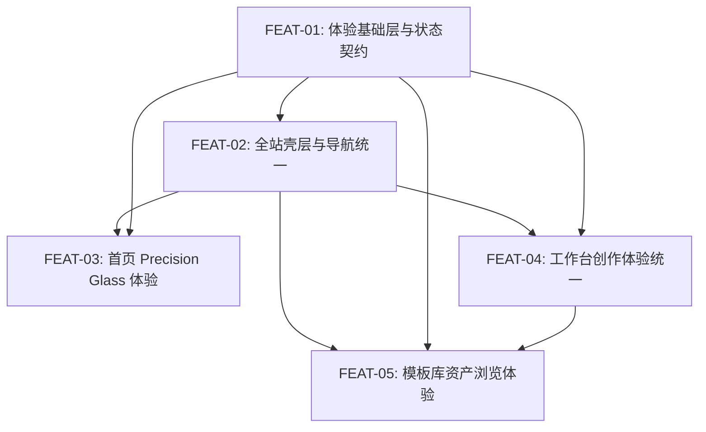

# 实现计划：全站交互与 UI 样式改造

## 1. 概览

- **项目**: 全站交互与 UI 样式改造（Precision Glass）
- **来源架构**: `docs/08-1-架构文档-全站交互与UI样式改造.md`
- **组织方式**: 功能维度（Feature-based）
- **项目类型**: Brownfield（在现有 style-gen / Visoryn 前端体验层上增量改造）
- **技术栈**: Next.js 15 (App Router) + React 19 + TypeScript + Tailwind CSS 4 + React Query + Playwright + Vitest
- **总阶段数**: 3
- **总功能数**: 5
- **最大并行度**: 3
- **关键路径**: FEAT-01 -> FEAT-02 -> FEAT-04 -> FEAT-05

## 2. 输入摘要

### 2.1 核心闭环与目标

业务闭环不变：**Reference -> Recipe -> Render**。

08 期体验闭环为：**Surface -> State -> Action**。本期把首页、工作台、模板库、导航、控件反馈和状态文案统一到 Precision Glass 方向，在不改变上传、分析、生成、模板和历史业务链路的前提下，让常规宽屏用户跨页面创作时始终看到同一套轻质表面、可判断状态和可恢复行动。

### 2.2 关键 ADR 与实施护栏

| ADR | 决策 | 实施约束 |
| --- | --- | --- |
| ADR-1 | 只改前端体验层，不重写业务链路 | 上传、分析、生成、模板、历史 API 和 hooks 保持兼容 |
| ADR-2 | 用 `src/app/globals.css` 承载 Precision Glass token | 优先替换 token 和共享 utility，避免组件内硬编码新色值 |
| ADR-3 | 页面壳层分两级统一 | `AuthHeader` 管全站顶部入口，`WorkspaceLayout` / `LeftSidebar` 管工作区导航 |
| ADR-4 | 状态呈现集中为 StatePresenter 契约 | 空态、加载、失败、恢复、未登录文案集中定义，组件按需消费 |
| ADR-5 | 常规宽屏为唯一布局验收目标 | >=1280px 必须稳定；小屏只保证不出现桌面横向破坏，不作为通过条件 |
| ADR-6 | 控件状态通过共享样式优先收敛 | 先定义按钮、输入、卡片、缩略图、浮层状态 class；只在必要处新增小组件 |
| ADR-7 | 不新增按量服务和运行成本 | 不新增后端 API、DB schema、外部服务、动画库或完整 UI 组件库 |

### 2.3 现有代码快照

| 文件/目录 | 状态 | 说明 |
| --- | --- | --- |
| `src/app/globals.css` | 已有 | 当前为深色 token，需要迁移到 Precision Glass 明亮 token 与共享 utility |
| `src/app/layout.tsx` | 已有 | 根布局已渲染 `AuthHeader`，字体为 Geist / Sora / Material Symbols |
| `src/components/auth/auth-header.tsx` | 已有 | 顶部导航与 OAuth 错误提示需要轻质化和路径高亮 |
| `src/app/page.tsx` | 已有 | 首页组合 Hero / UploadEntry / ValueSection / StatsSection / BottomCta / Footer |
| `src/components/landing/*` | 已有 | 首页组件需要重绘首屏、上传入口、价值区和 CTA |
| `src/app/workspace/layout.tsx` | 已有 | 工作区 Layout 已含 `LeftSidebar`，需要与顶部导航和页面背景统一 |
| `src/app/workspace/page.tsx` | 已有 | 工作台三段式页面，需统一画布、Recipe、Prompt、Output、历史、错误状态 |
| `src/components/workspace/*` | 已有 | 工作区组件边界清晰，可按表面/控件/状态逐步收敛 |
| `src/app/workspace/templates/page.tsx` | 已有 | 模板库页面需重绘搜索、卡片、空态、错误态和 Use Template 流程 |
| `src/hooks/use-workspace-state.ts` | 已有 | 业务状态机保留，仅消费统一状态文案和恢复动作 |
| `e2e/` | 已有 | 已有 happy-path、workspace、template、degradation 测试，可新增 Precision Glass 专项 spec |

### 2.4 架构约束

- 本期不新增数据库表、后端端点、AI Provider、队列、WebSocket、SSE 或外部运行服务。
- 全站视觉方向以 `docs/design/DESIGN.md` 为准，采用明亮、通透、低噪音、高留白的 Precision Glass。
- 主要页面只突出一个当前任务区域；辅助信息降低视觉重量。
- 失败状态必须保留参考图、Prompt、模板内容、历史选择等可复用上下文，并提供可行动入口。
- 控件状态必须覆盖默认、hover、pressed、selected、focus-visible、disabled、processing、error、success。
- 常规宽屏验收以 >=1280px 为目标，页面切换不得造成主任务区域大幅漂移。

## 3. 验收标准追踪矩阵

| AC-ID | 需求原文 | 架构承接 | 计划承接 | 验证方式 | 当前状态 |
| --- | --- | --- | --- | --- | --- |
| AC-01 | 首页首屏展示产品价值、主行动、预览和上传入口，符合 Precision Glass | LandingExperience + DesignTokenLayer | FEAT-03 | FEAT-03 §5 + `e2e/precision-glass-home.spec.ts` | planned |
| AC-02 | 首页、工作台、模板库视觉语言一致 | DesignTokenLayer + AppShell + WorkspaceExperience + TemplateLibraryExperience | FEAT-01, FEAT-02, FEAT-03, FEAT-04, FEAT-05 | FEAT-02 §5 跨页面导航 + 各页面专项 E2E | planned |
| AC-03 | 控件默认、悬停、按下、选中、禁用、处理中状态一致 | SharedInteractionPrimitives | FEAT-01, FEAT-03, FEAT-04, FEAT-05 | FEAT-01 组件测试 + FEAT-03/04/05 E2E hover/focus 检查 | planned |
| AC-04 | 工作台上传、分析、编辑、生成、完成状态布局稳定且输入不丢失 | WorkspaceExperience + StatePresenter | FEAT-04 | FEAT-04 §5 + `e2e/precision-glass-workspace.spec.ts` | planned |
| AC-05 | 模板库资产浏览、空结果、Use Template 回到工作台并加载内容 | TemplateLibraryExperience + WorkspaceExperience | FEAT-05 | FEAT-05 §5 + `e2e/precision-glass-templates.spec.ts` | planned |
| AC-06 | 上传、分析、生成、模板加载失败时保留上下文并提供可行动入口 | StatePresenter + WorkspaceExperience + TemplateLibraryExperience | FEAT-01, FEAT-04, FEAT-05 | FEAT-04/05 失败路径 E2E + StatePresenter 组件测试 | planned |
| AC-07 | 常规宽屏下首页、工作台、模板库主次区域比例稳定 | AppShell + LandingExperience + WorkspaceExperience + TemplateLibraryExperience | FEAT-02, FEAT-03, FEAT-04, FEAT-05 | 1280px / 1440px Playwright 断言和截图证据 | planned |
| AC-08 | 空态、加载、排队、处理中、成功、失败、未登录、无结果文案一致 | StatePresenter | FEAT-01, FEAT-03, FEAT-04, FEAT-05 | FEAT-01 状态文案单测 + 页面状态 E2E | planned |

## 4. 模块地图

| 模块 | 职责 | 计划承接 |
| --- | --- | --- |
| DesignTokenLayer | Precision Glass 颜色、表面、文字、焦点、状态和共享 utility | FEAT-01 |
| SharedInteractionPrimitives | 按钮、输入、卡片、缩略图、浮层的统一状态规则 | FEAT-01 |
| StatePresenter | 空态、加载、处理中、失败、恢复、未登录、无结果的文案与行动契约 | FEAT-01, FEAT-04, FEAT-05 |
| AppShell | `AuthHeader`、`WorkspaceLayout`、`LeftSidebar`、页面背景和导航选中 | FEAT-02 |
| LandingExperience | 首页 Hero、产品预览、上传入口、价值区、底部 CTA | FEAT-03 |
| WorkspaceExperience | 工作台画布、Recipe、Prompt、OutputSettings、HistoryPanel 和失败恢复 | FEAT-04 |
| TemplateLibraryExperience | 模板搜索、卡片、空态、错误态、Use Template | FEAT-05 |

按功能聚合展示：

| 功能 | 包含模块 | 类型 | 对应文件 |
| --- | --- | --- | --- |
| FEAT-01 | DesignTokenLayer, SharedInteractionPrimitives, StatePresenter | frontend | `FEAT-01-体验基础层与状态契约.md` |
| FEAT-02 | AppShell, PageLayoutContract | frontend | `FEAT-02-全站壳层与导航统一.md` |
| FEAT-03 | LandingExperience | frontend | `FEAT-03-首页PrecisionGlass体验.md` |
| FEAT-04 | WorkspaceExperience, StatePresenter 消费 | frontend | `FEAT-04-工作台创作体验统一.md` |
| FEAT-05 | TemplateLibraryExperience, StatePresenter 消费 | frontend | `FEAT-05-模板库资产浏览体验.md` |

## 5. 依赖图



节点使用 FEAT-ID 标识。

## 6. 阶段摘要

| 阶段 | 功能 | 目标 | 可并行度 |
| --- | --- | --- | --- |
| Phase 1 | FEAT-01 | 建立 Precision Glass token、共享状态 class、状态文案契约和 StatePresenter 基础 | 1 |
| Phase 2 | FEAT-02 | 统一顶部导航、工作区壳层、侧边导航和常规宽屏页面背景 | 1 |
| Phase 3 | FEAT-03, FEAT-04, FEAT-05 | 分别重绘首页、工作台、模板库，并补充页面级 E2E / 视觉验收 | 3 |

## 7. 任务总览

| 功能 | 阶段 | 包含维度 | 依赖 | 独立验收标准 |
| --- | --- | --- | --- | --- |
| FEAT-01: 体验基础层与状态契约 | Phase 1 | frontend | 无 | token、共享状态 class、状态文案和 StatePresenter 可被页面消费 |
| FEAT-02: 全站壳层与导航统一 | Phase 2 | frontend | FEAT-01 | 首页、工作台、模板库导航和壳层一致，>=1280px 无主区漂移 |
| FEAT-03: 首页 Precision Glass 体验 | Phase 3 | frontend | FEAT-01, FEAT-02 | 首页首屏同时呈现价值、预览、主行动和上传入口 |
| FEAT-04: 工作台创作体验统一 | Phase 3 | frontend | FEAT-01, FEAT-02 | 上传、分析、编辑、生成、历史恢复布局稳定且上下文不丢 |
| FEAT-05: 模板库资产浏览体验 | Phase 3 | frontend | FEAT-01, FEAT-02, FEAT-04 | 模板搜索、空态、Use Template、模板失败恢复完整可用 |

### 7.2 开发状态机

| FEAT | 当前步骤 | red_e2e | implement | green_e2e | review | 最近证据 | 阻塞原因 | 更新时间 |
| --- | --- | --- | --- | --- | --- | --- | --- | --- |
| FEAT-01 | task-review | waived | done | waived | todo | `pnpm vitest --run src/lib/ui/__tests__/status-copy.test.ts src/components/ui/__tests__/state-presenter.test.tsx`; `pnpm type-check`; `pnpm build` | E2E 不适用 | 2026-04-27 |
| FEAT-02 | task-review | done | done | done | todo | `docs/e2e/evidence/FEAT-02-e2e-green-20260427.md` | - | 2026-04-27 |
| FEAT-03 | task-review | done | done | done | todo | `docs/e2e/evidence/FEAT-03-e2e-green-20260427.md` | - | 2026-04-27 |
| FEAT-04 | red-e2e | todo | todo | todo | todo | plan created | - | 2026-04-27 |
| FEAT-05 | red-e2e | todo | todo | todo | todo | plan created | - | 2026-04-27 |

## 8. 未决策项

| 编号 | 问题 | 影响功能 | 需要谁决策 | 阻塞等级 |
| --- | --- | --- | --- | --- |
| 无 | 无，架构文档 `open_questions: []` | 无 | 无 | 无 |

## 9. 执行前置

### 9.1 环境准备

- 安装依赖：`pnpm install`
- 本期主要是前端体验层；运行工作台和模板真实链路时按既有项目要求准备 `.env`、`pnpm db:up` 和测试 mock。
- 开发服务器可启动：`pnpm dev`
- 浏览器验收默认使用常规宽屏：1280px、1440px。

### 9.2 执行顺序

1. 先执行 FEAT-01，建立 token、共享状态 class、状态文案契约和基础组件测试。
2. FEAT-01 通过后执行 FEAT-02，统一页面壳层、导航选中和宽屏布局约束。
3. FEAT-02 通过后，FEAT-03、FEAT-04、FEAT-05 可按文件边界并行；若资源有限，优先 FEAT-04，再 FEAT-03，最后 FEAT-05。
4. 除 FEAT-01 已明确 E2E 不适用外，每个用户可观察 FEAT 遵循 E2E-TDD：先生成 red spec / 证据，再实现，再跑 green 验证，最后进入 task-review。

### 9.3 全局验证

所有功能完成后执行：

```bash
pnpm type-check
pnpm lint
pnpm test
pnpm e2e
pnpm build
```

## 10. 变更记录

| 日期 | 变更类型 | 功能 | 说明 |
| --- | --- | --- | --- |
| 2026-04-27 | 新增 | 全部 | 基于 08 架构文档创建功能维度实现计划，拆分为基础层、壳层导航、首页、工作台、模板库 5 个 FEAT |

<!-- 保留目录：reviews/。当 task-review、dev-plan-check 等开始运行时创建。 -->
