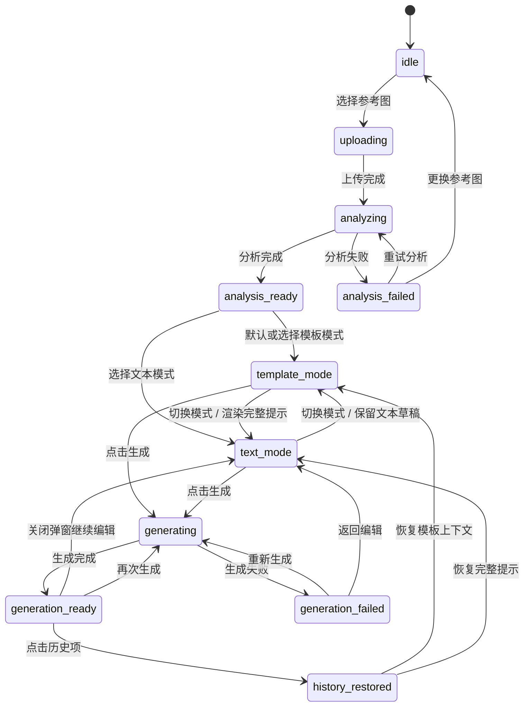
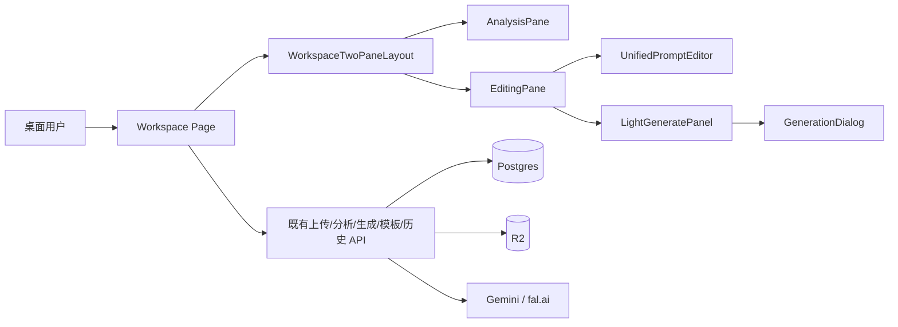
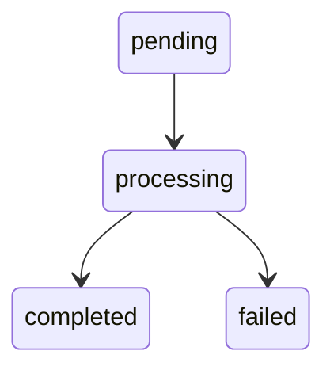

# 架构设计文档：Workspace 布局与生成弹窗重构

_本文件只保留当前版本真正影响实现的架构决策、边界和契约；DDL、目录树、环境变量、实施故事等内容默认不放入正文。_

## 1. 系统摘要

09 期把工作台主区域从状态驱动的二/三列切换，重构为稳定的左右双区：左侧分析区承载小参考图和大风格拆解，右侧编辑区承载合一编辑区与轻量生成区；生成进度、生成结果和生成失败统一进入对话框，不再常驻挤压主工作台。

核心闭环锚点：**Analyze -> Edit -> Generate**。本期验证目标是：不改变上传、分析、生成和模板 API 的前提下，让空态、分析中、分析完成、生成中和生成完成都保持同一空间骨架，并让模板模式、文本模式和变量编辑形成一个清晰的右侧编辑契约。

## 2. 范围、非目标与成功标准

### 2.1 范围

1. 工作台主区域重构为左右双区：左侧分析区，右侧编辑区。
2. 左侧分析区重排：参考图上传/显示区保持小占比，风格拆解区获得左侧主要空间。
3. 右侧编辑区重构：合一编辑区作为主体，轻量生成区作为底部或次级区域。
4. 合一编辑区支持两种模式：模板模式和文本模式。
5. 模板模式支持编辑模板原文，并在模板正文之外显示变量输入框列表。
6. 文本模式展示和编辑最终用于生成的完整生成提示。
7. 生成区轻量化：只承载必要输出设置、生成入口和不可用原因。
8. 生成对话框：承载生成中、生成完成和生成失败状态，关闭后回到原工作台上下文。
9. 空态、上传中、分析中、分析完成、生成中、生成完成和失败恢复保持同一左右区块位置。
10. 工作台主区域占满顶部导航和侧边栏之外的剩余空间，并支持可预期的上下滚动。

### 2.2 明确不做

- 不改变参考图上传、风格分析、图片生成、模板读取和历史恢复的核心 API。
- 不新增后端数据表、队列、实时推送、生成历史筛选或结果对比能力。
- 不重做模板库独立页面。
- 不新增移动端专用布局；首版仍以桌面和常规宽屏体验为验收目标。
- 不让负面提示继续作为可见 UI 区块；现有后端字段先保持兼容，前端统一写入空字符串。
- 不在本期引入全局状态管理库、完整设计组件库或可拖拽面板宽度。

### 2.3 成功标准

| 指标 | 首版目标 |
| --- | --- |
| 左右双区稳定性 | 工作台所有核心状态都保持左分析、右编辑的外层布局，不再按状态切换为三列 |
| 风格拆解可读性 | 分析完成后参考图保持轻量，风格拆解成为左侧主要内容 |
| 合一编辑体验 | 模板模式和文本模式可以切换，切换不清空用户已编辑内容 |
| 变量编辑体验 | 模板模式下可编辑模板原文，同时在正文之外调整变量值 |
| 生成区轻量化 | 输出设置和生成入口不与合一编辑区平分主要空间 |
| 生成弹窗体验 | 生成中、完成、失败都在对话框中呈现，关闭后上下文不丢失 |
| 空态一致性 | 未上传、分析中和分析完成的区块位置一致，只替换内容 |
| 滚动与响应式 | 工作台填满剩余空间；长内容可完整访问，不出现不可恢复的横向挤压 |

### 2.4 验收标准承接矩阵

| AC-ID | PRD 原文摘要 | 承接模块 | 关键链路 / 状态 | 风险 / 降级说明 |
| --- | --- | --- | --- | --- |
| AC-01 | 工作台分为左侧分析区和右侧编辑区 | WorkspaceTwoPaneLayout + AnalysisPane + EditingPane | §6.1 工作台进入链路；`idle` 到 `analysis_ready` 外层骨架不变 | 若视口过窄，保持左右顺序并允许主区域滚动，不回退到旧三列 |
| AC-02 | 参考图小占比，风格拆解占据主要空间 | AnalysisPane + ReferencePreview + StyleBreakdownPanel | §6.2 分析完成链路；`analysis_ready` | 参考图加载失败只影响预览区，风格拆解仍展示已有内容 |
| AC-03 | 右侧主体始终是合一编辑区，编辑内容不因状态切换丢失 | EditingPane + UnifiedPromptEditor + useWorkspaceState | §6.3 编辑链路；`analysis_ready` / `generating` / `generation_ready` | 对话框和失败状态不重置 prompt/template draft |
| AC-04 | 生成进度、结果和失败在对话框内呈现 | GenerationDialog + LightGeneratePanel | §6.5 生成对话框链路；`generating` / `generation_ready` / `generation_failed` | 生成失败停留在对话框内，可返回编辑且不清空上下文 |
| AC-05 | 关闭弹窗后回到原上下文 | GenerationDialog + WorkspaceContext | §6.5；dialog close | 关闭只改变 dialog 状态，不调用 workspace reset |
| AC-06 | 空态、分析中、分析完成布局一致 | WorkspaceTwoPaneLayout + EmptyStateBlocks | §6.1、§6.2；`idle` / `analyzing` / `analysis_ready` | 空态使用相同容器和职责占位，避免独立欢迎版式 |
| AC-07 | 主区域占满剩余空间，左右宽度响应式，内容可上下滑动 | WorkspaceLayout + WorkspaceTwoPaneLayout | §7.2 `WorkspaceLayoutContract`；常规桌面视口 | 长内容在所属 pane 内滚动，避免顶层失控 |
| AC-08 | 失败恢复不清空上下文 | ErrorStatePresenter + WorkspaceContext | §6.6 失败恢复链路；analysis/generation failure | 错误对象与业务上下文分离，只更新错误状态 |
| AC-09 | 模板模式/文本模式切换，变量列表在模板外显示 | UnifiedPromptEditor + TemplateModeEditor + TextModeEditor + TemplateVariablePanel | §6.3 合一编辑区编辑链路 | 切换模式不重新提取并覆盖用户输入；变量按模板原文稳定派生 |
| AC-10 | 轻量生成区只展示必要设置、入口和原因 | LightGeneratePanel | §6.4 生成准备链路 | 生成服务不可用时在轻量生成区显示原因，编辑区仍可用 |

## 3. 用户流程与状态

### 3.1 主流程

```text
进入工作台
  -> 渲染左右双区：左侧分析区 + 右侧编辑区
  -> 左上上传/参考图区，左下风格拆解区，右上合一编辑区，右下轻量生成区
  -> 上传参考图
  -> 左上显示参考图，左下显示分析进度，右侧编辑区保持原位
  -> 分析完成
  -> 左下展示风格拆解，右侧合一编辑区进入可编辑状态
  -> 用户选择模板模式或文本模式
  -> 模板模式：编辑模板原文 + 调整变量列表
  -> 文本模式：编辑完整生成提示
  -> 轻量生成区确认输出设置并点击生成
  -> 生成对话框展示生成进度
  -> 完成后对话框展示结果；关闭后回到原工作台上下文
```

### 3.2 关键分支

| 分支 | 入口 / 触发条件 | 架构处理方式 |
| --- | --- | --- |
| 初始空态 | 用户进入工作台且无参考图 | `WorkspaceTwoPaneLayout` 仍渲染四个职责区，左上为上传入口，左下/右侧为同位置占位 |
| 分析中 | 上传完成并创建分析任务 | `AnalysisPane` 左上显示参考图，左下显示 `AnalysisProgress`；`EditingPane` 不被卸载 |
| 模板加载 | 工作台 query 携带模板 ID 或用户已有模板内容 | 将模板内容写入 `templateSource`，进入模板模式并提取变量 |
| 模板模式切换 | 用户点击模板模式 | 展示模板原文编辑器和变量列表；变量值保存在 `variableValues`，不直接改写模板原文 |
| 文本模式切换 | 用户点击文本模式 | 展示完整生成提示；若来自模板模式，使用模板原文和变量值渲染结果作为初始完整提示 |
| 模板原文变更 | 用户编辑模板原文 | 重新提取变量；保留同名变量已有值，新变量为空，已删除变量从列表移除 |
| 变量值变更 | 用户编辑变量输入框 | 更新 `variableValues`；文本模式的完整提示在切换或预览时基于当前变量值生成 |
| 点击生成 | 用户在轻量生成区点击生成 | 以当前完整生成提示作为 `promptText`；`negativePromptText` 传空字符串以兼容现有接口 |
| 生成失败 | 生成 API 或轮询失败 | `GenerationDialog` 展示失败说明和重试/返回编辑；背景编辑上下文保留 |
| 关闭对话框 | 用户关闭生成中/完成/失败弹窗 | 只关闭对话框或更新 dialog 状态，不重置工作台内容 |

### 3.3 状态机



关键规则：

- 外层 `WorkspaceTwoPaneLayout` 不参与状态机切换，始终保持左分析、右编辑。
- `template_mode` 和 `text_mode` 是右侧合一编辑区的展示模式，不是后端任务状态。
- `generating`、`generation_ready`、`generation_failed` 由 `GenerationDialog` 承载视觉反馈；背景工作台不切换成结果页。
- `negativePromptText` 不再作为可见 UI 状态；调用现有接口时以空字符串兼容。

## 4. 系统上下文与模块职责

### 4.1 系统上下文

本期是前端体验层重构，不新增外部依赖，不改变 AI Provider、对象存储、数据库和主要业务 API。



变更点：

- `src/app/workspace/page.tsx` 从状态驱动的二/三列 grid，改为稳定的 `WorkspaceTwoPaneLayout`。
- `PromptEditor` 从 Prompt + Negative Prompt 双输入，演进为合一编辑区下的文本模式编辑器。
- 现有 `TemplateWizard` 的一次性变量填充能力，收敛为模板模式里的常驻变量列表。
- 现有 `OutputSettings` 拆出轻量生成区职责；生成进度和结果迁移到 `GenerationDialog`。

### 4.2 模块职责

| 模块 | 职责 | 上游输入 | 下游输出 |
| --- | --- | --- | --- |
| WorkspaceTwoPaneLayout | 渲染左右双区，管理主区域高度、宽度比例和滚动边界 | 工作台状态、导航外层可用空间 | 左侧 `AnalysisPane`、右侧 `EditingPane` 的稳定容器 |
| AnalysisPane | 组合参考图上传/显示区和风格拆解区；保证参考图小占比、风格拆解大空间 | referenceImageUrl、recipe、analysis state、error | 上传回调、重试/更换参考图回调、风格拆解展示 |
| ReferencePreview | 承载上传空态、上传中、参考图预览、更换参考图入口 | 文件状态、referenceImageUrl、upload progress | `onFileSelected`、`onReplace` |
| StyleBreakdownPanel | 承载风格拆解空态、分析中、分析失败、分析完成内容 | recipe、analysisQueueing、analysis error | 重试分析、更换参考图、保存模板入口 |
| EditingPane | 右侧编辑区容器，组织合一编辑区和轻量生成区；保证生成区小占比 | prompt/template draft、generation state、params | 完整生成提示、生成参数、生成动作 |
| UnifiedPromptEditor | 统一模板模式和文本模式，维护编辑草稿和模式切换 | templateSource、promptText、template variables | `resolvedPromptText`、mode、templateSource、variableValues |
| TemplateModeEditor | 编辑模板原文，并展示模板正文之外的变量输入列表 | templateSource、variableValues | 新 templateSource、新 variableValues |
| TextModeEditor | 编辑最终用于生成的完整提示词 | resolvedPromptText | 新 promptText |
| LightGeneratePanel | 展示必要输出设置、生成按钮、不可用原因；不展示结果图 | prompt readiness、params、generationUnavailable | `onGenerate(params)` |
| GenerationDialog | 展示生成中、生成完成、生成失败；关闭后保留背景上下文 | generationTaskId、generation polling data、error | retry、close、return to edit |

交互链路细节：

- `ReferencePreview`：点击/拖放文件 -> `startUpload` -> 上传进度 -> `completeUpload` -> `startAnalysis`；失败只更新左侧错误状态，不卸载右侧编辑区。
- `StyleBreakdownPanel`：`idle` 展示占位，`analyzing` 展示进度，`analysis_ready` 展示 recipe，`analysis_failed` 展示重试和更换参考图。
- `UnifiedPromptEditor`：点击模式切换 -> 更新 `promptMode`；模板模式变更原文 -> 提取变量并合并已有变量值；文本模式变更 -> 更新 `promptText`。
- `LightGeneratePanel`：点击生成 -> 读取当前 `resolvedPromptText`，校验非空和可生成状态 -> 调用现有生成创建逻辑 -> 打开 `GenerationDialog`。
- `GenerationDialog`：生成完成展示结果图；关闭只关闭 dialog，不改变 `WorkspaceTwoPaneLayout`；失败可重试或返回编辑。

### 4.3 需要刻意避免的过度设计

| 不引入的内容 | 原因 |
| --- | --- |
| 新后端数据表 | 本期只调整前端布局和编辑状态，现有 analysis/generation/template 表足够 |
| 新生成 API | 现有 `POST /api/generation` 可继续使用；UI 不显示负面提示时传空字符串即可 |
| 全局状态管理库 | 工作台状态仍集中在 `useWorkspaceState` 与页面局部状态即可承载 |
| 可拖拽分栏 | PRD 只要求响应式宽度和小/大空间优先级，拖拽会扩大交互和测试面 |
| 复杂模板 AST | 变量语法已是 `{{name}}`，首版继续用正则提取和替换 |
| 独立生成结果页面 | 结果是阶段性输出，对话框足以承载本期体验目标 |

## 5. 关键架构决策（ADR）

### ADR-1：工作台外层固定为左右双区

- **选择**：用 `WorkspaceTwoPaneLayout` 替换当前二/三列动态 grid，外层始终为左侧分析区和右侧编辑区。
- **理由**：PRD 的核心是减少状态切换跳变；继续按 `showPromptEditor` 切列会让空态和分析态布局不一致。
- **风险与对策**：较窄桌面可能拥挤；通过 min/max 宽度、内部滚动和响应式比例缓解，不引入移动专用布局。

### ADR-2：右侧采用合一编辑区而非多个并列编辑块

- **选择**：模板编辑和完整提示词编辑合并到 `UnifiedPromptEditor`，通过模板模式和文本模式切换。
- **理由**：两个大编辑区常驻会重复占用右侧空间；模式切换能保留同一编辑上下文，符合“生成区更小”的目标。
- **风险与对策**：模式间同步可能覆盖用户输入；用明确的 draft 状态和“切换不清空”规则约束。

### ADR-3：模板变量保持前端派生状态

- **选择**：模板原文是 source of truth，变量列表由模板原文提取，变量值存放在前端 `variableValues`。
- **理由**：变量编辑只服务当前工作台生成，不需要后端持久化；避免为临时编辑引入新表或新 API。
- **风险与对策**：模板原文变更会影响变量列表；同名变量保留旧值，新变量为空，删除的变量移除。

### ADR-4：UI 移除负面提示，后端字段先兼容保留

- **选择**：前端不再展示负面提示输入；调用现有生成 API 时 `negativePromptText` 传空字符串，历史字段继续读写但不展示为主编辑区。
- **理由**：PRD 要求完整提示词统一放在生成提示中；立即迁移后端字段会扩大范围并影响历史数据。
- **演进余地**：若后续确认不再需要负面提示，可单独做数据契约清理和测试更新。

### ADR-5：生成反馈进入对话框

- **选择**：生成中、完成、失败由 `GenerationDialog` 承载；主工作台只保留轻量生成入口。
- **理由**：结果常驻会挤压编辑区；对话框满足按需查看并能保留背景上下文。
- **风险与对策**：弹窗内容过长时内部滚动；关闭动作只影响 dialog，不 reset 工作台状态。

### ADR-6：生成区拆为轻量操作层

- **选择**：将输出设置和生成入口收敛为 `LightGeneratePanel`，不展示结果、不承载长文案。
- **理由**：生成区是动作入口，不应与合一编辑区平分主要面积；更重的生成面板会回到旧布局问题。
- **风险与对策**：不可用原因可能被忽略；在生成按钮附近展示短原因和恢复入口。

### 5.x 待确认问题

无。PRD 已明确右侧合一编辑、变量外置调整、生成区轻量化和生成弹窗化；后端负面提示字段采取兼容保留策略，不阻塞实现。

## 6. 运行链路

### 6.1 工作台进入与空态

1. `src/app/workspace/layout.tsx` 提供顶部导航和侧边栏之外的剩余高度容器。
2. `WorkspacePage` 初始化 `useWorkspaceState`，读取已有 session 状态。
3. `WorkspaceTwoPaneLayout` 固定渲染 `AnalysisPane` 和 `EditingPane`。
4. 若无参考图，`ReferencePreview` 显示上传入口，`StyleBreakdownPanel` 显示风格拆解占位。
5. `EditingPane` 显示合一编辑区空态和轻量生成区不可用原因。

实现原则：

- 空态使用与分析完成态相同的容器位置和比例，只替换内部内容。
- 顶层容器使用剩余高度，pane 内部负责滚动，避免整页和内部双重滚动打架。

### 6.2 上传与分析

1. 用户在 `ReferencePreview` 选择或拖放参考图。
2. 复用现有 `useUpload` 和 `useAnalysis` 链路。
3. 上传中：左上显示上传反馈，左下保持风格拆解占位或分析准备态。
4. 分析中：左上显示参考图，左下显示 `AnalysisProgress`。
5. 分析完成：`completeAnalysis(recipe, promptText, negativePromptText)` 写入工作台状态。
6. `UnifiedPromptEditor` 以 `promptText` 初始化文本草稿；`negativePromptText` 不进入可见 UI。

实现原则：

- 不改变上传直传、分析任务和轮询机制。
- 分析返回的 `negativePromptText` 可以保存在兼容字段中，但不显示独立输入区。

### 6.3 合一编辑区编辑

1. `UnifiedPromptEditor` 维护 `promptMode`：`template` 或 `text`。
2. 模板模式下，用户编辑 `templateSource`。
3. 每次模板原文变化时，调用 `extractVariables(templateSource)`。
4. 变量合并算法：按首次出现顺序生成变量列表；同名变量沿用已有 `variableValues[name]`；新增变量值为空；已不存在变量从 `variableValues` 删除。
5. 用户在模板外变量列表中输入值。
6. 切换到文本模式时，调用 `replaceVariables(templateSource, variableValues)` 得到完整提示词，并作为 `promptText` 的初始值。
7. 文本模式下，用户直接编辑 `promptText`。

实现原则：

- 模板原文和变量值是模板模式的 source of truth；文本模式的 `promptText` 是生成前的 source of truth。
- 从文本模式切回模板模式时，不反向解析完整提示词；保留模板草稿和变量值。
- `replaceVariables` 继续按变量名长度降序替换，避免短变量名误替换长变量名。

### 6.4 生成准备与提交

1. `LightGeneratePanel` 读取当前 `promptMode`。
2. 若为模板模式，生成前使用 `templateSource + variableValues` 渲染完整提示词。
3. 若为文本模式，直接使用 `promptText`。
4. 校验完整提示词非空，且当前状态允许生成。
5. 调用现有生成创建逻辑：`promptText` 使用完整提示词，`negativePromptText` 使用空字符串，`params` 使用输出设置。
6. 创建成功后进入 `generating`，并打开 `GenerationDialog`。

实现原则：

- UI 不提供负面提示入口，完整提示词承担所有生成语义。
- 生成区只负责参数和动作，不持有长文本编辑状态。

### 6.5 生成对话框

1. `GenerationDialog` 根据 `generationTaskId` 复用现有轮询数据。
2. `generating` 时显示生成进度和排队提示。
3. `generation_ready` 时显示结果图、关闭、重新生成等动作。
4. `generation_failed` 时显示错误说明、重新生成和返回编辑。
5. 关闭对话框时，只更新 dialog open 状态；工作台状态和编辑草稿保留。

实现原则：

- 对话框内部内容过长时内部滚动，关闭和主要行动入口保持可访问。
- 背景工作台不切换成结果图常驻布局。

### 6.6 失败恢复

1. 上传或分析失败只接管左侧对应区域。
2. 生成失败只接管 `GenerationDialog`。
3. 模板变量解析失败按空变量列表处理，并保留模板原文。
4. 返回编辑时关闭错误展示，不清空 `recipe`、`templateSource`、`variableValues` 或 `promptText`。

实现原则：

- 错误状态和业务上下文分离，错误不能触发全局 reset。
- 可恢复失败提供重试、更换参考图或返回编辑入口。

## 7. 领域对象与关键契约

### 7.1 核心对象

| 对象名 | Source of Truth | Owner | 用途 |
| --- | --- | --- | --- |
| WorkspaceContext | `useWorkspaceState` | WorkspacePage | 上传、分析、生成、历史恢复的跨组件状态 |
| AnalysisPaneState | WorkspaceContext 派生 | AnalysisPane | 左侧参考图、分析进度、风格拆解和分析失败展示 |
| UnifiedPromptDraft | 前端局部状态，可同步 promptText | UnifiedPromptEditor | 模板模式、文本模式、变量值和完整提示词 |
| GenerationParams | OutputSettings / LightGeneratePanel | LightGeneratePanel | 宽高比、质量等生成参数 |
| GenerationDialogState | WorkspacePage 局部状态 + generation polling | GenerationDialog | 是否打开、生成中/完成/失败展示 |

### 7.2 推荐最小 Schema

```ts
export type WorkspacePromptMode = "template" | "text";

export interface UnifiedPromptDraft {
  mode: WorkspacePromptMode;
  templateSource: string;
  variableValues: Record<string, string>;
  promptText: string;
}

export interface TemplateVariableView {
  name: string;
  value: string;
}

export interface ResolvedGenerationInput {
  promptText: string;
  negativePromptText: "";
  params: {
    aspectRatio: AspectRatio;
    quality: Quality;
  };
}

export interface GenerationDialogState {
  open: boolean;
  taskId: string | null;
  view: "progress" | "result" | "error";
}

export interface WorkspaceLayoutContract {
  leftPane: "analysis";
  rightPane: "editing";
  referenceRegion: "compact";
  styleBreakdownRegion: "primary";
  generateRegion: "compact";
  scrollOwner: "workspace" | "pane";
}
```

说明：

- `templateSource` 保存模板模式原文，支持 `{{variableName}}` 标记。
- `variableValues` 只保存当前工作台变量值，不写入后端。
- `promptText` 是文本模式和最终生成的完整提示词。
- `negativePromptText` 在本期 UI 中固定为空字符串，用于兼容现有接口。

### 7.3 API 边界

本期不新增 API，复用并约束现有端点：

| 接口路径 | 用途 | 本期说明 |
| --- | --- | --- |
| `POST /api/upload/presign` | 获取参考图上传地址 | 不变 |
| `POST /api/analysis` | 创建分析任务 | 不变 |
| `GET /api/analysis/:id` | 轮询分析结果 | 继续读取 `promptText`；`negativePromptText` 不进入 UI |
| `POST /api/generation` | 创建生成任务 | `promptText` 来源为合一编辑区解析结果；`negativePromptText` 由前端传空字符串 |
| `GET /api/generation/:id` | 轮询生成/历史详情 | 用于生成对话框和历史恢复，不改变响应契约 |
| `GET /api/templates/:id` | 加载模板 | 写入 `templateSource` 并进入模板模式 |

请求字段来源约束：

| 字段 | 数据来源 | 说明 |
| --- | --- | --- |
| `analysisTaskId` | derived | 当前工作台分析任务或历史恢复任务 |
| `promptText` | frontend_computed / user_input | 模板模式由模板原文和变量值渲染；文本模式由用户直接编辑 |
| `negativePromptText` | frontend_computed | 固定为空字符串，兼容现有生成 API |
| `params.aspectRatio` | user_input | 轻量生成区选择 |
| `params.quality` | user_input | 轻量生成区选择 |

### 7.4 状态流转

后端任务状态不变：



前端新增的 `template_mode`、`text_mode` 和 `GenerationDialogState` 都是 UI 状态，不写入数据库。

### 7.5 数据边界

| 存储层 | 职责 | 本期变化 |
| --- | --- | --- |
| PostgreSQL | 保存资产、分析任务、生成任务、模板 | 不新增表；负面提示字段兼容保留 |
| R2 对象存储 | 保存参考图和生成图 | 不变 |
| sessionStorage | 恢复工作台关键上下文 | 可继续保存 promptText；模板草稿是否持久化由实现阶段决定，首版可不持久化 |
| React state | 保存模式、模板原文、变量值、对话框开关 | 新增主要 UI 状态 owner |

### 7.6 命名与标识规则

- UI 术语统一使用“生成提示”或 `promptText`，不再在可见 UI 中使用“Negative Prompt/负面提示”。
- 接口兼容字段继续使用 `negativePromptText` / `negativePromptSnapshot`，但前端传空字符串并不作为主编辑对象。
- 模式命名使用 `template` / `text`，对应“模板模式 / 文本模式”。
- 变量名继续遵循 `[a-zA-Z_]\w*`，模板标记为 `{{variableName}}`。
- `WorkspaceTwoPaneLayout` 指外层左右双区；`AnalysisPane` 指左侧；`EditingPane` 指右侧。

## 8. 非功能需求、风险与运行策略

### 8.1 性能与吞吐量目标

| 指标 | 目标 | 预期并发 |
| --- | --- | --- |
| 模式切换响应 | 本地切换即时完成，无网络请求 | 单用户本地操作 |
| 变量提取 | 百级变量以内本地同步完成，不阻塞输入 | 单用户编辑 |
| 工作台首屏布局 | 不增加新的阻塞 API 请求 | 复用现有工作台并发 |
| 生成对话框轮询 | 复用现有 generation polling，不增加额外轮询通道 | 与现有生成一致 |

### 8.2 可靠性、错误处理与降级策略

| 级别 | 触发条件 | 系统行为 |
| --- | --- | --- |
| L1 轻提示 | 分析或生成等待超过既有阈值 | 在左侧分析区或生成对话框内提示排队，不改变布局 |
| L2 局部不可用 | 生成服务不可用 | 轻量生成区显示原因，合一编辑区继续可用 |
| L3 可恢复失败 | 分析失败 | 左侧风格拆解区显示失败和重试，参考图与右侧编辑保留 |
| L4 弹窗失败 | 生成失败 | 对话框展示失败，允许重试或返回编辑 |
| L5 模板解析异常 | 模板变量标记异常 | 保留模板原文，变量列表按可识别变量展示，文本模式仍可直接编辑 |

### 8.3 安全与反滥用策略

| 项目 | 首版策略 |
| --- | --- |
| API Key 管理 | 不变，AI Provider Key 只在服务端使用 |
| Prompt 注入 | 本期不新增模型调用入口；用户编辑的完整提示词仍走既有生成链路 |
| 内容安全 | 沿用现有生成服务和后端错误处理策略 |
| Rate Limit | 不新增额外生成入口；轻量生成区仍调用现有生成 API |
| 客户端输入 | 模板变量只作为提示词文本替换，不执行代码 |

### 8.4 成本控制预期

| 模块 | 预估单次成本 | 首版控制策略 |
| --- | --- | --- |
| 上传/分析 | 与现有链路一致 | 不新增分析调用 |
| 图片生成 | 与现有生成 API 一致 | 模式切换和变量编辑均为本地操作，不触发生成 |
| 模板变量处理 | 无外部成本 | 前端本地提取和替换 |
| 生成对话框 | 无新增外部成本 | 复用现有轮询 |

### 8.5 可观测性

- 继续使用现有 API 日志记录分析和生成任务。
- 前端无需新增埋点作为首版通过条件。
- 实现阶段可在开发日志中记录模式切换和变量解析错误，但不得记录用户完整提示词到非必要日志。

### 8.6 主要风险

| 风险 | 影响 | 缓解方式 |
| --- | --- | --- |
| 模式切换覆盖用户输入 | 用户丢失编辑内容 | 保持模板草稿、变量值、文本草稿三个状态独立，切换不清空 |
| 轻量生成区过轻导致不可用原因不明显 | 用户不知道为何不能生成 | 在生成按钮附近展示短原因和恢复行动 |
| 对话框关闭误清空结果或编辑状态 | 用户无法继续迭代 | 关闭只改变 dialog 状态，不调用 reset |
| 旧负面提示字段与新 UI 口径混乱 | 实现和测试误判 | 术语规则明确：UI 不显示，接口传空字符串，后端兼容保留 |
| 左右双区在较窄桌面拥挤 | 阅读和编辑体验下降 | 使用响应式比例、min-width、内部滚动；移动端另行立项 |

## 9. 实施方案

### Phase A：布局骨架与左侧分析区

1. `src/app/workspace/page.tsx` — 移除 `useThreeColumns` 二/三列切换逻辑，改为稳定渲染 `WorkspaceTwoPaneLayout`。
2. `src/components/workspace/workspace-two-pane-layout.tsx` — 新建左右双区容器，定义剩余高度、响应式宽度和滚动边界。
3. `src/components/workspace/analysis-pane.tsx` — 新建左侧分析区，组合 `ReferencePreview` 与 `StyleBreakdownPanel`。
4. `src/components/workspace/workspace-canvas.tsx` — 收敛为参考图上传/显示职责，移除结果常驻展示依赖。
5. `src/components/workspace/recipe-editor.tsx` / `analysis-progress.tsx` — 嵌入 `StyleBreakdownPanel`，覆盖空态、分析中、失败和完成态。

验证目标：AC-01、AC-02、AC-06、AC-07 的布局骨架可通过桌面截图和交互检查。

### Phase B：合一编辑区与变量模式

1. `src/components/workspace/unified-prompt-editor.tsx` — 新建合一编辑区，管理模板模式、文本模式和草稿状态。
2. `src/components/workspace/template-mode-editor.tsx` — 新建模板模式编辑器，支持模板原文编辑和变量列表。
3. `src/components/workspace/text-mode-editor.tsx` — 新建文本模式编辑器，编辑完整生成提示。
4. `src/lib/template-parser.ts` — 复用 `extractVariables` / `replaceVariables`；必要时补单元测试覆盖变量合并规则。
5. `src/hooks/use-workspace-state.ts` — 保持 `promptText` 为最终生成提示；`negativePromptText` UI 不再写入用户输入，生成时传空字符串。

验证目标：AC-03、AC-09；补充组件测试覆盖模式切换、模板原文变更、变量保留和文本草稿不丢失。

### Phase C：轻量生成区与生成对话框

1. `src/components/workspace/light-generate-panel.tsx` — 从 `OutputSettings` 拆出轻量生成区，只保留必要设置、生成入口和不可用原因。
2. `src/components/workspace/generation-dialog.tsx` — 新建生成对话框，承载生成中、完成和失败状态。
3. `src/app/workspace/page.tsx` — 调整 `handleGenerate`：读取 `resolvedPromptText`，`negativePromptText` 使用空字符串，提交后打开对话框。
4. `src/components/workspace/output-settings.tsx` — 压缩或拆分为参数选择子组件，移除生成结果/长状态占位。
5. `src/hooks/__tests__/use-workspace-state.test.tsx`、相关组件测试 — 更新负面提示 UI 移除后的断言；保留接口兼容测试。

验证目标：AC-04、AC-05、AC-08、AC-10；运行 `pnpm type-check`、相关 Vitest、必要的 Playwright 工作台流程。

## 10. 架构结论

本期架构选择前端体验层的最小重构：固定工作台空间骨架，收敛右侧编辑模型，把生成结果移出常驻布局，同时避免后端数据和 API 迁移。核心判断是：用户当前的主要损失来自布局跳变和编辑空间被挤压，而不是业务链路能力不足。

实现上应优先保证三个契约：外层左右双区不随状态变化；模板模式和文本模式切换不丢草稿；生成对话框不清空背景上下文。只要这三个契约成立，后续再细化视觉、动画或历史对比都不会破坏本期主体验。
