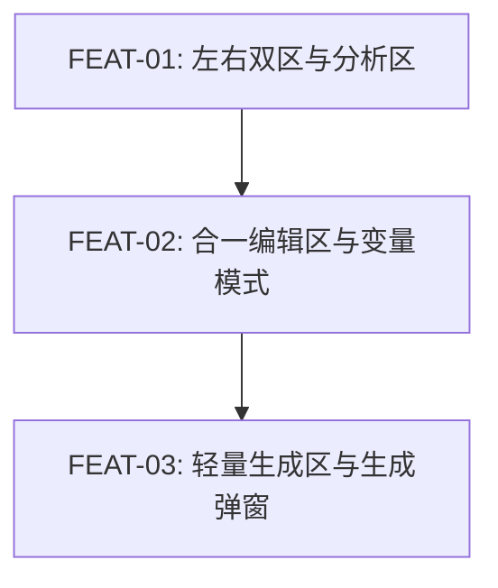

# 实现计划：Workspace 布局与生成弹窗重构

## 1. 概览

- **项目**: Workspace 布局与生成弹窗重构
- **来源架构**: `docs/09-1-架构文档-workspace布局与生成弹窗重构.md`
- **组织方式**: 功能维度（Feature-based）
- **项目类型**: Brownfield（在现有 style-gen / Visoryn 工作台上增量重构）
- **技术栈**: Next.js 15 App Router + React 19 + TypeScript + Tailwind CSS 4 + TanStack React Query + Vitest + Playwright
- **总阶段数**: 3
- **总功能数**: 3
- **最大并行度**: 1
- **关键路径**: FEAT-01 -> FEAT-02 -> FEAT-03

## 2. 输入摘要

### 2.1 核心闭环与目标

核心闭环：**Analyze -> Edit -> Generate**。

本期不改变上传、分析、模板、生成和历史 API，只重构工作台前端体验层：外层从状态驱动的二/三列切换，改为稳定的左右双区；左侧用小参考图和大风格拆解承载分析结果；右侧用合一编辑区承载模板模式和文本模式；生成区保持轻量，生成中、结果和失败统一通过对话框呈现。

### 2.2 关键 ADR 与实施护栏

| ADR | 决策 | 实施约束 |
| --- | --- | --- |
| ADR-1 | 工作台外层固定为左右双区 | 不再用 `showPromptEditor` 切换二/三列；空态、分析中、分析完成保持同一外层骨架 |
| ADR-2 | 右侧采用合一编辑区 | 模板编辑和完整生成提示编辑不能常驻为两个大区，必须通过模式切换承载 |
| ADR-3 | 模板变量保持前端派生状态 | 不新增后端表或 API；变量由模板原文提取，变量值保存在前端草稿 |
| ADR-4 | UI 移除负面提示，后端字段兼容保留 | 前端不显示负面提示输入；提交生成时 `negativePromptText` 固定传空字符串 |
| ADR-5 | 生成反馈进入对话框 | 主工作台不常驻展示生成结果；关闭对话框不重置工作台上下文 |
| ADR-6 | 生成区拆为轻量操作层 | 生成区只放必要输出设置、生成入口和不可用原因，不与合一编辑区平分主要面积 |

### 2.3 现有代码快照

| 文件/目录 | 状态 | 说明 |
| --- | --- | --- |
| `src/app/workspace/page.tsx` | 已有 | 当前包含二/三列 grid、模板 query 加载、上传/分析/生成/历史恢复接线 |
| `src/app/workspace/layout.tsx` | 已有 | 当前提供侧边栏和剩余高度容器，可保留外壳但需确保内容区滚动契约 |
| `src/components/workspace/workspace-canvas.tsx` | 已有 | 当前承载参考图、结果图和对比/放大逻辑，本期需收敛为参考图上传/显示职责 |
| `src/components/workspace/recipe-editor.tsx` | 已有 | 当前承载风格拆解和降级状态，可迁入左侧 StyleBreakdownPanel |
| `src/components/workspace/analysis-progress.tsx` | 已有 | 当前分析中展示组件，可作为左侧分析区状态内容 |
| `src/components/workspace/prompt-editor.tsx` | 已有 | 当前 Prompt + Negative Prompt 双输入，本期改造为文本模式或被新组件替代 |
| `src/components/workspace/template-wizard.tsx` | 已有 | 当前一次性变量填充，本期能力收敛到常驻模板模式变量列表 |
| `src/components/workspace/output-settings.tsx` | 已有 | 当前较重的生成设置和生成状态容器，本期拆成轻量生成区/参数选择 |
| `src/components/workspace/generation-progress.tsx` | 已有 | 当前生成中展示组件，可被生成对话框复用 |
| `src/lib/template-parser.ts` | 已有 | 已有变量提取与替换逻辑，本期补变量合并规则测试 |
| `src/hooks/use-workspace-state.ts` | 已有 | 当前保存 `promptText` / `negativePromptText` / 生成状态，本期保持后端兼容但 UI 不再写入负面提示 |
| `e2e/workspace-layout.spec.ts` | 已有 | 可参考现有工作台布局 E2E，新建 09 专项 spec |
| `e2e/helpers/workspace-actions.ts` | 已有 | 可复用工作台操作 helper |
| `e2e/helpers/mock-api.ts` | 已有 | 可扩展 mock 以覆盖 09 工作台状态 |

### 2.4 架构约束

- 本期不新增后端数据表、后端端点、队列、实时推送或外部服务。
- 工作台外层必须保持左右双区：左侧分析区，右侧编辑区。
- 右侧主体是合一编辑区，生成区必须更小，且不展示生成结果。
- 模板模式的 source of truth 是模板原文和变量值；文本模式的 source of truth 是完整生成提示。
- 负面提示不再作为可见 UI；接口兼容字段固定传空字符串。
- 失败状态与业务上下文分离，失败不能触发全局 reset。
- 用户可观察功能必须走 E2E-TDD：先 red spec，再实现，再 green 证据。

## 3. 验收标准追踪矩阵

| AC-ID | 需求原文 | 架构承接 | 计划承接 | 验证方式 | 当前状态 |
| --- | --- | --- | --- | --- | --- |
| AC-01 | 工作台分为左侧分析区和右侧编辑区 | WorkspaceTwoPaneLayout + AnalysisPane + EditingPane | FEAT-01 | FEAT-01 §5 + `e2e/workspace-two-pane.spec.ts` | done |
| AC-02 | 参考图小占比，风格拆解占据主要空间 | AnalysisPane + ReferencePreview + StyleBreakdownPanel | FEAT-01 | FEAT-01 §5 + `e2e/workspace-two-pane.spec.ts` | done |
| AC-03 | 右侧主体始终是合一编辑区，编辑内容不因状态切换丢失 | EditingPane + UnifiedPromptEditor + useWorkspaceState | FEAT-02 | FEAT-02 §5 + `e2e/workspace-unified-editor.spec.ts` | done |
| AC-04 | 生成进度、结果和失败在对话框内呈现 | GenerationDialog + LightGeneratePanel | FEAT-03 | FEAT-03 §5 + `e2e/workspace-generation-dialog.spec.ts` | done |
| AC-05 | 关闭弹窗后回到原上下文 | GenerationDialog + WorkspaceContext | FEAT-03 | FEAT-03 §5 + `e2e/workspace-generation-dialog.spec.ts` | done |
| AC-06 | 空态、分析中、分析完成布局一致 | WorkspaceTwoPaneLayout + EmptyStateBlocks | FEAT-01 | FEAT-01 §5 + `e2e/workspace-two-pane.spec.ts` | done |
| AC-07 | 主区域占满剩余空间，左右宽度响应式，内容可上下滑动 | WorkspaceLayout + WorkspaceTwoPaneLayout | FEAT-01 | FEAT-01 §5 + Playwright 1280px/1440px 断言 | done |
| AC-08 | 失败恢复不清空上下文（含上传失败和分析失败） | ErrorStatePresenter + WorkspaceContext | FEAT-01, FEAT-03 | FEAT-01/03 §5 失败恢复项（含上传失败 L3 断言） | done |
| AC-09 | 模板模式/文本模式切换，变量列表在模板外显示 | UnifiedPromptEditor + TemplateModeEditor + TextModeEditor + TemplateVariablePanel | FEAT-02 | FEAT-02 §5 + 组件测试 + E2E | done |
| AC-10 | 轻量生成区只展示必要设置、入口和原因 | LightGeneratePanel | FEAT-03 | FEAT-03 §5 + `e2e/workspace-generation-dialog.spec.ts` | done |

## 4. 模块地图

| 模块 | 职责 | 计划承接 |
| --- | --- | --- |
| WorkspaceTwoPaneLayout | 左右双区、剩余高度、宽度比例、滚动边界 | FEAT-01 |
| AnalysisPane | 左侧参考图和风格拆解区组合 | FEAT-01 |
| ReferencePreview | 上传空态、上传中、参考图预览、更换参考图 | FEAT-01 |
| StyleBreakdownPanel | 风格拆解空态、分析中、分析失败、分析完成 | FEAT-01 |
| EditingPane | 右侧合一编辑区和轻量生成区容器 | FEAT-02, FEAT-03 |
| UnifiedPromptEditor | 模板模式/文本模式、草稿和变量值状态 | FEAT-02 |
| TemplateModeEditor | 模板原文编辑和模板外变量列表 | FEAT-02 |
| TextModeEditor | 完整生成提示编辑 | FEAT-02 |
| LightGeneratePanel | 必要输出设置、生成入口、不可用原因 | FEAT-03 |
| GenerationDialog | 生成中、生成完成、生成失败弹窗 | FEAT-03 |

按功能聚合展示：

| 功能 | 包含模块 | 类型 | 对应文件 |
| --- | --- | --- | --- |
| FEAT-01 | WorkspaceTwoPaneLayout, AnalysisPane, ReferencePreview, StyleBreakdownPanel | frontend | `FEAT-01-左右双区与分析区.md` |
| FEAT-02 | EditingPane, UnifiedPromptEditor, TemplateModeEditor, TextModeEditor | frontend | `FEAT-02-合一编辑区与变量模式.md` |
| FEAT-03 | LightGeneratePanel, GenerationDialog, WorkspaceContext 集成 | frontend | `FEAT-03-轻量生成区与生成弹窗.md` |

## 5. 依赖图



节点使用 FEAT-ID 标识。

## 6. 阶段摘要

| 阶段 | 功能 | 目标 | 可并行度 |
| --- | --- | --- | --- |
| Phase 1 | FEAT-01 | 固定工作台外层左右双区，完成左侧参考图和风格拆解布局，确保空态/分析态一致 | 1 |
| Phase 2 | FEAT-02 | 完成右侧合一编辑区、模板模式、文本模式和变量外置调整 | 1 |
| Phase 3 | FEAT-03 | 完成轻量生成区、生成对话框、负面提示 UI 移除和全流程回归 | 1 |

## 7. 任务总览

| 功能 | 阶段 | 包含维度 | 依赖 | 独立验收标准 |
| --- | --- | --- | --- | --- |
| FEAT-01: 左右双区与分析区 | Phase 1 | frontend | 无 | 外层左右双区稳定，参考图小占比，风格拆解主空间，空态/分析态一致 |
| FEAT-02: 合一编辑区与变量模式 | Phase 2 | frontend | FEAT-01 | 模板模式/文本模式可切换，模板变量在正文外调整，切换不清空草稿 |
| FEAT-03: 轻量生成区与生成弹窗 | Phase 3 | frontend | FEAT-01, FEAT-02 | 生成区轻量，生成反馈在弹窗内，关闭/失败不清空上下文 |

### 7.2 开发状态机

| FEAT | 当前步骤 | red_e2e | implement | green_e2e | review | 最近证据 | 阻塞原因 | 更新时间 |
| --- | --- | --- | --- | --- | --- | --- | --- | --- |
| FEAT-01 | done | done | done | done | done | green: FEAT-01-e2e-green-20260430; review: FEAT-01-review-20260430 | - | 2026-04-30 |
| FEAT-02 | done | done | done | done | done | green: FEAT-02-e2e-green-20260430; review: FEAT-02-review-20260430 | - | 2026-04-30 |
| FEAT-03 | done | done | done | done | done | green: FEAT-03-e2e-green-20260430; review: FEAT-03-review-20260430 | - | 2026-04-30 |

## 8. 未决策项

| 编号 | 问题 | 影响功能 | 需要谁决策 | 阻塞等级 |
| --- | --- | --- | --- | --- |
| 无 | 架构文档 `open_questions: []`，实现计划无未决策项 | 无 | 无 | 无 |

## 9. 执行前置

### 9.1 环境准备

- 安装依赖：`pnpm install`
- 开发服务器可启动：`pnpm dev`
- 工作台真实链路需要 `.env.local`、数据库和外部服务配置；E2E 可优先使用现有 mock helper。
- 浏览器验收默认使用桌面宽度：1280px 和 1440px。

### 9.2 执行顺序

1. 执行 FEAT-01，先写 `e2e/workspace-two-pane.spec.ts` red 证据，再实现布局骨架和左侧分析区。
2. FEAT-01 进入 review 后执行 FEAT-02，先写 `e2e/workspace-unified-editor.spec.ts` red 证据，再实现合一编辑区和变量模式。
3. FEAT-02 进入 review 后执行 FEAT-03，先写 `e2e/workspace-generation-dialog.spec.ts` red 证据，再实现轻量生成区、生成弹窗和全流程回归。
4. 每个 FEAT 完成后只能推进到 `review`；`review -> done` 由 `task-review` 执行。

### 9.3 全局验证

所有功能完成后执行：

```bash
pnpm type-check
pnpm lint
pnpm test
pnpm e2e
pnpm build
```

## 10. 变更记录

| 日期 | 变更类型 | 功能 | 说明 |
| --- | --- | --- | --- |
| 2026-04-30 | 新增 | 全部 | 基于 09-1 架构文档创建功能维度实现计划，拆分为左右双区、合一编辑区、轻量生成弹窗 3 个 FEAT |

<!-- 保留目录：reviews/。当 task-review、dev-plan-check 等开始运行时创建。 -->
