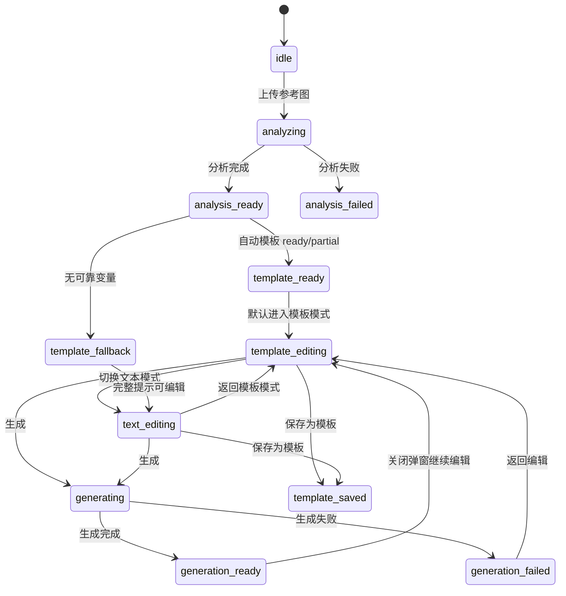
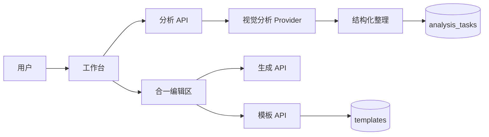
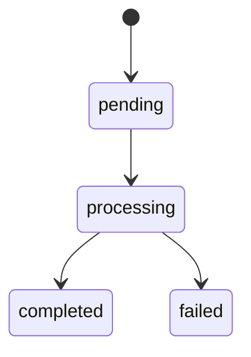
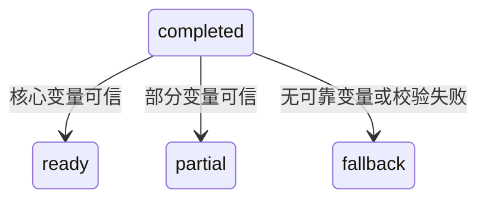

# 架构设计文档：分析后模板变量自动填充

_本文件只保留当前版本真正影响实现的架构决策、边界和契约；DDL、目录树、环境变量、实施故事等内容默认不放入正文。_

## 1. 系统摘要

10 期在现有参考图分析链路中新增“自动变量模板”产物：结构化分析完成后，同步得到可编辑模板正文、变量默认值和可用状态；工作台右侧首次进入模板模式，用户可以直接生成或改变量后生成。

核心闭环锚点：**Analyze -> Template -> Generate**。首版验证目标是：不新增 AI 调用、不自动保存模板库的前提下，让分析结果天然成为带默认值的可复用模板草稿。

## 2. 范围、非目标与成功标准

### 2.1 范围

1. 扩展结构化分析结果：返回自动模板正文、变量列表、模板状态和降级原因。
2. 自动变量覆盖主体内容、场景环境、视觉风格、光线色彩；内容明确时补充构图、材质、镜头语言、情绪氛围。
3. 变量默认值来自参考图分析结果，且首态完整生成提示可直接用于生成。
4. 分析任务持久化自动模板产物，轮询、刷新和历史上下文可读取同一结果。
5. 工作台分析完成后优先进入模板模式；变量默认值预填到变量输入区。
6. 修改变量后同步渲染完整生成提示，并复用现有生成提交链路。
7. 保存为模板时保留当前变量默认值，不再只从正文提取空默认值。
8. 变量不足或结构化降级时回退到完整文本模式，不展示空变量列表。

### 2.2 明确不做

- 不新增独立 AI 调用、后台任务、队列或实时推送。
- 不自动把每次分析结果保存到模板库。
- 不提供多套候选变量方案、批量变量组合或批量生成。
- 不新增模板分享、公共模板库、模板市场或复杂变量类型系统。
- 不改变上传直传、分析轮询、生成提交和生成结果弹窗的主流程。
- 不重做 09 期左右双区布局。

### 2.3 成功标准

| 指标 | 首版目标 |
| --- | --- |
| 自动模板产物 | 分析成功且结构化结果可信时，返回模板正文和非空默认值变量 |
| 直接生成 | 用户不修改变量时，完整生成提示不包含未替换变量或空值 |
| 变量编辑 | 用户修改变量后，生成提交使用更新后的完整提示 |
| 保存承接 | 保存为模板后，下次加载可看到对应变量和当前默认值 |
| 降级可用 | 变量不足时仍可展示完整提示并生成，不阻断主链路 |
| 响应与成本 | 不新增额外 AI 请求；结构化阶段总耗时只允许因更长 JSON 输出小幅增加 |

### 2.4 验收标准承接矩阵

| AC-ID | PRD 原文摘要 | 承接模块 | 关键链路 / 状态 | 风险 / 降级说明 |
| --- | --- | --- | --- | --- |
| AC-01 | 分析完成后自动出现变量模板 | Structurer + Analysis API + WorkspacePage + UnifiedPromptEditor | §6.1 分析产物生成；`analysis_ready/template_ready` | 若结构化结果缺模板字段，进入 `template_fallback`，不展示空变量 |
| AC-02 | 变量默认值来自参考图内容 | Structurer prompt + `validateAnalysisTemplate` | §6.1；变量默认值校验 | 默认值为空或未出现在变量列表时丢弃该变量，必要时降级为 partial/fallback |
| AC-03 | 默认值可直接生成 | `renderTemplateWithDefaults` + LightGeneratePanel | §6.2 首次进入编辑区；§6.4 生成提交 | 提交前再次替换变量，若仍含 `{{...}}` 则提示用户切到文本修正 |
| AC-04 | 修改变量会同步生成提示 | UnifiedPromptEditor + TemplateVariablePanel | §6.3 变量编辑链路；`template_editing` | 变量名以模板正文为准，同名变量统一替换 |
| AC-05 | 完整文本编辑不丢失控制权 | UnifiedPromptEditor | §6.3 模式切换；`text_editing` | 文本模式被用户编辑后，不再被变量默认值静默覆盖 |
| AC-06 | 保存模板承接变量与默认值 | TemplateSaveDialog + Template API + Template Repository | §6.5 保存模板 | API 以正文变量名为 source of truth，只保留正文中存在的变量默认值 |
| AC-07 | 变量不足时可降级使用 | Analysis API + WorkspacePage + UnifiedPromptEditor | §6.6 降级链；`template_fallback` | 显示完整提示和轻量说明，不阻断编辑、保存和生成 |
| AC-08 | 重新分析不会沿用旧变量 | useWorkspaceState + WorkspacePage | §6.2 新分析接管链路 | 新 analysisTaskId 完成时覆盖旧自动模板；失败时保留旧编辑内容但不写入新模板 |

## 3. 用户流程与状态

### 3.1 主流程

```text
用户上传参考图
  -> 现有视觉分析得到原始分析文本
  -> 结构化阶段产出视觉配方、自动模板正文、变量默认值、完整生成提示
  -> 分析任务保存这些产物
  -> 工作台轮询到 completed
  -> 若模板状态为 ready/partial：右侧进入模板模式，变量列表预填默认值
  -> 用户直接生成，或修改变量后生成
  -> 生成结果在现有对话框中展示
  -> 用户可主动保存为模板，模板库保存当前变量默认值
```

### 3.2 关键分支

| 分支 | 入口 / 触发条件 | 架构处理方式 |
| --- | --- | --- |
| 模板 ready | 结构化阶段返回核心变量和模板正文 | 保存自动模板产物，工作台默认进入模板模式 |
| 模板 partial | 只识别到部分可信变量 | 只展示可信变量；仍允许直接生成和文本编辑 |
| 模板 fallback | 无可靠变量、结构化缺字段或模板校验失败 | 不设置分析模板；工作台进入文本模式并展示轻量说明 |
| 结构化失败 | LLM 阶段失败，走现有 L3 降级 | `recipe=null`，`promptText=rawAnalysis`，自动模板为空 |
| 用户修改变量 | 模板模式中输入框变化 | 更新变量值，实时渲染完整提示并回写 `resolvedPromptText` |
| 用户改完整文本 | 文本模式中用户手动编辑 | 文本草稿成为生成 source of truth，不被变量结果覆盖 |
| 用户重新分析 | 新参考图或重试成功 | 以新的 analysisTaskId 产物覆盖旧自动模板，防止串图 |
| 用户保存模板 | 保存弹窗提交 | 前端发送当前模板正文和变量元信息，后端按正文变量名过滤并保存默认值 |

### 3.3 状态机



关键规则：

- `template_ready` 和 `template_fallback` 是工作台展示状态，不改变后端分析任务状态枚举。
- 分析任务后端状态仍沿用 `pending -> processing -> completed | failed`。
- 自动模板产物属于分析任务，不属于模板库；只有用户保存后才进入 `templates` 表。
- 生成提交始终读取当前完整提示：模板模式先替换变量，文本模式直接读取文本草稿。

## 4. 系统上下文与模块职责

### 4.1 系统上下文



本期只扩展分析任务产物和模板保存契约，不新增外部依赖。结构化整理仍是现有两阶段链路中的第二阶段；模板库仍是用户主动保存后的长期资产。

### 4.2 模块职责

| 模块 | 职责 | 上游输入 | 下游输出 |
| --- | --- | --- | --- |
| Structurer Prompt | 要求模型同时输出视觉配方、自动模板正文、变量默认值和模板状态 | 原始视觉分析文本 | 严格 JSON 文本 |
| Structurer Validator | 解析并校验结构化结果；校验变量名、默认值、变量是否出现在模板正文中 | Provider 输出 JSON | `StructuredResult` 或降级错误 |
| Analysis Repository | 持久化分析任务的自动模板字段 | `StructuredResult` | 带自动模板产物的 `AnalysisTask` |
| Analysis API | 在创建和轮询分析任务时返回自动模板字段 | 工作台请求、分析任务记录 | 工作台可消费的分析结果 |
| Workspace State | 保存当前分析模板、变量默认值、模板状态和降级原因；重新分析时清理旧模板 | 分析轮询结果、历史恢复 | `EditingPane` 初始模板上下文 |
| UnifiedPromptEditor | 在模板模式中展示模板正文和变量列表，在文本模式中展示完整提示；负责模式切换与同步 | 初始模板、变量默认值、用户输入 | 当前完整提示、当前模板正文、当前变量值 |
| Template API / Repository | 保存用户主动确认的模板，并保留当前变量默认值 | 模板名称、正文、变量元信息 | `PromptTemplate` |

交互细节：

- 分析完成触发：`WorkspacePage` 收到 `completed` 任务后，同时写入 `promptText`、`analysisTemplateContent`、`analysisTemplateVariables` 和 `analysisTemplateStatus`。
- 进入模板模式：只有 `analysisTemplateStatus` 为 `ready` 或 `partial` 且模板正文含合法变量时，`UnifiedPromptEditor` 才以模板模式初始化。
- 变量面板：按模板正文首次出现顺序展示变量；label 使用变量元信息，缺失时回退到变量名；输入框默认值来自 `defaultValue`。
- 文本模式保护：用户一旦手动编辑文本草稿，模板变量变化不再自动覆盖文本草稿，除非用户主动回到模板模式并重新进入文本模式。
- 保存模板：保存弹窗初始内容使用当前模板正文；提交时携带当前变量默认值，后端过滤后保存。

### 4.3 需要刻意避免的过度设计

| 不引入的内容 | 原因 |
| --- | --- |
| 第二次 AI 变量分析调用 | 结构化阶段已经拿到完整图像理解结果，追加输出即可，额外调用会增加成本和失败点 |
| 独立自动模板表 | 自动模板是分析任务派生产物，未保存前没有独立生命周期 |
| 模板候选版本系统 | PRD 只要求首个模板可用，多候选会扩大 UI 和验收复杂度 |
| 复杂变量类型系统 | 本期只需要名称、标签、默认值和来源字段 |
| 服务端模板渲染端点 | 当前渲染只服务工作台编辑，前端纯文本替换足够 |
| 新生成接口 | 现有生成接口已接受完整提示，自动模板只改变提示生成来源 |

## 5. 关键架构决策（ADR）

### ADR-1：自动模板并入结构化分析同一次调用

- **选择**：在现有结构化整理结果中增加自动模板字段，不新增第二次 AI 调用。
- **理由**：结构化阶段已有主体、场景、风格等上下文；额外调用会增加成本、延迟和失败点。
- **风险与对策**：输出 JSON 更长导致解析风险上升；用严格校验和 fallback 状态兜底。

### ADR-2：自动模板作为分析任务产物持久化

- **选择**：在 `analysis_tasks` 增加自动模板正文、变量列表、状态和原因字段。
- **理由**：自动模板属于本次分析结果，和 recipe/prompt 同生命周期；不需要独立表。
- **演进余地**：若未来要保存多候选模板，再单独引入版本或候选表。

### ADR-3：复用 `{{name}}` 变量语法并补充变量元信息

- **选择**：继续使用既有 `{{variableName}}` 正文语法，变量元信息补充 label、defaultValue、sourceField。
- **理由**：不破坏 06 期模板系统；元信息足够支持默认值和展示名称，无需变量类型系统。
- **风险与对策**：正文与变量元信息可能不一致；以后端校验“正文变量名”为 source of truth。

### ADR-4：首态生成提示由模板默认值渲染得到

- **选择**：当自动模板 ready/partial 时，用模板正文和默认值渲染完整提示作为工作台 prompt。
- **理由**：保证用户不修改变量也能直接生成，且变量视图和文本视图一致。
- **风险与对策**：AI 产出的原始 prompt 与渲染结果可能不同；保存时以当前工作台渲染结果为准。

### ADR-5：保存模板显式接收变量默认值

- **选择**：模板创建/更新接口允许传入变量元信息，Repository 按正文变量名过滤并保留默认值。
- **理由**：现有纯解析会把 defaultValue 置空，无法满足 AC-06；不需要新增端点。
- **风险与对策**：恶意变量可被过滤；只保存正文中实际存在且名称合法的变量。

### ADR-6：变量不足时降级到文本模式

- **选择**：无可靠变量时不展示空变量表单，直接进入完整文本编辑。
- **理由**：错误变量比没有变量更破坏信任；文本模式保留主链路可用。
- **风险与对策**：用户可能不知道为什么没有变量；编辑区显示轻量说明和保存入口。

### 5.x 待确认问题

无。变量范围、默认值来源、保存行为和降级策略已由 10 号 PRD 明确；本架构按精简模式落地。

## 6. 运行链路

### 6.1 分析产物生成

1. 视觉分析 Provider 返回原始视觉分析文本。
2. `structureAnalysis` 调用结构化整理 Provider。
3. 结构化整理输出 `recipe`、`analysisTemplateContent`、`analysisTemplateVariables`、`analysisTemplateStatus`、`analysisTemplateReason` 和 `negativePromptText`。
4. Validator 解析 JSON，并校验：
   - `analysisTemplateStatus` 必须为 `ready | partial | fallback`。
   - 变量名匹配 `[a-zA-Z_]\w*`。
   - 每个非 fallback 变量的 `defaultValue` 非空。
   - 每个变量名都必须在 `analysisTemplateContent` 中以 `{{name}}` 出现。
   - 同名变量去重，保留首次出现顺序。
5. 若状态为 ready/partial，调用 `replaceVariables(analysisTemplateContent, defaultsByName)` 生成 `promptText`。
6. 若状态为 fallback 或校验失败，保留 Provider 输出的普通 `promptText`，模板字段置空，变量列表为空。
7. `updateAnalysisTask` 保存 recipe、promptText、negativePromptText、模板字段和 rawResponse。

实现原则：

- 模板正文是变量名 source of truth；变量元信息只能补充默认值、标签和来源。
- ready/partial 的完整提示不得包含未替换的 `{{...}}`。
- fallback 不抛错，不影响分析任务 completed。

### 6.2 工作台接收分析结果

1. `useAnalysis` 轮询到任务 completed。
2. `WorkspacePage` 比对 `analysisData.id === ws.analysisTaskId`，忽略旧任务数据。
3. `completeAnalysis` 写入 recipe、promptText、negativePromptText、analysisTemplateContent、analysisTemplateVariables、analysisTemplateStatus。
4. 若状态为 ready/partial，清空本地旧模板草稿，用新模板初始化 `UnifiedPromptEditor`。
5. 若状态为 fallback，清空 `analysisTemplateContent`，以 promptText 初始化文本模式。
6. 更换参考图或重新分析时，新的 analysisTaskId 完成后覆盖旧模板；分析失败时不生成新模板。

实现原则：

- 新分析成功接管旧模板，避免上一张图的变量默认值混入当前图。
- 分析失败不清空用户已有编辑内容，但不能把旧变量标记为新分析产物。

### 6.3 编辑区变量同步

1. `UnifiedPromptEditor` 接收 `initialTemplateContent` 和 `initialTemplateVariables`。
2. 解析模板正文变量名，按出现顺序建立变量列表。
3. 合并算法：
   - 若变量在 `initialTemplateVariables` 中存在，取其 label/defaultValue/sourceField。
   - 若用户已编辑过同名变量，保留用户输入值。
   - 新变量默认值为空，仅用于用户手动新增变量场景。
   - 已从正文删除的变量从面板移除。
4. 用户修改变量值后，更新 `variableValues`。
5. 模板模式下的 `resolvedPromptText` 始终等于 `replaceVariables(templateSource, variableValues)`。
6. 切到文本模式时，若文本草稿未被用户触碰，用当前 resolved prompt 初始化；若已触碰，保留用户文本。

实现原则：

- 模板模式 source of truth：`templateSource + variableValues`。
- 文本模式 source of truth：`textPrompt`。
- 不从完整文本反向解析变量，避免误判和覆盖。

### 6.4 生成提交

1. 用户点击生成。
2. 若当前是模板模式，提交前再次用当前变量值渲染完整提示。
3. 若当前是文本模式，直接读取文本草稿。
4. 校验完整提示非空，且不包含合法变量标记 `{{name}}`。
5. 调用现有 `POST /api/generation`，`promptText` 为完整提示，`negativePromptText` 继续传空字符串。
6. 生成状态和结果仍由现有 `GenerationDialog` 承载。

实现原则：

- 自动变量模板不改变生成 API 契约。
- 未替换变量属于用户可修复输入错误，不提交给生成 Provider。

### 6.5 保存为模板

1. 用户点击「保存为模板」。
2. 保存弹窗读取当前模板正文；若当前只有文本模式，则以文本内容作为普通模板正文。
3. 若存在变量元信息，前端提交 `{ name, content, variables, sourceAnalysisTaskId }`。
4. Template API 校验名称、正文长度和变量元信息长度。
5. Repository 从 content 重新提取正文变量名。
6. 变量保存算法：
   - 按正文首次出现顺序生成变量列表。
   - 对每个变量名查找请求中的同名变量。
   - 若找到，保留 defaultValue、label、sourceField；否则 defaultValue 为空。
   - 丢弃正文中不存在、名称非法或重复的请求变量。
7. 写入 `templates` 表，返回保存后的模板。

实现原则：

- 保存模板的 source of truth 仍是正文。
- 变量默认值来自用户当前看到的变量值，不回退到最初分析默认值。

### 6.6 降级链

1. L1：部分变量缺失，但至少一个可信变量可用，标记 `partial`，只展示可信变量。
2. L2：模板正文校验失败或变量默认值为空，标记 `fallback`，进入文本模式。
3. L3：结构化整理失败，沿用现有 LLM 降级，展示原始分析文本。
4. L4：分析 Provider 不可用，沿用现有分析失败状态。

实现原则：

- 每一级降级都保留尽可能多的可编辑内容。
- 降级不新增弹窗，说明信息放在右侧编辑区或现有错误区域。

## 7. 领域对象与关键契约

### 7.1 核心对象

| 对象 | Source of Truth | Owner | 用途 |
| --- | --- | --- | --- |
| AnalysisTemplate | `analysis_tasks` 自动模板字段 | Analysis API | 本次分析生成的临时模板草稿 |
| TemplateVariable | 模板正文变量名 + variables 元信息 | Template Parser / Repository | 展示变量、填默认值、保存模板变量 |
| WorkspaceTemplateDraft | 浏览器工作台状态 | UnifiedPromptEditor | 当前编辑中的模板正文和变量值 |
| PromptTemplate | `templates` 表 | Template API | 用户主动保存后的长期模板 |

### 7.2 推荐最小 Schema

```typescript
type AnalysisTemplateStatus = "ready" | "partial" | "fallback";

type AnalysisTemplateSourceField =
  | "subject"
  | "scene"
  | "visual_style"
  | "lighting_color"
  | "composition"
  | "camera_language"
  | "texture"
  | "mood";

interface TemplateVariable {
  name: string;
  defaultValue: string;
  label?: string;
  sourceField?: AnalysisTemplateSourceField;
}

interface AnalysisTask {
  id: string;
  status: "pending" | "processing" | "completed" | "failed";
  recipe: VisualRecipe | null;
  promptText: string | null;
  negativePromptText: string | null;
  analysisTemplateContent: string | null;
  analysisTemplateVariables: TemplateVariable[];
  analysisTemplateStatus: AnalysisTemplateStatus | null;
  analysisTemplateReason: string | null;
}

interface StructuredResult {
  recipe: VisualRecipe;
  promptText: string;
  negativePromptText: string;
  analysisTemplateContent: string | null;
  analysisTemplateVariables: TemplateVariable[];
  analysisTemplateStatus: AnalysisTemplateStatus;
  analysisTemplateReason: string | null;
}
```

### 7.3 API 边界

| 接口 | 用途 | 变更 | 数据来源说明 |
| --- | --- | --- | --- |
| `POST /api/analysis` | 创建分析任务并在同步模式下返回结果 | 响应增加自动模板字段 | `assetId/fileUrl/width/height/mimeType`: frontend_computed |
| `GET /api/analysis/:id` | 轮询分析任务 | 响应增加自动模板字段 | `id`: path_param |
| `POST /api/templates` | 保存模板 | 请求体可选 `variables` | `name`: user_input；`content`: user_input/derived；`variables`: derived from editor；`sourceAnalysisTaskId`: frontend_computed |
| `PUT /api/templates/:id` | 更新模板 | 请求体可选 `variables` | `name/content`: user_input；`variables`: derived from editor |
| `POST /api/generation` | 生成图片 | 不变 | `promptText`: derived；`negativePromptText`: derived empty string；`params`: user_input |

说明：

- 不新增 API 端点。
- 分析列表或历史接口若展示分析详情，应透传这些字段；生成历史恢复首版可先恢复完整提示，不强制恢复自动模板草稿。

### 7.4 状态流转

后端分析任务状态不变：



自动模板状态只在 `completed` 分析任务内有效：



### 7.5 数据边界

| 存储层 | 存储内容 | 不存储内容 |
| --- | --- | --- |
| `analysis_tasks` | 本次分析的 recipe、完整提示、自动模板正文、变量默认值和状态 | 用户长期模板资产、多候选模板 |
| `templates` | 用户主动保存后的模板正文和变量默认值 | 每次分析自动生成的临时模板 |
| 浏览器工作台状态 | 当前编辑草稿、变量输入值、模式状态 | 可信长期数据源 |
| 生成任务表 | 本次生成使用的完整提示快照 | 模板正文和变量值分解 |

### 7.6 命名与标识规则

- ID 继续使用现有 ULID。
- 自动模板字段统一使用 `analysisTemplate*` 前缀，避免与已保存模板 `content/variables` 混淆。
- UI 文案使用“模板模式 / 文本模式 / 变量默认值”；接口和代码使用 `templateContent`、`variables`、`defaultValue`。
- 变量名使用英文小写或下划线：`subject`、`scene`、`visual_style`、`lighting_color`。
- 术语映射：PRD 的“主体内容”对应 `subject`；“场景环境”对应 `scene`；“视觉风格”对应 `visual_style`；“光线色彩”对应 `lighting_color`。

## 8. 非功能需求、风险与运行策略

### 8.1 性能与吞吐量目标

| 指标 | 目标 | 预期并发 |
| --- | --- | --- |
| 结构化阶段额外耗时 | 不新增网络调用，仅允许输出长度导致的小幅增加 | 沿用现有分析并发 |
| 模板渲染 | 单次替换在用户输入时保持即时响应 | 单用户编辑态 |
| 分析轮询响应体 | 自动模板字段随任务返回，单条响应保持可接受大小 | <= 20 个同时在线用户 |
| 保存模板 | 创建/更新模板仍为单次数据库写入 | 沿用现有模板 API 规模 |

### 8.2 可靠性、错误处理与降级策略

| 级别 | 场景 | 系统行为 |
| --- | --- | --- |
| L1 | 部分变量缺失 | 状态 `partial`，展示已有变量，完整提示仍可生成 |
| L2 | 模板正文或变量校验失败 | 状态 `fallback`，进入文本模式，保留完整提示 |
| L3 | 结构化整理失败 | 沿用现有 L3，recipe 为空，promptText 为原始分析文本 |
| L4 | 视觉分析或服务不可用 | 沿用现有分析失败与重试入口 |
| L5 | 模板保存失败 | 编辑草稿保留，保存弹窗显示错误，可重试 |

### 8.3 安全与反滥用策略

| 项目 | 首版策略 |
| --- | --- |
| Prompt 注入防护 | 结构化阶段 system prompt 明确只输出固定 JSON；Validator 丢弃非法变量名、过长内容和正文外变量 |
| 内容安全 | 不新增内容审核面；沿用现有上传、分析和生成服务边界 |
| Rate Limit | 自动模板不新增调用；模板保存继续沿用模板 API 限流 |
| API Key 管理 | AI Provider Key 继续仅服务端持有，不暴露到客户端 |
| 用户隔离 | 分析任务和模板保存继续校验 userId 归属 |
| 输入长度 | 模板正文和变量默认值设置长度上限，避免超长 JSON 写入和 UI 卡顿 |

### 8.4 成本控制预期

| 模块 | 预估单次成本 | 首版控制策略 |
| --- | --- | --- |
| 视觉分析 Provider | 沿用现有单次图片分析成本 | 不新增调用 |
| 结构化整理 Provider | 沿用现有单次文本结构化成本，输出略增 | 将变量模板并入同一次结构化结果 |
| 图像生成 Provider | 沿用现有单次生成成本 | 自动模板只改变 prompt 来源 |
| 数据库 | 单次分析多写少量文本和 JSON | 不新增表和额外写入链路 |

成本失控策略：若结构化输出明显变长导致失败率或费用上升，先降低变量上限和模板说明长度，不拆第二次调用。

### 8.5 可观测性

- `structurer_completed` 增加 templateStatus、templateVariableCount、templateFallbackReason。
- `structurer_failed` 继续记录解析和运行失败。
- `analysis_completed` 记录自动模板状态，便于区分 ready/partial/fallback 占比。
- `template_created` / `template_updated` 记录保存变量数量和是否携带默认值。
- 前端可用 `console.info` 级轻量事件记录用户从自动模板直接生成、修改变量后生成、fallback 文本生成三类路径。

### 8.6 主要风险

| 风险 | 影响 | 缓解方式 |
| --- | --- | --- |
| 模型输出的模板正文和变量默认值不一致 | 用户看到错误变量或无法直接生成 | 严格校验正文变量、默认值非空和渲染结果；失败即 fallback |
| 变量过多造成编辑负担 | 首态复杂，违背快速生成目标 | 变量上限建议 8 个，优先核心变量 |
| 保存模板丢失默认值 | 不满足快速复用 | API 显式接收 variables，并以后端 merge 算法保存 |
| 文本模式被变量覆盖 | 用户丢失手动修改 | `textTouched` 保护，只有未触碰文本时自动刷新 |
| 旧参考图变量混入新分析 | 严重误导生成 | analysisTaskId 比对和新分析成功覆盖旧模板 |

## 9. 实施方案

### Phase A：分析产物与契约

**后端与类型**

1. `src/types/models.ts` — 扩展 `TemplateVariable` 可选 `label/sourceField`；新增 `AnalysisTemplateStatus`；在 `AnalysisTask` 增加自动模板字段。
2. `src/lib/db/schema.ts` — 在 `analysisTasks` 增加自动模板正文、变量列表、状态和原因字段。
3. `src/lib/ai/prompts.ts` — 更新结构化整理提示，要求输出自动模板字段，核心变量优先级和 fallback 规则写入 prompt。
4. `src/lib/ai/structurer.ts` — 扩展 `StructuredResult` 校验；新增模板校验与默认值渲染逻辑。
5. `src/lib/repositories/analysis-task-repository.ts` — 映射自动模板字段，允许 `updateAnalysisTask` 写入这些字段。
6. `src/app/api/analysis/route.ts` 和 `src/app/api/analysis/[id]/route.ts` — 确保同步返回和轮询返回透传自动模板字段。

验证目标：结构化成功时能得到 ready/partial 自动模板；结构化或模板校验失败时仍 completed 且 fallback 到完整文本。

### Phase B：编辑区自动模板首态

**前端**

1. `src/hooks/use-workspace-state.ts` — 在工作台上下文和持久化状态中增加自动模板字段；`completeAnalysis` 接收并写入这些字段。
2. `src/app/workspace/page.tsx` — 轮询分析完成后将自动模板传入 `EditingPane`；新分析成功时清理旧模板；fallback 时传入 null。
3. `src/components/workspace/editing-pane.tsx` — 增加 `initialTemplateVariables` 和 `templateStatus` 传递。
4. `src/components/workspace/unified-prompt-editor.tsx` — 支持初始变量默认值、label、sourceField；实现变量合并和文本草稿保护。
5. `src/components/workspace/template-mode-editor.tsx` 和 `src/components/workspace/template-variable-panel.tsx` — 展示 label + 默认值输入，变量为空时展示 fallback 说明而非空表单。
6. `src/components/workspace/__tests__/unified-prompt-editor.test.tsx` — 增加默认值预填、修改变量同步、文本模式保护和新分析覆盖用例。

验证目标：分析完成后默认进入模板模式，变量输入框已填参考图内容；直接生成和改变量生成都使用正确完整提示。

### Phase C：保存模板默认值承接

**模板保存**

1. `src/lib/template-parser.ts` — 新增 `mergeTemplateVariables(content, providedVariables)`，按正文变量名过滤并保留默认值。
2. `src/lib/repositories/template-repository.ts` — `createTemplate` / `updateTemplate` 接收可选 variables，保存 merge 后结果。
3. `src/app/api/templates/route.ts` 和 `src/app/api/templates/[id]/route.ts` — 校验可选 variables，并传入 Repository。
4. `src/components/workspace/template-save-dialog.tsx` — 提交当前变量元信息；保存预览显示变量默认值。
5. `src/lib/__tests__/template-parser.test.ts` 和 `src/lib/repositories/__tests__/template-repository.test.ts` — 覆盖默认值保留、非法变量过滤、正文变量为准。

验证目标：保存后的模板变量默认值等于用户当前看到/修改后的值；下次加载模板时默认值不丢失。

### Phase D：回归验证

**测试与验收**

1. `src/app/api/analysis/__tests__/route.test.ts` — 覆盖结构化结果含自动模板、fallback、LLM 降级三类返回。
2. `src/app/api/analysis/[id]/__tests__/route.test.ts` — 覆盖轮询响应字段。
3. `src/components/workspace/__tests__/light-generate-panel.test.tsx` — 覆盖未替换变量时不可提交或显示原因。
4. `e2e/` — 增加“分析完成 -> 默认变量预填 -> 修改主体 -> 生成”的主路径，以及“无变量 fallback -> 文本生成”的边界路径。

验证目标：AC-01 到 AC-08 都有单元或端到端证据；现有上传、分析、生成、模板加载、历史恢复路径不回退。

## 10. 架构结论

本期采用“分析任务产物扩展 + 工作台模板首态 + 模板保存契约补强”的最短链路：不新增 AI 调用、不新增独立表、不改变生成接口，只让结构化分析一次性产出可替换变量和默认值。自动模板未保存前属于当前分析草稿，用户主动保存后才进入模板库。

关键落地点是两个 source of truth：自动模板正文决定变量名，变量元信息只提供默认值和展示信息；生成提交读取当前完整提示，文本模式一旦被用户编辑就不被变量结果静默覆盖。这样既满足首次快速再生成，也保留了工作台现有编辑控制权。
