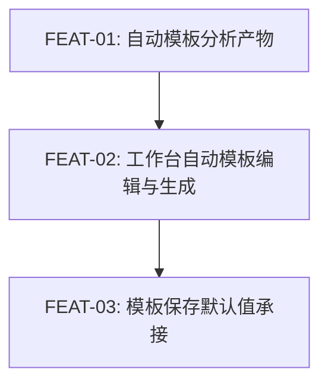

# 实现计划：分析后模板变量自动填充

## 1. 概览

- **项目**: 分析后模板变量自动填充
- **来源架构**: `docs/10-1-架构文档-分析后模板变量自动填充.md`
- **组织方式**: 功能维度（Feature-based）
- **项目类型**: Brownfield（在现有 style-gen / Visoryn 分析、模板和工作台链路上增量扩展）
- **技术栈**: Next.js 15 App Router + React 19 + TypeScript + Tailwind CSS 4 + Drizzle ORM + PostgreSQL + Gemini/Replicate Provider + TanStack React Query + Vitest + Playwright
- **总阶段数**: 3
- **总功能数**: 3
- **最大并行度**: 1
- **关键路径**: FEAT-01 -> FEAT-02 -> FEAT-03

## 2. 输入摘要

### 2.1 核心闭环与目标

核心闭环：**Analyze -> Template -> Generate**。

本期在现有参考图分析链路中新增“自动变量模板”产物：结构化分析完成后，同步得到可编辑模板正文、变量默认值、模板状态和降级原因；工作台右侧首次进入模板模式，用户可以直接生成，也可以修改变量后生成。首版不新增 AI 调用、不新增自动保存模板库行为、不改变生成接口，只让现有结构化阶段一次性产出可复用模板草稿。

### 2.2 关键 ADR 与实施护栏

| ADR | 决策 | 实施约束 |
| --- | --- | --- |
| ADR-1 | 自动模板并入结构化分析同一次调用 | 不新增第二次 AI 调用；结构化失败继续走现有 L3 降级 |
| ADR-2 | 自动模板作为分析任务产物持久化 | 在 `analysis_tasks` 扩展字段，不新增独立自动模板表 |
| ADR-3 | 复用 `{{name}}` 变量语法并补充变量元信息 | 模板正文变量名是 source of truth；变量元信息只补充 label/defaultValue/sourceField |
| ADR-4 | 首态生成提示由模板默认值渲染得到 | ready/partial 状态下的 `promptText` 必须由模板默认值替换后得到，不能残留 `{{...}}` |
| ADR-5 | 保存模板显式接收变量默认值 | 模板 API 接收可选 `variables`，Repository 以后端解析出的正文变量名过滤保存 |
| ADR-6 | 变量不足时降级到文本模式 | 不展示空变量表单；保留完整提示、编辑、保存和生成主链路 |

### 2.3 现有代码快照

| 文件/目录 | 状态 | 说明 |
| --- | --- | --- |
| `src/types/models.ts` | 已有 | 当前 `TemplateVariable` 仅有 `name/defaultValue`；`AnalysisTask` 尚无自动模板字段 |
| `src/lib/db/schema.ts` | 已有 | `analysis_tasks` 尚无 `analysisTemplate*` 字段；`templates.variables` 已是 JSONB |
| `src/lib/ai/prompts.ts` | 已有 | 结构化 prompt 当前只要求输出 recipe/prompt/negativePrompt |
| `src/lib/ai/structurer.ts` | 已有 | 当前只校验 `StructuredResult.recipe/promptText/negativePromptText` |
| `src/lib/repositories/analysis-task-repository.ts` | 已有 | 当前映射和更新字段不包含自动模板产物 |
| `src/app/api/analysis/route.ts` | 已有 | 同步管线保存结构化结果并返回任务，需要透传模板字段和日志 |
| `src/app/api/analysis/[id]/route.ts` | 已有 | 轮询直接返回 repository 对象，随模型扩展自然透传 |
| `src/hooks/use-workspace-state.ts` | 已有 | 当前持久化 prompt/recipe/generation，不保存自动模板状态 |
| `src/app/workspace/page.tsx` | 已有 | 当前已有 stale analysis guard、`EditingPane`、`LightGeneratePanel` 和保存弹窗接线 |
| `src/components/workspace/unified-prompt-editor.tsx` | 已有 | 当前支持模板/文本模式，但未接收变量默认值、label、sourceField 和 fallback 状态 |
| `src/components/workspace/template-variable-panel.tsx` | 已有 | 当前按变量名展示输入框，默认值只来自本地合并结果 |
| `src/components/workspace/template-save-dialog.tsx` | 已有 | 当前保存请求不携带变量默认值 |
| `src/lib/template-parser.ts` | 已有 | 已有变量提取和替换，需要新增变量元信息 merge helper |
| `src/lib/repositories/template-repository.ts` | 已有 | 当前创建/更新模板时重新提取变量，默认值会被置空 |
| `e2e/helpers/mock-api.ts` | 已有 | 可扩展分析/生成/模板 mock 来覆盖自动模板与 fallback |

### 2.4 架构约束

- 不新增 AI 调用、后台任务、队列、实时推送或生成 API。
- 自动模板未保存前只属于分析任务产物；用户主动保存后才进入模板库。
- `analysisTemplateStatus` 仅允许 `ready | partial | fallback`，且只在分析任务 `completed` 后有效。
- 变量名必须来自模板正文中的合法 `{{name}}`；正文中不存在、重复或非法的变量元信息必须丢弃。
- ready/partial 的完整提示不得包含未替换变量；fallback 不阻断分析任务 completed。
- 文本模式被用户触碰后，变量默认值变化不能静默覆盖手动文本。
- 新 analysisTaskId 完成时必须覆盖旧自动模板，避免上一张参考图变量混入当前图。
- 用户可观察功能必须走 E2E-TDD：先 red spec，再实现，再 green 证据。

## 3. 验收标准追踪矩阵

| AC-ID | 需求原文 | 架构承接 | 计划承接 | 验证方式 | 当前状态 |
| --- | --- | --- | --- | --- | --- |
| AC-01 | 分析完成后自动出现变量模板 | Structurer + Analysis API + WorkspacePage + UnifiedPromptEditor；§6.1/§6.2；`analysis_ready/template_ready` | FEAT-01, FEAT-02 | FEAT-01 §5 后端契约验收 + FEAT-02 §5 E2E：`e2e/analysis-template-autofill.spec.ts` | done |
| AC-02 | 变量默认值来自参考图内容 | Structurer prompt + `validateAnalysisTemplate`；变量默认值校验 | FEAT-01, FEAT-02 | FEAT-01 §5 默认值和校验测试 + FEAT-02 §5 变量预填断言 | done |
| AC-03 | 默认值可直接生成 | `replaceVariables`/`renderTemplateWithDefaults` + LightGeneratePanel；§6.4 | FEAT-01, FEAT-02 | FEAT-01 §5 未替换变量校验 + FEAT-02 §5 直接生成请求断言 | done |
| AC-04 | 修改变量会同步生成提示 | UnifiedPromptEditor + TemplateVariablePanel；§6.3 `template_editing` | FEAT-02 | FEAT-02 §5 组件测试 + `e2e/analysis-template-autofill.spec.ts` | done |
| AC-05 | 完整文本编辑不丢失控制权 | UnifiedPromptEditor；§6.3 `text_editing` | FEAT-02 | FEAT-02 §5 文本触碰保护测试 + E2E 模式切换断言 | done |
| AC-06 | 保存模板承接变量与默认值 | TemplateSaveDialog + Template API + Template Repository；§6.5 | FEAT-03 | FEAT-03 §5 API/repository 测试 + `e2e/template-default-values.spec.ts` | done |
| AC-07 | 变量不足时可降级使用 | Analysis API + WorkspacePage + UnifiedPromptEditor；§6.6 `template_fallback` | FEAT-01, FEAT-02 | FEAT-01 §5 fallback 契约测试 + FEAT-02 §5 fallback 文本模式 E2E | done |
| AC-08 | 重新分析不会沿用旧变量 | useWorkspaceState + WorkspacePage；§6.2 新分析接管链路 | FEAT-02 | FEAT-02 §5 新 analysisTaskId 覆盖旧模板的 hook/组件测试 + E2E | done |

## 4. 模块地图

| 模块 | 职责 | 计划承接 |
| --- | --- | --- |
| Structurer Prompt | 要求模型输出视觉配方、自动模板正文、变量默认值和模板状态 | FEAT-01 |
| Structurer Validator | 解析并校验自动模板字段，处理 ready/partial/fallback 和默认值渲染 | FEAT-01 |
| Analysis Repository | 持久化并映射分析任务自动模板字段 | FEAT-01 |
| Analysis API | 创建和轮询分析任务时返回自动模板字段，记录模板状态日志 | FEAT-01 |
| Workspace State | 保存当前分析模板、变量默认值、模板状态和降级原因；新分析接管旧模板 | FEAT-02 |
| UnifiedPromptEditor | 初始模板模式、变量默认值合并、文本模式保护、resolved prompt 输出 | FEAT-02 |
| TemplateVariablePanel | 展示 label/defaultValue/sourceField，空变量时展示 fallback 说明 | FEAT-02 |
| LightGeneratePanel | 使用当前完整提示生成，拦截未替换变量 | FEAT-02 |
| Template API / Repository | 创建/更新模板时接收并保存当前变量默认值 | FEAT-03 |
| TemplateSaveDialog | 提交当前模板正文、变量元信息和来源 analysisTaskId | FEAT-03 |

按功能聚合展示：

| 功能 | 包含模块 | 类型 | 对应文件 |
| --- | --- | --- | --- |
| FEAT-01 | Structurer Prompt, Structurer Validator, Analysis Repository, Analysis API | backend | `FEAT-01-自动模板分析产物.md` |
| FEAT-02 | Workspace State, WorkspacePage, UnifiedPromptEditor, TemplateVariablePanel, LightGeneratePanel | frontend | `FEAT-02-工作台自动模板编辑与生成.md` |
| FEAT-03 | TemplateSaveDialog, Template API, Template Repository, Template Parser | mixed | `FEAT-03-模板保存默认值承接.md` |

## 5. 依赖图



节点使用 FEAT-ID 标识。

## 6. 阶段摘要

| 阶段 | 功能 | 目标 | 可并行度 |
| --- | --- | --- | --- |
| Phase 1 | FEAT-01 | 扩展结构化结果、分析任务字段、Repository/API 响应和后端校验降级 | 1 |
| Phase 2 | FEAT-02 | 工作台消费自动模板产物，默认进入模板模式，支持直接生成、变量编辑、文本保护和 fallback | 1 |
| Phase 3 | FEAT-03 | 保存模板时保留当前变量默认值和元信息，更新 API/Repository/Dialog 与回归测试 | 1 |

## 7. 任务总览

| 功能 | 阶段 | 包含维度 | 依赖 | 独立验收标准 |
| --- | --- | --- | --- | --- |
| FEAT-01: 自动模板分析产物 | Phase 1 | backend | 无 | 分析任务 completed 后稳定返回自动模板字段；ready/partial 可直接渲染完整提示，fallback 不阻断主链路 |
| FEAT-02: 工作台自动模板编辑与生成 | Phase 2 | frontend | FEAT-01 | 分析完成默认展示预填变量模板；改变量、直接生成、文本模式保护、fallback 和重新分析均正确 |
| FEAT-03: 模板保存默认值承接 | Phase 3 | mixed | FEAT-02 | 保存为模板携带并保留当前变量默认值；加载模板时默认值不丢失 |

### 7.2 开发状态机

| FEAT | 当前步骤 | red_e2e | implement | green_e2e | review | 最近证据 | 阻塞原因 | 更新时间 |
| --- | --- | --- | --- | --- | --- | --- | --- | --- |
| FEAT-01 | done | waived | done | waived | done | `docs/10-2-实现计划-分析后模板变量自动填充/reviews/FEAT-01-review-20260515.md`；后端契约测试 green | 无 | 2026-05-15 |
| FEAT-02 | done | done | done | done | done | `docs/10-2-实现计划-分析后模板变量自动填充/reviews/FEAT-02-fix-20260516.md`；全量验证 green | 无 | 2026-05-16 |
| FEAT-03 | done | done | done | done | done | `docs/10-2-实现计划-分析后模板变量自动填充/reviews/FEAT-03-review-20260515.md`；保存默认值 E2E green | 无 | 2026-05-15 |

说明：FEAT-01 是后端分析契约扩展，E2E-TDD 对它标记为 `waived`；该功能的 red/green 质量门由 API、Repository 和 Structurer 契约测试承担。FEAT-02 和 FEAT-03 仍必须保留 red/green E2E 证据。

## 8. 未决策项

| 编号 | 问题 | 影响功能 | 需要谁决策 | 阻塞等级 |
| --- | --- | --- | --- | --- |
| 无 | 架构文档 `open_questions: []`，实现计划无未决策项 | 无 | 无 | 无 |

## 9. 执行前置

### 9.1 环境准备

- 安装依赖：`pnpm install`
- 数据库开发环境：`pnpm db:up`
- 需要本地数据库 schema 变更时：先改 `src/lib/db/schema.ts`，再运行 `pnpm db:generate` 或 `pnpm db:push`。
- 工作台真实链路需要 `.env.local`、数据库和 AI Provider 配置；E2E 可优先使用 mock helper。
- 涉及 UI 调整时先阅读 `docs/design/DESIGN.md`，保持现有 Precision Frame / Precision Glass 工作台风格。

### 9.2 执行顺序

1. 执行 FEAT-01，先补 API/structurer/repository red 测试，再实现自动模板字段、校验、长度安全边界、降级和日志。
2. FEAT-01 进入 review 后执行 FEAT-02，先写 `e2e/analysis-template-autofill.spec.ts` red 证据，再接入工作台状态和编辑器。
3. FEAT-02 进入 review 后执行 FEAT-03，先写 `e2e/template-default-values.spec.ts` red 证据，再实现保存变量默认值的前后端链路。
4. 每个 FEAT 完成后只能推进到 `review`；`review -> done` 由 `task-review` 执行。

### 9.3 全局验证

所有功能完成后执行：

```bash
pnpm type-check
pnpm lint
pnpm test
pnpm e2e
pnpm build
```

## 10. 变更记录

| 日期 | 变更类型 | 功能 | 说明 |
| --- | --- | --- | --- |
| 2026-05-13 | 新增 | 全部 | 基于 10-1 架构文档创建功能维度实现计划，拆分为分析产物、工作台编辑生成、模板保存默认值 3 个 FEAT |
| 2026-05-16 | 修复 | FEAT-02 / 全局 E2E | 修复 ready/partial 空变量 fallback、L3 降级显示、模板库刷新和旧 E2E 断言，`pnpm e2e` 全量 90 passed |

<!-- 保留目录：reviews/。当 task-review、dev-plan-check 等开始运行时创建。 -->
