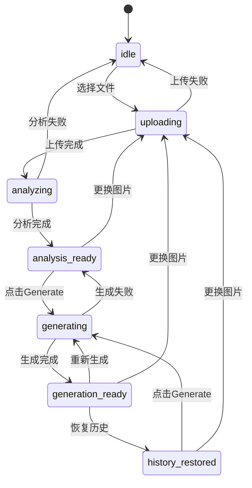

# 架构设计文档：Workspace 三栏工作台重构

_本文件只保留当前版本真正影响实现的架构决策、边界和契约；DDL、目录树、环境变量、实施故事等内容默认不放入正文。_

## 1. 系统摘要

11 期将 Workspace 从当前双栏布局（左分析区 + 右编辑区）重构为专业三栏工作台：顶部模式切换栏 + 中央三列卡片（Reference / Visual Recipe / Prompt）+ 底部历史条 + 右侧浮动生成按钮。核心闭环锚点：**Upload → Analyze → Edit → Generate**。本期验证目标：所有工作台状态（空态 / 上传中 / 分析中 / 分析完成 / 生成中 / 生成完成）保持同一三列骨架，且现有上传、分析、生成 API 完全不变。左侧导航栏保持现有结构不变，不新增菜单项。

## 2. 范围、非目标与成功标准

### 2.1 范围

1. 工作台主区域从双栏重构为三列卡片：Reference（上传+图片+分析摘要）、Visual Recipe（5 分类模块）、Prompt（正向/负向文本框+参数设置）
2. 顶部模式切换栏：Analyze / Editing / Generate / Result 四阶段标签，高亮当前阶段
3. 底部历史条重构为横向缩略图条（48×48 圆角正方形），支持点击预览和"恢复到工作台"
4. 右侧浮动生成按钮（固定定位，点击/Enter 触发），替换当前底部 GenerateHistoryBar 中的生成区
5. 状态联动：分析完成后自动填充 Recipe 和 Prompt，更换参考图重新分析
6. 各状态下的正确 UI 表现

### 2.2 P1 预留

以下功能本期不做，但架构已预留接口或占位，后续按优先级逐个实现：

| 功能 | 对应用户故事 | 预留方式 |
|------|------------|---------|
| 配方内容一键复制到提示词 | US-06（延伸） | RecipeCard 底部按钮显示但功能预留，PromptCard 预留 paste 接口 |
| 配方卡片内编辑风格描述 | US-05（延伸） | RecipeCard 编辑按钮显示但回调为空，recipe 数据流支持双向写入预留 |
| 风格下拉选择器 | — | 顶部导航栏左区域保留插槽位置，数据源待后续风格保存能力就绪 |

### 2.3 明确不做

- 不改变参考图上传、风格分析、图片生成、模板读取和历史恢复的核心 API
- 不新增后端数据表或 API 端点
- 不实现风格下拉选择器
- 不实现分析摘要 5 维度评分的自动化计算（前端从配方字段提取）
- 不实现配方内容一键复制到提示词
- 不实现组件库、素材库、设置页面的实际开发
- 不引入全局状态管理库
- 不做响应式断点适配（聚焦桌面端 ≥1024px）
- 不扩展左侧导航栏，保持现有菜单结构

### 2.4 成功标准

| 指标 | 首版目标 |
|------|---------|
| 三列骨架稳定性 | 工作台所有核心状态保持 Reference/Recipe/Prompt 三列位置，不再按状态切换列数 |
| 模式切换清晰度 | 顶部 4 标签正确高亮当前阶段，用户可手动切换查看 |
| Recipe 独立展示 | Visual Recipe 从分析区内拆出为独立卡片，5 分类按维度分组 |
| 生成按钮可达性 | 右侧浮动按钮始终可见，Enter 快捷键等效点击 |
| 历史条可回溯 | 底部缩略图点击可预览详情，可恢复到工作台 |
| 空态一致性 | 未上传、分析中和分析完成的三列骨架位置一致 |

### 2.5 验收标准承接矩阵

| AC-ID | PRD 原文摘要 | 承接模块 | 关键链路 / 状态 | 风险 / 降级说明 |
|-------|-------------|---------|----------------|----------------|
| AC-01 | 三栏布局正确渲染 | WorkspaceThreeColumnLayout + TopModeSwitcher + LeftSidebar + HistoryStrip + FloatingGenerateButton | §6.1 工作台进入链路 | 若视口 <1024px，保持三列但允许横向滚动，不回退双栏 |
| AC-02 | 参考图上传与分析联动 | ReferenceCard + useWorkspaceState + useAnalysis | §6.2 上传与分析链路 | 上传/分析失败降级同现有逻辑 |
| AC-03 | Visual Recipe 展示与分类浏览 | RecipeCard（独立三列卡片） | §6.3 分析完成链路 | Recipe 数据为空时显示引导文案 |
| AC-04 | Prompt 编辑与参数设置 | PromptCard + UnifiedPromptEditor + OutputSettings | §6.4 编辑链路 | 参数选择器移入 Prompt 卡片底部 |
| AC-05 | 生成与结果查看 | FloatingGenerateButton + GenerationDialog | §6.5 生成链路 | 生成结果仍由 GenerationDialog 承载 |
| AC-06 | 历史回溯 | HistoryStrip + HistoryDetailDialog | §6.6 历史回溯链路 | 历史数据复用现有 generation-history 查询 |
| AC-07 | 模式切换 | TopModeSwitcher | §6.1 | 顶部模式标签正确高亮和手动切换 |
| AC-08 | 异常处理与恢复 | ReferenceCard + RecipeCard + PromptCard + ErrorDisplay | §6.7 失败恢复链路 | 各卡片独立处理错误态，不互相干扰 |

## 3. 用户流程与状态

### 3.1 主流程

```text
进入工作台
  -> 渲染三列布局：Reference / Visual Recipe / Prompt
  -> 顶部无选中模式（或 Analyze 默认高亮）
  -> Reference 卡片上传区域点击/拖拽上传参考图
  -> 上传中：Reference 卡片显示进度，顶部 Analyze 高亮
  -> 上传完成 -> 自动触发分析
  -> 分析中：Reference 显示分析进度，Recipe/Prompt 卡片显示加载态
  -> 分析完成：
     - Reference 卡片底部展示 5 维度分析摘要
     - Recipe 卡片填充 5 分类模块（Structure / Materials / Lighting / Color Palette / Mood & Atmosphere）
     - Prompt 卡片填充生成的提示词
     - 顶部自动切换到 Editing 高亮
  -> 用户编辑 Prompt，调整参数
  -> 点击右侧浮动 Generate 按钮（或按 Enter）
  -> 顶部切换到 Generate 高亮，按钮 loading
  -> 生成完成：顶部切换到 Result 高亮，GenerationDialog 弹出结果
  -> 底部历史条新增缩略图
  -> 用户可继续编辑重新生成，或点击历史缩略图回溯
```

### 3.2 关键分支

| 分支 | 入口 / 触发条件 | 架构处理方式 |
|------|---------------|-------------|
| 初始空态 | 进入工作台且无参考图 | 三列卡片均渲染，各自显示空态引导文案 |
| 更换参考图 | 点击 Reference 卡片"更换图片" | 触发 `ws.reset()` → 重新上传/分析，三列内容全部更新 |
| 手动切换模式 | 点击顶部模式标签 | 仅改变高亮和卡片聚焦，不改变工作台数据状态 |
| 历史恢复 | 点击底部历史条缩略图 | 弹出 HistoryDetailDialog，"恢复到工作台"调用 `enterHistoryRestored` |
| 上传失败 | 网络中断/格式不支持 | Reference 卡片显示错误提示+"重新上传"，其他卡片保持空态 |
| 分析失败 | 超时/模型错误 | Reference 保持图片+失败态，Recipe/Prompt 显示"分析失败"+ 重试按钮 |
| 生成失败 | 超时/服务错误 | 顶部切回 Editing，GenerationDialog 显示错误，Prompt 内容不丢失 |

### 3.3 状态机



**关键规则**：
- `WorkspaceState` 枚举不变（idle/uploading/analyzing/analysis_ready/generating/generation_ready/history_restored）
- 顶部模式高亮是 `WorkspaceState` 的视图映射，不引入新的状态维度
- 模式高亮映射规则：`idle|uploading|analyzing` → Analyze，`analysis_ready` → Editing，`generating` → Generate，`generation_ready` → Result，`history_restored` → Editing
- 用户手动点击模式标签时，覆盖自动映射，但不改变 `WorkspaceState`
- 左侧导航栏保持现有结构不变

## 4. 系统上下文与模块职责

### 4.1 系统上下文

本次重构是纯前端布局变更，后端 API（上传/分析/生成/模板/历史）完全不变。

```
┌─────────────────────────────────────────────────────────────┐
│                    workspace/layout.tsx                       │
│ ┌──────────┐ ┌────────────────────────────────────────────┐ │
│ │          │ │  workspace/page.tsx                         │ │
│ │          │ │ ┌────────────────────────────────────────┐  │ │
│ │  Left    │ │ │ StatusBar (工作区名称 + TopModeSwitcher)│  │ │
│ │ Sidebar  │ │ ├────────────────────────────────────────┤  │ │
│ │ (不变)   │ │ │ WorkspaceThreeColumnLayout             │  │ │
│ │          │ │ │ ┌──────────┬──────────┬──────────┐     │  │ │
│ │          │ │ │ │Reference │  Recipe  │  Prompt  │ ⚡FGB│  │ │
│ │          │ │ │ │  Card    │  Card    │  Card    │     │  │ │
│ │          │ │ │ └──────────┴──────────┴──────────┘     │  │ │
│ │          │ │ ├────────────────────────────────────────┤  │ │
│ │          │ │ │ HistoryStrip                           │  │ │
│ └──────────┘ │ └────────────────────────────────────────┘  │ │
│              └────────────────────────────────────────────┘ │
└─────────────────────────────────────────────────────────────┘
         │              │              │              │
    ┌────▼────┐   ┌─────▼─────┐  ┌───▼───┐   ┌─────▼─────┐
    │  R2     │   │ Analysis  │  │Generation│ │ Templates │
    │ Upload  │   │   API     │  │   API   │  │   API     │
    └─────────┘   └───────────┘  └────────┘   └───────────┘
    (不变)         (不变)         (不变)        (不变)
```

变更集中在：
- `workspace/page.tsx`：页面组件编排从双栏改为三列 + 顶栏 + 历史条
- 新增组件：TopModeSwitcher、ReferenceCard、RecipeCard（独立）、PromptCard、HistoryStrip、FloatingGenerateButton、HistoryDetailDialog
- 重构/删除组件：WorkspaceTwoPaneLayout → WorkspaceThreeColumnLayout，AnalysisPane 拆分为 ReferenceCard + RecipeCard，GenerateHistoryBar 拆分为 HistoryStrip + FloatingGenerateButton

### 4.2 模块职责

| 模块 | 职责 | 上游输入 | 下游输出 |
|------|------|---------|---------|
| **LeftSidebar** | 全局导航（保持现有结构不变） | pathname, session | router.push 路由跳转 |
| **StatusBar** | 顶部栏容器：工作区名称 + TopModeSwitcher 嵌入 + 右侧图标区 | WorkspaceState, manualModeOverride, session | 布局容器（不改变状态） |
| **TopModeSwitcher** | 顶部四阶段标签，高亮当前模式 | WorkspaceState, manualModeOverride | visual highlighting only（不改变状态） |
| **WorkspaceThreeColumnLayout** | 三列等宽/1:1:1.2 比例网格容器 | ReferenceCard, RecipeCard, PromptCard | DOM 布局 |
| **ReferenceCard** | 参考图上传/展示 + 分析摘要（5 维度评分） | referenceImageUrl, recipe, state, error | onFileSelected, onReplace, onRetry |
| **RecipeCard** | 独立 Visual Recipe 卡片，5 分类模块 + "复制到提示词" | recipe, state | 编辑配方回调（P2 阶段暂为只读） |
| **PromptCard** | 提示词编辑 + 参数设置 + 模型选择 + 模板库按钮 | promptText, templateContent, templateVariables, params | onResolvedPromptChange, onParamsChange |
| **FloatingGenerateButton** | 右侧固定浮动按钮，点击/Enter 触发生成 | state, promptText, canGenerate | onGenerate |
| **HistoryStrip** | 底部横向缩略图条，点击预览 | generation-history query | onRestore, onViewAll |
| **HistoryDetailDialog** | 历史详情弹窗（结果图 + Prompt 快照 + 参数） | restoredData | onRestore, onClose |
| **GenerationDialog** | 生成进度/结果/失败弹窗（复用现有） | state, resultImageUrl, error | onClose, onRetry |

**交互细节补充**：

**ReferenceCard**：
- 空态：拖拽/点击上传区，虚线边框 + 引导文案
- 有图态：卡片头部（标题"Reference"+ 帮助图标 + "更换图片"按钮 + 更多选项三态点）→ 参考图全宽展示 → 分析摘要区（5 维度评分行：图标 + 维度名 + 匹配值 + 百分比条）→ "查看完整分析"链接
- 上传中：图片位置显示上传进度条
- 分析中：图片下方显示分析加载态（pulse 动画）
- 分析失败：图片下方显示错误信息 + "重新分析"按钮

**RecipeCard**：
- 空态："上传参考图以生成视觉配方"引导文案
- 有数据态：卡片头部（标题"Visual Recipe"+ 帮助图标 + 编辑按钮）→ 5 个分类折叠模块（图标 + 分类名 + 描述）→ 底部"复制配方到提示词"按钮
- 分析中：整卡片骨架屏加载态

**PromptCard**：
- 空态："分析完成后将自动生成提示词"引导文案
- 有数据态：卡片头部（标题"Prompt"+ 帮助图标 + 模型选择器 + 模板库按钮）→ 正向提示词 textarea → 负向提示词 textarea（折叠，带字符计数）→ 参数设置行（宽高比 / 分辨率 / 引导强度）→ 辅助选项开关（使用配方引导 / 增强细节）
- 复用现有 UnifiedPromptEditor 组件，外层包装卡片壳

**FloatingGenerateButton**：
- 位置：固定定位在三列卡片区域右侧，垂直居中
- 形态：蓝色圆形/胶囊，闪电图标 + "Generate" 文字，下方小字"Enter 生成"
- 禁用态：置灰，提示不可用原因（tooltip）
- Loading 态：旋转动画
- 悬停：发光效果（glow）

**TopModeSwitcher**：
- 4 个胶囊形按钮：Analyze（绿色）/ Editing（紫色）/ Generate（橙色）/ Result（绿色）
- 选中态使用对应颜色填充，非选中态浅色背景
- Analyze 始终可点击；Editing 在分析完成后可点击；Generate 在提示词非空时可点击；Result 在生成完成后可点击
- 不可点击模式标签显示为浅灰且无 hover 效果

**HistoryStrip**：
- 左侧"History"标题 + 图标
- 中间横向排列 48×48 圆角缩略图（支持横向滚动）
- 选中项带蓝色边框和对勾
- 右侧"查看全部"按钮
- 空态：仅显示"History"标题，无缩略图

### 4.3 需要刻意避免的过度设计

- **不引入全局状态管理库**（Zustand/Jotai/Redux）：当前 `useWorkspaceState` hook + sessionStorage 足够管理三列工作台状态
- **不引入可拖拽面板宽度**：首版固定三列比例，避免拖拽交互增加复杂度
- **不引入响应式断点系统**：首版聚焦桌面端 ≥1024px，不做 tablet/mobile 适配
- **不拆分 Recipe 子分类为独立组件文件**：5 个分类模板相同，用 map 渲染即可
- **不新增后端 API**：分析摘要评分从前端已有 recipe 字段提取，不需要新端点

## 5. 关键架构决策（ADR）

### ADR-1：三列布局采用 CSS Grid 固定比例而非 Flex 弹性分配
- **选择**：`grid-cols-[minmax(280px,1fr)_minmax(280px,1fr)_minmax(320px,1.2fr)]` 固定比例，Prompt 卡片略宽
- **理由**：三列卡片内容密度不同（Prompt 需要更多编辑空间），固定比例可预测布局行为。不使用 Flex auto 是因为三列等高约束在 Flex 中需额外处理。不使用可拖拽分隔条因为首版不需要用户自定义面板宽度
- **风险**：窄屏下可能挤压卡片内容。对策：设置 minmax 下限 280px，过窄时允许横向滚动

### ADR-2：顶部模式标签为纯视图映射，不引入独立 mode 状态
- **选择**：TopModeSwitcher 接收 `WorkspaceState` + 可选 `manualModeOverride`，内部计算高亮标签，不新增独立 mode state
- **理由**：避免双状态源（WorkspaceState vs mode）导致同步问题。模式高亮是状态的视图投影，不是独立状态维度
- **演进余地**：若后续需要模式切换触发内容过滤，可升级 manualModeOverride 为 zustand slice

### ADR-3：ReferenceCard 的分析摘要从 recipe 字段前端提取，不扩展 API
- **选择**：新增 `extractAnalysisSummary(recipe: VisualRecipe): DimensionScore[]` 工具函数，从 recipe 的 styleTags/subject/scene/lighting/color/mood 等字段提取 5 维度评分
- **理由**：避免为纯展示数据新增后端端点。recipe 已包含足够信息（styleTags、各维度描述文本），前端可通过字符串匹配 + 权重计算生成百分比
- **风险**：初期评分算法精度有限。对策：先使用确定性启发式规则（字段长度比 + 关键词计数），后续可替换为 API 返回值

### ADR-4：HistoryStrip 从 GenerateHistoryBar 中剥离生成区，仅保留缩略图浏览
- **选择**：拆分 GenerateHistoryBar 为 HistoryStrip（纯缩略图条）+ FloatingGenerateButton（独立浮动按钮）。HistoryStrip 不再包含生成参数和生成按钮
- **理由**：PRD 要求生成按钮浮动在右侧始终可见，且底部历史条应聚焦于历史浏览。原有 bar 中混合了生成参数、生成按钮和历史缩略图，职责不清
- **风险**：生成参数（宽高比/分辨率）移入 PromptCard 底部后，PromptCard 内容密度增加。对策：参数行使用紧凑布局（icon + 下拉）

### ADR-5：复用 GenerationDialog 承载生成结果，不做内联结果展示
- **选择**：生成完成仍由 GenerationDialog 弹窗展示结果图，不在三列卡片中内联展示
- **理由**：PRD 的 Result 模式要求"显示生成结果图"，但三列卡片区域已被 Reference/Recipe/Prompt 占据。弹窗方式不破坏三列骨架稳定性，且现有 GenerationDialog 已完善
- **演进余地**：后续可将 Result 作为第四列或替换 Reference 卡片内容

### 5.x 待确认问题

无。

## 6. 运行链路

### 6.1 工作台进入链路

1. 用户导航到 `/workspace`
2. `workspace/layout.tsx` 渲染 LeftSidebar + 主内容区
3. `workspace/page.tsx` 渲染 StatusBar → WorkspaceThreeColumnLayout → HistoryStrip → FloatingGenerateButton
4. `useWorkspaceState` 初始化：优先从 sessionStorage 恢复，否则进入 `idle` 状态
5. 三列卡片各自根据 `state` 渲染对应状态（idle → 三列空态引导）
6. TopModeSwitcher 根据 state 高亮 Analyze 标签
7. HistoryStrip 查询 generation-history 渲染已有缩略图

**实现原则**：
- 进入时三列骨架必须完整渲染，空态使用同位置占位组件
- sessionStorage 恢复逻辑不变，直接跳转到 `analysis_ready`

### 6.2 上传与分析链路

1. 用户在 ReferenceCard 点击/拖拽上传文件
2. `handleFileSelected` 调用 `ws.startUpload()` → 上传到 R2 → `ws.completeUpload()` → POST `/api/analysis`
3. TopModeSwitcher 高亮 Analyze
4. ReferenceCard 显示上传进度 → 分析进度
5. RecipeCard 显示骨架屏加载态
6. PromptCard 显示加载态
7. 分析完成：`ws.completeAnalysis()` 更新 recipe/promptText
8. TopModeSwitcher 自动高亮切换到 Editing
9. ReferenceCard 渲染 5 维度摘要，RecipeCard 渲染 5 分类，PromptCard 填充提示词

**实现原则**：
- 上传和分析 API 不变，复用现有 useUpload / useAnalysis hooks
- 分析摘要提取使用 `extractAnalysisSummary(recipe)` 工具函数

### 6.3 分析完成后的浏览链路

1. ReferenceCard 底部展示 5 维度分析摘要（Style/Material/Lighting/Composition/Mood）
2. RecipeCard 展示 5 个分类模块，每个包含图标+描述
3. 用户点击分类模块展开查看更多子项
4. 用户点击"复制配方到提示词"（P2 阶段，首期按钮显示但功能预留）

**实现原则**：
- 5 维度评分算法：对 recipe 各字段文本长度归一化为百分比，不做 AI 二次调用

### 6.4 编辑链路

1. PromptCard 中 UnifiedPromptEditor 可编辑提示词
2. 参数设置行（宽高比/分辨率/引导强度）嵌入 PromptCard 底部
3. 编辑内容实时更新 `resolvedPromptText` 和 `ws.promptText`
4. FloatingGenerateButton 检测 promptText 非空 → 切换为可用态

**实现原则**：
- UnifiedPromptEditor 组件完全复用，外层包装 PromptCard 卡片壳
- 输出参数（aspectRatio/quality）从 FloatingGenerateWindow 移入 PromptCard

### 6.5 生成链路

1. 用户点击 FloatingGenerateButton 或按 Enter
2. `handleGenerate` POST `/api/generation`，参数从 generationParams state 获取
3. TopModeSwitcher 高亮 Generate，按钮显示 loading
4. GenerationDialog 弹出显示生成进度
5. 生成完成：`ws.completeGeneration()`，TopModeSwitcher 切换到 Result
6. GenerationDialog 显示结果图
7. HistoryStrip 左侧新增缩略图，invalidate generation-history query

**实现原则**：
- 生成 API 不变，复用现有 useGeneration hook
- Enter 快捷键通过全局 `useEffect` 监听 `keydown`，检查 canGenerate 条件后调用 handleGenerate
- FloatingGenerateButton 和 GenerationDialog 共享同一 generationParams state

### 6.6 历史回溯链路

1. 用户点击 HistoryStrip 中某张缩略图
2. HistoryDetailDialog 弹出，展示该次生成的结果图 + prompt 快照 + 参数
3. 用户点击"恢复到工作台"
4. 调用 `handleHistoryRestore(id)`，通过 useHistoryRestore 获取数据
5. `ws.enterHistoryRestored()` 更新三列卡片内容
6. TopModeSwitcher 高亮 Editing

**实现原则**：
- 复用现有 useHistoryRestore hook
- HistoryDetailDialog 是新组件，参考现有 GenerationDialog 结构

### 6.7 失败恢复链路

1. 上传失败：ReferenceCard 显示错误 + "重新上传"按钮，RecipeCard/PromptCard 保持空态
2. 分析失败：ReferenceCard 保持图片 + 失败态，RecipeCard/PromptCard 显示"分析失败" + 重试按钮
3. 生成失败：TopModeSwitcher 切回 Editing，GenerationDialog 显示错误，Prompt 内容不丢失，FloatingGenerateButton 恢复可用

**实现原则**：
- 各卡片独立处理自身错误态，互不干扰
- 错误处理复用现有 WorkspaceError 机制

## 7. 领域对象与关键契约

### 7.1 核心对象

| 对象 | Source of Truth | Owner | 用途 |
|------|----------------|-------|------|
| WorkspaceState | useWorkspaceState hook (sessionStorage) | workspace/page.tsx | 工作台整体状态 |
| VisualRecipe | analysis API 返回 → ws.recipe | AnalysisTask | 结构化风格配方 |
| promptText | useWorkspaceState (用户编辑) | workspace/page.tsx | 当前提示词 |
| GenerationParams | workspace/page.tsx state | FloatingGenerateButton / PromptCard | 生成参数 |
| manualModeOverride | workspace/page.tsx state | TopModeSwitcher | 手动模式覆盖 |
| DimensionScore | 前端从 VisualRecipe 派生 | ReferenceCard | 5 维度分析摘要 |

### 7.2 推荐最小 Schema

```typescript
/** 分析摘要维度评分 — 前端从 VisualRecipe 派生 */
interface DimensionScore {
  dimension: "style" | "material" | "lighting" | "composition" | "mood";
  label: string;           // "Style" / "Material" / ...
  value: string;           // "Modern Rustic" / "Weathered Wood, Stone, Metal"
  percentage: number;      // 0-100
  iconColor: string;       // CSS color token
}

/** Recipe 分类模块 — 前端从 VisualRecipe 分组 */
interface RecipeCategory {
  category: "structure" | "materials" | "lighting" | "color_palette" | "mood_atmosphere";
  label: string;           // "Structure" / "Materials" / ...
  description: string;     // 从 recipe 对应字段提取
  iconColor: string;
}

/** TopModeSwitcher 模式类型 */
type TopMode = "analyze" | "editing" | "generate" | "result";

/** 手动模式覆盖状态 */
type ManualModeOverride = TopMode | null;

/** HistoryStrip 缩略图条目 — 复用现有 generation-history 数据 */
interface HistoryStripItem {
  id: string;              // generation task id
  thumbnailUrl: string;    // 缩略图 URL
  createdAt: string;       // ISO timestamp
}

/** HistoryDetailDialog 数据 — 复用 useHistoryRestore 返回值 */
interface HistoryDetail {
  resultFileUrl: string;
  promptSnapshot: string;
  negativePromptSnapshot: string;
  recipe: VisualRecipe | null;
  params: { aspectRatio: string; quality: string };
}

/** LeftSidebar 导航项 — 扩展 */
interface NavItem {
  label: string;
  href: string;
  icon: string;            // Material Symbols icon name
  match: (pathname: string) => boolean;
  disabled?: boolean;      // 未实现页面标记
}
```

### 7.3 API 边界

本次不新增 API 端点。现有使用的端点：

| 接口路径 | 用途 | 说明 |
|---------|------|------|
| POST `/api/upload/presign` | 获取预签名 URL | 不变 |
| POST `/api/analysis` | 创建分析任务 | 不变 |
| GET `/api/analysis/[id]` | 轮询分析状态 | 不变 |
| POST `/api/generation` | 创建生成任务 | 不变 |
| GET `/api/generation/[id]` | 轮询生成状态 | 不变 |
| GET `/api/generation/history` | 获取生成历史 | 不变，HistoryStrip 复用 |
| GET `/api/templates/[id]` | 获取模板详情 | 不变 |
| GET `/api/generation/[id]/restore` | 恢复历史记录 | 不变 |

### 7.4 状态流转

WorkspaceState 不变，复用现有状态机。映射关系：

| WorkspaceState | TopMode 高亮 | ReferenceCard | RecipeCard | PromptCard | GenerateButton |
|---------------|-------------|---------------|------------|------------|----------------|
| idle | analyze | 空态上传区 | 空态引导 | 空态引导 | 禁用 |
| uploading | analyze | 上传进度 | 空态引导 | 空态引导 | 禁用 |
| analyzing | analyze | 图片+分析进度 | 骨架屏 | 加载态 | 禁用 |
| analysis_ready | editing | 图片+分析摘要 | 5 分类 | 提示词文本 | 可用 |
| generating | generate | 图片+分析摘要 | 5 分类 | 提示词文本 | 加载中 |
| generation_ready | result | 图片+分析摘要 | 5 分类 | 提示词文本 | 可用 |
| history_restored | editing | 图片+分析摘要 | 5 分类 | 提示词文本 | 可用 |

### 7.5 数据边界

| 存储层 | 职责 | 变更说明 |
|-------|------|---------|
| Cloudflare R2 | 参考图和生成结果图片存储 | 不变 |
| PostgreSQL | 分析任务、生成任务、模板数据 | 不变 |
| sessionStorage | WorkspaceState 跨页面恢复 | 新增 manualModeOverride 字段（可选） |
| React state | 临时 UI 状态（generationParams、dialogOpen 等） | 不变 |

### 7.6 命名与标识规则

- **ID 策略**：沿用现有 ULID，不变
- **JSON 命名**：camelCase，与现有 API 保持一致
- **CSS 类名**：沿用 `workspace-` 前缀 + BEM 风格
- **组件命名**：PascalCase，与现有组件保持一致
- **术语映射**：
  - "三列卡片区域" → `WorkspaceThreeColumnLayout`
  - "分析摘要" → `DimensionScore[]`（前端派生）
  - "分类模块" → `RecipeCategory`（前端派生）
  - "历史条" → `HistoryStrip`
  - "生成按钮" → `FloatingGenerateButton`
  - "模式切换" → `TopModeSwitcher`
  - "左侧导航栏" → `LeftSidebar`（保持现有结构不变）

## 8. 非功能需求、风险与运行策略

### 8.1 性能与吞吐量目标

| 指标 | 目标 |
|------|------|
| 工作台首屏渲染 | <1s（三列骨架 + 空态引导） |
| 三列布局稳定性 | 状态切换无布局抖动（CLS < 0.05） |
| 历史 Query 缓存命中 | 返回工作台时历史数据可用（TanStack Query staleTime 5min） |

### 8.2 可靠性、错误处理与降级策略

降级级别从低到高：

| 级别 | 触发条件 | 系统行为 |
|------|---------|---------|
| L0 正常 | 所有服务正常 | 完整三列交互 |
| L1 排队提示 | 分析/生成轮询 >60s | 显示排队提示（复用现有 degradation 机制） |
| L2 服务不可用 | 生成服务 SERVICE_UNAVAILABLE | FloatingGenerateButton 禁用 + 提示，编辑仍可用 |
| L3 分析失败 | 分析超时/模型错误 | ReferenceCard 显示失败态，Recipe/Prompt 显示重试 |
| L4 全局降级 | sessionStorage 损坏 | 静默清理，回到 idle 状态 |

### 8.3 安全与反滥用策略

| 项目 | 首版策略 |
|------|---------|
| API 路由保护 | 现有 auth 中间件不变 |
| 文件上传安全 | R2 直传 + MIME 校验，不变 |
| XSS 防护 | React 默认转义 + 不使用 dangerouslySetInnerHTML |

### 8.4 成本控制预期

本次为纯前端重构，不新增后端 API 调用和 AI 推理成本。

| 模块 | 变更 | 成本影响 |
|------|------|---------|
| 前端渲染 | 新增 6 个组件 | 0（客户端渲染） |
| API 调用 | 不变 | 0 |

### 8.5 可观测性

沿用现有 console.warn/error 日志，不新增埋点。

### 8.6 主要风险

| 风险 | 影响 | 缓解方式 |
|------|------|---------|
| 三列布局在 1024-1280px 窗口下拥挤 | 卡片内容被截断 | minmax 下限 280px + 允许横向滚动 |
| 分析摘要评分算法精度不足 | 5 维度百分比显示不合理 | 初期使用启发式规则，标注为可替换 |
| 历史条数据量增长后横向滚动性能 | 大量 DOM 节点 | 限制渲染数量（最近 20 条） + 虚拟滚动（后续） |

## 9. 实施方案

### Phase A：骨架布局与组件拆分

**前端**

1. `src/components/workspace/workspace-three-column-layout.tsx` — 新建，替代 WorkspaceTwoPaneLayout，CSS Grid 三列布局 `grid-cols-[minmax(280px,1fr)_minmax(280px,1fr)_minmax(320px,1.2fr)]`
2. `src/components/workspace/top-mode-switcher.tsx` — 新建，4 阶段标签组件，接收 WorkspaceState + manualModeOverride
3. `src/components/workspace/reference-card.tsx` — 新建，整合 ReferencePreview + 分析摘要（5 维度评分）
4. `src/components/workspace/recipe-card.tsx` — 新建，从 StyleBreakdownPanel 重构为独立卡片，5 分类分组展示
5. `src/components/workspace/prompt-card.tsx` — 新建，包装 UnifiedPromptEditor + 输出参数行
6. `src/components/workspace/history-strip.tsx` — 新建，纯缩略图条（从 HistoryPanel 重构）
7. `src/components/workspace/floating-generate-button.tsx` — 新建，右侧固定浮动按钮（Enter 快捷键）
8. `src/components/workspace/history-detail-dialog.tsx` — 新建，历史详情弹窗

**改造**

9. `src/app/workspace/page.tsx` — 重构编排：替换 TwoPaneLayout 为 ThreeColumnLayout + TopModeSwitcher + HistoryStrip + FloatingGenerateButton
10. `src/components/workspace/status-bar.tsx` — 保留为独立组件，内部重组布局：左侧保留工作区名称（"Workspace"粗体），中间嵌入 TopModeSwitcher，右侧保留帮助图标/品牌标识/用户头像（不变）。风格下拉选择器预留插槽但不渲染

**工具函数**

11. `src/lib/analysis-summary.ts` — 新建 `extractAnalysisSummary(recipe)` 工具函数
12. `src/lib/recipe-categories.ts` — 新建 `extractRecipeCategories(recipe)` 工具函数

验证目标：三列布局在所有 WorkspaceState 下正确渲染，空态/有数据态骨架一致。

### Phase B：交互逻辑与状态联动

**前端**

13. `src/app/workspace/page.tsx` — 集成 TopModeSwitcher 状态联动（自动映射 + 手动覆盖）
14. `src/app/workspace/page.tsx` — 拆分 GenerateHistoryBar 逻辑为 HistoryStrip + FloatingGenerateButton
15. `src/components/workspace/floating-generate-button.tsx` — 添加 Enter 快捷键全局监听
16. `src/components/workspace/prompt-card.tsx` — 集成输出参数（从 FloatingGenerateWindow 迁移）
17. `src/components/workspace/history-strip.tsx` — 集成 generation-history 查询 + 点击弹出 HistoryDetailDialog
18. `src/components/workspace/history-detail-dialog.tsx` — 实现"恢复到工作台"联动

验证目标：上传 → 分析 → 编辑 → 生成全链路在三列布局下正常工作，模式切换正确联动。

## 10. 架构结论

本次重构的核心判断是：**纯前端布局重构，零后端变更**。三列卡片（Reference / Visual Recipe / Prompt）是对现有双栏（AnalysisPane / EditingPane）的职责重组——AnalysisPane 拆分为 ReferenceCard（上传+展示+摘要）和 RecipeCard（配方独立展示），EditingPane 重组为 PromptCard（编辑+参数合一）。状态管理沿用 `useWorkspaceState`，新增的 TopModeSwitcher 仅做视图映射不引入新状态维度。

设计原则：
1. **骨架不变**：所有 WorkspaceState 下三列位置固定，只替换内容
2. **组件复用优先**：UnifiedPromptEditor、GenerationDialog、useUpload/useAnalysis/useGeneration 等核心组件和 hooks 完全复用
3. **前端派生数据**：分析摘要评分和配方分类均由前端从 VisualRecipe 派生，不新增 API
4. **渐进增强**：配方编辑、风格选择器等 P2 功能预留接口但不实现
