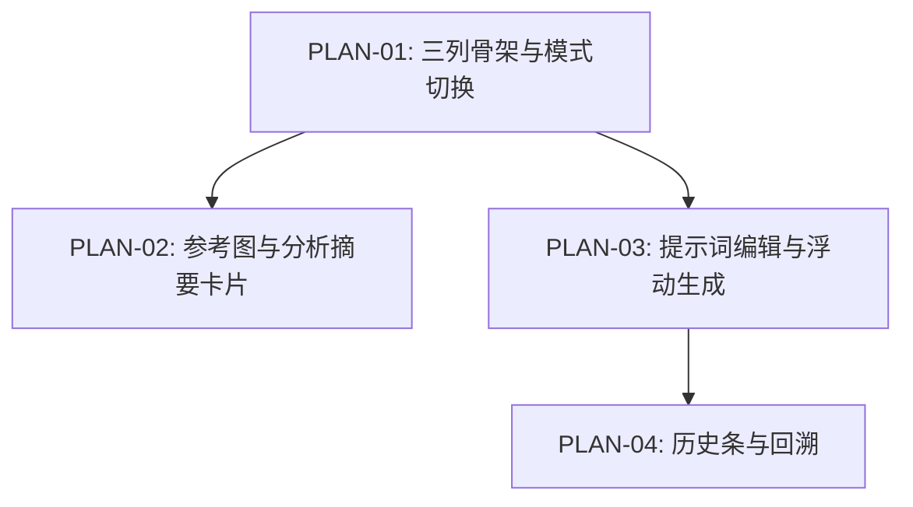

# 实现计划：Workspace 三栏工作台重构

## 1. 计划入口

11 期将 Workspace 从双栏重构为三栏工作台：Reference / Visual Recipe / Prompt，保留现有上传、分析、生成、模板和历史 API。

- 来源架构：`docs/11-Workspace三栏工作台重构/11-1-架构文档-Workspace三栏工作台重构.md`
- 设计系统：`docs/design/DESIGN.md`
- 核心闭环：Upload -> Analyze -> Edit -> Generate
- 计划组织：功能维度，4 个 PLAN 文件
- 权威边界：README 只维护跨 PLAN 索引、验收追踪、执行拓扑和状态机；具体实现以各 `PLAN-*.md` 为准。

## 2. 执行拓扑



| 阶段 | 功能 | 目标 | 并行度 |
| --- | --- | --- | --- |
| Phase 1 | PLAN-01 | 三列骨架、TopModeSwitcher、StatusBar、卡片基础壳 | 1 |
| Phase 2 | PLAN-02, PLAN-03 | 分析/Recipe 卡片完整实现；Prompt/生成按钮完整实现 | 2 |
| Phase 3 | PLAN-04 | 历史条、历史详情弹窗、替换 GenerateHistoryBar | 1 |

执行顺序：先 PLAN-01；随后 PLAN-02 和 PLAN-03 可并行；最后 PLAN-04。

## 3. 验收标准追踪矩阵

| AC-ID | 需求原文 | 架构承接 | 计划承接 | 验证方式 | 当前状态 |
| --- | --- | --- | --- | --- | --- |
| AC-01 | 三栏布局正确渲染 | WorkspaceThreeColumnLayout + TopModeSwitcher + StatusBar | PLAN-01 | PLAN-01 E2E + 组件测试 | done |
| AC-02 | 参考图上传与分析联动 | ReferenceCard + useWorkspaceState + useAnalysis | PLAN-01, PLAN-02 | PLAN-02 E2E | done |
| AC-03 | Visual Recipe 展示与分类浏览 | RecipeCard | PLAN-02 | PLAN-02 E2E | done |
| AC-04 | Prompt 编辑与参数设置 | PromptCard + UnifiedPromptEditor + OutputSettings | PLAN-03 | PLAN-03 E2E | done |
| AC-05 | 生成与结果查看 | FloatingGenerateButton + GenerationDialog | PLAN-03 | PLAN-03 E2E | done |
| AC-06 | 历史回溯 | HistoryStrip + HistoryDetailDialog | PLAN-04 | PLAN-04 E2E | done |
| AC-07 | 模式切换 | TopModeSwitcher | PLAN-01 | PLAN-01 E2E | done |
| AC-08 | 异常处理与恢复 | ReferenceCard / RecipeCard / PromptCard / ErrorDisplay | PLAN-01~04 | 各 PLAN 边界场景 + E2E | done |

## 4. 功能索引

| 功能 | 文件 | 依赖 | 交付边界 |
| --- | --- | --- | --- |
| PLAN-01 | `PLAN-01-三列骨架与模式切换.md` | 无 | 三列骨架、模式切换、卡片基础壳 |
| PLAN-02 | `PLAN-02-参考图与分析摘要卡片.md` | PLAN-01 | ReferenceCard、RecipeCard、分析摘要工具 |
| PLAN-03 | `PLAN-03-提示词编辑与浮动生成.md` | PLAN-01 | PromptCard、FloatingGenerateButton、Enter 生成 |
| PLAN-04 | `PLAN-04-历史条与回溯.md` | PLAN-01, PLAN-03 | HistoryStrip、HistoryDetailDialog、历史恢复 |

## 5. 开发状态机

| FEAT | 当前步骤 | red_e2e | implement | green_e2e | review | 最近证据 | 阻塞原因 | 更新时间 |
| --- | --- | --- | --- | --- | --- | --- | --- | --- |
| PLAN-01 | done | done | done | done | done | `reviews/PLAN-01-review-20260531.md` | - | 2026-05-31 |
| PLAN-02 | done | done | done | done | done | `reviews/PLAN-02-review-20260531.md` | - | 2026-05-31 |
| PLAN-03 | done | done | done | done | done | `reviews/PLAN-03-review-20260531.md` | - | 2026-05-31 |
| PLAN-04 | done | done | done | done | done | `reviews/PLAN-04-review-20260531.md` | - | 2026-05-31 |

## 6. 全局护栏

- 不新增后端 API、数据表或全局状态管理库。
- 不改变 `WorkspaceState` 枚举、现有 hooks、sessionStorage 恢复逻辑。
- 不做响应式断点适配；桌面端小于 1024px 时允许横向滚动。
- `UnifiedPromptEditor` 和 `GenerationDialog` 复用。
- 左侧导航保持现有结构，不新增菜单项。
- UI 改动必须遵循 `docs/design/DESIGN.md`。

## 7. 执行前置与全局验证

- 安装依赖：`pnpm install`
- 真实链路需要 `.env.local`、数据库和 AI Provider 配置。
- 11 期 E2E 用例在各 PLAN 的 red E2E 阶段创建。
- 每个 PLAN 完成后只能推进到 `review`；`review -> done` 由 `task-review` 执行。

全局验证：

```bash
pnpm type-check
pnpm lint
pnpm test
pnpm e2e -- e2e/workspace-reference-recipe.spec.ts e2e/workspace-prompt-generate.spec.ts e2e/workspace-history-strip.spec.ts
pnpm build
```

> 备注：全量旧 `pnpm e2e` 套件仍包含 09/10 期旧 two-pane 和旧生成窗口断言；11 期验收以本期目标 E2E 合集为准，旧套件迁移建议单独处理。

## 8. 未决策项与变更记录

| 类型 | 日期 | 内容 |
| --- | --- | --- |
| 未决策项 | 2026-05-30 | 无。架构文档 `open_questions: []` |
| 新增 | 2026-05-30 | 基于 11-1 架构文档创建 4 个功能维度 PLAN |

<!-- 保留目录：reviews/。当 task-review、dev-plan-check 等开始运行时创建。 -->
