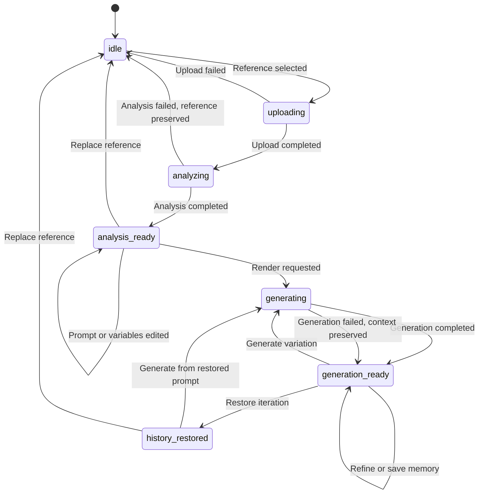
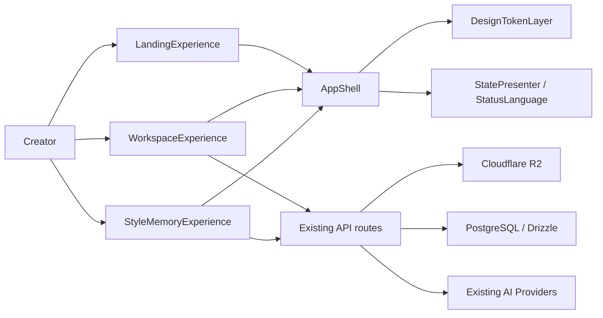
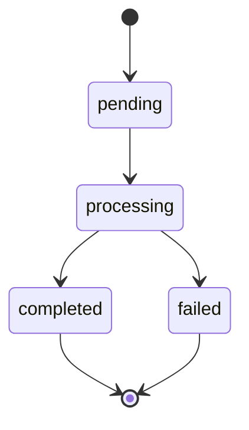

# 架构设计文档：全站 AI 优先界面风格复刻

_本文件只定义本期体验迁移真正影响实现的架构决策、模块边界、交互契约和验收承接；不新增后端数据表、业务 API、AI Provider、队列、WebSocket、完整移动端工作流或大型 UI 框架。_

## 1. 系统摘要

本期将 Visoryn 从“AI 在后台处理”的界面表达升级为 AI 优先的 Evidence Workbench：用户在首页、工作台、风格记忆库和状态页之间切换时，都能看到 AI 当前理解了什么、证据来自哪里、生成是否就绪以及下一步可以做什么。核心闭环锚点是 **Reference -> Evidence -> Render**。架构选择前端体验迁移方案，保留既有上传、分析、生成、历史和模板复用链路，用统一设计 token、页面壳层、状态语言和 Evidence/Prompt/Render 交互契约完成全站一致化。

## 2. 范围、非目标与成功标准

### 2.1 范围

- 升级全站设计规范落地层：在 `docs/design/DESIGN.md` 与 `src/app/globals.css` 的 Precision Glass 基础上补齐 AI evidence、readiness、style memory、状态语义 token 和组件使用规则。
- 迁移工作台体验：保留现有三栏宽屏结构，重塑 `Reference Canvas`、`Style Intelligence`、`Prompt + Render`、`Render Dock` 和 `Recent iterations` 的信息层级与交互反馈。
- 建立 AI 证据关系：把 `VisualRecipe` 的色彩、构图、光线、质感、情绪等字段映射为前端 evidence facet，并连接参考图锚点、风格理解卡片和提示片段。
- 强化生成前判断：在 Render Dock 集中呈现变量完整度、风格信号、服务状态、输出参数、不可生成原因和生成动作。
- 将模板库产品表达迁移为 Style Memory：复用现有模板 API、source image linkage、搜索、使用、复制和删除能力，强化来源图、变量、风格标签和复用意图展示。
- 统一 Landing、Workspace、Style Memory、登录入口、空态、加载、失败、未登录、服务不可用等状态表达，让每个状态保留上下文并给出下一步。

### 2.2 明确不做

- 不改变参考图上传、R2 直传、分析任务、生成任务、历史恢复、模板保存和模板复用的业务流程。
- 不新增后端数据表、业务 API、AI Provider 抽象、队列、WebSocket、运营后台或付费/账号体系。
- 不把模板库重建为独立“记忆服务”，Style Memory 只是现有 Prompt Template 的产品表达和前端视图模型。
- 不在首版完整重做移动端工作流；本期只保证窄屏不出现内容破坏，完整移动端 step flow 后续单独立项。
- 不引入大型 UI 框架、独立设计 token runtime、动画编排库或全量组件重写。
- 不做完全像素级复刻；验收关注目标风格的信息层级、AI 解释、证据关系、状态语言和跨页面一致性。

### 2.3 成功标准

| 指标 | 首版目标 |
| --- | --- |
| 设计规范承接 | 实现任一页面前，设计 token、表面层级、状态语言、证据表达、Render Dock 和 Style Memory 卡片规则均可从设计规范与本架构定位到。 |
| 工作台闭环 | 用户在常规宽屏桌面完成上传、分析、编辑、生成、历史恢复和保存模板时，业务链路正常完成，界面持续表达 AI 状态和下一步。 |
| 证据可追踪 | 分析完成后，主要风格信号能在参考图锚点、Style Intelligence facet 和 Prompt provenance 中建立可见关系。 |
| 生成可判断 | 生成按钮启用、禁用、排队、失败和服务不可用时，Render Dock 均给出可见原因和可继续行动。 |
| 记忆可复用 | Style Memory 列表能展示来源图、变量数量、风格标签或复用意图，并保留使用、复制、删除和空态恢复路径。 |
| 全站一致 | Landing、Workspace、Style Memory、登录入口和状态页使用同一壳层、token、状态文案和主要操作反馈，不出现明显旧体系残留。 |
| 性能与稳定 | 首屏和工作台交互不因视觉迁移引入明显卡顿；分析/生成仍使用既有轮询和降级策略。 |

### 2.4 验收标准承接矩阵

| AC-ID | PRD 原文承接 | 承接模块 | 关键链路 / 状态 | 风险 / 降级说明 |
| --- | --- | --- | --- | --- |
| AC-01 | 前置：团队开始实现任一页面的视觉迁移。动作：查看本期设计规范。结果：能明确页面底色、面板层级、状态表达、证据关系、生成操作区、风格记忆卡片和主要控件反馈的统一规则。 | DesignTokenLayer、StatePresenter/StatusLanguage、WorkspaceExperience、StyleMemoryExperience | Phase A 先更新设计规范和 token；所有页面组件只消费共享 token、status copy 和 evidence/readiness 术语。 | 若发现 `DESIGN.md` 与组件 token 冲突，以 `DESIGN.md` 和本架构的 AI evidence 语义为准，先修 token 再改页面。 |
| AC-02 | 前置：用户在常规宽屏桌面打开工作台。动作：查看页面整体布局。结果：页面包含工作区导航、AI 协作状态、参考画布、风格理解、提示与生成、近期迭代，并与目标图保持同一信息层级和视觉气质。 | AppShell、WorkspaceExperience | `/workspace` 进入后渲染 `LeftSidebar`、`StatusBar/AiStatusHeader`、`WorkspaceThreeColumnLayout`、`ReferenceCard`、`RecipeCard`、`PromptCard`、`OutputCard`、`HistoryStrip`。 | 若数据为空，仍展示 AI 将读取的信号和 Render Dock 禁用原因，不退回旧式空白卡片。 |
| AC-03 | 前置：用户完成参考图分析。动作：查看风格理解和提示内容。结果：用户能看到主要风格信号、相关证据、可信度提示，并理解这些判断如何影响当前提示内容。 | WorkspaceExperience、Evidence/Prompt/Render 契约 | `analysis_ready` 时由 `VisualRecipe` 生成 evidence facets、reference anchors、prompt provenance spans 和 confidence/readiness 文案。 | 首版 provenance 可由前端规则映射生成，不新增后端字段；缺少可匹配片段时展示 facet chip 与解释文案。 |
| AC-04 | 前置：用户准备生成新图。动作：查看生成操作区。结果：用户能判断变量是否完整、风格信号是否足够、服务是否可用；若不可生成，页面可见说明原因和下一步行动。 | WorkspaceExperience、StatePresenter/StatusLanguage | `PromptCard` 更新 resolved prompt 与 variables；`Render Dock` 根据 `canGenerate`、`hasUnresolvedVariables`、`degradation.generationUnavailable` 和 busy state 展示 readiness。 | 生成不可用时保留编辑能力和保存能力；不通过隐藏按钮解决错误，只显示原因和下一步。 |
| AC-05 | 前置：用户至少完成一次生成。动作：查看近期迭代并操作历史结果。结果：用户可以比较、恢复、继续生成变体，或将满意方向保存为风格记忆。 | WorkspaceExperience | `generation_ready` 后刷新 `generation-history`；`HistoryStrip/IterationMemory` 打开 `HistoryDetailDialog`，恢复时调用 `enterHistoryRestored`，保存时复用 `TemplateSaveDialog`。 | 首版比较可用已有详情弹层或轻量对照，不新增 history API；无历史时展示“迭代会出现在这里”的教学空态。 |
| AC-06 | 前置：用户进入风格记忆库。动作：浏览、搜索、使用、复制或删除风格记忆。结果：每条记忆优先展示来源图、风格标签、变量和复用意图；空态或受限状态也提供明确下一步。 | StyleMemoryExperience、StatePresenter/StatusLanguage | `/workspace/templates` 使用 `useTemplateSearch` 与现有模板 API；卡片展示 `sourceImageUrl`、`variableCount`、tags/reuse intent 前端派生、Use/Duplicate/Delete。 | API 401/空列表/搜索无结果统一走 StatePresenter；不新增后端字段，复用 content、variables 和 source image 快照派生展示。 |
| AC-07 | 前置：用户在首页、工作台、风格记忆库、登录入口和状态页面之间切换。动作：观察页面壳层、面板、按钮、状态点、标签和文案。结果：页面之间使用同一套 AI 优先视觉语言；导航选中、当前任务层级、状态语言和主要操作反馈保持一致，用户能判断当前所在页面和下一步行动，不出现明显旧体系残留或像不同产品的断层。 | DesignTokenLayer、AppShell、LandingExperience、WorkspaceExperience、StyleMemoryExperience、StatePresenter/StatusLanguage | 全站页面统一消费 `workspace-chromatic`/surface token、按钮/input/chip/status class、共享状态文案和导航选中规则。 | 迁移期允许旧组件逐步替换，但 Phase D 前必须清理明显旧色板、硬边框、孤立 SVG 按钮和无解释禁用态。 |
| AC-08 | 前置：用户遇到分析失败、生成失败、未登录、服务不可用或风格记忆库为空。动作：查看状态提示并尝试继续任务。结果：页面保留可复用上下文，说明发生原因，并提供重试、返回编辑、更换输入、登录或创建记忆等可继续行动。 | StatePresenter/StatusLanguage、WorkspaceExperience、StyleMemoryExperience | `WorkspaceError`、`DegradationState`、`ProductStatus` 映射到 failedRecoverable/authRequired/noResults/queued/processing；保留 reference、prompt、history/template context。 | 错误恢复不清空 sessionStorage 中有效工作台快照；仅 `Replace` 或显式 reset 清除当前上下文。 |
| AC-09 | 前置：用户首次进入首页，或进入没有参考图、没有分析结果、没有风格记忆的空态页面。动作：查看首屏或空态内容。结果：用户能判断 AI 会如何理解参考图、拆解风格、辅助编辑并生成新结果；页面提供明确的开始创作、上传参考图、创建第一条风格记忆或返回可用工作台的入口。 | LandingExperience、WorkspaceExperience、StyleMemoryExperience、StatePresenter/StatusLanguage | Landing 首屏展示 Reference -> Evidence -> Render 预览；Workspace 空态展示 AI 将读取的信号；Style Memory 空态提供从工作台保存或从参考图开始。 | 未登录或 API 受限时不展示死空态，显示登录/返回工作台路径。 |

## 3. 用户流程与状态

### 3.1 主流程

1. 用户进入首页或直接打开 `/workspace`，AppShell 展示一致导航、当前页面和主要操作入口。
2. Landing 首屏用 `Reference -> Evidence -> Render` 的产品预览解释 AI 会如何理解参考图、拆解风格、辅助编辑并生成结果。
3. 用户上传参考图或从 Style Memory 选择模板进入工作台；上传仍通过现有预签名 URL 和 `useUpload` 完成。
4. WorkspaceExperience 进入 `uploading/analyzing`，Reference Canvas 保留参考图，AI 状态区说明正在读取色彩、构图、光线、质感和情绪。
5. 分析完成后进入 `analysis_ready`，Style Intelligence 展示 evidence facets，Prompt + Render 展示 prompt provenance、变量和 negative constraints。
6. 用户编辑提示或变量；每次编辑更新 resolved prompt，Render Dock 同步计算 readiness 和不可生成原因。
7. 用户开始生成；工作台进入 `generating`，保留参考图、提示快照、上一轮结果和当前参数。
8. 生成完成进入 `generation_ready`，结果弹层与近期迭代更新，用户可比较、恢复、生成变体或保存为 Style Memory。
9. 用户进入 `/workspace/templates` 浏览 Style Memory；每条记忆展示来源图、变量、复用价值，并可使用、复制、删除或从空态创建。
10. 用户在 Landing、Workspace、Style Memory、登录入口和状态页之间切换时，状态语言、导航选中和控件反馈保持一致。

### 3.2 关键分支

| 分支 | 入口/触发条件 | 状态变化 | 数据 / 回调更新 |
| --- | --- | --- | --- |
| 上传参考图 | `ReferenceCard.onFileSelected(file)` | `idle -> uploading -> analyzing` | `useUpload` 返回 `{ assetId, fileUrl }`；`getImageDimensions` 计算尺寸；POST `/api/analysis` 成功后 `ws.startAnalysis(task.id)`。 |
| 分析完成 | `useAnalysis(ws.analysisTaskId)` 返回 `completed` | `analyzing -> analysis_ready` | `ws.completeAnalysis(recipe, promptText, negativePromptText, templatePayload)`；同步 `resolvedPromptText`、`currentTemplateVariables`。 |
| 分析失败 | analysis POST 或 polling 返回失败 | `analyzing -> idle`，保留 reference context | `ws.failAnalysis(message, stage, code, retryable)`；Reference Canvas 显示失败原因、Retry analysis、Replace。 |
| 编辑提示/变量 | `UnifiedPromptEditor` 产生 resolved prompt 或 variable change | 保持 `analysis_ready/generation_ready/history_restored` | `onResolvedPromptChange` 更新 `resolvedPromptText` 与 `ws.promptText`；`onTemplateVariablesChange` 更新当前变量列表。 |
| 生成就绪判断 | prompt、variables、busy state、service state 任一变化 | `Render Dock` readiness 更新，不单独写入后端 | `canGenerate = prompt 非空 && 无未解析变量 && 非 busy && generation service 可用`；`disabledReason` 可见。 |
| 开始生成 | `OutputCard.onGenerate(params)` 且 `canGenerate=true` | `analysis_ready/history_restored/generation_ready -> generating` | POST `/api/generation`；成功后 `ws.startGeneration(task.id)`；失败时 `ws.failGeneration` 并保留 prompt/params。 |
| 生成完成 | `useGeneration(ws.generationTaskId)` 返回 completed | `generating -> generation_ready` | `ws.completeGeneration(resultFileUrl)`；打开 `GenerationDialog`；invalidate `generation-history`。 |
| 历史恢复 | `HistoryStrip.onSelect(id)` 后用户确认 Restore | `generation_ready/analysis_ready -> history_restored` | `restoreHistory(id)` 返回 prompt/recipe/result/params；`enterHistoryRestored` 写回工作台上下文。 |
| 保存风格记忆 | `PromptCard.onSaveTemplate` 或 Render Dock 保存入口 | 工作台状态不变 | `TemplateSaveDialog` 使用 `sourceAnalysisTaskId`、`sourceAssetId`、`sourceImageUrl`、variables 创建现有 PromptTemplate。 |
| 使用风格记忆 | `TemplateCard.onUse(id)` | 导航到 `/workspace?templateId=id` | GET `/api/templates/:id` 后更新 `promptText`、`resolvedPromptText`、`currentTemplateVariables`，再清理 query。 |
| 受限/未登录 | API 返回 `401` 或 auth state 缺失 | 页面业务状态不被清空 | `StatePresenter(status="authRequired")` 提供登录与返回工作台；Style Memory 保留搜索输入。 |

### 3.3 状态机



关键规则：

- 只有用户明确 Replace/reset 时清空 reference 和 prompt context；分析失败、生成失败、服务不可用和未登录不清空上下文。
- `generation_ready` 可同时表示“生成成功且有结果”和“生成失败但上下文可恢复”；具体文案由 `WorkspaceError.stage` 与 `ProductStatus` 决定。
- 生成可用性不是持久状态，而是由 prompt、variables、busy state、service degradation 派生的前端 readiness。
- Style Memory 页面不改变 Workspace state；使用记忆时通过 `templateId` query 把 prompt/variables 注入当前工作台。

## 4. 系统上下文与模块职责

### 4.1 系统上下文

本期系统边界是 Next.js 前端体验层、既有 API routes、PostgreSQL/R2/AI Provider 组成的现有业务链路。架构只改变页面组织、视觉 token、状态呈现和前端视图模型，不新增业务后端。



### 4.2 模块职责

| 模块 | 职责 | 上游输入 | 下游输出 |
| --- | --- | --- | --- |
| DesignTokenLayer | 承接 `DESIGN.md` 的 Precision Glass 基础，并补齐 AI evidence facet、readiness、style memory、状态色和控件反馈 token；约束页面表面层级、无硬分割线、ghost border、button/input/chip 样式。 | `docs/design/DESIGN.md`、redesign brief、现有 `src/app/globals.css`。 | CSS custom properties、共享 utility class、页面/组件视觉使用规则。 |
| AppShell | 统一 Landing、Workspace、Style Memory、登录入口的导航、页面层级、当前任务识别和宽屏壳层；保留现有 `LeftSidebar` 与 auth header。 | 当前 route、auth state、workspace state 摘要。 | 统一导航选中、页面标题/状态 header、主内容容器和可访问 landmarks。 |
| WorkspaceExperience | 组织 `Reference Canvas`、`Style Intelligence`、`Prompt + Render`、`Render Dock`、`IterationMemory`；保留 `useWorkspaceState`、上传、分析、生成、历史恢复和模板保存链路。 | WorkspaceContext、analysis/generation polling、history list、template query、user edits。 | 工作台视图状态、evidence facets、prompt provenance、readiness、用户回调。 |
| StyleMemoryExperience | 将 `/workspace/templates` 从 Template Library 表达为 Style Memory；复用模板搜索、使用、复制、删除 API，强化来源图、变量、复用意图、空态和受限状态。 | `useTemplateSearch`、PromptTemplate list item、auth/API error、search input。 | Style memory cards、filters/search state、Use/Duplicate/Delete callbacks、StatePresenter 状态。 |
| LandingExperience | 首页第一屏展示 AI-first studio 价值和 Reference -> Evidence -> Render 预览；上传入口、浏览记忆和开始创作入口与工作台一致。 | 用户入口、pending file store、auth header。 | `useFileStore` pending file、跳转 `/workspace`、首屏和空态状态文案。 |
| StatePresenter/StatusLanguage | 统一空态、加载、排队、处理中、成功、可恢复失败、历史恢复、未登录、无结果、服务不可用的文案、tone、行动按钮和 aria-live。 | ProductStatus、WorkspaceError、DegradationState、页面自定义 copy。 | 可复用状态组件、状态文案映射、下一步 action contract。 |

### 4.3 需要刻意避免的过度设计

- 不新增 `style_memories` 表；Style Memory 是 `PromptTemplate` 的前端视图表达。
- 不新增 `/api/evidence`、`/api/readiness`、`/api/style-memory` 等端点；evidence 和 readiness 由现有 `VisualRecipe`、prompt、variables、task status 前端派生。
- 不引入队列、WebSocket 或实时流式 UI；分析/生成仍使用现有任务状态轮询和 60s queueing hint。
- 不引入完整移动端 step workflow；本期实施只避免窄屏破版，移动端主流程另立 PRD/架构。
- 不引入大型设计系统框架或 token build pipeline；继续使用 Tailwind 4、CSS variables 和现有组件模式。
- 不把 prompt provenance 做成可编辑 AST 或版本系统；首版使用 facet-to-span 映射和可见高亮，保持低复杂度。

## 5. 关键架构决策（ADR）

### ADR-1：采用前端体验迁移，不重写业务链路
- **选择**：本期只迁移 UI 架构、状态语言和前端视图模型，保留上传、分析、生成、历史、模板 API 与数据表。
- **理由**：PRD 目标是 AI 优先表达和全站一致性，不是业务能力新增；不用更重方案是为了避免后端迁移风险和验收口径漂移。
- **风险与对策**：现有 API 字段不足时先用前端派生展示；只有 AC 无法承接时才进入后续需求变更。

### ADR-2：用 DesignTokenLayer 承载 AI evidence 语义，而非引入新 UI 框架
- **选择**：在 `globals.css` 与 `DESIGN.md` 基础上扩展 evidence/readiness/style-memory/status token 和共享 class。
- **理由**：现有组件已经依赖 CSS variables 和 Tailwind；不用新框架可保持改造范围小、测试稳定、视觉规则可追踪。
- **风险与对策**：token 名称过散会导致二次漂移；Phase A 先冻结命名和使用规则，再改页面。

### ADR-3：AppShell 统一跨页面结构，Workspace 保留三栏宽屏模型
- **选择**：Landing、Workspace、Style Memory 共享导航和状态语言；Workspace 继续使用三栏桌面 workbench。
- **理由**：PRD 明确保留专业三栏心智和常规宽屏首版；不用重排工作流可减少用户学习成本。
- **风险与对策**：窄屏仍可能拥挤；本期仅做可用降级，完整移动端 step flow 延后。

### ADR-4：Evidence/Prompt/Render 关系由前端视图模型派生
- **选择**：从 `VisualRecipe`、prompt text、template variables 派生 `EvidenceFacet`、`PromptProvenanceSpan` 和 `RenderReadiness`。
- **理由**：现有 AI 输出已包含色彩、构图、光线、质感、mood 等字段；不用新增后端 evidence schema 可快速承接 AC-03。
- **风险与对策**：首版高亮可能不是语义级精确匹配；展示“相关信号”而非声明精确因果，并保留 future backend provenance 余地。

### ADR-5：Render Dock 成为生成前判断的唯一可见控制面
- **选择**：把变量完整度、风格信号、服务状态、参数、不可用原因、重试和生成动作集中在 Prompt + Render 下方。
- **理由**：生成是关键决策点；不用分散到底栏/弹层可让用户在点击前就知道是否可生成。
- **风险与对策**：控制面过重会压缩 prompt 编辑空间；使用 compact readiness list 和可折叠详细说明控制密度。

### ADR-6：Style Memory 复用模板模型，不新增记忆服务
- **选择**：`PromptTemplate` 仍是 source of truth，Style Memory 仅改变卡片层级、文案、筛选和空态表达。
- **理由**：现有模板已有 source asset/image、variables、使用、复制、删除；不用新服务可保留保存模板和复用链路。
- **风险与对策**：缺少显式 style tags/reuse intent 字段时用 recipe/prompt/variables 前端派生；需要持久化再单独立项。

### ADR-7：状态恢复优先于视觉清空
- **选择**：失败、排队、未登录、服务不可用都必须保留可复用上下文，并通过 StatePresenter 给出下一步。
- **理由**：AI 创作链路等待和失败较多；不用“只禁用按钮/只显示错误”可减少用户误以为任务丢失。
- **风险与对策**：状态映射可能重复；统一收敛到 `ProductStatus`、`WorkspaceError`、`DegradationState` 和页面 override。

### 5.x 待确认问题

无。PRD 检查报告未发现缺失项或断点；本架构无阻塞问题，frontmatter `open_questions` 保持为空。

## 6. 运行链路

### 6.1 Landing 首次进入与开始创作

1. 用户打开 `/`，`LandingExperience` 渲染 AI-first hero、产品预览、上传入口和浏览 Style Memory 入口。
2. `AuthHeader` 或共享导航展示当前登录入口，视觉 token 与 Workspace/Style Memory 共用。
3. 用户选择上传时，`UploadEntry` 将 File 写入 `useFileStore`，再导航到 `/workspace`。
4. Workspace 首次挂载时消费 pending file，调用 `handleFileSelected(file)` 进入上传与分析链路。
5. 若用户选择浏览记忆，导航到 `/workspace/templates`，Style Memory 按 auth/API 状态展示列表、空态或登录提示。

这条链路的实现原则：

- 首页不是营销长页优先，而是直接解释 Reference -> Evidence -> Render 和第一步。
- 上传入口只负责 file handoff，不提前调用分析 API。
- 首屏空态必须说明 AI 会读取哪些风格信号，并给出开始创作/浏览记忆两个行动。

### 6.2 上传与分析链路

1. `ReferenceCard.onFileSelected(file)` 调用 `ws.startUpload(file.type)`，状态进入 `uploading`。
2. 浏览器通过 `useUpload` 获取预签名 URL 并直传 R2，同时 `getImageDimensions(file)` 读取宽高。
3. 上传完成后 `ws.completeUpload(assetId, fileUrl)`，状态进入 `analyzing` 并保留参考图 URL。
4. 前端 POST `/api/analysis`，请求体来自 `assetId/fileUrl/width/height/mimeType`。
5. API 使用既有 Provider 和 DB task，返回 task id 或同步完成结果；前端轮询 `/api/analysis/:id`。
6. 分析中 UI 持续展示参考图、AI 正在读取的 facet 和 queueing hint。
7. 成功时 `ws.completeAnalysis` 写入 recipe、prompt、negative prompt、template variables；失败时 `ws.failAnalysis` 写入 recoverable error。

这条链路的实现原则：

- 图片二进制只走 R2 直传，不经过业务 API。
- 分析失败不清空 `referenceImageUrl`、`assetId` 和可重试上下文。
- Evidence facet 提取算法：按固定字段顺序 `color -> composition -> lighting -> texture -> mood -> subject` 从 `VisualRecipe` 读取非空文本，生成稳定 id、label、icon、tone；缺失字段不渲染空 facet。

### 6.3 Evidence/Prompt/Render 浏览与编辑链路

1. `analysis_ready` 时，WorkspaceExperience 将 `recipe` 转为 `EvidenceFacet[]`，Reference Canvas 渲染 anchors/palette/overlay controls。
2. Style Intelligence 展示 facet label、summary、confidence display 和“点击后关联参考图/提示片段”的 affordance。
3. Prompt + Render 接收 `promptText`、`analysisTemplateContent`、`analysisTemplateVariables`，渲染 Prompt provenance 和 UnifiedPromptEditor。
4. 用户点击 facet 时，前端更新 `selectedFacetId`，Reference Canvas 高亮对应 anchor，Prompt provenance 高亮对应 span。
5. 用户编辑 prompt 或变量时，`onResolvedPromptChange` 更新 `resolvedPromptText` 和 `ws.promptText`；`onTemplateVariablesChange` 更新当前变量列表。
6. Render Dock 重新计算 readiness，显示 prompt resolved、variables resolved、style signal sufficient、service available、not busy。

这条链路的实现原则：

- Prompt span 匹配算法先按 facet keywords 长文本优先匹配 prompt，小写比较，避免短词覆盖长词；无匹配时仍展示 facet chip，不伪造精确 span。
- 变量完整度以 `hasUnresolvedVariables(resolvedPromptText)` 为准，不另写一套解析规则。
- `selectedFacetId` 是前端 UI 状态，不写入 sessionStorage 或后端。

### 6.4 生成与结果链路

1. Render Dock 接收 `params`、`canGenerate`、`disabledReason`、`generationUnavailable`、`WorkspaceError`。
2. 用户点击 Generate 时，若 `canGenerate=false` 则按钮保持禁用并显示可见原因；若可用则调用 `handleGenerate(params)`。
3. `handleGenerate` 校验 `analysisTaskId`、prompt 非空、无未解析变量、服务可用，然后 POST `/api/generation`。
4. POST 成功后 `ws.startGeneration(task.id)`，状态进入 `generating`；Render Dock 进入 progress/read-only 参数状态。
5. `useGeneration` 轮询任务；完成时 `ws.completeGeneration(resultFileUrl)`、打开 `GenerationDialog`、刷新 `generation-history`。
6. 失败时 `ws.failGeneration(message, code, retryable)`，状态回到 `generation_ready`，保留 reference、prompt、variables、params。

这条链路的实现原则：

- Generate 不是孤立按钮，必须伴随 readiness list、参数和失败恢复路径。
- 生成期间不允许重复提交；参数控件禁用但保持可见。
- `SERVICE_UNAVAILABLE` 只阻断生成动作，不阻断编辑、历史查看和保存 Style Memory。

### 6.5 Iteration Memory 链路

1. `generation_ready` 后 React Query 刷新 `generation-history`，`HistoryStrip` 接收最近 20 条结果。
2. 无历史时显示教学空态，说明 renders 会作为 visual evidence 出现。
3. 用户选择历史项时，调用 `restoreHistory(id)` 获取 result、recipe、prompt snapshot、negative prompt、params、analysisTaskId。
4. 前端打开 `HistoryDetailDialog`，用户确认恢复后调用 `enterHistoryRestored` 写回 Workspace state。
5. 恢复后用户可继续编辑、重新生成或保存为 Style Memory。

这条链路的实现原则：

- 首版可用已有详情弹层承载比较和恢复，不新增比较 API。
- 历史恢复覆盖 prompt 和 recipe，但不修改原 history 记录。
- 近期迭代是创作回路的一部分，空态也要说明“比较、恢复、复用”的后续价值。

### 6.6 Style Memory 链路

1. 用户进入 `/workspace/templates`，`useTemplateSearch` 请求 `/api/templates?search=&limit=20`。
2. 列表成功时，Style Memory 卡片展示来源图、名称、变量数量、前端派生的 style tags/reuse intent 和操作入口。
3. 搜索输入变化后通过 deferred value 触发查询；无结果时 StatePresenter 提供清除搜索/返回工作台。
4. Use 操作导航到 `/workspace?templateId=id`，Workspace GET `/api/templates/:id` 后注入 content 和 variables。
5. Duplicate/Delete 继续调用现有模板 API 并 invalidate `templates` query。
6. API 401、服务失败、空列表分别映射为 authRequired、failedRecoverable、empty/noResults 状态。

这条链路的实现原则：

- 列表 GET 已支持 cursor/limit/search，本期不改变 API 形态；前端可以继续先取 20 条，后续再接 load more。
- source image 优先展示 `sourceImageUrl`；缺失时使用低噪音占位并解释“无来源预览”。
- 复用意图首版由 template name、variables 和 prompt content 前端派生，不新增持久字段。

### 6.7 全站状态与降级链路

1. 页面或组件将业务状态映射到 `ProductStatus`：empty、loading、queued、processing、success、failedRecoverable、restored、authRequired、noResults。
2. `getStatusCopy(status, overrides)` 返回统一 title、description、action label 和 tone。
3. `StatePresenter` 根据 status 设置 aria-live、tone dot、说明和 1-2 个行动按钮。
4. Workspace 的 `DegradationState` 超过 60s 时进入 queued copy；Provider/API 返回 `SERVICE_UNAVAILABLE` 时进入 service unavailable copy。
5. 用户选择 Retry、Back to Edit、Replace、Login、Create memory 等行动时，页面调用既有回调，不清空未明确放弃的上下文。

这条链路的实现原则：

- 状态文案用“发生了什么 + 保留了什么 + 下一步”三段式。
- 降级级别从轻到重：排队提示 -> 服务暂不可用但可编辑 -> 可恢复失败 -> 未登录受限。
- 所有失败态都必须至少有一个可继续行动；不可把错误只放在 `title` 或 `sr-only` 中。

## 7. 领域对象与关键契约

### 7.1 核心对象

| 对象名 | Source of Truth | Owner | 用途 |
| --- | --- | --- | --- |
| `VisualRecipe` | `analysis_tasks.recipe` / `src/types/models.ts` | Existing analysis pipeline | Style Intelligence 和 evidence facets 的输入。 |
| `WorkspaceContext` | `useWorkspaceState` + sessionStorage snapshot | WorkspaceExperience | 工作台状态、reference、prompt、task id、error、degradation 的前端 source of truth。 |
| `EvidenceFacet` | 前端由 `VisualRecipe` 派生 | WorkspaceExperience | 连接参考图、风格理解和 prompt provenance 的最小展示对象。 |
| `PromptProvenanceSpan` | 前端由 prompt + EvidenceFacet 派生 | WorkspaceExperience | 标记提示文本中与 facet 相关的片段。 |
| `RenderReadiness` | 前端由 prompt、variables、task status、degradation 派生 | WorkspaceExperience | Render Dock 启用/禁用、原因和下一步行动。 |
| `PromptTemplate` / Style Memory | `templates` 表和 `/api/templates` | StyleMemoryExperience | 风格记忆列表、保存、使用、复制和删除。 |
| `ProductStatus` | `src/lib/ui/status-copy.ts` | StatePresenter/StatusLanguage | 全站空态、加载、失败、登录受限、无结果等状态语言。 |

### 7.2 推荐最小 Schema

```ts
type WorkspacePhase =
  | "idle"
  | "uploading"
  | "analyzing"
  | "analysis_ready"
  | "generating"
  | "generation_ready"
  | "history_restored";

type EvidenceFacetId =
  | "color"
  | "composition"
  | "lighting"
  | "texture"
  | "mood"
  | "subject";

interface EvidenceFacet {
  id: EvidenceFacetId;
  label: string;
  summary: string;
  tone: "color" | "composition" | "lighting" | "texture" | "mood" | "neutral";
  confidenceLabel: "strong" | "medium" | "weak";
  sourceField: keyof VisualRecipe;
  anchorIndex: number | null;
}

interface PromptProvenanceSpan {
  id: string;
  facetId: EvidenceFacetId;
  text: string;
  startIndex: number | null;
  endIndex: number | null;
  matchType: "exact" | "keyword" | "facet_only";
}

interface RenderReadiness {
  promptResolved: boolean;
  variablesResolved: boolean;
  styleSignalsAvailable: boolean;
  serviceAvailable: boolean;
  workspaceIdle: boolean;
  canGenerate: boolean;
  disabledReason: string;
  nextAction:
    | "upload_reference"
    | "wait_for_analysis"
    | "resolve_variables"
    | "wait_for_task"
    | "retry_service"
    | "generate";
}

interface StyleMemoryCardViewModel {
  id: string;
  name: string;
  sourceImageUrl: string | null;
  variableCount: number;
  styleTags: string[];
  reuseIntent: string;
  createdAt: string;
  actions: Array<"use" | "duplicate" | "delete">;
}

interface StatusLanguageViewModel {
  status: ProductStatus;
  title: string;
  description: string;
  primaryActionLabel?: string;
  secondaryActionLabel?: string;
  tone: "neutral" | "accent" | "success" | "warning" | "danger";
}
```

Schema 约束：

- 上述对象均为前端视图模型，不要求新增数据库字段。
- `EvidenceFacet` 由 `VisualRecipe` 扁平字段派生，嵌套层级不超过 2 层。
- `RenderReadiness.canGenerate` 必须与现有生成 guard 保持一致：prompt 非空、无未解析变量、非 busy、服务可用。
- Style Memory 列表项必须兼容现有 `TemplateListItem`；新增 tags/reuse intent 为派生显示字段。

### 7.3 API 边界

| 接口路径 | 用途 | 数据来源与说明 |
| --- | --- | --- |
| `POST /api/upload/presign` | 获取 R2 直传 URL | `user_input`: file name/type/size；业务 API 不接收图片二进制。 |
| `POST /api/analysis` | 创建分析任务 | `frontend_computed`: width/height/mimeType；`system_generated`: assetId 来自上传；`user_input`: fileUrl 来自已上传参考图；保留现有两阶段 AI 链路。 |
| `GET /api/analysis/:id` | 轮询分析任务 | `system_generated`: analysisTaskId；返回 recipe、prompt、negative prompt、template variables 和错误信息。 |
| `POST /api/generation` | 创建生成任务 | `derived`: analysisTaskId、resolved prompt、negative prompt；`user_input`: aspectRatio/quality；继续使用现有 provider。 |
| `GET /api/generation/:id` | 轮询生成任务 | `system_generated`: generationTaskId；返回 resultFileUrl 或 error。 |
| `GET /api/generation?pageSize=20&cursor=...` | 最近迭代列表 | `system_generated`: auth user；`user_input`: cursor/pageSize；本期用于 Iteration Memory。 |
| `GET /api/templates?search=&limit=20&cursor=...` | Style Memory 列表 | `user_input`: search；`derived`: limit/cursor；返回现有 id、name、variableCount、sourceAssetId、sourceImageUrl、createdAt。 |
| `GET /api/templates/:id` | 使用记忆时加载详情 | `system_generated`: templateId；返回 content 和 variables，注入 Workspace。 |
| `POST /api/templates` | 保存 Style Memory | `user_input`: name/content/variables；`derived`: sourceAssetId/sourceImageUrl/sourceAnalysisTaskId；不新增字段。 |
| `POST /api/templates/:id/duplicate` / `DELETE /api/templates/:id` | 复制和删除 Style Memory | `system_generated`: templateId/auth user；成功后刷新 templates query。 |

API 原则：

- 本期 API 表仅列出既有首版用户流程会消费的端点，不新增业务端点。
- 列表接口继续使用现有分页/limit/cursor；前端展示若暂未接 load more，不改变后端 contract。
- 请求体字段在实现计划中保持现有校验规则，不因 UI 命名从 Template Library 变为 Style Memory 而改 API 命名。

### 7.4 状态流转

后端任务状态继续使用既有状态机：



前端产品状态映射：

| 来源 | 条件 | ProductStatus | UI 行为 |
| --- | --- | --- | --- |
| Workspace | no reference and no prompt | `empty` | 引导上传参考图或选择 Style Memory。 |
| Workspace | uploading/analyzing/generating < 60s | `processing` | 保留上下文，说明当前 AI 正在处理什么。 |
| Workspace | analyzing/generating >= 60s | `queued` | 显示排队提示和返回编辑行动。 |
| Workspace | generation completed | `success` | 展示结果、继续编辑、再次生成、保存记忆。 |
| Workspace | analysis/generation failed retryable | `failedRecoverable` | 保留上下文，提供 Retry/Back to Edit/Replace。 |
| Workspace | history restored | `restored` | 说明历史已恢复，可继续编辑或生成。 |
| Style Memory | API 401 | `authRequired` | 提供登录和返回工作台。 |
| Style Memory | empty list | `empty` | 提供从工作台保存或从参考图开始。 |
| Style Memory | search no result | `noResults` | 提供清除搜索和返回工作台。 |

### 7.5 数据边界

| 存储层 | 职责 | 本期变化 |
| --- | --- | --- |
| R2 对象存储 | 保存 reference/generated image 文件，通过 URL 供 UI 预览。 | 不变；source image snapshot 继续用于 Style Memory preview。 |
| PostgreSQL / Drizzle | 保存 assets、analysis tasks、generation tasks、templates 和用户数据。 | 不新增表、不改核心 schema；仅复用已有字段展示。 |
| 浏览器 sessionStorage | 保存 Workspace 关键恢复状态。 | 保留；状态失败和页面切换不清空有效快照。 |
| React state / React Query cache | 保存 selected facet、readiness、dialog open、search、history/template list cache。 | 新增体验状态仅在前端存在，刷新后可从后端和 sessionStorage 恢复核心上下文。 |
| 文档设计规范 | 作为视觉迁移 source of truth。 | `DESIGN.md` 与本架构共同约束 AI-first token 和状态语言。 |

### 7.6 命名与标识规则

- ID 策略：继续使用现有 ULID；前端派生对象 id 使用稳定字符串枚举，不进入数据库。
- JSON 命名：API 和 TypeScript 保持 camelCase，例如 `sourceImageUrl`、`analysisTaskId`、`negativePromptText`。
- 数据库命名：继续使用 snake_case，通过 Drizzle schema 映射；本期不新增 column。
- 产品术语映射：
  - Template Library UI 显示为 `Style Memory`；代码/API 暂保留 `template` 命名。
  - Recipe UI 显示为 `Style Intelligence`；数据模型仍为 `VisualRecipe`。
  - Reference image UI 显示为 `Reference Canvas`；数据模型仍为 `Asset(type="reference")`。
  - Output/Generate UI 显示为 `Render Dock`；数据模型仍为 `GenerationTask`。
  - Recent history UI 显示为 `Recent iterations` 或 `Iteration Memory`；API 仍为 generation history。
- 状态术语：界面文案使用 `ready / queued / processing / recoverable / restored / unavailable`，避免只用技术错误码；错误码保留在内部日志和调试上下文。

## 8. 非功能需求、风险与运行策略

### 8.1 性能与吞吐量目标

| 指标 | 目标 | 预期并发 |
| --- | --- | --- |
| Workspace 首屏交互 | 不因视觉迁移增加阻塞式数据请求；无 reference 时直接渲染空态。 | 单用户本地工作台为主。 |
| Render Dock readiness 更新 | prompt/variables 变化后在前端同步更新，无网络请求。 | 与编辑器输入频率一致。 |
| Style Memory 列表 | 默认请求 20 条，保留 cursor/limit 能力。 | 普通个人模板量级。 |
| 图片预览 | 使用现有 Next Image/R2 URL；避免一次性渲染过多大图。 | 最近历史最多展示 20 条。 |

### 8.2 可靠性、错误处理与降级策略

| 降级级别 | 触发条件 | 系统行为 |
| --- | --- | --- |
| L1 排队提示 | 分析或生成轮询超过 60s | 显示 queued 状态，保留参考图、prompt 和可返回编辑行动。 |
| L2 生成服务不可用 | generation API 返回 `SERVICE_UNAVAILABLE` | Render Dock 禁用 Generate，保留编辑、历史查看和保存记忆。 |
| L3 可恢复失败 | 分析/生成失败且 retryable | StatePresenter/卡片内错误说明原因，提供 retry/replace/back to edit。 |
| L4 未登录/受限 | templates/history 等 API 返回 401 | 不清空工作台，Style Memory 显示登录和返回工作台。 |
| L5 空态/无结果 | 无 reference、无 template、搜索无结果 | 展示教学说明和下一步，不显示空白面板。 |

### 8.3 安全与反滥用策略

| 项目 | 首版策略 |
| --- | --- |
| API Key 管理 | 继续仅在服务端持有 R2、AI Provider、fal/Replicate/Gemini key，客户端不暴露。 |
| Prompt 注入防护 | 本期不改变 AI pipeline；UI 中区分 system 输出、用户编辑 prompt 和 negative prompt，不把 UI 文案拼入 system prompt。 |
| 内容安全 | 保持现有 Provider/API 错误处理；失败时展示 recoverable copy，不泄露密钥或内部堆栈。 |
| Rate Limit | 复用既有模板创建 rate limit 与 API 校验；本期不新增按量接口。 |
| 图片 URL | sourceImageUrl 继续校验 http/https；模板 sourceAssetId 需属于当前用户且为 reference。 |
| Auth | 复用 NextAuth；Style Memory 和 history 受限时显示 authRequired 状态。 |

### 8.4 成本控制预期

| 模块 | 预估单次成本 | 首版控制策略 |
| --- | --- | --- |
| R2 上传/读取 | 与现有参考图和结果图存储成本一致 | 继续直传和 URL 预览，不新增中转图片处理。 |
| Vision/Structurer 分析 | 与现有 `/api/analysis` 单次调用一致 | UI 迁移不增加分析调用次数；retry 由用户显式触发。 |
| Image generation | 与现有 `/api/generation` 单次调用一致 | Render Dock 阻止未就绪和重复提交，减少误触发成本。 |
| Template/History 查询 | 数据库查询成本 | 列表分页/limit，React Query 缓存，不轮询模板列表。 |

成本失控降级：

- 生成服务不可用或预算受限时，Render Dock 显示服务受限并保留编辑/保存能力。
- 分析服务排队时，只展示 queueing 状态，不自动重复提交。
- Style Memory 和 history 失败不触发 AI 调用，用户仍可回到工作台继续编辑。

### 8.5 可观测性

- 继续使用现有结构化日志事件：analysis request/completed/failed、generation history/list、template created/list/failed。
- 前端可在测试中用 `data-testid` 验证关键状态：workspace layout、reference-card、recipe-card、prompt-card、output-card、history-strip、state-presenter。
- 关键 UI 状态不新增远程埋点要求；若后续需要产品分析，应单独设计事件命名和采集边界。
- 错误 UI 只展示用户可理解的 message/code 映射，内部 stack 仅服务端日志保留。

### 8.6 主要风险

| 风险 | 影响 | 缓解方式 |
| --- | --- | --- |
| 视觉迁移过宽导致旧/新体系混杂 | AC-07 不通过 | Phase A 先冻结 token 和状态语言；Phase D 做全站视觉回归和旧 class 扫描。 |
| Prompt provenance 首版不够精确 | 用户误解 AI 因果关系 | 文案使用“related signals/相关信号”，不声明精确因果；后续可接真实 provenance。 |
| Render Dock 信息过多 | Prompt 编辑效率下降 | 首版只保留 readiness、params、primary action、失败恢复；更多参数不展开。 |
| Style Memory 缺少持久复用意图字段 | 卡片表达不足 | 首版从 name/content/variables/source image 派生；若验收需要人工编辑复用意图，后续单独扩 schema。 |
| auth/API 失败在模板页表现像空库 | 用户不知道该登录还是重试 | 用 StatePresenter 区分 authRequired、failedRecoverable、empty、noResults。 |
| 常规宽屏优先导致窄屏体验不足 | 移动用户体验不完整 | 明确本期非目标；实现时保证不破版，完整移动端另立项。 |

## 9. 实施方案

### Phase A：设计规范、token 与状态语言基线

1. `docs/design/DESIGN.md` — 补齐 AI-first Evidence Workbench 规则：AI evidence facet 色、readiness 状态、Style Memory 卡片、Render Dock、状态语言三段式、控件反馈和禁止旧体系残留。
2. `src/app/globals.css` — 在现有 Precision Glass token 上补齐 evidence/readiness/style-memory/status token；统一 `.surface-panel`、`.btn-primary`、`.btn-secondary`、`.input-precision`、chip/status class 的使用边界。
3. `src/lib/ui/status-copy.ts` — 扩展或调整 ProductStatus copy，覆盖 service unavailable、style memory empty、analysis failed、generation failed、queueing、auth required 的用户可行动文案。
4. `src/components/ui/state-presenter.tsx` — 保持组件 API 简洁，补齐状态 tone、compact/full variant、行动按钮和 aria-live 规则。
5. `src/components/ui/__tests__/state-presenter.test.tsx`、`src/lib/ui/__tests__/status-copy.test.ts` — 验证状态 copy、override、action label 和 aria-live。

验证目标：AC-01、AC-08 的基础契约可由设计规范、token 和 status copy 直接承接。

### Phase B：WorkspaceExperience 与 Evidence/Prompt/Render 契约

1. `src/app/workspace/page.tsx` — 保留现有上传、分析、生成、历史、模板保存回调；新增或整理 selected facet、render readiness、status mapping 的前端派生逻辑。
2. `src/components/workspace/workspace-three-column-layout.tsx` — 保留常规宽屏三栏，微调列宽、间距、overflow 和 aria-label，确保目标图信息层级稳定。
3. `src/components/workspace/ai-copilot-ribbon.tsx` / `src/components/workspace/status-bar.tsx` — 收敛为 AI 协作状态头：phase、confidence/readiness、service availability、next action。
4. `src/components/workspace/reference-card.tsx` — 将 reference anchors、palette、overlay controls 和分析失败恢复文案统一到 Evidence Canvas 契约。
5. `src/components/workspace/recipe-card.tsx` — 将 `VisualRecipe` 映射为 `EvidenceFacet[]`，支持 selected facet 高亮和 confidence/readiness 表达。
6. `src/components/workspace/prompt-card.tsx`、`src/components/workspace/unified-prompt-editor.tsx` — 强化 prompt provenance、variables、negative constraints 和保存 Style Memory 入口；保留单一可见保存入口。
7. `src/components/workspace/output-card.tsx` — 演进为 Render Dock：readiness list、参数、disabled reason、retry、generate、save as style memory。
8. `src/components/workspace/__tests__/*.test.tsx` — 更新 Reference/Recipe/Prompt/Output/Workspace layout 组件测试，覆盖 empty/analyzing/ready/generating/failed 状态。

验证目标：AC-02、AC-03、AC-04 在常规宽屏工作台可通过组件测试和目标 E2E 验证。

### Phase C：Iteration Memory 与 StyleMemoryExperience

1. `src/components/workspace/history-strip.tsx`、`src/components/workspace/history-detail-dialog.tsx` — 将近期历史表达为 Iteration Memory，补齐空态教学、比较/恢复/继续生成/保存记忆入口。
2. `src/hooks/use-history-list.ts`、`src/hooks/use-history-restore.ts` — 保持 API contract 不变，必要时调整视图字段适配。
3. `src/app/workspace/templates/page.tsx` — 将页面标题、搜索、列表、空态、错误态迁移为 Style Memory；使用 StatePresenter 区分 empty/authRequired/noResults/failedRecoverable。
4. `src/components/workspace/template-card.tsx` — 强化 source image、variables、style tags/reuse intent、Use/Duplicate/Delete 层级；减少旧文件列表感。
5. `src/hooks/use-template-search.ts` — 保持 `TemplateListItem` 与 `/api/templates` contract，不新增后端字段；必要时新增前端派生 helper。
6. `src/components/workspace/__tests__/history-strip.test.tsx`、`src/components/workspace/__tests__/template-card.test.tsx`、模板页相关测试 — 覆盖 populated、empty、search no result、auth/API error、use/duplicate/delete。

验证目标：AC-05、AC-06 的迭代恢复和风格记忆复用路径完整，且不修改模板 API。

### Phase D：Landing、AppShell 与全站验收

1. `src/app/page.tsx`、`src/components/landing/hero.tsx`、`src/components/landing/upload-entry.tsx`、`src/components/landing/value-section.tsx` — 首页首屏迁移为 AI-first studio 预览，突出 Reference -> Evidence -> Render 和开始创作/浏览记忆入口。
2. `src/app/workspace/layout.tsx`、`src/components/workspace/left-sidebar.tsx`、`src/components/auth/auth-header.tsx`、`src/components/auth/login-button.tsx` — 统一导航、登录入口、选中态、壳层和状态反馈。
3. `src/components/landing/__tests__/*.test.tsx`、`src/components/workspace/__tests__/left-sidebar.test.tsx` — 更新全站壳层、首页和导航测试。
4. `e2e/` 或 `docs/e2e/` 对应 12 期用例 — 覆盖 Landing first step、Workspace empty/analyzing/ready/render disabled、generation result、history restore、Style Memory empty/populated/auth、全站状态语言。
5. `pnpm type-check`、`pnpm test`、`pnpm lint`、目标 Playwright E2E/视觉回归 — 作为本期 review_ready 前验证命令。

验证目标：AC-07、AC-08、AC-09 全站一致性、异常恢复和第一步引导通过；确认没有新增后端 schema/API/provider。

## 10. 架构结论

本期架构以“体验迁移、业务链路不变”为核心判断：用 DesignTokenLayer 和 AppShell 统一全站视觉源头，用 WorkspaceExperience 把 Reference、Evidence、Prompt、Render 和 Iteration Memory 串成可解释创作回路，用 StyleMemoryExperience 把现有模板库表达为可复用风格记忆。关键实现只新增前端视图模型和状态语言，不引入后端表、业务 API、AI Provider、队列或完整移动端流程，能在既有产品闭环上直接承接 PRD AC-01 到 AC-09。

后续开发应先完成 Phase A 的规范和 token 基线，再迁移 Workspace 核心闭环，最后扩展到 Style Memory、Landing 和全站状态验收。若后续发现真实 provenance、持久复用意图或移动端 step flow 必须进入产品能力层，应作为独立需求重新生成 PRD 与架构，而不是混入本期前端体验迁移。
