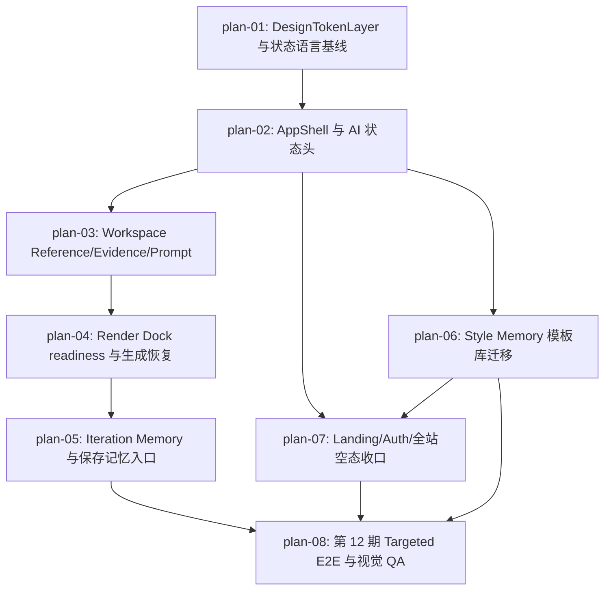

# 实现计划：全站 AI 优先界面风格复刻

## 1. 计划入口

第 12 期将现有 Visoryn 前端体验迁移为 AI 优先的 Evidence Workbench：保留上传、分析、生成、历史和模板 API，不新增后端业务能力；通过设计 token、共享壳层、状态语言、Evidence/Prompt/Render 视图模型和 Style Memory 页面表达，让用户在 Landing、Workspace、Style Memory 与状态页之间都能理解 AI 当前读到了什么、生成是否就绪以及下一步可以做什么。

- 来源架构：`docs/12-全站AI优先界面风格复刻/12-1-架构文档-全站AI优先界面风格复刻.md`
- 设计系统：`docs/design/DESIGN.md`
- 核心闭环：Reference -> Evidence -> Render
- 计划组织：功能维度，8 个 `plan-*.md` 文件
- 项目模式：brownfield；repo 扫描只用于确认现有路径、脚本、组件和测试入口，产品决策以第 12 期架构为准。
- 权威边界：README 只维护跨 PLAN 索引、验收追踪、执行拓扑和状态机；具体文件清单、实现规格、Task 列表和验证命令以各 `plan-*.md` 为准。

## 2. 执行拓扑



| 阶段 | 功能 | 目标 | 并行度 |
| --- | --- | --- | --- |
| Phase A | plan-01 | 设计规范、CSS token、状态 copy、StatePresenter 基线 | 1 |
| Phase B | plan-02, plan-03, plan-04 | 共享壳层和 Workspace Evidence/Prompt/Render 主闭环 | 1 |
| Phase C | plan-05, plan-06 | Iteration Memory 与 Style Memory 复用路径 | 2 |
| Phase D | plan-07, plan-08 | Landing/Auth/全站状态收口与 targeted E2E/视觉回归门 | 1 |

执行顺序：先完成 Phase A 的 token 与状态语言；再接 AppShell；随后按 Workspace 主链路完成 Evidence/Prompt 与 Render Dock；Style Memory 可在 Render Dock 完成后与 Iteration Memory 并行；Landing/Auth/全站状态收口在壳层和 Style Memory 语义稳定后执行；最后由 plan-08 汇总第 12 期 targeted E2E、视觉 QA 和旧体系残留清理。

## 3. 验收标准追踪矩阵

| AC-ID | 需求原文 | 架构承接 | 计划承接 | 验证方式 | 当前状态 |
| --- | --- | --- | --- | --- | --- |
| AC-01 | 团队开始实现任一页面视觉迁移前，能明确页面底色、面板层级、状态表达、证据关系、生成操作区、风格记忆卡片和主要控件反馈规则。 | DesignTokenLayer、StatePresenter/StatusLanguage、WorkspaceExperience、StyleMemoryExperience | plan-01 | plan-01 §5 设计契约验收、§6 验证命令；plan-08 §5 全站 token 回归 | done |
| AC-02 | 常规宽屏桌面打开工作台，页面包含工作区导航、AI 协作状态、参考画布、风格理解、提示与生成、近期迭代，并与目标图保持同一信息层级和视觉气质。 | AppShell、WorkspaceExperience | plan-02, plan-03, plan-05 | plan-02 §5 壳层验收；plan-03 §5 Workspace E2E；plan-05 §5 history E2E | in-progress |
| AC-03 | 参考图分析完成后，用户能看到主要风格信号、相关证据、可信度提示，并理解这些判断如何影响当前提示内容。 | WorkspaceExperience、Evidence/Prompt/Render 契约 | plan-03 | plan-03 §5 Evidence/Prompt 验收、§6 `e2e/workspace-ai-first-evidence.spec.ts` | in-progress |
| AC-04 | 准备生成时，用户能判断变量是否完整、风格信号是否足够、服务是否可用；不可生成时有可见原因和下一步行动。 | WorkspaceExperience、StatePresenter/StatusLanguage | plan-04 | plan-04 §5 Render Dock readiness 验收、§6 `e2e/workspace-ai-first-render-dock.spec.ts` | done |
| AC-05 | 至少完成一次生成后，用户可以比较、恢复、继续生成变体，或将满意方向保存为风格记忆。 | WorkspaceExperience | plan-05 | plan-05 §5 Iteration Memory 验收、§6 `e2e/workspace-ai-first-iteration-memory.spec.ts` | done |
| AC-06 | 进入风格记忆库后，每条记忆优先展示来源图、风格标签、变量和复用意图；空态或受限状态提供明确下一步。 | StyleMemoryExperience、StatePresenter/StatusLanguage | plan-06 | plan-06 §5 Style Memory 验收、§6 `e2e/ai-first-style-memory.spec.ts` | in-progress |
| AC-07 | 首页、工作台、风格记忆库、登录入口和状态页使用同一套 AI 优先视觉语言，导航选中、当前任务层级、状态语言和主要操作反馈保持一致。 | DesignTokenLayer、AppShell、LandingExperience、WorkspaceExperience、StyleMemoryExperience、StatePresenter/StatusLanguage | plan-01, plan-02, plan-07, plan-08 | plan-07 §5 全站收口验收；plan-08 §5 targeted E2E + 视觉回归 | in-progress |
| AC-08 | 分析失败、生成失败、未登录、服务不可用或风格记忆库为空时，页面保留上下文，说明原因，并提供可继续行动。 | StatePresenter/StatusLanguage、WorkspaceExperience、StyleMemoryExperience | plan-01, plan-04, plan-06, plan-07 | plan-01 §5 状态 copy 验收；plan-04/06/07 §5 降级验收；plan-08 §5 异常路径 E2E | in-progress |
| AC-09 | 首次进入首页或空态页面时，用户能判断 AI 如何理解参考图、拆解风格、辅助编辑并生成新结果，并有明确入口。 | LandingExperience、WorkspaceExperience、StyleMemoryExperience、StatePresenter/StatusLanguage | plan-03, plan-06, plan-07, plan-08 | plan-03/06/07 §5 空态验收；plan-08 §6 `e2e/ai-first-landing-states.spec.ts` | done |

## 4. 功能索引

| 功能 | 文件 | 依赖 | 交付边界 |
| --- | --- | --- | --- |
| plan-01 | `plan-01-DesignTokenLayer与状态语言基线.md` | 无 | 设计规范、CSS token、状态 copy 和 StatePresenter 契约稳定，可支撑后续页面迁移。 |
| plan-02 | `plan-02-AppShell与AI状态头.md` | plan-01 | Landing/Workspace/Style Memory 共享壳层、导航选中和 AI 协作状态头可复用。 |
| plan-03 | `plan-03-Workspace-Reference-Evidence-Prompt风格复刻.md` | plan-02 | 工作台参考画布、Style Intelligence、Prompt provenance 和空态/分析态完成 AI-first 表达。 |
| plan-04 | `plan-04-Render-Dock-readiness与生成恢复.md` | plan-03 | Render Dock 成为生成前判断唯一可见控制面，并保留生成失败恢复路径。 |
| plan-05 | `plan-05-Iteration-Memory与保存记忆入口.md` | plan-04 | 近期迭代支持比较、恢复、继续生成和保存为 Style Memory 的用户路径。 |
| plan-06 | `plan-06-Style-Memory模板库迁移.md` | plan-02 | `/workspace/templates` 从 Template Library 迁移为 Style Memory，API/代码命名仍保留 template。 |
| plan-07 | `plan-07-Landing-Auth与全站空态收口.md` | plan-02, plan-06 | Landing、登录入口、全站空态/失败态使用统一 AI-first 壳层和状态语言。 |
| plan-08 | `plan-08-第12期Targeted-E2E与视觉QA.md` | plan-05, plan-06, plan-07 | 第 12 期 targeted E2E、视觉回归、旧体系残留扫描和验收证据齐备。 |

## 5. 开发状态机

| FEAT | 当前步骤 | red_e2e | implement | green_e2e | review | 最近证据 | 阻塞原因 | 更新时间 |
| --- | --- | --- | --- | --- | --- | --- | --- | --- |
| plan-01 | done | done | done | done | done | `docs/12-全站AI优先界面风格复刻/12-2-实现计划-全站AI优先界面风格复刻/reviews/plan-01-review-20260705.md` | - | 2026-07-05 |
| plan-02 | done | done | done | done | done | `docs/12-全站AI优先界面风格复刻/12-2-实现计划-全站AI优先界面风格复刻/reviews/plan-02-review-20260705.md` | - | 2026-07-05 |
| plan-03 | done | done | done | done | done | `docs/12-全站AI优先界面风格复刻/12-2-实现计划-全站AI优先界面风格复刻/reviews/plan-03-review-20260705.md` | - | 2026-07-05 |
| plan-04 | done | done | done | done | done | `docs/12-全站AI优先界面风格复刻/12-2-实现计划-全站AI优先界面风格复刻/reviews/plan-04-review-20260706.md` | - | 2026-07-06 |
| plan-05 | done | done | done | done | done | `docs/12-全站AI优先界面风格复刻/12-2-实现计划-全站AI优先界面风格复刻/reviews/plan-05-review-20260706.md` | - | 2026-07-06 |
| plan-06 | done | done | done | done | done | `docs/12-全站AI优先界面风格复刻/12-2-实现计划-全站AI优先界面风格复刻/reviews/plan-06-review-20260707.md` | - | 2026-07-07 |
| plan-07 | done | done | done | done | done | `docs/12-全站AI优先界面风格复刻/12-2-实现计划-全站AI优先界面风格复刻/reviews/plan-07-review-20260707.md` | - | 2026-07-07 |
| plan-08 | done | done | done | done | done | `docs/12-全站AI优先界面风格复刻/12-2-实现计划-全站AI优先界面风格复刻/reviews/plan-08-review-20260707.md` | - | 2026-07-07 |

## 6. 全局护栏

- 不新增后端数据表、数据库字段、业务 API、AI Provider、队列、WebSocket、运营后台、付费/账号体系或大型 UI 框架。
- 上传、R2 直传、分析任务、生成任务、历史恢复、模板保存、模板复用、复制和删除的业务链路保持既有 API contract。
- Template Library 在 UI 中显示为 `Style Memory`，但 API、repository、hook 和 TypeScript 命名继续保留 `template`，除非另有独立架构变更。
- Evidence、Prompt provenance、Render readiness、Style Memory tags/reuse intent 均由前端从 `VisualRecipe`、prompt、variables、task status 和 template 字段派生，不新增后端 evidence/readiness/style-memory 端点。
- Prompt provenance、状态说明和 UI copy 只作前端展示，不拼入 AI system prompt；用户编辑 prompt、AI 输出说明和 negative prompt/constraints 必须在界面上保持可见边界。
- 失败、未登录、服务不可用、排队和空态不得清空有效工作台上下文；只有用户明确 Replace/reset 时才清除 reference/prompt/history/template 快照。
- Render Dock 不通过隐藏按钮处理不可生成状态；必须显示变量、风格信号、服务状态、busy state、禁用原因和下一步行动。
- 保留第 11 期三栏宽屏工作台心智；本期只保证窄屏不破版，不实施完整移动端 step workflow。
- UI 改动优先遵循 `docs/design/DESIGN.md` 和本期架构；若与旧文档或旧组件冲突，以 AI-first evidence 语义和 Precision Glass token 为准。
- 每个用户可观察功能执行时先补 red E2E 或组件测试证据，再实现到 green；完整 legacy `pnpm e2e` 不作为第 12 期唯一验收门。

## 7. 执行前置与全局验证

- 安装依赖：`pnpm install`
- 真实上传/分析/生成链路需要 `.env.local`、PostgreSQL、R2、Gemini/FAL 配置；targeted E2E 可继续使用现有 `e2e/helpers/mock-api.ts` 和 fixtures。
- 开发前先读取本 README、对应 `plan-XX-*.md`、源架构文档和 `docs/design/DESIGN.md`。
- 每个 plan 在 `ready-to-dev` 状态下先创建 red E2E/测试证据；实现完成后只推进到 `review`，`review -> done` 仅由 `task-review` 执行。
- 第 12 期验收以 targeted E2E/视觉回归为主，旧 09/10/11 期 legacy specs 若仍编码旧布局或旧文案，应在 plan-08 中迁移或隔离。

全局验证：

```bash
pnpm verify:acceptance
```

## 8. 未决策项与变更记录

| 类型 | 日期 | 内容 |
| --- | --- | --- |
| 未决策项 | 2026-07-05 | 无。源架构 frontmatter `open_questions: []`，本实现计划未新增阻塞问题。 |
| 新增 | 2026-07-05 | 基于第 12 期架构文档创建 8 个功能维度 plan 文件，覆盖 Phase A-D 与 AC-01..AC-09。 |
| 约束 | 2026-07-05 | 计划明确本期不新增后端表/API/Provider/队列/WebSocket；Style Memory 仅为现有 Template Library 的前端产品表达。 |
| 回归复核 | 2026-08-05 | `pnpm e2e:targeted` 结果为 35 passed / 12 failed；计划回退为 `in_review`，AC-02/03/06/07/08 恢复为 `in-progress`，详见 `docs/e2e/evidence/plan-12-acceptance-audit-red-20260805.md`。 |

<!-- 保留目录：reviews/。当 task-review、dev-plan-check 等开始运行时创建。 -->
