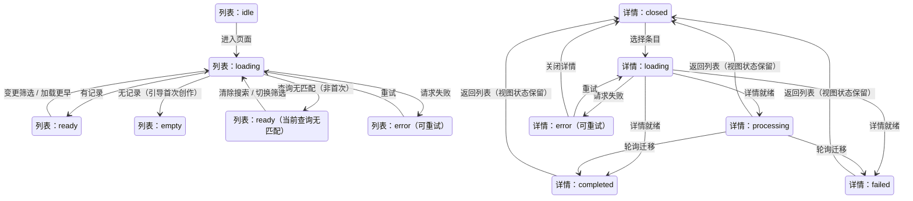
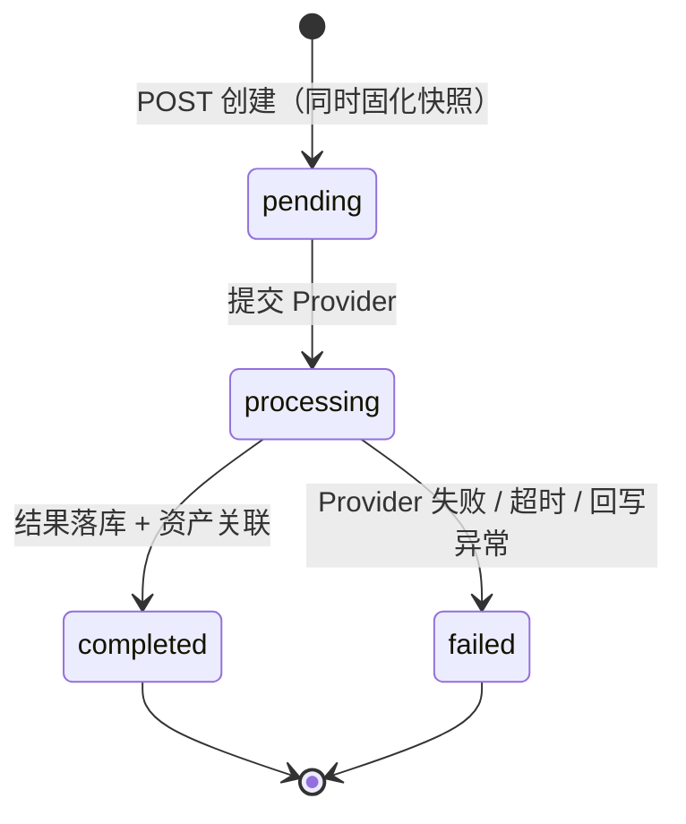

# 架构设计文档：Iteration Memory 闭环补全

_本文件只保留本期真正影响实现的架构决策、边界和契约；不新建数据表、不新增端点路径、不引入队列或推送，完整 DDL、目录树与环境变量清单不入正文。_

## 1. 系统摘要

本期把工作台近期迭代条背后的生成历史补全为完整 Iteration Memory：用户可按状态与提示检索全部生成尝试，在详情中看到固化于提交时刻的创作上下文快照，并通过"继续此方向"安全恢复或沉淀为 Style Memory。核心闭环锚点是 **Attempt -> Understand -> Continue**。架构选择"读模型扩展 + 提交时快照"：Iteration 即既有 `generation_tasks` 行，快照内嵌为列，既有端点参数化扩展，恢复为纯客户端动作。

## 2. 范围、非目标与成功标准

### 2.1 范围

- **数据层**：`generation_tasks` 内嵌 `recipe_snapshot`、`variables_snapshot`（jsonb，可空）与 `source_template_id`（可空外键）；`templates` 增加 `source_generation_task_id`（可空外键）；补用户维度的列表索引；产出 Drizzle 迁移。
- **读链路**：`GET /api/generation` 支持 `q`（提示词或来源 Style Memory 名称）与 `status`（all / processing / completed / failed）筛选，保持游标分页，条目返回状态、提示摘要与设置摘要；`GET /api/generation/[id]` 对全部状态返回详情（快照优先、活引用回退、缺失标记、已保存关联）。
- **写链路**：`POST /api/generation` 在创建时服务端固化上下文快照，并接受可选 `sourceTemplateId`；`POST /api/templates` 接受可选 `sourceGenerationTaskId` 建立来源迭代关联。
- **前端**：新页面 `/workspace/iterations`（列表 + 详情 master-detail、三态状态面、替换确认）；近期迭代条"查看全部"入口与左侧导航 Iterations 项；恢复守卫与恢复接线（复用既有历史恢复模式）；列表视图状态在 workspace 布局层保活。

### 2.2 明确不做

- 不新建 iterations 数据表、独立迭代服务或异步任务框架；不引入 WebSocket / SSE 推送，继续数据库轮询。
- 不纳入纯分析任务记录；不做批量下载、批量保存、删除、导出或历史保留期管理。
- 不新增自动相似度评分或渲染后 AI 审计（仅回放当时已存在的证据）。
- 不改动 Style Memory 资产模型本体，只增加来源迭代关联列。
- 不引入全文检索引擎或向量检索，首版使用数据库模糊匹配。
- 不做服务端工作区会话；工作区保护守卫在客户端完成。
- 不做移动端专属布局，沿用既有响应式规则。

### 2.3 成功标准

| 指标 | 首版目标 |
| --- | --- |
| 历史可达 | 任意状态的生成尝试都能从完整页面检索到；近期迭代条既有行为不回退。 |
| 上下文完整 | 新记录详情可完整还原提交时刻的证据、提示、变量、排除项与设置；旧记录缺失部分被显式标记而不阻断浏览。 |
| 安全继续 | 恢复动作不触发生成；存在不同未完成工作区时必须确认，取消后两侧状态均不变。 |
| 沉淀可用 | 成功迭代可保存为 Style Memory；重复保存呈现已保存状态而非重复资产。 |
| 状态可解释 | 空态、加载、未登录、列表服务不可用、单条不可用均有保留说明与下一步行动。 |
| 列表性能 | 列表接口 P95 < 500ms、详情 P95 < 300ms（单用户千条记录量级）。 |

### 2.4 验收标准承接矩阵

| AC-ID | PRD 原文摘要 | 承接模块 | 关键链路 / 状态 | 风险 / 降级说明 |
| --- | --- | --- | --- | --- |
| AC-01 | 完整 Iteration Memory 可达且覆盖全部生成状态 | 生成读链路 API、Iteration Memory 页面 | 近期条"查看全部" → `/workspace/iterations?status=all`；列表按创建时间倒序渲染 processing / completed / failed 三态条目 | 旧记录无快照也能返回条目；无结果图的状态一律状态面，不用占位假图 |
| AC-02 | 用户可以找到并连续浏览目标 Iteration | 页面与组件、视图状态 store | `q` + `status` 组合查询、游标加载较早、打开详情返回后视图状态保活；无匹配时保留搜索与筛选条件并提供清除 / 切换行动（"当前查询无匹配"态） | ILIKE 匹配在数据量增长后可能变慢，首版接受，预留 pg_trgm 演进 |
| AC-03 | 已完成详情提供可理解的完整创作上下文 | 详情接口、仓库快照回退逻辑 | 详情按"快照优先、活引用回退、缺失标记"组装证据/变量/来源图 | 旧记录缺失字段显式标记（对应 PRD 业务规则 9），不影响仍可用内容展示 |
| AC-04 | 进行中与失败记录提供确定感和恢复路径 | 详情面板三态变体、轮询编排 | processing 详情轮询单任务端点，完成后切换真实结果，且不提供生成 / 重复提交动作；failed 详情展示失败说明 + "修正并继续" | 轮询连续失败 3 次停轮询并给出重试，保留已展示内容 |
| AC-05 | 继续历史方向时完整恢复且不误覆盖当前工作区 | 恢复与视图状态模块 | 客户端守卫纯函数（三豁免规则）→ 替换确认对话框 → 应用恢复载荷回工作台 | 守卫在客户端判定，保守侧误弹确认可接受；判定规则集中单测覆盖 |
| AC-06 | 成功 Iteration 可以沉淀为 Style Memory | 入口与沉淀模块、templates 写链路 | completed 且有结果资产才开放入口；保存预填快照载荷 + `sourceGenerationTaskId`；详情反查已保存状态 | 保存流程异常（同名冲突等）沿用既有模板接口错误处理 |
| AC-07 | 空态、登录和服务异常不破坏现有上下文 | 状态面组件、API 错误码 | 401 → 登录引导且不清空本地工作台状态；5xx → 保留列表/详情已见内容 + 重试 | 降级链见 8.2，按用户体验影响从小到大排列 |

### 2.5 P1 预留

无。本期不保留半成品预留位或开关位；候选演进方向统一见 §10 架构结论，按使用反馈单独立项。

## 3. 用户流程与状态

### 3.1 主流程

用户在工作台近期迭代条点击"查看全部"进入 `/workspace/iterations`；页面默认展示最近的全部状态记录。用户通过提示关键词与状态筛选缩小范围，或继续加载较早记录；点击条目在页面内打开详情（列表上下文不丢失）。已完成详情并排展示参考图与结果、当时的证据与不变量、提示、变量、排除项和设置。用户点击"继续此方向"；若当前工作区存在不同的未完成内容，先弹出替换确认，取消则原地不动。确认后回到工作台，上下文恢复为该次迭代快照、原结果保留为上一轮；用户修改并主动提交后形成一条新的 Iteration，原记录不变。

### 3.2 关键分支

| 分支 | 入口 / 触发条件 | 架构处理方式 |
| --- | --- | --- |
| 任务仍在进行 | 打开 processing 记录 | 详情展示已保留上下文与当前阶段；前端 5s 轮询单任务端点；状态迁移后切换真实结果或失败态；详情不提供生成或重复提交动作 |
| 生成失败 | 打开 failed 记录 | 详情展示失败说明与保留上下文；"修正并继续"复用同一条恢复链路 |
| 替换确认 | 恢复时工作区有不同未完成内容 | 客户端守卫纯函数判定；对话框展示两侧提示摘要，确认后才应用恢复载荷 |
| 保存为 Style Memory | completed 且有结果资产的详情 | 预填快照载荷调用既有模板创建接口并携带来源迭代 id；已关联时展示已保存态与打开入口 |
| 单条详情不可用 | 详情请求 5xx / 404 | 列表、筛选与浏览位置保持不变，详情位给出重试或关闭 |
| 列表服务不可用 | 列表请求 5xx | 说明工作台不受影响，提供重试与返回工作台 |
| 未登录 | 无有效 session | 接口 401 → 页面登录引导；本地工作台状态不清理，登录后回原入口 |

### 3.3 状态机（页面视图状态）



关键规则：列表与详情是同一页面的两个正交状态（master-detail），详情关闭只重置详情态，不重置列表态；processing 详情在轮询迁移后原地切换状态面，不要求用户重新打开。搜索或筛选后无匹配进入"当前查询无匹配"态，保留搜索词与筛选条件，提供清除搜索或切换筛选行动（承接 AC-02 结果项）。已完成详情头部的"上一条 / 下一条"顺序切换由视图 store 的选中项与游标栈支撑，切换详情同样不重置列表。

## 4. 系统上下文与模块职责

### 4.1 系统上下文

```text
浏览器（工作台 / Iteration Memory 页面 / 近期迭代条）
  │  HTTP/JSON：列表与详情 DTO、错误码
  ▼
Next.js API 路由（/api/generation*、/api/templates*）
  │  SQL：新增聚合读路径（列表 / 详情联表）
  │      两处写入（提交时快照列、模板来源关联列）
  ▼
PostgreSQL（generation_tasks、analysis_tasks、assets、templates）
  ▲
  │  URL 引用（本期无新增二进制写入路径）
R2 对象存储（参考图 / 结果图）
```

本期不新增外部依赖与外部服务调用。变更集中在应用内部：浏览器 ↔ Next.js API 路由 ↔ PostgreSQL / R2 的既有边界不变；新增一条聚合读路径（迭代列表与详情查询）、两列提交时快照写入、一处模板来源关联写入。AI Provider、上传预签名、Webhook 均不在本期变更范围内。

### 4.2 模块职责

| 模块 | 职责 | 上游输入 | 下游输出 |
| --- | --- | --- | --- |
| 生成读链路 API（`src/app/api/generation/route.ts` GET、`src/app/api/generation/[id]/route.ts`） | 解析与校验 `q`/`status`/`cursor`/`pageSize`；组装全状态详情 DTO（快照优先、回退、缺失标记、已保存关联）；401/404/5xx 错误码 | 查询参数、路径 id、session | 列表条目 DTO、IterationDetail DTO |
| 生成任务仓库（`src/lib/repositories/generation-task-repository.ts`） | `listIterations`（状态过滤 + 提示词/模板名模糊匹配 + 名称联表 + keyset 游标）；`findIterationDetail`（单条联表聚合与快照回退算法）；创建任务时写入快照列与来源模板 id | API 参数、analysis task 行 | 领域对象与聚合行 |
| 生成写链路（`src/app/api/generation/route.ts` POST + schema 快照列） | 创建任务时服务端从所引用 analysis task 固化 `recipe_snapshot`/`variables_snapshot`；接受可选 `sourceTemplateId` 并校验归属 | 生成请求体（含可选 sourceTemplateId） | 新 Iteration 行 |
| Iteration Memory 页面与组件（`src/app/workspace/iterations/page.tsx`、`src/components/iterations/*`、`src/lib/iterations/view-model.ts`） | 列表 + 详情 master-detail 编排、检索/筛选/加载较早、三态详情变体、轮询编排、空态/加载/未登录/服务不可用状态面、DTO → 视图模型（摘要截断、状态文案、缺失标记） | 列表/详情 DTO、视图状态 store | 页面视图与用户回调 |
| 恢复与视图状态（`src/hooks/use-iteration-restore.ts`、`src/hooks/use-iteration-memory-view.ts`、workspace page 接线） | 守卫纯函数（三豁免判定）+ 恢复载荷应用到工作台状态并记录 `currentIterationId`；列表视图状态（搜索/筛选/选中/游标栈/滚动位置）在 workspace 布局层保活并同步 URL | 详情 DTO、工作台当前状态 | 工作台状态更新、视图状态 |
| 入口与沉淀（近期迭代条、`src/components/workspace/left-sidebar.tsx`、`src/app/api/templates/route.ts`） | 近期条"查看全部"链接与 Iterations 导航项；模板创建接口接受 `sourceGenerationTaskId`（校验归属与已完成且有结果资产） | 导航交互、保存请求 | 路由跳转、template 行 |

**关键交互链路（UI 组件细节）**：

- **替换确认对话框**：触发条件为守卫判定返回 `confirm`；状态变化为展示"当前方向摘要 / 将切换为摘要"两个文本槽；回调为"取消"（关闭对话框，详情与工作台零变更）与"继续切换"（应用恢复载荷并导航回 `/workspace`）。
- **已保存状态**：详情加载时由 `savedTemplate` 决定；有值时保存按钮替换为"已保存为 Style Memory + 打开"两个动作，"打开"跳转 `/workspace/templates` 并按 id 定位；无值且记录 completed 有结果时显示"保存为 Style Memory"，点击后进入预填保存流程（名称必填、内容与变量预填、确认后提交）。
- **近期迭代条**：继续调用列表接口默认参数（completed-only），条目 shape 为超集向后兼容；新增"查看全部"动作链接到 `/workspace/iterations?status=all`。

### 4.3 需要刻意避免的过度设计

- 不建 `/api/iterations` 并行资源或独立迭代读服务：与既有 generation 端点重复同一领域对象，带来口径漂移。
- 不引入推送（WebSocket/SSE）或任务队列：轮询已是全站模式，数据量级不需要。
- 不引入全文检索（pg_trgm / 向量）：千条量级模糊匹配足够。
- 不做迭代-模板多对多关联表：单一可空外键即可承接"已保存"语义。
- 不做服务端工作区会话：工作区未提交状态只存在于浏览器，守卫客户端化。
- 不做归档分层、软删除或保留期框架：PRD 明确不做管理类动作。

## 5. 关键架构决策（ADR）

### ADR-1：Iteration 复用 generation_tasks，不新建表
- **选择**：Iteration = `generation_tasks` 一行，状态沿用 pending/processing/completed/failed。
- **理由**：PRD 的 Iteration 定义就是"一次正式图片生成尝试"，与现有实体一一对应；新建表只会复制索引与关联，徒增迁移与同步成本。
- **风险与对策**：近期条 completed-only 的既有行为通过查询参数默认值保持，不在数据层分裂口径。

### ADR-2：提交时服务端固化上下文快照
- **选择**：`POST /api/generation` 创建任务时，服务端从所引用 analysis task 固化 `recipe_snapshot` 与 `variables_snapshot` 到本行。
- **理由**：PRD 要求详情呈现"当时"的证据与变量，活引用会随后续分析漂移；快照内嵌主任务表符合"单一场景不建旁表"原则，且服务端固化不可被客户端篡改。
- **风险与对策**：存量旧行快照为空 → 详情回退活引用并显式标记缺失（承接 PRD 业务规则 9）。

### ADR-3：扩展现有端点，不新建 /api/iterations
- **选择**：`GET /api/generation` 增加 `q`/`status` 参数与增补字段；`GET /api/generation/[id]` 扩展为全状态详情；`POST /api/templates` 增加来源迭代字段。
- **理由**：同一领域对象维护两条读路径会漂移；现有近期条调用方保持默认参数即向后兼容，端点总数不增加。
- **演进余地**：若迭代读模型复杂化（聚合、标签、推荐），再评估拆独立资源。

### ADR-4："继续此方向"为纯客户端恢复
- **选择**：恢复 = 客户端把详情快照载荷写回工作台状态；替换守卫在客户端比较当前工作区与目标；服务端零新写路径。
- **理由**：工作区未提交状态只存在于浏览器，服务端无从判定"未完成编辑"；再次生成复用既有 POST（analysisTaskId 不变、提示重写），天然形成新 Iteration，与 PRD 主旅程第 10 步一致。
- **风险与对策**：守卫判定规则收敛为单一纯函数并覆盖三豁免（工作区为空 / 已是同一 Iteration / 无不同未完成编辑）的单测。

### ADR-5：已保存状态用 templates 反向关联
- **选择**：`templates.source_generation_task_id` 可空列 + 索引；详情按该列反查（取最新一条）得到已保存状态。
- **理由**：关联的写入点唯一（保存动作创建模板时）；容忍 1:N（用户在 Style Memory 内复制产生新资产）而 UI 只需呈现"已保存 + 打开最新"。
- **风险与对策**：模板被删除时自然回到未保存态，无需双写清理或联动逻辑。

### ADR-6：列表视图状态在 workspace 布局层保活并同步 URL
- **选择**：搜索词、筛选、选中项、游标栈与滚动位置存放在挂载于 workspace layout 的客户端 store；`q`/`status` 同步到 URL 查询参数。
- **理由**：PRD 要求从详情返回、从工作台往返后列表视图不丢；layout 层 store 的生命周期覆盖 `/workspace/*` 路由切换；URL 同步支持直达与回退。
- **风险与对策**：store 消费范围收敛到迭代页面，避免工作台主页面无关重渲染。

### ADR-7：进行中轮询复用既有单任务端点
- **选择**：详情打开且状态为 processing 时 5s 轮询 `GET /api/generation/[id]`；列表当前窗口含 processing 条目时 10s 低频重拉。
- **理由**：复用全站轮询模式与既有超时/失败处理，不引入推送基础设施；低频列表刷新满足"完成后状态面替换为真实结果"。
- **演进余地**：任务量级上升后可升级为 SSE 增量更新。

### 5.8 待确认问题

无。关键不确定点均已在 ADR-2（存量回退）、ADR-4（守卫纯函数）、ADR-6（store 生命周期）中给出决策。

## 6. 运行链路

### 6.1 进入与检索（列表读链路）

1. 用户从近期迭代条"查看全部"或左侧导航进入 `/workspace/iterations`。
2. 页面以视图 store 初值为查询参数（URL `q`/`status` 优先于 store 记忆值；页面级默认 `status=all`，满足 PRD"默认看到全部生成尝试"，API 层默认 `completed` 仅服务于近期迭代条兼容），请求 `GET /api/generation?q=&status=&cursor=&pageSize=20`。
3. API 校验：`q` trim 后 ≤ 100 字符；`status ∈ {all, processing, completed, failed}`，默认 `completed`（近期条兼容）；`pageSize` clamp 至 [1, 50]。
4. 仓库 `listIterations` 执行：`WHERE user_id = :userId` + 状态条件（`all` 不加）+ `(prompt_snapshot ILIKE '%q%' OR templates.name ILIKE '%q%')`（LEFT JOIN templates ON generation_tasks.source_template_id = templates.id），`ORDER BY created_at DESC, id DESC`，keyset 游标，`LIMIT pageSize + 1` 判断还有更早记录。
5. 返回条目 DTO（id / status / promptSummary / resultFileUrl | null / params / createdAt）与 nextCursor。
6. 前端追加条目并更新"继续浏览较早记录"动作的可用性；视图 store 记录游标栈。

这条链路的实现原则：

- `promptSummary` 由服务端截断为前 120 字符，列表不传输全文。
- 匹配使用大小写不敏感的 ILIKE；`q` 为空串时视为无搜索条件。
- 状态过滤中 `pending` 与 `processing` 在 SQL 层合并为 `IN ('pending','processing')` 映射到展示态 processing。
- 性能依托新增索引 `idx_generation_tasks_user_created (user_id, created_at DESC, id DESC)`。

### 6.2 打开详情（全状态详情链路）

1. 用户点击列表条目；视图 store 记录 `selectedId`，列表 DOM 与滚动位置不动。
2. 前端请求 `GET /api/generation/[id]`；API 校验 session 与记录归属。
3. 仓库 `findIterationDetail` 单条联表：主行 + analysis task（活引用）+ 结果资产 + 来源参考图资产 + 来源模板名 + 已保存模板（`templates.source_generation_task_id = id` 取最新一条）。
4. 上下文组装算法（显式声明，逐字段）：`recipe = recipe_snapshot ?? analysis.recipe`，来源标记为 `snapshot | fallback`，两者皆无则 `missing`；`variables` 同算法；`sourceImageUrl` 取 analysis 关联参考图资产 URL，取不到则为 `null`（前端标记来源图缺失）。
5. completed 返回 `resultFileUrl`；processing / failed 返回 `resultFileUrl: null` 与 `errorMessage`。
6. 前端按状态渲染详情变体；processing 进入轮询（6.5）。

这条链路的实现原则：

- 详情一次请求返回全部上下文，不拆多个子请求。
- 组装算法集中在仓库单一函数，DTO 的来源标记字段（`recipeSource` 等）直接驱动前端缺失提示。
- 非 completed 状态同样返回提示、排除项、设置与来源图，支撑"已保留上下文"的确定感。

### 6.3 继续此方向（恢复链路，纯客户端）

1. 用户在详情点击"继续此方向"（failed 详情为"修正并继续"，同一条链路）。
2. 守卫纯函数 `computeRestoreGuard(currentWorkspace, targetDetail)` 判定，三豁免任一成立则直接继续：当前工作区为空；`currentIterationId === targetDetail.id`（已是同一 Iteration）；当前工作区内容与目标快照一致（提示、排除项、参数逐字段相等）。
3. 判定为 `confirm` 时弹出替换确认对话框，展示当前方向与目标方向的提示摘要；取消 → 关闭对话框，详情与工作台零变更。
4. 确认后应用恢复载荷：提示文本、排除项、参数、变量、配方视图、来源图 URL、analysisTaskId、上一轮结果（`resultFileUrl`）逐字段写入工作台状态，并记录 `currentIterationId = targetDetail.id`。
5. 导航回 `/workspace`；不发出任何生成或写请求。
6. 用户编辑并主动点击生成 → 走既有 `POST /api/generation`（服务端固化新快照）→ 形成新的 Iteration，原记录不动。

这条链路的实现原则：

- 守卫为纯函数（输入两边状态、输出 direct/confirm），单测覆盖三豁免与确认分支。
- 恢复载荷字段与详情 DTO 一一对应，不在前端重算或补全。
- 恢复动作幂等：对同一目标重复恢复不产生副作用。
- 守卫读取与恢复写入经既有工作台本地持久化通道（sessionStorage）完成跨路由传递；应用恢复载荷后必须同步 flush 再导航回 `/workspace`，避免工作台挂载时读到防抖写入前的旧快照（带入 create-dev-plan 作为实现注意事项）。

### 6.4 保存为 Style Memory（沉淀链路）

1. 详情为 completed 且 `resultAssetId` 非空时显示"保存为 Style Memory"；`savedTemplate` 已有值时替换为"已保存 + 打开"状态。
2. 保存对话框预填：`content = promptSnapshot`、`variables = variables`（详情值）、`sourceAssetId = detail.sourceAssetId`（取自所引用 analysis task 的来源资产；既有模板接口仅接受数据库资产 id）、`sourceGenerationTaskId =` 迭代 id；名称由用户必填。`sourceAssetId` 缺失（旧记录来源资产不可用）时禁用保存入口并说明来源缺失。
3. 提交 `POST /api/templates`：沿用既有同名冲突 409、参数校验与限流；新增校验 `sourceGenerationTaskId` 归属当前用户且状态 completed 且有结果资产。
4. 成功后详情局部刷新为已保存态；失败沿用既有错误呈现，不影响已展示内容。

这条链路的实现原则：

- 保存完全复用既有模板接口与错误处理，本期只加一个可空关联字段。
- 不复制结果图资产；Style Memory 继续只持有来源图引用。
- "来源资产缺失时禁用保存入口"是本架构的防御性口径：既有模板接口仅接受数据库资产 id，且分析来源列非空、实际罕见；验收与开发交接按此口径执行，不回溯 PRD。

### 6.5 进行中轮询更新

1. 详情状态为 processing 时每 5s 轮询单任务端点；列表当前窗口含 processing 条目时每 10s 重拉当前查询。
2. 轮询观测到状态迁移（completed / failed）→ 前端原地替换状态面并停止对应轮询。
3. 轮询连续失败 3 次 → 停止轮询，展示"更新暂不可用 + 重试"，保留已展示内容。

## 7. 领域对象与关键契约

### 7.1 核心对象

| 对象 | Source of Truth | Owner | 用途 |
| --- | --- | --- | --- |
| Iteration（generation_tasks 行） | PostgreSQL | generation-task-repository | 一次生成尝试的全状态记录与提交时快照 |
| 列表条目 DTO / IterationDetail DTO | API 组装层 | 生成读链路 API | 列表与详情渲染载荷，含缺失来源标记 |
| Style Memory（templates 行） | PostgreSQL | template-repository | 可复用方向资产；新增来源迭代关联 |
| 列表视图状态 | 浏览器 | use-iteration-memory-view store | 搜索 / 筛选 / 选中 / 游标栈 / 滚动位置保活 |
| 工作区未提交状态 | 浏览器 | workspace page 状态 | 守卫比较对象与恢复目标 |

### 7.2 推荐最小 Schema

```ts
/** 列表条目（GET /api/generation 增补 shape） */
interface IterationListItem {
  id: string;
  status: "processing" | "completed" | "failed"; // pending 归并展示为 processing
  promptSummary: string;        // 服务端截断前 120 字符
  resultFileUrl: string | null; // 仅 completed 且资产可取
  params: { aspectRatio: string; quality: string };
  createdAt: string;            // ISO 8601
}

/** 详情（GET /api/generation/[id] 扩展 shape） */
interface IterationDetail {
  id: string;
  analysisTaskId: string;
  status: "processing" | "completed" | "failed";
  promptSnapshot: string;
  negativePromptSnapshot: string;
  params: { aspectRatio: string; quality: string };
  modelName: string;
  resultFileUrl: string | null;
  errorMessage: string | null;
  recipe: StoredVisualRecipe | null;
  recipeSource: "snapshot" | "fallback" | "missing";
  variables: TemplateVariable[];
  variablesSource: "snapshot" | "fallback" | "missing";
  sourceImageUrl: string | null; // null 即来源图缺失标记
  sourceAssetId: string | null;  // 所引用 analysis task 的来源资产 id；保存预填依赖
  sourceTemplateName: string | null;
  savedTemplate: { id: string; name: string } | null;
  createdAt: string;
  updatedAt: string;
}
```

### 7.3 API 边界

| 接口 | 方法 | 用途 | 变更与字段来源 |
| --- | --- | --- | --- |
| `/api/generation` | GET | 迭代列表（近期条与完整页面共用） | 新增 `q`（user_input，≤100 字符）、`status`（user_input，默认 completed 兼容近期条）；响应条目增补 `status`/`promptSummary`（derived，服务端截断）/`params`（system_generated），旧字段保留 |
| `/api/generation` | POST | 创建生成任务（新 Iteration） | 请求新增可选 `sourceTemplateId`（frontend_computed：工作台当前应用的 Style Memory id）；服务端固化 `recipe_snapshot`/`variables_snapshot`（system_generated：读取所引用 analysis task） |
| `/api/generation/[id]` | GET | 全状态迭代详情 | 响应扩展为 7.2 的 IterationDetail（含快照来源标记与已保存关联）；既有轮询消费方向后兼容 |
| `/api/templates` | POST | 保存 Style Memory | 请求新增可选 `sourceGenerationTaskId`（frontend_computed：当前迭代 id）；服务端校验归属与 completed + resultAssetId |
| `/api/templates/[id]` | GET | 打开对应记忆 | 无变更，复用 |

认证口径：上表全部端点沿用 Auth.js session 认证与 userId 归属校验（统一策略见 §8.3）；除近期迭代条以默认参数调用外，无匿名访问路径。

### 7.4 状态流转（后端任务，沿用既有）



关键规则：状态机与迁移触发点（同步回写、Webhook、超时定时器）全部沿用既有实现，本期不改；展示层把 `pending` 归并为"进行中"。

### 7.5 数据边界

- **PostgreSQL**：迭代记录与提交时快照、Style Memory 资产与来源关联的唯一事实源。
- **R2**：参考图与结果图二进制；数据库只持 URL 引用，本期不产生新二进制写入路径。
- **浏览器**：工作区未提交状态与列表视图状态，不落库、不同步服务端。

### 7.6 命名与标识规则

- ID：沿用 26 位 ULID，无前缀体系。
- 术语映射：UI 文案统一"Iteration Memory / 迭代"；接口与表沿用 `generation`/`templates` 命名，不出现 `iteration_tasks` 之类新名；PRD"排除项" = `negativePromptSnapshot`；PRD"生成设置" = `params` + `modelName`；PRD"风格证据与不变量" = `recipe`（快照优先）。
- 数据库列 snake_case：`recipe_snapshot`、`variables_snapshot`、`source_template_id`、`source_generation_task_id`。
- 状态枚举：数据库四值（pending/processing/completed/failed）不变；DTO 三值（pending 归并 processing）。

## 8. 非功能需求、风险与运行策略

### 8.1 性能与吞吐量目标

| 指标 | 目标 | 预期并发 |
| --- | --- | --- |
| 列表接口延迟 | P95 < 500ms（单用户 ≤ 1000 条） | 单用户串行检索，无列表并发假设 |
| 详情接口延迟 | P95 < 300ms | 详情 + 5s 轮询 |
| 轮询放大控制 | 单会话并发轮询 ≤ 2（详情 + 列表窗口） | 首版无多端同步假设 |

### 8.2 可靠性、错误处理与降级策略

- 错误响应沿用 `{ error, code, retryable }` 结构；401 触发登录引导且不清空本地工作台状态。
- 降级链（按用户体验影响从小到大）：
  1. 详情图片加载失败 → 图片位占位与说明，其余上下文照常。
  2. 快照缺失（存量旧记录）→ 活引用回退 + 显式缺失标记。
  3. 单条详情 5xx/404 → 列表与视图状态不动，详情位重试或关闭。
  4. 列表 5xx → 说明工作台不受影响，重试或返回工作台。
  5. 数据库长时间不可用 → 进入全站既有降级，本期不新增处理。
- 轮询连续失败 3 次自动停止并保留最后已知内容。

### 8.3 安全与反滥用策略

| 项目 | 首版策略 |
| --- | --- |
| 认证与归属 | 沿用 Auth.js session；迭代读写与模板关联写入均校验 userId 归属 |
| 输入面收敛 | `q` ≤ 100 字符、`status` 白名单、`pageSize` clamp [1,50]、`sourceTemplateId`/`sourceGenerationTaskId` 服务端归属校验 |
| Prompt 注入 | 本期不新增 LLM 调用；快照仅存储与回显，前端按纯文本渲染 |
| 内容安全 | 不新增生成能力，沿用既有 Provider 侧策略 |
| Rate Limit | 保存动作沿用模板接口既有 30 次/小时/IP；读接口不设独立限流（登录态 + 分页兜底） |
| API Key | 无新增密钥，既有密钥仅服务端持有 |

### 8.4 成本控制预期

| 模块 | 预估单次成本 | 首版控制策略 |
| --- | --- | --- |
| 列表 / 详情查询 | 数据库读，无外部按量计费 | pageSize ≤ 50、轮询低频、单联表查询避免 N+1 |
| 生成 / 保存 | 既有链路，本期无增量 | 不变 |

### 8.5 可观测性

- 沿用结构化 JSON 日志，新增事件：`iteration_list_queried`（duration / itemCount / hasQ / statusFilter）、`iteration_detail_queried`（status / recipeSource / hasSavedTemplate）。
- 不新增告警与指标面板；异常经既有 5xx 日志通道暴露。

### 8.6 主要风险

| 风险 | 影响 | 缓解方式 |
| --- | --- | --- |
| ILIKE 搜索随数据量增长变慢 | 列表延迟上升 | 首版量级可接受；演进路径为 pg_trgm GIN 索引 |
| 存量记录无快照，详情不完整 | AC-03 体验打折 | 活引用回退 + 显式缺失标记，产品行为已在 PRD 规则 9 定义 |
| 客户端守卫误判 | 误弹确认或漏弹确认 | 判定收敛为纯函数 + 三豁免单测；保守侧（多弹确认）可接受 |
| 详情与列表轮询叠加造成读放大 | 数据库压力 | 仅含 processing 时启用列表重拉，10s 低频，单会话 ≤ 2 并发 |
| 模板名搜索依赖 sourceTemplateId 传递 | 部分记录无法按名搜索 | 仅"从 Style Memory 进入工作台后生成"的记录携带该字段，与 PRD 口径一致；在交接文档中明示 |

## 9. 实施建议与技术选型

### Phase A：数据与读链路（后端）

1. `src/lib/db/schema.ts` — `generation_tasks` 新增 `recipe_snapshot`/`variables_snapshot`（jsonb 可空）、`source_template_id`（varchar 26 可空外键）；`templates` 新增 `source_generation_task_id`（可空外键 + 索引）；新增 `idx_generation_tasks_user_created`。
2. `drizzle/` — `pnpm db:generate` 生成迁移，人工审查后本地 `db:push` 验证。
3. `src/types/models.ts` — 新增 `IterationListItem`/`IterationDetail` 类型与状态归并映射。
4. `src/lib/repositories/generation-task-repository.ts` — 实现 `listIterations`（q/status/游标/名称联表）与 `findIterationDetail`（快照回退算法、已保存关联）；`createGenerationTask` 写入快照列与 `sourceTemplateId`。
5. `src/app/api/generation/route.ts` — GET 参数扩展与条目 DTO；POST 接受 `sourceTemplateId` 并固化快照。
6. `src/app/api/generation/[id]/route.ts` — 输出全状态 IterationDetail。
7. `src/app/api/templates/route.ts` — 接受并校验 `sourceGenerationTaskId`。
8. 相邻单测：仓库（快照回退、搜索命中、游标、归属隔离）、路由（参数校验、401、默认参数兼容）。

**验证目标**：`pnpm verify:fast` 绿；近期迭代条以默认参数调用列表接口行为不变。

### Phase B：Iteration Memory 页面

1. `src/app/workspace/iterations/page.tsx` — 列表 + 详情 master-detail、检索/筛选/加载较早、轮询编排、未登录/空态/搜索无结果/加载/错误状态面。
2. `src/components/iterations/iteration-list.tsx`、`iteration-list-item.tsx`（三态条目）、`iteration-detail-panel.tsx`（completed/processing/failed 变体）、`iteration-state-faces.tsx`。
3. `src/lib/iterations/view-model.ts` — DTO → 视图模型（摘要、状态文案、缺失标记）。
4. `src/hooks/use-iteration-memory-view.ts` — 视图状态 store，挂载 workspace layout。
5. 组件测试 + targeted E2E：三态列表、搜索筛选组合、详情返回保位、未登录与服务异常面。

**验证目标**：AC-01/02/03/04/07 前端可走通；新增 targeted spec 纳入 `pnpm e2e:targeted`。

### Phase C：继续创作与沉淀闭环

1. `src/hooks/use-iteration-restore.ts` — 守卫纯函数与恢复载荷应用；workspace page 接线（`currentIterationId`、上一轮结果展示）。
2. `src/components/iterations/replace-confirm-dialog.tsx` — 替换确认（两侧摘要、取消/继续切换）。
3. 保存入口、已保存态与 `/workspace/templates` 打开定位。
4. 近期迭代条"查看全部"动作与 `src/components/workspace/left-sidebar.tsx` Iterations 导航项。
5. E2E：AC-05 恢复与守卫（三豁免 + 确认分支）、AC-06 保存闭环与重复保存状态。

**验证目标**：`pnpm verify:fast` + targeted E2E 绿；2.4 承接矩阵每条 AC 可指到实现与测试。

## 10. 架构结论

- **核心判断**：Iteration Memory 是既有生成历史的"完整读模型 + 提交时快照 + 客户端恢复"，不是新子系统。零新增外部依赖、零新增数据表、零新增端点路径，变更收敛在两列快照、两处可空关联、既有端点的参数化扩展与一个新前端页面。
- **设计原则**：读扩展优于资源复制；快照内嵌主表优于旁表；守卫客户端化优于服务端会话；轮询复用优于引入推送。
- **演进方向**：搜索升级 pg_trgm、进行中更新升级推送、迭代级标签与批量操作、来源图缺失的资产修复流程——均在本期"明确不做"之外，按使用反馈单独立项。
