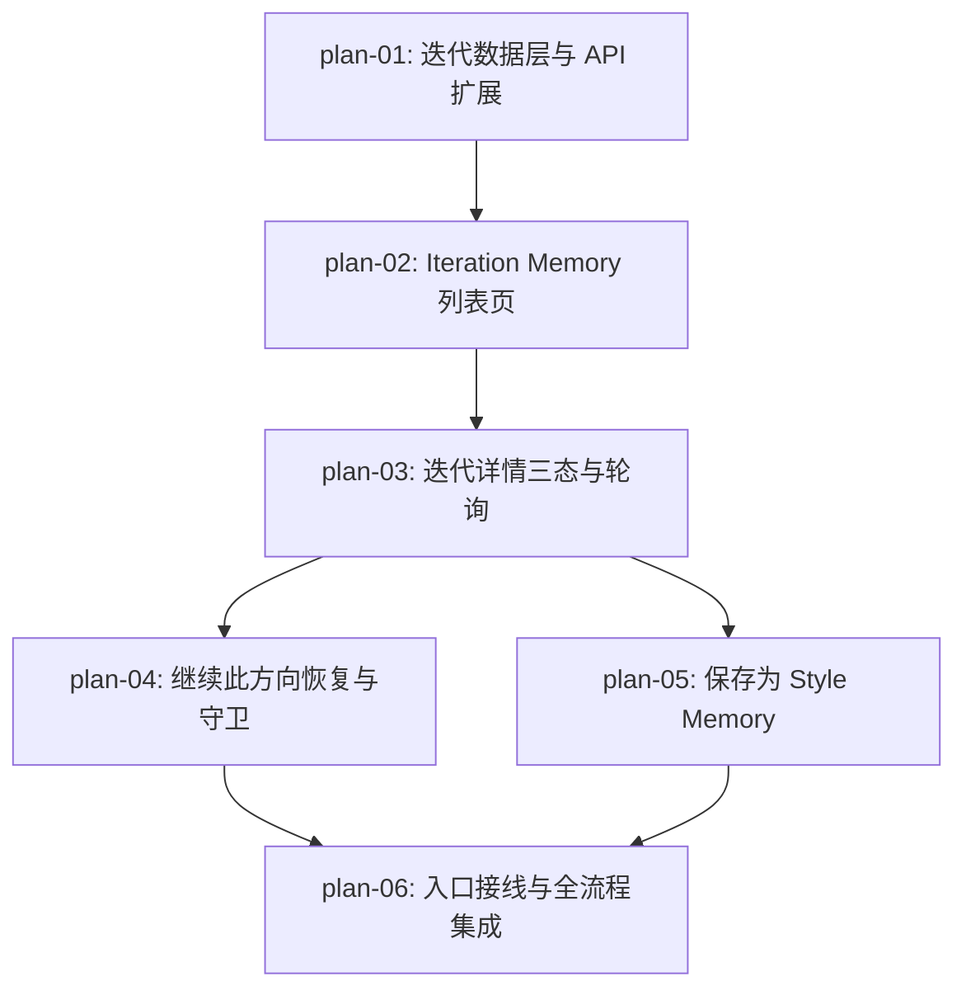

# 实现计划：Iteration Memory 闭环补全

## 1. 计划入口

本期把工作台近期迭代条背后的生成历史补全为完整 Iteration Memory：用户可按状态与提示检索全部生成尝试（进行中 / 已完成 / 失败），在详情中看到固化于提交时刻的创作上下文快照，并通过"继续此方向"安全恢复到工作台或沉淀为 Style Memory。架构定位为"读模型扩展 + 提交时快照 + 客户端恢复"：零新增数据表、零新增端点路径、零新增外部依赖。

- 来源架构：`docs/13-Iteration-Memory闭环补全/13-1-架构文档-Iteration-Memory闭环补全.md`
- 设计系统：`docs/design/DESIGN.md`
- 核心闭环：Attempt -> Understand -> Continue
- 计划组织：功能维度，6 个 PLAN 文件
- 权威边界：README 只维护跨 PLAN 索引、验收追踪、执行拓扑和状态机；具体实现以各 `plan-*.md` 为准。

## 2. 执行拓扑



| 阶段 | 功能 | 目标 | 并行度 |
| --- | --- | --- | --- |
| 1 | plan-01 | 数据层快照列、迭代列表/详情读接口、写链路扩展全部就绪 | 1 |
| 2 | plan-02 | `/workspace/iterations` 列表页可用（检索/筛选/加载较早/状态面） | 1 |
| 3 | plan-03 | 三态详情面板 + 进行中轮询 + master-detail 编排 | 1 |
| 4 | plan-04, plan-05 | 恢复守卫与工作台接线、保存 Style Memory（两者可并行） | 2 |
| 5 | plan-06 | 近期条/导航入口接线 + 全流程集成回归 | 1 |

执行顺序：`[["plan-01"], ["plan-02"], ["plan-03"], ["plan-04", "plan-05"], ["plan-06"]]`。plan-04 与 plan-05 都只消费 plan-03 的详情面板插槽，可并行开发；两者共同修改的唯一文件是 `src/components/iterations/iteration-detail-panel.tsx`（分别填充 primaryActions 与 secondaryActions 插槽，改动区不重叠），该文件的改动需串行合入（先 plan-04 后 plan-05）。

## 3. 验收标准追踪矩阵

| AC-ID | 需求原文 | 架构承接 | 计划承接 | 验证方式 | 当前状态 |
| --- | --- | --- | --- | --- | --- |
| AC-01 | 完整 Iteration Memory 可达且覆盖全部生成状态 | 生成读链路 API、Iteration Memory 页面 | plan-01, plan-02, plan-06 | plan-01 §5 后端验收（全状态列表 + 兼容断言）；plan-02 §5 列表 E2E（三态渲染、默认 all）；plan-06 §5 入口可达集成回归 | done |
| AC-02 | 用户可以找到并连续浏览目标 Iteration | 页面与组件、视图状态 store、生成写链路（来源模板标记） | plan-01, plan-02, plan-04 | plan-01 §5（q 命中提示词或来源模板名）；plan-02 §5（搜索/筛选组合、加载较早、返回保位、无匹配行动）；plan-04 §5（生成请求携带 sourceTemplateId 断言，保障记录可按模板名搜索） | done |
| AC-03 | 已完成详情提供可理解的完整创作上下文 | 详情接口、仓库快照回退逻辑 | plan-01, plan-03 | plan-01 §5（快照优先/回退/缺失标记）；plan-03 §5 详情 E2E（并排展示 + 分区块 + 缺失提示） | done |
| AC-04 | 进行中与失败记录提供确定感和恢复路径 | 详情面板三态变体、轮询编排 | plan-03, plan-04 | plan-03 §5（三态详情、无重复提交入口、轮询切换 E2E）；plan-04 §5（"修正并继续"动作行为 E2E） | done |
| AC-05 | 继续历史方向时完整恢复且不误覆盖当前工作区 | 恢复与视图状态模块 | plan-04 | plan-04 §5（守卫纯函数单测 + 恢复/取消/新迭代 E2E） | done |
| AC-06 | 成功 Iteration 可以沉淀为 Style Memory | 入口与沉淀模块、templates 写链路 | plan-01, plan-05 | plan-01 §5（sourceGenerationTaskId 校验）；plan-05 §5（保存/已保存态/打开定位 E2E） | done |
| AC-07 | 空态、登录和服务异常不破坏现有上下文 | 状态面组件、API 错误码 | plan-02, plan-03, plan-06 | plan-02 §5（空态/未登录/列表 5xx E2E）；plan-03 §5（单条详情失败保留列表可重试）；plan-06 §5 集成回归 | done |

## 4. 功能索引

| 功能 | 文件 | 依赖 | 交付边界 |
| --- | --- | --- | --- |
| plan-01 | `plan-01-迭代数据层与API扩展.md` | 无 | 快照列迁移 + 列表/详情读接口 + 生成/模板写链路扩展，近期条兼容不变 |
| plan-02 | `plan-02-IterationMemory列表页.md` | plan-01 | 列表页（三态条目、搜索筛选、加载较早、五种状态面、视图保活） |
| plan-03 | `plan-03-迭代详情三态与轮询.md` | plan-02 | 三态详情面板、进行中轮询、master-detail 编排与上一条/下一条 |
| plan-04 | `plan-04-继续此方向恢复与守卫.md` | plan-03 | 恢复守卫纯函数、替换确认对话框、工作台恢复接线（flush 后导航） |
| plan-05 | `plan-05-保存为StyleMemory与已保存态.md` | plan-01, plan-03 | 保存预填流程、已保存状态、打开定位到 Style Memory 页 |
| plan-06 | `plan-06-入口接线与全流程集成.md` | plan-04, plan-05 | 近期条"查看全部"、左侧导航项、US-01~10 全流程集成回归 |

## 5. 开发状态机

| FEAT | 当前步骤 | red_e2e | implement | green_e2e | review | 最近证据 | 阻塞原因 | 更新时间 |
| --- | --- | --- | --- | --- | --- | --- | --- | --- |
| plan-01 | done | waived | done | waived | done | `reviews/plan-01-review-2026-08-17.md` | E2E 不适用（纯后端）：red/green 由相邻 Vitest 承载，证据 docs/e2e/evidence/plan-01-e2e-*.md | 2026-08-17 |
| plan-02 | done | done | done | done | done | `reviews/plan-02-review-2026-08-17.md` | - | 2026-08-17 |
| plan-03 | done | done | done | done | done | `reviews/plan-03-review-2026-08-17.md` | - | 2026-08-17 |
| plan-04 | done | done | done | done | done | `reviews/plan-04-review-2026-08-17.md` | - | 2026-08-17 |
| plan-05 | done | done | done | done | done | `reviews/plan-05-review-2026-08-17.md` | - | 2026-08-17 |
| plan-06 | done | done | done | done | done | `reviews/plan-06-review-2026-08-17.md` | - | 2026-08-17 |

## 6. 全局护栏

- 遵循 `AGENTS.md` 的变更-验证路由：每个功能完成后先跑其 §6 验证命令，再进 `review`；跨切面前端功能交付前跑 `pnpm verify:fast`。
- E2E-TDD 强制：plan-02 ~ plan-06 在 `ready-to-dev` 前先产出 red E2E（预期失败证据），实现后转 green；plan-01 以相邻路由/仓库测试为直接质量门（E2E 不适用理由见其 §8）。
- 不修改架构"明确不做"清单内的内容：不新增数据表、端点路径、队列、推送、全文检索引擎；不改动 AI Provider、上传预签名、Webhook、分析链路。
- 每个功能只允许修改其文件清单内的文件；确需越界时先在该功能 `风险与边界 > 允许修改的额外文件` 声明并说明原因。`package.json`（含 `e2e:targeted` 套件清单）仅 plan-06 允许修改。
- 状态术语与 UI 文案遵循架构 §7.6 术语映射与 `docs/design/DESIGN.md`；错误文案遵循 PRD"发生了什么 / 保留了什么 / 下一步"三段式。
- 近期迭代条既有行为（completed-only 默认参数）与既有 spec（`e2e/workspace-history-strip.spec.ts`、`e2e/workspace-ai-first-iteration-memory.spec.ts`）不得回归。
- 功能真实状态以 `plan-*.md` frontmatter 为准；本表仅为流程展示缓存。

## 7. 执行前置与全局验证

- 本地工具链就绪：`pnpm doctor` 通过；`pnpm install --frozen-lockfile` 已执行。
- 本地 PostgreSQL：`pnpm db:up` 后 `pnpm db:push` 应用 plan-01 迁移。
- 浏览器测试：`pnpm exec playwright install chromium` 已执行；E2E 使用 mocked API（`e2e/helpers/mock-api.ts`），不需要 live provider 凭证。
- 单功能 spec 运行方式：`pnpm e2e -- e2e/<spec>.spec.ts --project=workspace`。

全局验证：

```bash
pnpm verify:fast
pnpm e2e -- e2e/workspace-iteration-memory-integration.spec.ts --project=workspace
pnpm e2e -- e2e/workspace-history-strip.spec.ts --project=workspace   # 近期条回归
```

## 8. 未决策项与变更记录

| 类型 | 日期 | 内容 |
| --- | --- | --- |
| 创建 | 2026-08-17 | 初次生成：6 个功能文件（plan-01 ~ plan-06），5 个阶段，关键路径 plan-01→02→03→04→06；无未决策项（架构 open_questions 为空）。 |

<!-- 保留目录：reviews/。当 task-review、dev-plan-check 等开始运行时创建。 -->
