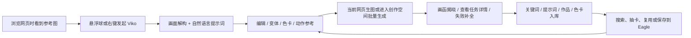

# 13 需求调研：Viko 竞品分析与 style-gen 优化机会

## 0. 文档说明

- **产出时间**：2026-08-16
- **研究对象**：[Viko 官网](https://viko.fun/)
- **研究目标**：还原 Viko 当前产品能力、关键交互、边界与商业化设计，并对照 style-gen / Visoryn 的现行产品和代码，识别值得借鉴、应避免和可形成差异化的方向。
- **研究方式**：官网与产品页实测 + 官方文档逐页核实 + 定价与 FAQ 核对 + style-gen 产品文档、架构文档与可执行代码对照。
- **证据时点**：Viko 官方文档主要更新于 2026-07-26 至 2026-07-31；本报告于 2026-08-16 访问当前官网、产品页、定价页、积分页、登录入口和文档。
- **后续动作**：本报告可以作为第 13 期产品需求的研究输入，但不等同于已批准 PRD。

### 0.1 证据等级

| 等级 | 定义 | 本报告中的用法 |
| --- | --- | --- |
| A | 当前官方文档、定价页或可见产品界面直接验证 | 可以作为当前产品事实 |
| B | 官方产品页、官方演示图或营销描述 | 可确认产品主张，登录后的细节仍需谨慎 |
| C | 根据公开信息与现行代码作出的推断 | 明确标注为判断或建议 |

### 0.2 研究限制

1. 未创建 Viko 账号、未支付、未提交真实图片，因此登录后的创作空间与插件执行效果主要依据官方文档和官方录屏描述，不能替代真实任务质量测试。
2. Chrome Web Store 详情页未能稳定读取，因此本报告不提供用户量、评分、版本号或权限清单，避免猜测。
3. Viko 官网个别营销页仍残留“免费 Beta / 未开放付费”的旧搜索缓存，但当前实时定价页已经展示付费方案。本报告以实时页面为准。
4. Viko “高精度提示词”的积分口径在定价页与文档中存在不一致，已单独标注。

---

## 1. 执行摘要

### 1.1 一句话结论

Viko 把“看到参考图”前移到浏览器现场，再把反推结果拆成关键词、提示词、作品和色卡四类资产，通过批量生成、历史恢复和 Eagle 集成形成“捕捉灵感 -> 立即验证 -> 长期复用”的闭环；style-gen 当前在证据可信度、内容与风格分离、风格不变量和确定性 Prompt 编译上更扎实，但入口、批量创作、资产沉淀和结果复盘仍不完整。

### 1.2 最重要的五个判断

1. **Viko 真正的产品壁垒不是“图片转提示词”，而是入口与闭环。** 浏览器悬浮球把捕捉成本压到最低，Web 创作空间承接组合和批量生成，资产库与 Eagle 承接长期复用。
2. **style-gen 不应追求 Viko 功能平移。** style-gen 已经拥有更严谨的 `VisualRecipeV2`、文字证据、模型置信度、hard/soft 不变量、变量和多档 Prompt，这才是应该放大的差异化。
3. **style-gen 当前最大的短板是“生成之后没有形成真正的学习闭环”。** History 只列已完成图片，Style Memory 的标签和复用意图主要由名称与变量数派生，尚未充分利用已有 Recipe、证据、来源与成功结果。
4. **最值得优先借鉴的是 Viko 的资产复利与批量恢复机制。** 先修复完整 History 路径、丰富 Style Memory 语义、补充参考图/结果/证据对比，再考虑浏览器插件和更大的资产系统。
5. **style-gen 最有潜力的差异化不是“更多随机灵感”，而是“渲染后审计”。** 在生成后说明哪些风格不变量被保留、哪些发生漂移，会把现有 Reference -> Evidence -> Render 推进为 Reference -> Evidence -> Render -> Audit。

### 1.3 建议优先级

| 优先级 | 建议 | 结论 |
| --- | --- | --- |
| P0 | 补全 Iteration Memory / History 闭环 | 立即推进 |
| P0 | 让 Style Memory 保存真实风格语义与成功证据 | 立即推进 |
| P0 | 设计“渲染后风格保持审计”小范围验证 | 建议验证后推进 |
| P1 | 同一方向生成 2/4 张变体并支持部分失败恢复 | 建议推进 |
| P1 | 将色卡升级为可保存、可锁定、可复用的参考资产 | 建议推进 |
| P1 | 在固定九维 Style DNA 上增加图像类型适配层 | 建议推进 |
| P1 | 增加面向用户的快速上手与公开产品文档 | 建议推进 |
| P2 | 用轻量网页捕捉入口验证浏览器场景 | 先验证，不直接做完整插件 |
| P2 | 完整浏览器插件、Eagle 集成、独立关键词库 | 由验证数据决定 |
| 暂缓 | 动作参考、游戏式开卡、复杂积分会员体系 | 当前不应优先 |

---

## 2. Viko 产品定位与核心价值

### 2.1 产品定位

Viko 将自己定义为面向 AIGC 创作者的“视觉灵感工作台”与“Creative Memory”。它试图解决的不是单次反推，而是这个长期问题：创作者收藏了大量参考图，却无法解释它们为何成立，也很难把其中的视觉规律带入下一次创作。

其公开价值主张可以归纳为三层：

1. **现场捕捉**：在浏览网页时直接对参考图发起反推或反推并出图，不离开当前页面。
2. **转译和验证**：把参考图拆解为可读信息，生成自然语言提示词，并用新图快速验证。
3. **沉淀和复用**：将词句、完整提示词、生成作品与色卡沉淀为云端资产，并可保存到 Eagle。

### 2.2 目标用户

从官方文档和场景判断，主要用户包括：

- 经常在 Pinterest、设计网站或网页素材库中收集参考图的 AIGC 创作者。
- 不擅长从零写提示词，希望从参考图快速得到可用起点的用户。
- 需要高频生成系列图、希望管理提示词和色彩资产的创作者。
- 已使用 Eagle 管理本地素材，希望图像和生成上下文一起归档的专业用户。

### 2.3 核心产品循环



Viko 把“收藏参考图”改造成一个可以循环复利的过程，而不是一次性的 AI 操作。

---

## 3. Viko 产品功能地图

```text
Viko
├── 0. 获客与上手
│   ├── 官网产品说明与实录
│   ├── Chrome 插件安装
│   ├── 邮箱 / Google 登录
│   └── 注册赠送 30 积分
├── 1. 浏览器现场捕捉
│   ├── 图片悬浮球 P：反推提示词
│   ├── 图片悬浮球 V：反推并出图
│   ├── 图片右键菜单
│   ├── 网页划词收藏
│   ├── 网站禁用列表
│   └── 全局默认设置
├── 2. 参考图理解与反推
│   ├── 按图像类型适配的画面解构
│   ├── 标准 / 高精度提示词
│   ├── 同风格变体提示词
│   ├── 色卡提取与引用
│   └── 动作参考
├── 3. 图片生成
│   ├── 当前网页直接生图
│   ├── 创作空间直接生图
│   ├── 模型 / 画幅 / 1K 输出
│   ├── 云端异步执行
│   ├── 并发与队列优先级
│   └── 批量生成
├── 4. 创作空间
│   ├── 五轴灵感抽卡台
│   ├── 词卡托盘
│   ├── 提示词正文
│   ├── 创作参数与积分预检
│   ├── 会话画架
│   ├── 画函集中揭晓
│   └── 部分完成与失败补全
├── 5. 资产与历史
│   ├── 关键词册
│   ├── 提示词册
│   ├── 作品集
│   ├── 色卡册
│   ├── 历史筛选与任务详情
│   ├── 批量下载
│   └── 批量保存到 Eagle
├── 6. 账号、云端与集成
│   ├── 插件 / Web 共用账号
│   ├── 跨设备同步
│   ├── Eagle 本机 API
│   ├── 5 种界面语言
│   └── 数据与隐私控制
└── 7. 商业化
    ├── Free 试用积分
    ├── Pay as you go
    ├── Lite / Plus / Pro
    ├── 会员加油包
    ├── 并发 / 批量 / 队列分层
    └── 预占、结算、失败退回
```

---

## 4. Viko 功能详细拆解

### 4.1 获客、注册与快速开始

| 功能 | 产品细节 | 边界 / 默认值 | 证据 |
| --- | --- | --- | --- |
| 官网主张 | “看到好图，Viko 一下”，强调让灵感成为下一次创作起点 | 主页直接引导安装插件或进入创作空间 | A |
| 登录方式 | 登录页提供邮箱密码与 Google 登录 | 创作空间访问会跳转登录 | A |
| 新用户积分 | 注册获得 30 积分 | 自发放起 30 天有效；约可完成 4 次“反推 + 生图” | A |
| 第一次创作 | 官方路径是反推 1 分 + 生图 6 分 + 收藏资产 0 分 | 开始前需要插件登录且至少 7 积分 | A |
| 平台 | 插件支持桌面 Chrome；创作空间为桌面浏览器设计 | 暂无移动端专门支持 | A |

Viko 的首次体验目标不是让用户先学习所有模块，而是用 7 积分完成一次从参考图到新图的闭环。

### 4.2 浏览器插件：捕捉入口

#### 4.2.1 悬浮球触发条件

悬停网页图片时，满足以下条件才显示悬浮球：

- 图片显示尺寸与原始尺寸均不小于 96 × 96 像素。
- 图片存在有效图片地址；背景图或 Canvas 绘制内容可能无法识别。
- 全局开关开启，当前网站不在禁用列表。

#### 4.2.2 两个主按钮

| 按钮 | 动作 | 结果 | 消耗 |
| --- | --- | --- | ---: |
| P | 只反推 | 画面解构 + 自然语言提示词 | 1 积分 |
| V | 反推并出图 | 先反推，再自动生成 1 张 | 7 积分 |

这两个按钮本质上提供“理解优先”和“立即验证”两种创作节奏。对新用户而言，V 按钮明显减少了从分析到生成的操作层级。

#### 4.2.3 右键和划词

- 对图片右键可执行“反推提示词”或“反推并出图”。
- 对网页文字选中后右键，可以 0 积分存入关键词册。
- 划词资产保存文字本身和清理跟踪参数后的来源页面地址。
- 对悬浮球无法触发的图片，右键菜单有时仍然可用。

#### 4.2.4 隐私边界

- 悬停和显示按钮本身不上传内容。
- 只有用户主动点击反推、生成、收藏或划词收藏时，对应内容才会上传处理。
- 为支持刷新后重试，任务图片副本会保存在浏览器本机，删除任务时清除。

#### 4.2.5 插件全局设置

| 设置组 | 可配置项 |
| --- | --- |
| 账号 | 登录、余额、退出登录 |
| 悬浮球 | 全局开关、禁用网站列表 |
| 反推 | 反推模型、标准/高精度、变体提示词 |
| 生图 | 生图模型、默认画幅、1K 清晰度 |
| 参考控制 | 色卡模式、默认参考色卡、动作参考 |
| Eagle | 是否启用、服务地址、默认标签、测试连接 |
| 语言 | 中文、英文、日文、韩文、西班牙文 |

全局设置是默认值，单任务设置优先级更高。

### 4.3 画面解构

Viko 不采用完全固定的分析模板，而是先判断图像类型，再选择适合的解构维度。

| 图像类型 | 官方列出的重点维度 |
| --- | --- |
| 人像摄影 | 主体人物、动作/表情、造型、身形轮廓、肤色/肤调、光线/色彩、成像质感 |
| 插画 / 动漫 | 画风/笔触、角色设计、脸部风格锁定、眼型/瞳孔、服装/道具 |
| 海报 / 版式 | 版式层级、图层堆叠、字体/文字、图形元素功能、色彩系统、构图节奏 |
| 产品图 | 产品主体、卖点表达、品牌/情绪、材质/印刷感 |
| 通用 | 图像类型、风格线索、摄影/构图、场景/背景、画面元素、生成优先级、失败风险 |

解构包含在反推费用中，不额外扣分。每一条解构词句都可以单独点击收藏为词卡，并保留分类与来源。

### 4.4 反推提示词与变体

#### 4.4.1 输出形式

Viko 明确选择自然语言和关键词短语，而不是 JSON。产品定位不是机械复原，而是为继续创作提供可用表达。

#### 4.4.2 精度档位

| 档位 | 输出特征 | 适合场景 |
| --- | --- | --- |
| 标准精度 | 更整洁、去除冗余 | 快速二创、日常生成 |
| 高精度 | 尽可能覆盖机位、构图、色彩、光影、材质等参数 | 复杂海报、高还原任务 |

#### 4.4.3 变体提示词

变体提示词默认关闭。开启后会额外返回一个保留核心视觉体系、改变若干具体维度的同风格方向；官方文档称不额外扣积分。主提示词与变体提示词都可以编辑、收藏和继续生成。

#### 4.4.4 当前公开口径的不一致

- 实时定价页权益表写明“高精度提示词 2 积分/次”。
- 反推文档写明“每次反推 1 积分”，介绍高精度时未说明额外费用。
- 积分价目表只列出反推 1 分、生图 6 分、动作参考 6 分，未单列高精度。

因此高精度最终如何计费，应以登录后提交前的实际预检为准。这也是 style-gen 应避免的产品文档问题：用量、功能与价格必须由同一事实源生成。

### 4.5 色卡模式

| 项目 | 规则 |
| --- | --- |
| 默认状态 | 关闭 |
| 提取结果 | 主色、每种颜色的用途和占比 |
| 影响范围 | 延续整体色彩秩序与光色氛围 |
| 不影响 | 主体、内容和构图仍由提示词决定 |
| 费用 | 提取、保存、整理、引用均 0 积分；生图仍按 6 分/张 |
| 资产化 | 可保存到色卡册，重命名、搜索、再次引用 |
| 组合 | 可与动作参考叠加 |

创作空间中一次只能引用一张色卡，批量任务整批使用同一色卡。

### 4.6 动作参考模式

动作参考默认关闭，每次额外消耗 6 积分。其产品边界定义得很清楚：

| 只约束 | 仍由提示词决定 |
| --- | --- |
| 动作与姿态 | 主体是谁、长什么样 |
| 人物位置与画面关系 | 服装与造型 |
| 接触点、重心和受力 | 场景与背景 |
| 空间关系 | 色彩与风格 |

适合复杂透视、多人位置关系和难以用文字表达的动作。它是“空间控制”，不是风格迁移。

### 4.7 当前网页直接生图

Viko 支持三种入口：

1. 直接点击 V，反推后自动出图。
2. 完成反推后，在面板点击生成。
3. 图片右键选择“反推并出图”。

可选参数：

- 生图模型：使用插件配置的默认模型。
- 画幅：1:1、2:3、3:2、3:4、4:3、9:16、16:9、4:5、3:1、1:3，以及自动匹配参考图的 AUTO。
- 清晰度：当前为 1K。
- 任务在云端继续运行，关闭当前网页不会丢失。

常见组合消耗：

| 组合 | 积分 |
| --- | ---: |
| 仅反推 | 1 |
| 反推 + 生图 | 7 |
| 反推 + 动作参考 + 生图 | 13 |
| 色卡引用 + 生图 | 6 |
| 色卡引用 + 动作参考 + 生图 | 12 |

### 4.8 创作空间

创作空间分为“创作、收藏、历史”三个区域，与插件共用账号和资产。

#### 4.8.1 灵感抽卡台

抽卡台从用户自己的关键词册中抽取，不使用平台内置词库。五个轴是：

- 风格
- 主体
- 构图
- 色彩
- 动态

用户可以锁定满意的词卡，只重抽其他轴，再把整手词卡送入托盘。抽取、锁定、重抽均为本地操作，0 积分。

#### 4.8.2 创作工作台

| 区域 | 作用 |
| --- | --- |
| 词卡托盘 | 接收关键词册和抽卡台词卡，可去重、删除单张或清空 |
| 提示词正文 | 描述主体、场景、构图、光色和质感 |
| 创作参数 | 模型、画幅、张数、1K 清晰度、引用色卡 |
| 积分预检 | 提交前检查整批余额，不够时不提交 |
| 会话画架 | 只展示当前会话中已完成且有真实图片的任务 |

词卡负责骨架，正文补充具体画面，系统将二者拼合成最终提示词。

#### 4.8.3 批量生成与画函

- 单批张数由会员档位决定：Free 1、Lite 3、Plus 5、Pro 10。
- 每张图 6 积分。
- 批量结果完成后先封入“画函”，用户可以逐张翻牌或全部翻开。
- 满意结果可以“收入档案”，进入作品集。
- 未收入档案的图片仍保留在任务详情中。

“画函”的核心价值是集中处理批量结果；游戏化开卡只是表现层。

#### 4.8.4 部分完成与补全

如果一批 5 张中成功 3 张、失败 2 张：

- 任务进入“部分完成”。
- 成功的 3 张可以立即查看和保存。
- 失败的 2 张积分自动退回。
- 用户可以只补全缺失张数，新结果并回原任务。
- 内容安全失败需要修改提示词后新建任务，超时/限流/服务不可用可以稍后补全。

这是 Viko 在批量产品中较成熟的一项设计：局部失败不会让整批结果作废。

### 4.9 四类资产系统

#### 4.9.1 关键词册

- 来源：画面解构词句、网页划词。
- 保留：内容、分类、来源页地址。
- 支持：按内容、分类、来源搜索；显示使用次数；加入托盘；参与抽卡。
- 删除后支持立即撤销。

#### 4.9.2 提示词册

- 保存完整提示词，主提示词和变体都可以收藏。
- 与来源任务关联，可回看当时的生成结果。
- 支持按内容、模型、来源筛选。
- 可复制或直接复用到创作工作台。
- 从提示词册删除不影响来源任务。

#### 4.9.3 作品集

- 只有真实完成且由用户主动保存的结果才能进入作品集。
- 每件作品保留提示词、模型、画幅和来源任务。
- 历史是自动执行记录，作品集是用户认可的长期资产。
- 可查看详情、下载、继续创作或保存到 Eagle。

#### 4.9.4 色卡册

- 保存主色、用途和占比。
- 支持重命名、搜索、移除和再次引用。
- 插件与创作空间共用。
- 积分耗尽后仍可整理和使用已有色卡。

### 4.10 历史与任务详情

#### 4.10.1 历史筛选

| 维度 | 选项 |
| --- | --- |
| 状态 | 全部、收藏、进行中、完成、失败 |
| 类型 | 全部、仅反推、反推·出图、直接生图 |

进行中任务在刷新或关闭浏览器后继续同步。插件端发起的任务也进入同一历史。

#### 4.10.2 任务详情

任务详情保留：

- 提示词和变体提示词
- 画面解构分组
- 色卡
- 来源图和来源页
- 模型、画幅、清晰度与参考开关
- 参考图与生成图并排对比
- 上一条 / 下一条导航

可从详情收藏提示词、词句、色卡和作品，下载原图，保存到 Eagle，或继续创作。

#### 4.10.3 批量动作

- 历史可进入选择模式。
- 支持多个任务结果打包下载。
- 支持批量保存到 Eagle。
- 无真实图片的失败任务会被自动跳过。
- 个别 Eagle 保存失败不会阻断其他任务，并分别显示成功/失败数。

#### 4.10.4 历史保留策略

Viko 只说明历史会按“内部保留策略”清理，没有公开具体时长；主动保存的资产不受历史清理影响。这一口径对用户仍不够确定。

### 4.11 Eagle 集成

Viko 通过 Eagle 的本机 API `localhost:41595` 连接本地素材库：

- 用户必须安装并运行 Eagle。
- 插件中手动开启并测试连接。
- 默认标签是 `viko,ai-generated`，可修改。
- 只有用户主动保存时才会发送到本机 Eagle，不自动同步。
- 支持单张保存和历史批量保存。

官方文档写明保存内容包括图片、默认标签和来源信息；产品页另称图片、提示词、解构结果可一起沉淀。由于两处表述精度不同，具体 Eagle 字段映射仍需登录实测。

### 4.12 任务状态与故障恢复

单任务状态：

| 状态 | 用户界面 | 用户可做什么 |
| --- | --- | --- |
| `queued` | 排队 | 等待；可关闭页面 |
| `reversing` | 反推中 | 等待数十秒 |
| `prompt_ready` | 提示词就绪 | 查看、收藏或继续生图 |
| `generating` | 创作中 | 等待，同时发起其他任务 |
| `done` | 完成 | 查看、下载、收藏、继续创作 |
| `error` | 失败 | 根据错误提示重试；积分退回 |

批量任务额外有：部分完成、待启封、已启封、补全。

积分采用“预占 -> 成功结算 -> 失败释放”模式；失败预占最迟 30 分钟解除，批量只结算成功张数。

### 4.13 商业化与套餐

#### 4.13.1 当前套餐

| 档位 | 月付 | 年付 | 基础积分 | 每日积分 | 每端并发 | 单批上限 | 队列 |
| --- | ---: | ---: | ---: | ---: | ---: | ---: | --- |
| Free | $0 | - | 注册一次性 30 | - | 1 | 1 | 普通 |
| Lite | $5.90 | $59 | 500 / 周期 | 10 | 3 | 3 | 标准 |
| Plus | $12.90 | $129 | 1,200 / 周期 | 20 | 5 | 5 | 优先 |
| Pro | $24.90 | $249 | 2,600 / 周期 | 30 | 10 | 10 | 最高 |

年付一次支付全年费用，但积分按月发放；月付和年付订阅会自动续费，可在账户中心管理。

#### 4.13.2 一次性积分

| 类型 | 价格 | 积分 | 有效期 | 购买条件 |
| --- | ---: | ---: | --- | --- |
| Pay as you go | $1.99 | 100 | 3 个月 | 所有登录用户 |
| 小包 | $4.90 | 300 | 12 个月 | 有效付费会员 |
| 中包 | $9.90 | 650 | 12 个月 | 有效付费会员 |
| 大包 | $19.90 | 1,400 | 12 个月 | 有效付费会员 |

Pay as you go 会在积分包有效期内解锁高精度提示词、动作参考等高级模式，但并发与单批上限仍按 Free 计算。

#### 4.13.3 档位策略

Viko 的付费档位主要区分用量和效率，而不是大规模锁功能：

- 全付费档开放反推、生图、色卡、动作参考和批量。
- 色卡对 Free 也免费。
- 高精度提示词与动作参考需要 Pay as you go 或订阅。
- 并发、单批张数和队列优先级是核心分层杠杆。

### 4.14 数据与隐私

官方文档声明：

- 只处理用户主动提交的内容，不自动扫描浏览网页。
- 任务记录和四类资产保存到云端账户。
- 来源页 URL 会在记录前清理跟踪参数。
- 插件配置保存在浏览器本机。
- 未经另行同意，不使用用户内容训练通用 AI 模型。
- 不出售数据，不将内容用于广告。
- 可逐条删除任务和资产；批量清除或注销账户需要联系官方。

这些边界被放进了用户文档，而不是只存在于法律条款中，是值得借鉴的信任设计。

---

## 5. Viko 核心用户路径还原

### 5.1 最短路径：网页参考图 -> 新图

```text
1. 安装插件并登录
2. 在网页悬停一张 >= 96×96 且有有效 URL 的图片
3. 点击 P 反推，或点击 V 反推并出图
4. 等待画面解构和自然语言提示词
5. 可选：编辑提示词、开启变体、色卡或动作参考
6. 选择画幅并提交
7. 云端运行，页面可以关闭
8. 返回插件面板或创作空间查看结果
9. 收藏词句、提示词、作品或色卡
10. 下次从资产库继续创作
```

**Aha moment**：用户无需下载图片、上传到另一个工具、复制提示词再切换生图平台，在当前浏览页面就能完成理解与验证。

### 5.2 深度路径：资产 -> 批量创作

```text
1. 打开创作空间
2. 从关键词册挑词，或使用五轴抽卡台随机组合
3. 将词卡送入托盘
4. 在正文中补充具体场景
5. 选择模型、画幅、张数和色卡
6. 系统进行积分预检
7. 提交批量任务
8. 画函就绪后逐张或全部揭晓
9. 成功作品收入档案，失败张数单独补全
10. 将有效提示词、作品和色卡继续沉淀
```

**Aha moment**：过去收藏的碎片在抽卡和托盘中重新组合，变成下一批可执行提示词。

### 5.3 恢复路径：部分失败

```text
1. 批量任务部分完成
2. 成功结果可立即启封和保存
3. 失败张数积分自动退回
4. 用户只补全缺失张数
5. 新结果并回原画函和任务
```

**关键价值**：失败粒度与结算粒度一致，用户不会因为局部失败重做整批。

---

## 6. Viko 的优势、弱点与产品判断

### 6.1 优势

1. **入口极低摩擦**：浏览器悬浮球直接出现于灵感发生的地方，减少下载、上传和跨工具复制。
2. **端到端闭环完整**：反推、解构、生成、批量、失败恢复、资产管理和本地素材库形成连贯路径。
3. **资产定义清楚**：关键词、提示词、作品和色卡分别承接不同复用需求，并与来源任务关联。
4. **高级控制边界清晰**：色卡只影响光色，动作参考只影响空间关系，降低用户误解。
5. **批量失败体验成熟**：部分成功可先使用，失败积分退回，支持按张补全。
6. **商业化和成本可感知**：提交前预检，失败自动退回；档位主要按吞吐量分层。
7. **用户文档完整**：操作、计费、任务状态、隐私、排错都公开说明。

### 6.2 弱点与风险

1. **工作流和信息架构较大**：插件、创作空间、四类资产、历史、抽卡、Eagle、积分可能增加新用户认知负担。
2. **解构可信度缺少公开证据契约**：官方强调多维解构，但公开文档没有像 style-gen 一样声明每条结论的观察依据、模型置信度和不变量来源关系。
3. **提示词变体可能只提供方向，不保证可解释差异**：公开文档没有说明变体具体改了哪些维度、是否可锁定或回滚。
4. **游戏化画函与专业创作节奏不一定匹配**：集中揭晓有价值，但逐张翻牌的仪式感可能拖慢高频用户。
5. **定价口径存在不一致**：高精度提示词的积分在定价页与文档中不一致。
6. **历史保留期限不透明**：只说明“内部保留策略”，不利于用户判断是否需要主动归档。
7. **平台范围有限**：插件只支持桌面 Chrome，移动端未专门支持。
8. **输出分辨率当前只有 1K**：对专业出图和后期场景可能不足。
9. **完整产品效果未独立验证**：未登录实测前，反推质量、动作参考稳定性和批量体验仍属于官方自述。

---

## 7. style-gen 当前产品能力地图

本节以 [PRODUCT.md](../PRODUCT.md)、[DESIGN.md](design/DESIGN.md)、当前 API、类型、组件与 2026-08-12 acceptance 证据为准，不使用历史 backup 文档作为当前真值。

```text
style-gen / Visoryn
├── 0. Landing 与认证
│   ├── Reference -> Evidence -> Render 价值说明
│   ├── JPG / PNG / WebP 上传，最大 10MB
│   ├── Google 登录
│   └── Style Memory 入口
├── 1. Reference
│   ├── R2 预签名直传
│   ├── 参考图画布
│   ├── Replace / Retry
│   └── 会话级上下文恢复
├── 2. Evidence
│   ├── 两阶段视觉理解与结构化
│   ├── 固定九维 Style DNA
│   ├── 内容事实 / 可迁移风格分离
│   ├── 文字观察依据与模型置信度
│   ├── hard / soft 风格不变量
│   ├── negative constraints
│   └── 风格指纹与 ready / partial / fallback
├── 3. Prompt
│   ├── 复原 Prompt
│   ├── concise / standard / professional 模板
│   ├── 内容变量
│   ├── mood / primary color 可选 modifier
│   ├── 自定义文本
│   ├── Prompt provenance
│   └── 保存为 Style Memory
├── 4. Render
│   ├── 5 种画幅
│   ├── Standard / HD
│   ├── 单张生成
│   ├── readiness 检查
│   ├── 异步 pending -> processing -> completed / failed
│   └── 失败重试与服务降级提示
├── 5. Iteration Memory
│   ├── 最近 20 个已完成生成结果
│   ├── 任务详情
│   ├── Restore to workspace
│   └── Generate variation
├── 6. Style Memory
│   ├── 模板保存 / 搜索 / 复用
│   ├── 来源图预览
│   ├── 变量结构
│   ├── Duplicate / Delete
│   └── Prompt-only 降级
└── 7. 技术与运行
    ├── Replicate / Gemini 视觉与结构化 Provider
    ├── Replicate / fal 图像生成 Provider
    ├── 数据库轮询与 Replicate webhook
    ├── R2 资产存储
    └── Auth.js + PostgreSQL
```

### 7.1 style-gen 的现有强项

#### 7.1.1 可信的结构化视觉语义

当前 `VisualRecipeV2` 明确分离：

- 内容摘要、主体、属性、动作、环境、辅助元素、时间/天气。
- 九维可迁移 Style DNA：视觉媒介、构图、镜头、色彩、光影、造型语言、材质纹理、氛围、渲染。
- 每条 Style Observation 的稳定 ID、1-3 条文字依据和 0-1 模型置信度。
- 由 Observation 支撑的 hard/soft Style Invariant。
- 风格指纹 tokens 和九维连续评分。

这比 Viko 公布的“解构维度”更接近一份可以校验和编译的风格契约。

#### 7.1.2 确定性 Prompt 编译

style-gen 从同一份 Recipe 派生：

- Reconstruction Prompt
- Concise Template
- Standard Template
- Professional Template

内容变量、可选 modifier、维度顺序和去重由服务端确定性逻辑生成，不需要额外模型调用。用户切换档位、关闭不变量或修改变量时，不会改写原始证据。

#### 7.1.3 证据与 Prompt 关系可见

工作台能够从 Prompt 中匹配 Evidence Facet，展示“prompt linked / related signal / prompt pending”等关系。即使当前实现是文本匹配而非模型直接 provenance，也比单一自然语言反推更透明。

#### 7.1.4 上下文保留和恢复

- 上传、分析、生成、失败与历史恢复都保留参考图和 Prompt 上下文。
- `sessionStorage` 保存工作区快照。
- 历史恢复会带回 Prompt、Negative Prompt、参数、Recipe、来源图和变量。
- 服务不可用时仍允许继续编辑和保存。

#### 7.1.5 Provider 抽象和降级

视觉、结构化和图像生成均有 Provider 抽象；Replicate 支持异步 webhook，fal 支持同步返回后的后台存储。`ready / partial / fallback` 让合法核心结果尽量可用，而不是字段缺失就整体报废。

### 7.2 style-gen 当前短板

1. **入口只有上传**：用户必须先获得图片文件，再进入产品，无法在灵感现场捕捉。
2. **生成只支持单张**：无法同一方向生成小批变体并集中比较。
3. **没有独立参考控制资产**：现有 `primary_color` 是文本 modifier，不是可视色卡；没有动作、构图或其他可复用参考资产。
4. **Style Memory 语义仍偏展示派生**：当前标签主要从名称、是否有来源图和变量数推导，复用意图也由这些字段生成，没有持久化选中的不变量、Recipe 快照、成功样例或使用次数。
5. **History 只返回已完成任务**：列表 API 只包含 `id / resultFileUrl / createdAt`，无法筛选进行中、失败、分析任务或生成类型。
6. **History 详情未充分利用来源上下文**：虽然恢复接口已经返回来源图、Recipe 和变量，但当前详情主要展示结果、Prompt、Negative Prompt 和参数，没有参考图/结果/证据的完整并排审查。
7. **`View all` 指向缺失路由**：Workspace 的 HistoryStrip 会跳转 `/history`，但当前 `src/app` 下没有对应页面。这是一个明确的闭环断点。
8. **没有面向用户的产品文档**：内部文档很强，但用户看不到操作边界、任务状态、Provider 行为、数据处理与恢复策略。
9. **没有用户级模型选择**：Provider 能力存在于环境配置，创作者无法根据任务选择模型或理解成本与质量差异。
10. **无商业化与用量反馈**：没有积分、额度、单次预估或失败退款等产品层设计。当前可以暂不收费，但用户仍缺少“本次操作成本/限制”的可见性。
11. **固定九维对所有图像一致**：契约稳定是优点，但海报、人物、产品、建筑等特殊内容缺少额外的领域阅读方式。

### 7.3 当前验证状态

2026-08-12 的最新 acceptance 证据显示：92 个测试文件、687 个测试、production build 和 targeted E2E 48 项全部通过。第 12 期 README 仍标记为 `in_review`，但最新 green evidence 已证明最终编辑状态通过验收。产品研究应以当前代码和最新 green evidence 为准。

---

## 8. Viko 与 style-gen 功能矩阵

| 功能维度 | Viko | style-gen 当前 | 判断 |
| --- | --- | --- | --- |
| 核心定位 | 视觉灵感捕捉与 Creative Memory | 可信、可编辑的视觉风格 Recipe | 互补，不应同质化 |
| 首次入口 | Chrome 插件 + Web Studio | 文件上传 | Viko 明显更低摩擦 |
| 浏览器现场反推 | 有，P/V 悬浮球和右键 | 无 | 大机会，但投入较大 |
| 网页划词收藏 | 有，保留来源 | 无 | 对 style-gen 非核心，可后置 |
| 图像类型适配 | 人像/动漫/海报/产品/通用 | 固定九维 Style DNA | 可增加补充层，不应破坏九维契约 |
| 内容与风格分离 | 文档有表达，公开契约不详 | 明确结构化分离 | style-gen 更强 |
| 观察依据 | 解构文本 | 每项有 evidence | style-gen 更强 |
| 模型置信度 | 公开文档未说明 | 每项 0-1 confidence | style-gen 更强 |
| 风格不变量 | 以核心气质描述 | hard/soft invariant + 来源 ID | style-gen 更强 |
| Prompt 形态 | 标准/高精度 + 变体 | 复原 + 三档模板 + structured/custom | style-gen 更强 |
| Prompt 可解释性 | 变体方向可用，但改动维度不透明 | facet 与 Prompt provenance 关系 | style-gen 更强 |
| 色卡 | 提取、保存、搜索、引用 | 只有文本型 primary color modifier | Viko 更完整 |
| 动作参考 | 有 | 无 | Viko 更广，但非 style-gen 核心 |
| 画幅 | 10 种 + AUTO | 5 种 | Viko 更丰富 |
| 输出分辨率 | 1K | Standard / HD | 名称不同，需实际 Provider 核对 |
| 批量生成 | 1/3/5/10 张 | 单张 | Viko 明显更强 |
| 部分失败恢复 | 按张退款与补全 | 单任务重试 | 批量前不是阻塞，批量后必须补 |
| 灵感组合 | 五轴抽卡 + 词卡托盘 | 变量、不变量、modifier | style-gen 应做“受控变化”，不必复制随机抽卡 |
| 资产类型 | 关键词、提示词、作品、色卡 | Style Memory + Generation History | Viko 更完整，style-gen 更集中 |
| Style Memory 语义 | 来源、分类、使用次数、任务关联 | 来源图、变量数、名称派生标签 | style-gen 需要补真实元数据 |
| 历史筛选 | 状态 × 类型 | 只列已完成生成 | Viko 更完整 |
| 任务详情 | 来源、解构、色卡、设置、对比 | 结果、Prompt、参数、恢复 | style-gen 数据已有一部分，UI 未充分承接 |
| 批量下载 | 有 | 无 | 低到中优先级 |
| Eagle | 有 | 无 | 面向专业用户有价值，需验证需求 |
| 跨设备云端 | 插件/Web 统一 | 登录后 DB/R2 持久化，workspace 快照本会话 | 资产云端有基础，工作区跨设备仍有限 |
| 用户文档 | 完整 | 只有内部工程文档 | Viko 明显更强 |
| 隐私说明 | 面向用户公开 | 产品原则强调信任，但无同等用户文档 | 应补 |
| 定价/积分 | 完整 | 无 | 不应急于复制 |
| 移动端 | 无专门支持 | 专业桌面工作台 | 相同边界 |

---

## 9. 值得借鉴的产品模式

### 9.1 捕捉和创作分工

Viko 的插件负责“捕捉”，Web 端负责“组合、批量和管理”。这种端边界是合理的：灵感入口轻，深度工作区重。style-gen 如果未来扩展浏览器入口，也应保持浏览器端只做最短动作，不把完整 Evidence Workbench 塞进扩展面板。

### 9.2 保存动作与资产语义分开

Viko 区分自动历史与主动保存资产：历史记录执行过程，作品集记录用户认可。style-gen 当前 History 和 Style Memory 已经具备两个雏形，应把这个区分做得更明确：

- History 是所有尝试和恢复路径。
- Style Memory 是经过选择、包含来源和证据的可复用风格方向。
- 成功 Render 是 Style Memory 的验证证据，而不是孤立图片。

### 9.3 提交前预检

Viko 在批量提交前预检积分；style-gen 已经有 Render Readiness。两者可以结合为更强的预检：

- Prompt 是否可解析。
- 变量是否完整。
- 证据与不变量是否足够。
- 当前模型是否可用。
- 本次张数、输出规格和预计成本。

### 9.4 部分成功优先

批量任务不应是全有或全无。未来 style-gen 上线多图变体时，任务组必须允许单张完成、单张失败、成功结果先用、失败项单独重试。

### 9.5 用户级状态和隐私文档

Viko 把“何时上传、保存什么、任务状态、失败是否扣费、数据如何删除”写进用户文档。style-gen 的 Precision Frame 强调可信，但目前这些内容主要存在工程文档中。把内部契约转译为用户可读文档，本身就是产品能力。

---

## 10. 不建议直接照搬的部分

### 10.1 不复制四个孤立资产库

关键词、提示词、作品、色卡分成四个库容易形成碎片。style-gen 更适合构建以 Style Memory 为中心的关联资产：一个 Memory 下关联来源图、Recipe、不变量、变量、Prompt、色卡和成功 Render。用户既可以按类型浏览，也不会丢失上下文。

### 10.2 不复制游戏式逐张翻牌

批量结果集中揭晓值得借鉴，但“开卡包”不是 style-gen 的品牌方向。Precision Frame 是安静、精确的专业工具。更合适的表现是：批量结果网格、按证据对比、快速标记保留/淘汰，以及失败项清晰补全。

### 10.3 不把随机抽卡作为主创作方式

随机组合适合探索，但容易稀释 style-gen 的可控与可解释优势。更合适的产品是“受控变化矩阵”：锁定风格不变量，只对主体、场景、色彩或镜头中的指定变量生成变体。

### 10.4 不立刻做动作参考

动作参考解决的是姿态和空间关系，不是 style-gen 当前的可迁移风格问题。它需要新的参考控制链路、Provider 能力、数据契约和验证方式，当前投入产出低于色卡、批量变体和渲染后审计。

### 10.5 不在没有用量证据时复制积分体系

积分、每日刷新、订阅、加油包、并发与队列会显著增加运营和支持成本。style-gen 应先记录真实 Provider 成本、生成频率、失败率和高价值功能使用率，再决定收费单位。

### 10.6 不接受定价与文档口径分裂

Viko 高精度提示词的积分口径不一致。style-gen 如果未来计费，价格、提交前预检、账单和用户文档必须从同一套产品事实源派生。

---

## 11. style-gen 优化建议

### 11.1 P0：补全 Iteration Memory / History 闭环

**问题**：Workspace 的 `View all` 指向不存在的 `/history`；现有历史 API 只列已完成生成，详情没有把已有的来源图、Recipe、Evidence 和结果完整呈现出来。

**建议范围**：

- 提供真实可访问的 History 页面，或在路由未完成前移除失效入口。
- 以状态、时间和任务类型筛选任务。
- 任务详情并排显示参考图与生成结果。
- 同时展示当次 Prompt、Negative Prompt、启用的不变量、Evidence、变量值、模型和输出参数。
- 保留 Restore、Generate variation、Save to Style Memory。
- 第一版不必做批量下载和分析任务全量管理，先打通“找到 -> 理解 -> 恢复 -> 再生成”。

**为什么优先**：这是已有数据和已有用户承诺之间的断点，修复成本低于新建插件，却直接提升复用率。

**投入级别**：小到中。路由断点修复可在 1-2 天内完成；完整详情与筛选约 3-5 天。

**成功指标**：

- 历史详情打开率。
- Restore 后再次生成率。
- 历史结果保存为 Style Memory 的比例。
- 用户从历史恢复到再次提交的平均时间。

### 11.2 P0：让 Style Memory 保存真实语义，不再依赖名称派生

**问题**：当前 Memory 卡片的标签主要从名称、来源图存在与否、变量数推导；复用意图也是规则文案。这不能回答“这条记忆保留了什么风格、被什么结果验证过”。

**建议范围**：

- 保存时带上来源 Analysis / Recipe 的可追溯关系。
- 记录用户保存时启用的 Style Invariants 和 modifiers。
- 展示真实 Style Fingerprint、变量和 Negative Constraints。
- 允许关联一个或多个“验证成功的 Render”。
- 显示最近使用时间、使用次数和从该 Memory 产生的迭代数。
- 搜索应覆盖真实风格标签、变量、来源与可迁移规则，而不只搜索名称。

**为什么优先**：style-gen 已经生成这些结构化信息，只是没有在 Memory 中把它们变成持久资产。这是利用现有护城河的最高杠杆改进。

**投入级别**：中到大，约 1-2 周，取决于是否扩展持久化结构。

**成功指标**：

- 分析完成后的 Memory 保存率。
- Memory 7 天 / 30 天复用率。
- 从 Memory 发起生成的成功率。
- 来源图支持的 Memory 占比。

### 11.3 P0：验证“渲染后风格保持审计”

**问题**：当前工作流在 Render 完成时结束。用户仍需凭感觉判断哪些风格被保留、哪些发生漂移。

**建议范围**：

- 用当前选中的 Style Invariants 作为审计清单。
- 对参考图与结果逐项给出“保留 / 部分保留 / 漂移 / 无法判断”。
- 每个判断显示可观察依据，避免单一总分或虚构精度。
- 将漂移项直接转成下一轮可操作建议，例如加强构图约束、降低色彩偏移或恢复材质描述。
- 第一版可以只支持 3-5 个高置信不变量，不追求完整自动评分。

**为什么优先**：这是 Viko 公开能力未覆盖、同时最符合 style-gen “证据先于信任”定位的差异化。

**投入级别**：中到大。交互原型与用户验证约 3-5 天；稳定产品化可能 1-2 周以上，并可能增加一次视觉模型调用。

**成功指标**：

- 审计查看率。
- 从漂移项发起修正生成的比例。
- 达到用户满意结果所需平均迭代次数。
- 用户对“结果为何不对”的可解释性评分。

### 11.4 P1：增加小批量受控变体

**问题**：单张生成让用户难以判断当前 Prompt 是否稳定，也无法高效比较不同随机结果。

**建议范围**：

- 第一版只提供 2 张和 4 张，避免一步走到 10 张。
- 所有结果共享同一份 Prompt、变量、不变量与参数快照。
- 允许单张成功、单张失败、失败项单独重试。
- 用结果网格直接比较，不做逐张翻牌。
- 支持标记“保留、淘汰、设为代表结果”。

**为什么优先**：它同时提升 Prompt 验证效率、Style Memory 质量和后续审计价值。

**投入级别**：大，约 1-2 周以上，需要任务组、部分状态和结果集合。

**成功指标**：

- 每批保留结果数。
- 单个满意结果的平均生成成本。
- 部分失败恢复成功率。
- 单批完成后保存 Memory 的比例。

### 11.5 P1：把色卡做成第一类参考资产

**问题**：当前 `primary_color` 只是文本 modifier，缺少可视、可保存、可复用的色彩秩序。

**建议范围**：

- 从参考图提取 4-8 个主色、用途、比例和整体冷暖/对比关系。
- 色卡与 Evidence 中的 color observation 关联。
- 用户可以锁定整张色卡，或只锁定部分角色色。
- Style Memory 可以包含色卡；生成前明确色卡影响色彩，不改变主体和构图。
- 生成后审计可以检查主色关系是否保持。

**为什么优先**：色彩已经是现有九维证据和 modifier 的一部分，向可视资产升级比新增动作控制更自然。

**投入级别**：中，约 3-5 天到 1-2 周，取决于是否需要新的图像取色与 Provider 控制。

**成功指标**：

- 色卡保存率与复用率。
- 使用色卡后的色彩审计通过率。
- 色卡参与的 Memory 复用率。

### 11.6 P1：在固定九维契约上增加“图像类型适配层”

**问题**：固定九维保证一致性，但对海报、人物、产品、建筑等领域的重要细节不够专门。

**建议范围**：

- 保留 `VisualRecipeV2` 九维 Style DNA 作为跨类型公共契约。
- 新增图像类型识别和补充 Evidence Pack。
- 海报重点：文字层级、图文关系、网格、视觉路径。
- 人物重点：姿态、造型、肤调、脸部呈现方式，但不要把身份特征误当风格。
- 产品重点：材质、卖点呈现、品牌情绪、印刷/摄影质感。
- 建筑重点：空间秩序、透视、尺度和材质。

**为什么优先**：借鉴 Viko 的场景适配，同时保留 style-gen 的结构化和可比较优势。

**投入级别**：中到大，约 1-2 周起，取决于类型数量和评测集。

**成功指标**：

- 各图像类型的 ready / partial / fallback 分布。
- 用户对补充维度有用性的选择率。
- 不同类型的 Prompt 修改率和生成成功率。

### 11.7 P1：增加用户可见的快速上手和产品文档

**问题**：style-gen 内部契约很完整，但用户无法系统了解任务状态、Evidence、变量、Memory、Provider、失败恢复和数据边界。

**建议范围**：

- “十分钟完成第一次创作”路径。
- Reference、Evidence、Invariant、Variable、Modifier、Style Memory 的术语说明。
- 分析和生成状态字典。
- 失败时保留什么、如何恢复。
- 数据何时上传、保存什么、如何删除。
- 模型和输出边界。

**为什么优先**：降低复杂产品的学习门槛，并把“可信”从界面风格升级为可验证承诺。

**投入级别**：小到中，约 2-5 天，可先覆盖主路径。

### 11.8 P2：先验证轻量网页捕捉，再决定完整插件

**问题**：完整浏览器插件是 Viko 最大的入口优势，但也带来权限、图片识别、跨站兼容、登录、来源跟踪、隐私和发布维护成本。

**建议验证顺序**：

1. 先支持粘贴图片 URL 或从网页拖入工作台，并记录来源 URL。
2. 观察有多少用户真的从网页来源开始任务。
3. 再验证书签工具、浏览器分享入口或最小插件，只提供“发送到 style-gen”。
4. 当网页来源占比、激活提升和复用率足够高时，再做悬浮球、右键、现场 Evidence 面板。

**投入级别**：轻量验证小到中；完整插件超大，通常 2 周以上并有持续维护成本。

**进入完整插件的建议门槛**：

- 至少 25%-30% 的新任务来自网页来源。
- 网页来源用户的首次生成率显著高于文件上传用户。
- 来源 URL 对后续 Memory 搜索和复用有可测价值。

### 11.9 P2：专业集成按用户证据推进

Eagle 集成对专业素材管理用户价值明确，但不应因为竞品有就直接建设。建议先在访谈或使用数据中确认：

- 用户是否已经使用 Eagle。
- 他们希望保存图片，还是完整 Recipe、Prompt 和来源。
- 本地资产库与云端 Style Memory 的职责如何分工。

如果推进，style-gen 应比 Viko 更进一步：将 Reference、Render、Recipe 摘要、Style Fingerprint 和来源任务一起导出，而不是只保存图片与标签。

---

## 12. 建议的产品路线图

### 12.1 0-2 周：先修闭环

1. 修复 `/history` 断点，提供可用的 History 全量入口。
2. 强化 History 详情，至少显示来源图、结果、Prompt、参数与恢复动作。
3. 定义 Style Memory 的真实产品语义与持久化范围。
4. 补齐用户主路径文档和状态说明。
5. 增加基础埋点：分析完成、Evidence 交互、生成、保存 Memory、复用 Memory、历史恢复。

### 12.2 2-6 周：放大现有护城河

1. 上线 Style Memory 语义增强。
2. 做渲染后审计原型和小范围用户测试。
3. 增加 2/4 张受控变体的产品规格。
4. 设计可视色卡与 Evidence 的关联方式。

### 12.3 6-12 周：扩展入口与专业效率

1. 根据数据决定是否实现批量任务组与部分失败补全。
2. 上线色卡资产和色彩保持审计。
3. 增加首批图像类型适配包。
4. 验证网页 URL 导入或最小浏览器发送入口。
5. 根据真实用户工具链决定 Eagle 或其他集成。

---

## 13. 建议的成功指标体系

### 13.1 激活

- 上传/导入参考图 -> 分析完成率。
- 分析完成 -> 第一次生成率。
- 首次进入 -> 第一次成功 Render 的中位时间。

### 13.2 证据价值

- Evidence Facet 展开率。
- Style Invariant 开关使用率。
- 变量修改率和 modifier 启用率。
- 用户因 Evidence 修改 Prompt 后的生成率。

### 13.3 资产复利

- 分析或生成后保存 Style Memory 的比例。
- Style Memory 7 天 / 30 天复用率。
- 每条 Memory 产生的生成任务数。
- 复用 Memory 相比从零上传的时间节省。

### 13.4 迭代效率

- 每个满意结果的平均生成次数。
- History Restore -> 再生成率。
- 批量结果保留率与部分失败恢复率。
- 渲染后审计 -> 修正生成率。

### 13.5 入口验证

- 网页 URL / 浏览器入口任务占比。
- 网页来源用户与文件上传用户的激活差异。
- 来源 URL 在搜索、Memory 复用和导出中的使用率。

---

## 14. 评估结论

| 维度 | 评级 | 说明 |
| --- | --- | --- |
| 必要性 | 高 | style-gen 的核心分析已经强，但 History 与 Memory 未充分承接，直接限制复用与留存 |
| 紧迫性 | 高 | `/history` 存在可见断点；现有结构化数据越丰富，未被资产化的浪费越大 |
| 技术可行性 | 高 | History、来源、Recipe、变量、模板和生成上下文已有大部分基础 |
| 资源投入 | 分层 | P0 小到中；批量、审计、浏览器插件为大到超大 |

**评估结论：建议调整范围后推进。**

不建议以“追平 Viko”作为第 13 期目标。建议把目标收敛为：

> 让每一次可信分析和成功 Render 都能沉淀为可解释、可验证、可继续迭代的 Style Memory。

首期只需要解决 History 完整性、Style Memory 真实语义和渲染后审计验证。批量、色卡和网页捕捉在这些基础稳定后分期推进。

---

## 15. 关键决策点

| # | 决策问题 | 初步倾向 | 需要补充的信息 |
| --- | --- | --- | --- |
| 1 | 第 13 期先做 History、Memory 还是批量？ | 先 History + Memory | 当前用户复用率、历史点击率、Memory 保存率 |
| 2 | Style Memory 是否保存完整 Recipe 快照？ | 保存可追溯关系和保存时选择状态 | 数据迁移、版本兼容、删除语义 |
| 3 | 渲染后审计是否允许增加一次 AI 调用？ | 可选、只审计高置信不变量 | 单次成本、延迟、审计准确率 |
| 4 | 是否做色卡第一类资产？ | 是，优先于动作参考 | 当前 color evidence 质量、Provider 控制能力 |
| 5 | 批量第一版张数多少？ | 2/4 张 | 用户实际比较需求和 Provider 吞吐 |
| 6 | 是否建设浏览器插件？ | 先 URL 导入或最小发送入口 | 网页来源任务占比、跨站兼容成本 |
| 7 | 是否引入用户级模型选择？ | 专家设置中渐进开放 | 模型成本、质量差异、Provider 稳定性 |
| 8 | 是否引入积分体系？ | 暂缓 | 成本曲线、付费意愿、用量分布 |

---

## 16. 主要风险与缓解

1. **资产系统继续膨胀**：新增色卡、历史、Memory 后信息可能碎片化。缓解：以 Style Memory 为关联中心，类型浏览只是视图，不复制四个孤立数据库心智。
2. **审计结果再次成为黑盒评分**：如果只给“82% 相似”会违背产品原则。缓解：逐条对应用户选中的不变量，展示观察依据和不可判断状态。
3. **批量带来成本与状态复杂度**：部分失败、取消、重试和配额会迅速扩大范围。缓解：第一版限制 2/4 张，先定义任务组和单项状态，再增加更多张数。
4. **浏览器插件消耗过多资源**：跨站兼容、权限和隐私维护可能拖慢核心产品。缓解：先验证 URL 导入和最小发送入口，设定数据门槛。
5. **图像类型适配破坏统一契约**：如果每类图都独立 Schema，会失去可比较性。缓解：九维 Style DNA 保持 SSOT，类型层只提供补充 Evidence。
6. **Style Memory 版本兼容困难**：Recipe 和 Prompt 演进后旧 Memory 可能无法使用。缓解：保留版本号、原始文本和兼容投影，用户编辑状态与分析事实分离。

---

## 17. 信息来源

### 17.1 Viko 官方来源

- [Viko 首页](https://viko.fun/)
- [产品能力](https://viko.fun/product)
- [使用文档目录](https://viko.fun/docs)
- [定价](https://viko.fun/pricing)
- [积分加油包](https://viko.fun/credits)
- [十分钟完成第一次创作](https://viko.fun/docs/getting-started/first-creation)
- [悬浮球与右键菜单](https://viko.fun/docs/extension/capture)
- [画面解构](https://viko.fun/docs/extension/deconstruct)
- [反推提示词](https://viko.fun/docs/extension/reverse-prompt)
- [当前网页直接生图](https://viko.fun/docs/extension/generate-in-page)
- [色卡模式](https://viko.fun/docs/extension/palette-mode)
- [动作参考](https://viko.fun/docs/extension/pose-reference)
- [插件设置](https://viko.fun/docs/extension/settings)
- [创作空间导览](https://viko.fun/docs/studio/overview)
- [灵感抽卡台](https://viko.fun/docs/studio/brainstorm)
- [批量创作工作台](https://viko.fun/docs/studio/composer)
- [画函揭晓](https://viko.fun/docs/studio/pack-reveal)
- [部分完成与补全](https://viko.fun/docs/studio/recovery)
- [关键词册](https://viko.fun/docs/library/keywords)
- [提示词册](https://viko.fun/docs/library/prompts)
- [作品集](https://viko.fun/docs/library/works)
- [色卡册](https://viko.fun/docs/library/palettes)
- [历史记录](https://viko.fun/docs/library/history)
- [任务详情](https://viko.fun/docs/library/task-detail)
- [积分价目表](https://viko.fun/docs/billing/credits)
- [档位与限制](https://viko.fun/docs/billing/plans)
- [任务状态](https://viko.fun/docs/reference/task-states)
- [数据与隐私](https://viko.fun/docs/reference/privacy)
- [常见问题](https://viko.fun/docs/reference/faq)

### 17.2 style-gen 当前真值

- [产品目的](../PRODUCT.md)
- [Precision Frame 设计规范](design/DESIGN.md)
- [第 12 期 PRD](12-全站AI优先界面风格复刻/12-0-需求设计-全站AI优先界面风格复刻.md)
- [第 12 期实现计划](12-全站AI优先界面风格复刻/12-2-实现计划-全站AI优先界面风格复刻/README.md)
- [最新 Acceptance Green Evidence](e2e/evidence/plan-12-acceptance-audit-green-20260812.md)
- [`VisualRecipeV2` 类型](../src/types/models.ts)
- [视觉语义提示契约](../src/lib/ai/prompts.ts)
- [结构化输出 Schema](../src/lib/ai/structured-output-schema.ts)
- [确定性 Prompt Composer](../src/lib/prompt-composer.ts)
- [分析归一化与不变量](../src/lib/visual-recipe.ts)
- [Workspace 主流程](../src/app/workspace/page.tsx)
- [生成 API](../src/app/api/generation/route.ts)
- [Style Memory 页面](../src/app/workspace/templates/page.tsx)
- [Style Memory View Model](../src/lib/style-memory-view-model.ts)

---

## 18. 研究过程记录

### 18.1 用户原始目标

> 整体调研 Viko 产品能力，详细输出功能地图与产品细节，再对比 style-gen 项目，提出值得借鉴和优化的建议。

### 18.2 本次研究范围决策

- 用户指定了单一竞品 Viko，因此本次没有扩展到 3-5 个泛竞品，避免稀释研究重点。
- 先完整还原 Viko，再对照 style-gen 的当前代码和现行文档。
- 建议只回答“做什么”和“为什么”，具体技术架构留给后续 PRD / 架构阶段。

### 18.3 最终建议

建议以本报告为输入，下一步单独生成第 13 期 PRD，候选题目：

> **可验证的 Style Memory 与 Iteration Audit**

建议首期范围只包含：

1. 完整 History 路径与来源/结果/证据详情。
2. Style Memory 保存真实 Recipe 语义、用户选择和成功结果。
3. 渲染后不变量保持审计的受控验证。

批量生成、色卡资产、网页捕捉与专业集成作为后续独立需求，不与首期捆绑。
