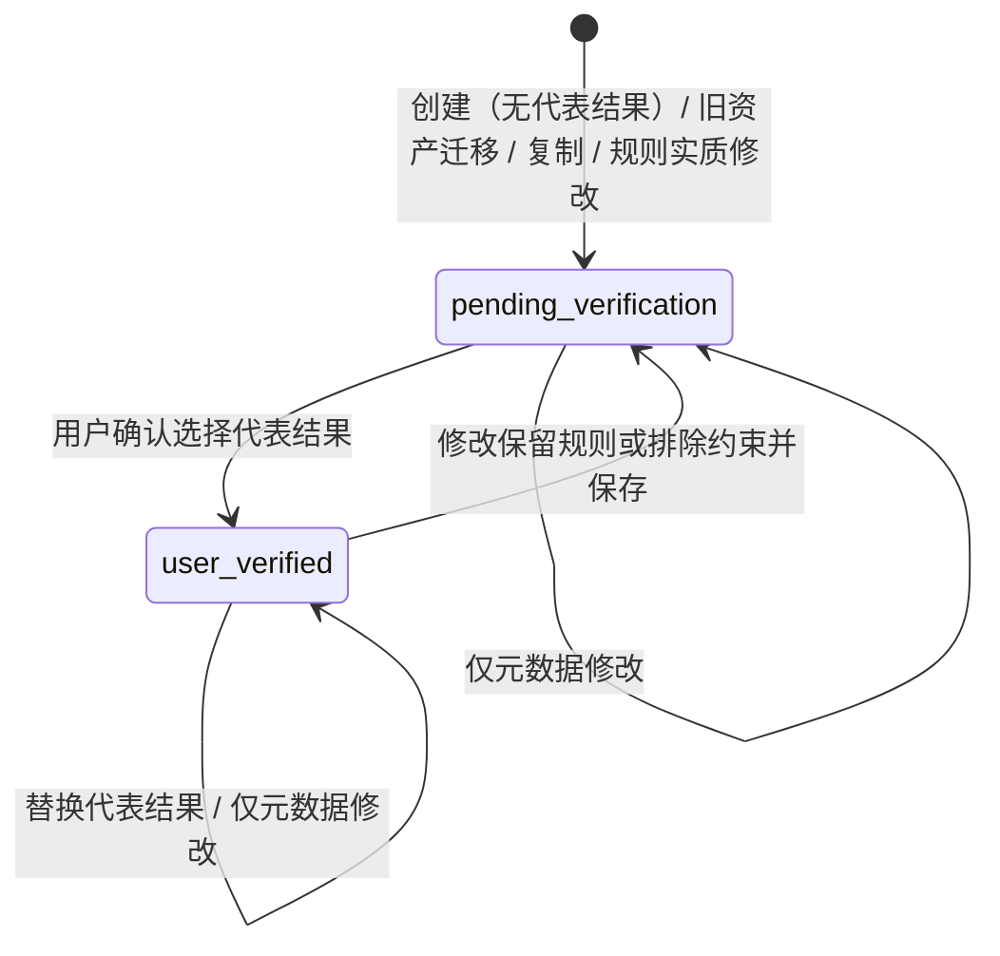

# 架构设计文档：可验证 Style Memory

_本文件只保留当前版本真正影响实现的架构决策、边界和契约；DDL、目录树、环境变量、实施故事等内容默认不放入正文。_

## 1. 系统摘要

本架构将 Style Memory 从"提示模板库"升级为"用户确认、结果佐证的可复用风格规则资产"：保存时确认代表结果与保留规则，由服务端派生"用户已验证 / 待验证"状态；详情页统一承担理解、编辑、验证与治理；复用经预检进入工作区，持续保持来源身份与一致的生成准备结论。核心闭环锚点：**保存 → 验证 → 复用**（Memory → Verify → Reuse）。实现上不新增外部服务与数据表，通过 `templates` 表扁平扩展与既有 Iteration 关联（`generation_tasks.sourceTemplateId`）承载全部能力。

## 2. 范围、非目标与成功标准

### 2.1 范围

继承 PRD §1.4 本期范围 13 条，收敛为架构交付：

1. **数据与状态**：`templates` 表新增验证状态、代表结果引用与风格规则四元组；旧数据迁移为"待验证"。
2. **列表**：验证状态筛选（全部 / 用户已验证 / 待验证）、扩展搜索（名称、说明、风格规则（含指纹与增强方向）、排除约束、变量名与标签）、最近使用排序、新卡片（验证状态 + 代表结果/来源图 + 规则摘要 + 变量数 + 最近使用）。
3. **详情**（新页面）：验证依据、保留的风格（风格指纹 / 核心保留规则）、可替换内容、排除约束与增强方向、完整提示（高级信息）、使用情况；编辑、选择/替换代表结果、复制、删除入口。
4. **保存流程**：从完成 Iteration 的三步向导（结果与代表结果 → 保留规则与可替换变量 → 命名）；从工作区保存草稿（无代表结果 → 待验证）。
5. **复用**：使用前预检（保留规则、必填变量门、工作区替换影响）；工作区持续身份条；生成准备结论单一来源。
6. **交互基建**：共享弹层焦点原语（focus trap / Escape / 焦点还原 / 背景隔离）与更多操作菜单键盘原语。
7. **状态完备**：加载、空态、无结果、未登录、部分来源缺失、保存冲突、服务不可用；导航术语统一为 "Style Memory"。

### 2.2 明确不做

继承 PRD §1.4 十条"明确不做"，另加架构层约束：

- 不做自动风格保持评分、相似度总分、渲染后智能审计（PRD 决策：先建立可信资产语义）。
- 不做多代表结果、结果排名、作品集管理（每条 Memory 首版最多一个代表结果）。
- 不做批量操作、版本树与回滚、多人协作、自定义标签体系、智能推荐排序。
- 不做浏览器插件、外部素材库、分享发布；不动生成模型选择与商业化；不做移动端工作台重设计。
- 架构层补充：不为 Memory 建独立新表（在 `templates` 上扁平扩展）；不做 API 路径与表名更名（见 ADR-8）；不做全文检索索引（ILIKE 足够，见 §8.6）；不回填旧数据的使用时间与规则（缺失如实标注，等用户补充）。

### 2.3 成功标准

| 指标 | 首版目标 |
| --- | --- |
| 功能验收 | PRD AC-01～AC-11 全部通过（定性；逐条见 §2.4 与实施方案各 Phase 验证目标） |
| 状态诚实性 | 任何路径下"用户已验证"均存在用户确认的代表结果；不存在系统代替用户确认的写入点（定性） |
| 删除边界 | 删除 Memory 后来源参考图、Iteration、代表结果与历史记录均可查看；被删 Memory 不可见不可用（定性） |
| 列表接口性能 | 单用户 ≤ 500 条量级下，列表查询 p95 ≤ 500ms |
| 详情接口性能 | 详情查询（含使用聚合与代表结果联查）p95 ≤ 300ms |
| 键盘可用性 | 保存、删除、复用预检弹层与更多菜单的键盘用例（AC-08）全部通过 Playwright 键盘断言 |

### 2.4 验收标准承接矩阵

| AC-ID | PRD 原文摘要 | 承接模块 | 关键链路 / 状态 | 风险 / 降级说明 |
| --- | --- | --- | --- | --- |
| AC-01 | 列表表达真实风格语义与验证状态 | 列表页、API 层、视图模型 | §6.1 列表联查；卡片渲染真实字段；加载骨架不显示虚假资产 | 视图模型重写后需回归既有卡片 e2e；名称派生标签代码删除 |
| AC-02 | 搜索、筛选与可见信息一致 | API 层、列表页 | §6.1 search 谓词覆盖可见字段（"来源说明"→`description` 的显式口径决策见 §6.1）；URL 持久化条件，返回恢复 | 变量搜索仅匹配 name+label，避免 JSON 键名噪声；来源图像无可检索文本，提示文案不承诺未覆盖信息 |
| AC-03 | 详情解释可信与复用 | 详情页、API 层 | §6.2 详情组装；完整提示仅高级信息 | 部分来源缺失时分区标注（联动 AC-09） |
| AC-04 | 诚实保存已验证/待验证 | 保存流程、API 层 | §6.3 双来源保存；状态服务端派生（ADR-1） | 预填缺失显式标记，不推测补齐；提交锁防重复 |
| AC-05 | 编辑/重验证/替换/复制不制造虚假状态 | 详情页、API 层 | §6.4 治理动作；PUT 状态回退；代表结果原子更新 | 状态回退由服务端数组比较判定，客户端提示与之一致；取消分支零写操作 |
| AC-06 | 复用前后来源身份与一致准备状态 | 复用模块、工作区集成 | §6.5 预检门 + 身份条 + 就绪单一来源（ADR-7）；`sourceTemplateId` 关联与使用聚合（ADR-4） | sessionStorage 握手失败回退 `?templateId=` 既有加载路径 |
| AC-07 | 取消/确认删除有安全终点 | 详情页、数据层 | §6.4 删除；FK `SET NULL` 迁移（ADR-2） | 迁移前 FK 为 `NO ACTION` 会阻断删除，属本架构必须修复项 |
| AC-08 | 弹层与菜单连续键盘操作 | 交互基建 | ModalDialog / DropdownMenu 原语（ADR-6） | 四个弹层 + 菜单迁移到共享原语；e2e 键盘断言 |
| AC-09 | 旧资产与部分缺失仍诚实可用 | 数据层、详情页 | 迁移默认回填 `pending_verification`；详情分区缺失说明 | 不自动继承、不回填伪造内容 |
| AC-10 | 空列表/未登录/服务异常可恢复 | 列表页、详情页 | 空态双入口（打开工作区 / 查看 Iterations）；条件持久化 URL；401/503 既有错误码口径；工作区快照不触碰 | 重试恢复原视图与浏览位置（游标编码于 URL）；现有空态两按钮均指向工作区，Phase B 需修正其一指向 Iterations |
| AC-11 | 保存冲突/失败后无损重试 | 保存流程、API 层 | §6.3 提交锁 + 409 名称冲突 + 向导状态保留 | 服务端同名检测防重复创建；成功后进入新详情 |

## 3. 用户流程与状态

### 3.1 主流程

**复用主流程（理解并使用一条可信 Memory）**

1. 主导航 "Style Memory" 进入列表；卡片显示验证状态、代表结果或来源图、核心保留规则摘要、变量数与最近使用。
2. 用户按规则/变量搜索并切换状态筛选；打开一条详情。
3. 详情先呈现验证依据（参考图、代表结果、来源 Iteration），再看保留规则、排除约束、可替换变量与使用情况。
4. 点击"使用这条 Memory"→ 预检弹层：展示保留规则、必填变量表单、当前工作区替换影响。
5. 补全必填变量后确认进入工作区；工作区持续显示 Memory 身份条（名称、验证状态、已恢复规则数、缺失变量）。
6. 所有区域基于同一就绪结论；用户主动生成，新 Iteration 与 Memory 保持关联（`sourceTemplateId`），详情使用情况随之更新。

**保存流程（两条来源）**：从完成 Iteration 保存走三步向导（并排参考图与本次结果 + "设为代表结果"勾选 → 确认保留规则/排除约束/可替换变量 → 命名与说明，高级信息含完整提示）；从工作区保存草稿（说明无代表结果，保存为待验证）。

**治理流程**：从卡片进入详情 → 查看/编辑（元数据修改保留状态；规则实质修改回退待验证）→ 选择/替换代表结果（候选来自相关已完成 Iteration）→ 复制（待验证开始）→ 删除（确认层说明保留边界，取消零变更）。

### 3.2 关键分支

| 分支名 | 入口/触发条件 | 架构处理方式 |
| --- | --- | --- |
| 保存时不设代表结果 | 向导步骤 1 未勾选 | 提交体不含 `representativeGenerationTaskId`，服务端派生 `pending_verification` |
| 预检取消 | 弹层取消/Escape/背景（非破坏性可关） | 零写操作；关闭还原焦点到触发按钮 |
| 预检必填未填全 | 存在 `trim(defaultValue) === ''` 的变量 | "进入工作区"禁用并列出缺失项（AC-06） |
| 工作区已有不同未完成内容 | sessionStorage 快照存在且 `currentTemplateId` ≠ 目标 Memory | 预检明确提示"将在确认后切换"（PRD 规则 20） |
| 规则实质修改 | PUT 携带的规则/排除数组与现存值不等 | 服务端置 `pending_verification`；前端保存前同口径提示 |
| 替换代表结果取消 | 选择器中取消 | 不发请求，原状态与原代表结果不变 |
| 删除取消 | 确认层取消 | 不发请求；确认层禁用背景点击关闭 |
| 旧 Memory | 迁移存量行 | 默认 `pending_verification`、规则四元组为空数组，详情分区显示"待补充" |
| 来源部分缺失 | 资产/迭代引用为空或图 URL 失效 | 详情对应分区单独说明，其余内容可用（AC-09） |
| 未登录 / 服务不可用 | 401 / 503 | 既有错误码口径；列表条件在 URL 中保留；工作区快照不触碰 |
| 保存冲突 / 暂时失败 | 409 `TEMPLATE_NAME_CONFLICT` / 5xx | 向导保留全部已确认内容与当前步骤；改名或重试；不产生重复 Memory |

### 3.3 状态机

验证状态是本期唯一新增领域状态机（两态），删除为行级终结而非状态：



关键规则：

1. **不变式**：`user_verified` 必有非空 `representativeGenerationTaskId`；该不变式只由三个服务端写点保证（POST 创建、representative-result 端点、PUT 回退），客户端任何请求体都不能直接写 `verificationStatus`。
2. **读时防御**：详情/列表读取时若 `user_verified` 但代表结果引用为空（理论不可达），DTO 一致性降级为 `pending_verification`，避免展示自相矛盾的状态。
3. 页面级状态（加载骨架、空态、错误态、保存进行中）由列表/详情组件结合 `StatePresenter` 既有模式承载，映射见 §8.2 降级链。

## 4. 系统上下文与模块职责

### 4.1 系统上下文

本需求**不引入任何新外部系统**，全部在既有 Next.js 单体边界内扩展：

```text
                     ┌─────────────────────────────────────────────────┐
                     │        Next.js 单体（本期改动全部在此边界内）        │
   浏览器 ──────────▶ │  列表页 / 详情页(新) / 保存向导 / 预检 / 身份条      │
  (Auth.js session)  │  /api/templates*（8 端点，2 个新增）               │
                     │  templates 表扩展 + generation_tasks FK 修正       │
                     └────────┬──────────────────────┬─────────────────┘
                              │ SQL                  │ fileUrl 只读引用
                     ┌────────▼────────┐    ┌────────▼────────┐
                     │   PostgreSQL    │    │  Cloudflare R2   │
                     └─────────────────┘    └─────────────────┘
   AI Pipeline（Replicate / Gemini / fal）——本期零改动，不在此图链路上
```

- **PostgreSQL**：`templates` 表新增扁平列与引用；`generation_tasks` 外键行为修正并补索引；无新表。
- **Cloudflare R2**：只读引用（代表结果/来源图 URL 解析自既有 `assets.fileUrl`），无新增对象写入。
- **Auth.js**：沿用 session 鉴权与 401 口径，无变更。
- **AI Pipeline（Replicate/Gemini/fal）**：本期零改动。风格规则来自保存时用户确认的配方快照，不做自动审计（PRD 决策）。

数据流向变化点：`templates` 行新增"验证依据"出边（`representative_generation_task_id → generation_tasks`）与"派生使用"入边（`generation_tasks.source_template_id → templates`，由 `NO ACTION` 修正为 `SET NULL`）；前端新增一个页面路由（`/workspace/templates/[id]`）与两个 API 子资源端点。

### 4.2 模块职责

| 模块 | 负责 | 上游输入 | 下游输出 |
| --- | --- | --- | --- |
| ① 数据与契约层 | schema 扩展、迁移、类型定义、repository 查询/写入（含状态派生与使用聚合） | API 层参数 | DB 行与 DTO |
| ② API 层 | templates 路由扩展 + 代表结果两个子资源端点；请求校验、限流、错误码 | 前端请求 | StyleMemory DTO |
| ③ 列表页模块 | 筛选/搜索/排序、卡片渲染、状态与空态、URL 条件持久化 | GET /api/templates | 卡片交互（查看详情/使用） |
| ④ 详情页模块 | 验证依据与规则展示、编辑表单、代表结果选择器、复制/删除治理动作 | GET/PUT/DELETE + 子资源端点 | 页面状态与动作结果 |
| ⑤ 保存流程模块 | Iteration 三步向导 + 工作区草稿保存；预填映射、提交锁、失败保留 | IterationDetail / 工作区状态 | POST /api/templates → 新详情 |
| ⑥ 复用与工作区集成模块 | 预检弹层、sessionStorage 握手、身份条、就绪结论统一、焦点原语 | Memory 详情 + 工作区快照 | 工作区状态更新、生成请求关联 |

UI 模块交互链路补充（arch-check 高频项，触发条件 → 状态变化 → 回调 → 数据更新）：

- **列表卡片"使用"**：点击 → 打开预检弹层（焦点进入首个必填输入）→ 填写/取消 → 取消则关层还原焦点零变更；确认则写快照并 `router.push('/workspace?templateId=…')`。"查看详情"→ `router.push('/workspace/templates/{id}')`，列表查询条件（search/status/cursor）编码在 URL，返回时恢复。
- **详情"编辑"**：进入编辑态（表单预填当前值）→ 修改规则/排除时页内即时显示"保存后状态将变为待验证" → 保存调 PUT → 成功后详情回读刷新（状态可能已回退）；取消编辑不发请求。
- **详情"选择代表结果"**（待验证详情的验证依据区，或已验证的"替换"）→ 打开候选选择器（GET representative-candidates 游标加载）→ 选中确认调 POST → 详情回读（`user_verified` + 新代表结果）；取消零请求。
- **详情"更多 → 删除"**：打开确认弹层（背景点击不可关闭）→ 取消还原焦点；确认调 DELETE → 成功后 `router.push('/workspace/templates')` 恢复原查询条件。
- **Iteration 保存向导**：三步间可往返（步骤状态保留在组件 state）；步骤 1 勾选变化即时联动步骤 3 的"保存后状态"文案；提交期间按钮锁定防重复；失败时错误条展示服务端 `error` 文案，全部输入保留。
- **身份条**：工作区挂载并存在 `currentTemplateId` 时渲染；数据来自 `use-workspace-state` 扩展的 `memoryIdentity`（名称/状态/规则数）与就绪派生的缺失变量清单；"查看"跳详情、"移除"清除 `currentTemplateId`（工作区内容保留）。

### 4.3 需要刻意避免的过度设计

- **不建 Memory 版本表/版本树**：规则修改回退状态即可，历史由 Iteration Memory 承担。
- **不建独立"代表结果资产表"或复制图片**：引用 `generation_tasks.resultAssetId` 即可（ADR-2）。
- **不冗余存储使用计数/最近使用字段**：读时聚合（ADR-4），避免双写一致性。
- **不引入 Redis/队列/Worker**：无异步任务新增，写操作均为同步低频请求。
- **不引入 Radix 等弹层依赖**：自建轻量焦点原语（ADR-6），控制依赖面。
- **不做全文检索引擎/向量搜索**：ILIKE + 单用户小数据量足够。
- **不建 Memory 标签/分类体系**：PRD 明确首版搜索基于真实内容。
- **不做 API/表更名**：`/api/templates` 与 `templates` 表为内部稳定契约，UI 术语单独统一（ADR-8）。

## 5. 关键架构决策（ADR）

### ADR-1：验证状态由服务端派生，客户端不可写入
- **选择**：`verificationStatus` 是存储字段但只能由服务端写点推导——POST 创建时按代表结果存在性派生；PUT 编辑时按规则数组是否实质变化回退；representative-result 端点置为已验证。请求体不接受 `verificationStatus`。
- **理由**：验证语义是产品信任边界，"用户已验证"必须对应真实用户动作；客户端直写会打开伪造验证的路径。比"每次读时全量推导"更简单——状态转移点少且可观测。
- **风险与对策**：前后端回退口径不一 → 回退判定算法在 §6.4 显式定义并双侧同口径实现 + 单测矩阵覆盖。

### ADR-2：代表结果与来源引用均为"引用不复制"，FK 统一 `ON DELETE SET NULL`
- **选择**：`representative_generation_task_id` 引用 `generation_tasks`（不复制图片资产）；既有 `generation_tasks.source_template_id` FK 由 `NO ACTION` 迁移为 `SET NULL`，新引用同样 `SET NULL`，并为 `source_template_id` 补单列索引。
- **理由**：单一事实源（结果图属于 Iteration）；AC-07 要求删除 Memory 不影响 Iteration，当前 FK 会直接阻断删除，属必须修复缺陷。不复制资产也避免 R2 双份对象与所有权混乱。
- **风险与对策**：引用指向的行理论上消失 → 读时防御降级（§3.3 规则 2）；当前产品无 Iteration 删除功能，风险仅为防御性。

### ADR-3：风格规则四元组以 `text[]` 扁平快照存储在 `templates` 表
- **选择**：新增 `retained_rules` / `negative_constraints`（用户确认、可编辑、触发状态回退）与 `style_tokens` / `enhancement_hints`（保存时快照、仅展示）四组 `text[]` 列，加 `description` 与 `verification_status`，不建任何新表。
- **理由**：与 Memory 一对一、读写场景单一，独立表违反扁平化偏好；`text[]` 支持直接 `array_to_string` 参与搜索。可编辑/展示两组字段按"是否触发回退"清晰分层，对齐 PRD 规则 15。
- **演进余地**：若未来需要规则级证据溯源（每条规则挂 observation id），届时再升级为 jsonb 结构，读取层已隔离在 repository。

### ADR-4：使用情况（最近使用、派生数量）读时聚合，不落冗余字段
- **选择**：`lastUsedAt = max(generation_tasks.createdAt where source_template_id = id)`、`derivedIterationCount = count(*)`，在列表/详情 SQL 中以 `LEFT JOIN LATERAL` 聚合，依赖新增的 `source_template_id` 索引。
- **理由**：写时冗余需要在生成链路加第二个写点，引入一致性风险；单用户量级下聚合成本可忽略。排序游标基于聚合值编码。
- **风险与对策**：用户 Memory 极多时列表变慢 → 量级阈值出现时再加缓存列，当前明确不做。

### ADR-5：预检确认值经 sessionStorage 一次性握手进入工作区
- **选择**：预检确认时更新既有 `style-gen-workspace-state` 快照（沿用 `primeWorkspaceSnapshotFromTemplate` 组装逻辑，合入预检已填变量），再导航 `/workspace?templateId=…`；工作区挂载消费快照。变量值不进 URL。
- **理由**：复用既有快照机制（已在生产使用），URL 携带长文本值脆弱且泄漏到历史记录；不引入全局状态库。
- **风险与对策**：快照写入失败或被并发覆盖 → 回退到 `?templateId=` 纯拉取路径，身份条仍显示缺失变量，行为退化为可见而非错误。

### ADR-6：自建共享弹层/菜单焦点原语，不引入 Radix
- **选择**：新建 `src/components/ui/modal-dialog.tsx`（focus trap、Escape、焦点还原、`aria-modal`、可选禁背景关闭）与 `src/components/ui/dropdown-menu.tsx`（方向键导航、Escape、焦点还原）；原语同时约束图标按钮与菜单项的最小命中面积 ≥ 44×44px（PRD 规则 29"舒适点击区域"）；确认类动作完成导航后，目标页面将初始焦点置于首要内容（PRD 键盘操作旅程第 4 步）；保存向导、删除确认、预检、更多菜单统一迁移。
- **理由**：仓库零 Radix 依赖，为一个 trap 引入组件库不值；AC-08 需要的是可断言的键盘行为而非组件生态。自建原语约百行级，可控可测。
- **风险与对策**：焦点管理边界情况（动态内容、screen reader）→ 原语配组件测试 + AC-08 Playwright 键盘断言兜底。

### ADR-7：生成准备结论单一来源，扩展 `render-readiness`
- **选择**：`deriveRenderReadiness` 输入增加 Memory 上下文（已恢复规则数、缺失变量名），输出结论对象由生成面板、证据面板与身份条共同消费；任何区域不得自行推导"是否可生成/是否有证据"的相反结论。
- **理由**：PRD 规则 22 与 AC-06 的"一处说有证据、另一处说在等待"问题根源是多头推导；既有 `render-readiness.ts` 已是单一派生函数，扩展它比新建并行机制成本低。
- **风险与对策**：旧消费方依赖字段形状 → 扩展为新增可选输入与字段，向后兼容。

### ADR-8：保留 `/api/templates` 路径与 `templates` 表名，仅统一 UI 术语
- **选择**：对外路由、表名、repository 名全部不动；导航文案统一为 "Style Memory"。实际改动点：`src/components/workspace/left-sidebar.tsx` 的 "Library" 标签改为 "Style Memory"、ariaLabel "Style Memory Library" 同步；`src/components/app-shell.tsx` 的 memory 变体已输出 "Style Memory"，无需改动。
- **理由**：更名是纯重构成本（迁移 + 全量消费方 + e2e 重写），无用户可感知收益；产品语言统一是 UI 层诉求。
- **演进余地**：若未来对外提供公开 API，再评估别名层。

### 5.9 待确认问题

无未决问题。设计期已决策（原问号项记录）：

- Q1 已决策：卡片"核心保留规则"显示 `retainedRules` 前 2 条以"·"连接（而非风格指纹 tokens），与 PRD 列表信息层级口径一致。
- Q2 已决策：排序首版仅"最近使用"（`COALESCE(lastUsedAt, updatedAt) DESC`），不做排序切换器；PRD 线框仅出现该排序。
- Q3 已决策："增强方向"预填按配方 `schemaVersion` 分支映射（V2 `optionalModifiers` / V1 `visualKeywords`），见 §6.3 步骤算法。
- Q4 已决策：旧数据不回填使用时间（显示"尚未使用"）与规则（显示"待补充"），等用户补充（AC-09 口径）。
- Q5 已决策：向导"设为代表结果"默认不勾选，避免代替用户确认（PRD 规则 12"主动勾选"）。

## 6. 运行链路

### 6.1 列表、搜索与筛选

1. 列表页挂载或条件变更，读取 URL 中的 `search` / `status` / `cursor` 并请求 `GET /api/templates?search=&status=&cursor=&limit=`（沿用既有游标契约：`limit` 默认 10、上限 50；`search` ≤ 100 字符，trim 后空串等同不过滤）。
2. 服务端单条 SQL：`WHERE user_id = ? [AND verification_status = ?] [AND search谓词]`，`ORDER BY COALESCE(last_used, updated_at) DESC, id DESC`，`LIMIT n+1` 判定 hasMore。
   - **search 谓词**（单子串、ILIKE、大小写不敏感）：`name` OR `description` OR `array_to_string(retained_rules, ' ')` OR `array_to_string(negative_constraints, ' ')` OR `array_to_string(style_tokens, ' ')` OR `array_to_string(enhancement_hints, ' ')` OR 变量聚合子查询。变量聚合算法：`(SELECT string_agg(coalesce(v->>'label', v->>'name'), ' ') FROM jsonb_array_elements(variables) v)`——只匹配变量名与标签，**不含** `defaultValue` 与 JSON 键名，避免 `"name"`、`"defaultValue"` 等英文键名造成假阳性。
   - **"来源说明"可搜索口径（PRD 规则 8 的显式决策，非静默收窄）**：来源在卡片/详情中以图像与迭代链接呈现，本身无可检索文本；PRD 所指可搜索的"来源说明"落在本架构的 `description`（说明字段——保存流程中用于描述来源与用途的文本），已纳入谓词。风格指纹与增强方向属详情可见的真实风格规则（PRD 范围第 3 条），一并纳入。搜索框提示文案只承诺：名称、说明、风格规则（含指纹与增强方向）、排除约束、变量名与标签。
   - **last_used 聚合**：`LEFT JOIN LATERAL (SELECT max(created_at) AS last_used, count(*) AS derived_count FROM generation_tasks WHERE source_template_id = templates.id)`。
   - **代表结果图**：`LEFT JOIN generation_tasks rep ON rep.id = representative_generation_task_id`，再 `LEFT JOIN assets ra ON ra.id = rep.result_asset_id` 取 `ra.file_url`。
3. 响应列表条目 DTO（§7.2）；游标 = 末条 `(sortTs, id)` 编码串，写入 URL 供返回恢复。

这条链路的实现原则：

- 搜索范围 = 卡片与详情用户可见字段（PRD 规则 8）；搜索框提示文案与实际谓词一致。
- `status` 与 `search` 可组合；筛选互斥单选。
- 查询条件与游标持久化在 URL，详情返回后原条件与浏览位置恢复（AC-02/AC-10）。

### 6.2 详情读取

1. `GET /api/templates/[id]`；未登录 401、非本人或不存在 404（既有口径）。
2. 服务端组装 DTO：来源参考图（`sourceAssetId → assets.file_url`，缺失为 null）、来源 Iteration `{id, createdAt}`、代表结果 `{iterationId, imageUrl, createdAt}`、规则四元组、`variables`、`content`（高级信息）、`usage {lastUsedAt, derivedIterationCount}`。
3. 读时一致性防御：`user_verified` 且代表结果引用为空 → DTO 状态降级 `pending_verification`。
4. 待验证且无代表结果时，验证依据区返回"可从相关已完成 Iteration 选择代表结果"的引导标记（前端文案渲染依据）。

实现原则：缺失分区标注、不虚构（AC-09）；完整提示仅在高级信息折叠区。

### 6.3 保存（两条来源共用一条提交链路）

**A. 从完成 Iteration 保存（三步向导）**

1. 入口为 Iteration 详情"保存为 Style Memory"；预填载荷来自 `IterationDetail`（按实际字段名）：`promptSnapshot → content`、配方（`recipe`；`recipeSource=snapshot` 优先，`fallback` 回退活引用）、`variables → variables`（`variablesSource` 同口径回退）、`sourceAssetId`、`id → sourceGenerationTaskId`（来源迭代即详情自身）、`resultFileUrl`（本次结果图展示）。
2. 步骤 1：并排参考图与本次结果 + "设为代表结果"勾选（默认不勾选，ADR-5/Q5）；文案说明勾选并保存后为"用户已验证"。
3. 步骤 2：确认保留规则与可替换变量。**规则预填算法**（按 `recipe.schemaVersion` 分支，缺失项显式标记"本次无 X"，不推测补齐）：
   - V2：`retainedRules ← styleInvariants[].value`（`kind=hard` 优先排序）；`negativeConstraints ← negativeConstraints`；`enhancementHints ← optionalModifiers[].defaultValue`（非空项）；`styleTokens ← styleFingerprint.tokens`。
   - V1：`retainedRules ← mustKeep`；`styleTokens ← styleTags`；`enhancementHints ← visualKeywords`；排除约束预填：流程 A（Iteration 保存）取 `negativePromptSnapshot`、流程 B（工作区保存）取工作区 `negativePromptText`，非空则整体作为一条排除约束。
   - 规则与排除约束可勾选、编辑、增删（用户输入为准）；`styleTokens` / `enhancementHints` 为快照随提交携带（frontend_computed）。
   - 同屏确认可替换变量及默认值（预填自 `variables`，可编辑，随提交携带）——PRD AC-04 的"确认变量"步骤在此完成。
4. 步骤 3：名称（必填 1–50，中性帮助文案，提交或失焦才显示错误）、说明（可选 ≤ 500）、高级信息折叠预览完整提示；底部"保存后状态"随步骤 1 勾选联动。
5. 提交 `POST /api/templates` 扩展体（§7.3）；服务端校验：`representativeGenerationTaskId` 若存在必须等于 `sourceGenerationTaskId` 且该任务属于本人、`completed`、有 `resultAssetId`（复用既有来源迭代校验）；名称冲突 409。
6. 服务端派生状态：有合法代表结果 → `user_verified`，否则 `pending_verification`；成功 201 返回完整记录，前端 `router.push` 至新详情。

**B. 从工作区保存草稿**

1. 入口为工作区保存按钮（现有位置）；向导首屏说明"当前没有代表结果，本次保存为待验证，稍后可从相关完成 Iteration 补充"。
2. 步骤 2 预填自当前工作区配方（现行链路均为 V2 配方），同屏确认保留规则、排除约束与可替换变量及默认值；步骤 3 命名；提交体不含 `representativeGenerationTaskId` 与 `sourceGenerationTaskId`，携带 `sourceAssetId`（工作区有参考图时）。
3. 服务端派生 `pending_verification`；成功进入新详情，详情显示工作区来源与已确认内容，不展示虚构代表结果。

实现原则：验证状态只由服务端派生（ADR-1）；提交期间锁定重复提交；失败保留全部步骤内容与当前步骤，409 优先展示服务端文案（AC-04/AC-11）；保存动作不产生任何生成任务。

### 6.4 治理动作（编辑、重验证、替换、复制、删除）

1. **编辑**：详情编辑表单仅暴露名称/说明/变量默认值/保留规则/排除约束 → `PUT /api/templates/[id]`。**状态回退判定算法**：服务端加载现存行，对 `retainedRules` 与 `negativeConstraints` 分别做"逐元素 trim → 排序 → 逗号连接"的规范化串比较（顺序无关的集合语义）；任一集合与请求值不等 → `verificationStatus = 'pending_verification'`（代表结果引用保留展示）。前端保存前提示使用同一算法的客户端实现。`content` 仍可经既有工作台链路更新（向后兼容），但详情编辑界面不暴露，且不触发回退（PRD 口径：验证只对规则集合成立）。
2. **选择/替换代表结果**：`GET /api/templates/[id]/representative-candidates` —— **相关迭代定义**：`generation_tasks.source_template_id = memory.id OR generation_tasks.id = memory.source_generation_task_id`，且 `status='completed'` 且 `result_asset_id` 非空，按 `created_at DESC` 游标分页。用户选中确认 → `POST /api/templates/[id]/representative-result {generationTaskId}`，服务端校验同上集合归属后原子更新 `representative_generation_task_id` 并置 `user_verified`；取消不发任何请求。
3. **复制**：`POST /api/templates/[id]/duplicate`（既有端点扩展）——复制 `content` / `variables` / `description` / 规则四元组 / `sourceAssetId` / `sourceImageUrl` / `sourceGenerationTaskId`（注：`description` 与 `sourceGenerationTaskId` 为本期新增复制字段，既有 `duplicateTemplate` 不复制它们）；**不复制** `representativeGenerationTaskId`；状态固定 `pending_verification`；名称追加 `"(copy)"` 并按既有算法去重；响应后跳转复制品详情并提示重命名。
4. **删除**：确认弹层（禁背景关闭）→ `DELETE /api/templates/[id]` 物理删除 `templates` 行；`generation_tasks.source_template_id` 由 FK `SET NULL` 自动解链；不触碰 `assets` / `analysis_tasks` / `generation_tasks` 行。成功后回列表恢复原查询条件；取消零写操作。

实现原则：所有取消分支零写操作；状态转移唯一写点在服务端；候选集、复制结果、删除边界都以服务端判定为准，前端仅展示。

### 6.5 复用预检与工作区集成

1. 卡片/详情"使用"→ 预检弹层读取 Memory 详情：顶部状态徽标 + 代表结果缩略（已验证时）；"将保留"清单（`retainedRules` 全量）；"开始前替换"表单——**必填变量定义**：`trim(defaultValue) === ''` 的变量，逐个输入框必填；其余变量折叠为"其他变量（N 项）"。
2. **工作区影响判定算法**：读取 sessionStorage `style-gen-workspace-state` 现值——快照不存在或 `referenceImageUrl` 与 `promptText` 均为空 → "当前工作区为空，可直接进入"；`currentTemplateId === memory.id` → "已在使用这条 Memory"；否则 → "当前工作区有不同的未完成内容，将在确认后切换"。未完成内容的判定依据：快照存在且含参考图或提示文本即视为未完成内容（保守口径；PRD 规则 20 的"没有不同未完成内容可直接进入"即此判定为否的情形）。
3. 必填变量未填全 → "进入工作区"禁用并列出具体缺失项（AC-06）；取消（按钮/Escape/背景，非破坏性）→ 关闭、还原焦点、零变更。
4. 确认 → 更新 sessionStorage 快照（组装逻辑同 `primeWorkspaceSnapshotFromTemplate`，将预检已填变量合入变量值与模板变量）→ `router.push('/workspace?templateId=…')`。
5. 工作区挂载消费快照并记录 `currentTemplateId`（既有机制），扩展 `memoryIdentity = { id, name, verificationStatus, retainedRuleCount }`；身份条渲染名称、状态、已恢复规则数与缺失变量清单（来自就绪派生），提供"查看"（跳详情）与"移除"（清 `currentTemplateId`，内容保留）。
6. **就绪统一**：`deriveRenderReadiness` 输入增加 Memory 上下文，生成面板、证据面板、身份条消费同一结论对象；"仍需填写 X 项"与"可生成"只能来自该对象（ADR-7，AC-06/PRD 规则 22）。
7. 生成：既有 `POST /api/generation` 携带 `sourceTemplateId` → 新 Iteration 显示来源 Memory（既有 `sourceTemplateName` 解析）；本 Memory 的 `lastUsedAt` 与派生计数随 §6.1/§6.2 聚合自然更新。

实现原则：预检确认不自动生成（PRD 规则 23）；变量值不进 URL（ADR-5）；快照握手失败回退 `?templateId=` 拉取路径，身份条如实显示缺失变量。

## 7. 领域对象与关键契约

### 7.1 核心对象

| 对象 | Source of Truth | Owner | 用途 |
| --- | --- | --- | --- |
| Style Memory（`templates` 行扩展） | PostgreSQL `templates` 表 | 数据层模块（repository 唯一写入方） | 可复用风格规则资产本体 |
| 验证状态 `verificationStatus` | `templates.verification_status` 列 | API 层三个服务端写点（§3.3） | 信任边界表达 |
| 代表结果 | `templates.representative_generation_task_id → generation_tasks.result_asset_id` 引用链 | API 层（representative-result 端点 / POST 校验） | 验证依据；不复制资产 |
| 规则四元组 | `templates` 四个 `text[]` 列 | 保存/编辑写点 | 详情与卡片展示、状态回退判定 |
| 使用情况 | `generation_tasks.source_template_id` 关联的聚合 | 读时聚合（ADR-4） | 最近使用与派生数量 |
| 候选迭代集合 | §6.4 相关性定义的服务端查询 | API 层 | 代表结果选择器数据源 |
| 工作区 Memory 身份 | `use-workspace-state` 的 `currentTemplateId` / `memoryIdentity` + sessionStorage 快照 | 复用与工作区集成模块 | 身份条与就绪统一 |

### 7.2 推荐最小 Schema

```ts
/** 验证状态（DB varchar(20) + CHECK 约束） */
export type TemplateVerificationStatus = "user_verified" | "pending_verification";

/** templates 行（repository 层读出；列表/详情 DTO 由此序列化） */
export interface StyleMemoryRecord {
  id: string;                            // ULID, system_generated
  name: string;                          // user_input, 1-50
  description: string | null;            // user_input, ≤500
  content: string;                       // 完整提示（高级信息）, ≤10000
  variables: TemplateVariable[];         // 用户确认, ≤20 项（既有结构）
  retainedRules: string[];               // user_input, ≤12 条 × ≤200 字符（可编辑，触发回退）
  negativeConstraints: string[];         // user_input, ≤12 条 × ≤200 字符（可编辑，触发回退）
  styleTokens: string[];                 // 保存时快照, ≤16 条 × ≤80 字符（仅展示）
  enhancementHints: string[];            // 保存时快照, ≤16 条 × ≤80 字符（仅展示）
  verificationStatus: TemplateVerificationStatus; // derived（服务端，ADR-1）
  representativeGenerationTaskId: string | null;  // user 选择 + 服务端校验（ADR-2）
  sourceAssetId: string | null;          // frontend_computed（既有）
  sourceImageUrl: string | null;         // derived from asset（既有）
  sourceGenerationTaskId: string | null; // frontend_computed（既有）
  userId: string;                        // system_generated（session）
  createdAt: Date;
  updatedAt: Date;
}

/** GET /api/templates 列表条目 */
export interface StyleMemoryListItem {
  id: string;
  name: string;
  verificationStatus: TemplateVerificationStatus;
  retainedRulesPreview: string[];   // 前 2 条（卡片摘要）
  variableCount: number;
  sourceImageUrl: string | null;    // 来源图（卡片次预览/待验证主预览）
  representativeImageUrl: string | null; // 代表结果图（已验证主预览）
  lastUsedAt: string | null;        // ISO 8601，无使用为 null（显示"尚未使用"）
  updatedAt: string;
}

/** GET /api/templates/[id] 详情（含高级信息与使用情况） */
export interface StyleMemoryDetail extends Omit<StyleMemoryRecord, "createdAt" | "updatedAt"> {
  sourceGenerationTask: { id: string; createdAt: string } | null; // 来源 Iteration
  representativeResult: { iterationId: string; imageUrl: string | null; createdAt: string } | null;
  usage: { lastUsedAt: string | null; derivedIterationCount: number };
  createdAt: string;
  updatedAt: string;
}

/** 代表结果候选条目 */
export interface RepresentativeCandidate {
  id: string;                 // generation task id
  imageUrl: string | null;    // result asset fileUrl
  promptSummary: string;      // 服务端截断 120 字符（既有口径）
  createdAt: string;
}
```

嵌套均 ≤ 2 层；`StyleMemoryDetail` 为扁平记录 + 三个一层子对象。

### 7.3 API 边界

| 接口 | 用途 | 说明（含字段数据来源） |
| --- | --- | --- |
| `POST /api/templates` | 两条保存流程提交 | body：`name`(user_input)、`description?`(user_input)、`content`(user_input)、`variables?`(user 确认)、`retainedRules?`(user_input)、`negativeConstraints?`(user_input)、`styleTokens?`/`enhancementHints?`(frontend_computed 预填快照)、`sourceAssetId?`/`sourceGenerationTaskId?`(frontend_computed)、`representativeGenerationTaskId?`(user_input，须等于 sourceGenerationTaskId)。服务端派生状态；201 返回记录；409 名称冲突 |
| `GET /api/templates` | 列表 + 搜索 + 状态筛选 | query：`search`(user_input ≤100)、`status`(all/user_verified/pending_verification)、`cursor`、`limit`(默认 10 上限 50)；返回条目见 §7.2 |
| `GET /api/templates/[id]` | 详情 | 含使用聚合与代表结果联查；404/401 既有口径 |
| `PUT /api/templates/[id]` | 编辑五字段 | `name`/`description`/`variables`(仅默认值编辑)/`retainedRules`/`negativeConstraints`；服务端做回退判定（§6.4 算法）；`content` 兼容既有调用方 |
| `DELETE /api/templates/[id]` | 删除 | 204；FK `SET NULL` 解链；不触碰其他表 |
| `POST /api/templates/[id]/duplicate` | 复制 | 201 复制品（`pending_verification`、无代表结果）；名称 "(copy)" 去重 |
| `POST /api/templates/[id]/representative-result` | 设置/替换代表结果 | body：`generationTaskId`(user_input)；校验相关集（§6.4）；原子置 `user_verified` |
| `GET /api/templates/[id]/representative-candidates` | 候选迭代列表 | 相关集定义见 §6.4；`cursor`/`limit` 游标分页 |

共 8 个端点（≤ 10）；每个端点对应 §3.1/§6 中具体用户交互。限流口径见 §8.3：现状仅 `POST /api/templates` 接入；Phase A 统一覆盖全部 5 个写端点（POST / PUT / DELETE / duplicate / representative-result），读端点不限流。

### 7.4 状态流转

状态机见 §3.3（两态 + 终结删除，不重复作图）。持久化写点矩阵：

| 写点 | 状态输入 | 状态输出 |
| --- | --- | --- |
| `POST /api/templates` | — | 有合法代表结果 → `user_verified`；否则 `pending_verification` |
| `POST /api/templates/[id]/representative-result` | 任意 | `user_verified` |
| `PUT /api/templates/[id]` | `user_verified` | 规则集合实质变化 → `pending_verification`；否则不变 |
| `POST /api/templates/[id]/duplicate` | 任意 | 复制品固定 `pending_verification` |
| 存量迁移 `0005` | — | 全部 `pending_verification`（默认值回填） |

### 7.5 数据边界

| 存储 | 职责 |
| --- | --- |
| PostgreSQL | 唯一事实源：Memory 本体、验证状态、引用关系、Iteration 关联与聚合来源 |
| Cloudflare R2（经 `assets.fileUrl`） | 图像对象存储；本期只读引用，无新增写入 |
| sessionStorage（`style-gen-workspace-state`） | 工作区快照与预检握手（易失、可由 `?templateId=` 路径重建）；不作为事实源 |
| URL（列表 `search`/`status`/`cursor`、工作区 `templateId`） | 可恢复的导航与筛选状态 |

### 7.6 命名与标识规则

- **ID**：沿用统一 ULID（26 位），不引入类型前缀体系。
- **枚举值**：DB `verification_status` 用 `varchar(20)` + CHECK（`'user_verified' | 'pending_verification'`），与 TS 类型字面量一致。
- **JSON / DB 命名**：API 与 TS 沿用 camelCase；新列沿用 snake_case（`retained_rules` 等）。
- **术语映射（全文档与代码统一）**：UI 与接口统一 "Style Memory"（导航 "Library" 改名，ADR-8）；"代表结果" = `representativeGenerationTaskId`；"核心保留规则" = `retainedRules`；"排除约束" = `negativeConstraints`（沿用 V2 配方同名概念，不再使用 `negativePrompt` 指代该列表）；"风格指纹" = `styleTokens`（源自配方 `styleFingerprint.tokens`）；"增强方向" = `enhancementHints`；"完整提示" = `content`（高级信息，不称"提示模板正文"）；"来源说明"（PRD 规则 8）= `description`（说明字段）——来源图像与迭代链接无可检索文本，可搜索的来源文本即说明。内部路径与表名保留 `templates`（ADR-8）。

## 8. 非功能需求、风险与运行策略

### 8.1 性能与吞吐量目标

| 指标 | 目标 | 预期并发 |
| --- | --- | --- |
| 列表查询（含 2 个 LATERAL/JOIN 聚合） | p95 ≤ 500ms（单用户 ≤ 500 条 Memory 量级） | 单用户低并发浏览 |
| 详情查询 | p95 ≤ 300ms | 同上 |
| 保存/编辑/代表结果写操作 | 同既有 templates 写路径量级（同步、无外部调用） | 写操作 30 次/小时/IP 限流内 |
| 搜索 | ILIKE 单子串，无跨用户查询；量级外表现见 §8.6 风险 | — |

### 8.2 可靠性、错误处理与降级策略

错误处理沿用既有结构化口径：401 `UNAUTHORIZED`、404 `TEMPLATE_NOT_FOUND`、409 名称冲突（现状双轨：POST 返回 `TEMPLATE_NAME_CONFLICT`、PUT 返回 `CONFLICT`；Phase A 统一为 `TEMPLATE_NAME_CONFLICT`，编辑改名冲突与保存冲突同码）、429 `RATE_LIMITED`、5xx `SERVICE_UNAVAILABLE`（DB 不可用识别逻辑沿用），响应均含 `code` + `retryable`。降级链按用户体验影响从小到大：

- **L1 代表结果图 URL 失效**：已验证卡片回退来源图 + "代表结果图暂不可用"标注；详情分区说明；验证状态如实不变。
- **L2 部分来源缺失**（旧资产/资产删除防御分支）：详情对应分区"来源缺失/待补充"说明，其余内容照常可用（AC-09）。
- **L3 保存冲突或服务暂不可用**：向导保留全部步骤内容；409 展示服务端文案引导改名；5xx 可直接重试；不产生重复 Memory（服务端同名检测）。
- **L4 列表/详情服务不可用**：错误态保留 URL 中的搜索/筛选/游标与工作区快照；重试成功恢复原视图与位置（AC-10）。
- **L5 登录失效**：登录引导；登录后回原入口并恢复查询条件；工作区本地内容始终保留。

### 8.3 安全与反滥用策略

| 项目 | 首版策略 |
| --- | --- |
| 认证与授权 | Auth.js session 逐请求校验；repository 全查询强制 `userId` scope；代表结果候选校验任务归属本人 |
| 输入校验 | 名称 1–50；说明 ≤500；规则/排除 ≤12 条 × ≤200 字符；快照 token ≤16 条 × ≤80 字符；`content` ≤10000（沿用）；数组与长度上限防 JSON 膨胀滥用 |
| 限流 | 现状仅 `POST /api/templates` 接入内存级滑动窗口（30 次/小时/IP，路由内本地实现）；Phase A 抽离到既有 `src/lib/rate-limit.ts` 并让 PUT / DELETE / duplicate / representative-result 全部写端点统一接入 |
| AI 应用安全 | 本期**无新增模型调用**（规则为用户确认、无自动审计，PRD 决策）；无新 Prompt 注入面；既有分析管线不动；API Key 仍仅服务端持有 |
| 敏感数据 | 不打印凭据；日志不输出规则全文（仅计数与 id） |

### 8.4 成本控制预期

| 模块 | 预估单次成本 | 首版控制策略 |
| --- | --- | --- |
| 全部新增链路 | 0 新增按量外部成本（纯 DB 查询 + R2 既有 URL 读取） | 无预算告警新增项 |
| 数据库迁移 | 一次性（单表加列 + FK 重建 + 索引） | 低峰执行；`db:reset` 演练验证 |

无成本失控降级场景（不涉及按量计费外部服务）。

### 8.5 可观测性

沿用既有结构化 JSON 日志，无新基建：`template_created` / `template_updated` 增记 `verificationStatus`、规则计数、是否含代表结果；新增事件 `representative_result_set {templateId, generationTaskId, action: "set"|"replace"}`、`template_verification_reset {templateId, trigger: "rules"|"constraints"}`、`style_memory_reused {templateId}`（预检确认时）。告警矩阵不变。

### 8.6 主要风险

| 风险 | 影响 | 缓解方式 |
| --- | --- | --- |
| 焦点原语迁移引入键盘回归 | AC-08 失败、键盘用户受阻 | 共享原语 + 组件测试 + AC-08 Playwright 键盘断言；存量四弹层一次性迁移清单 |
| FK 迁移（`NO ACTION → SET NULL`）锁表或失败 | 删除链路不可用 / 迁移回滚 | 迁移 SQL 复核；本地 `db:reset` 全量演练；低峰执行 |
| 前后端状态回退口径不一致 | 虚假验证状态（违反核心不变式） | 判定算法单点定义（§6.4）双侧实现 + 单测矩阵（改规则/改排除/改序/仅改空白） |
| sessionStorage 握手丢失或被覆盖 | 预检填写的变量未带入工作区 | 回退 `?templateId=` 拉取路径；身份条显示缺失变量，退化为可见而非错误 |
| ILIKE 搜索在量级增长后变慢 | 列表超时 | 当前量级可忽略；出现阈值后先加 `pg_trgm` 索引（明确不在本期） |
| 存量 Memory 全量"待验证"引起困惑 | 用户感知资产"降级" | 列表/详情文案按 PRD 口径说明补充验证路径（AC-09）；不回填伪造 |
| 既有 e2e（template.spec 等）大范围受影响 | 回归门禁红 | Phase B/C 内同步更新受影响 spec，最后跑 `verify:acceptance` 全量 |

## 9. 实施方案

### Phase A：数据与 API 闭环

**后端**

1. `src/lib/db/schema.ts` — `templates` 新增 `verification_status`（默认 `pending_verification` + CHECK）、`description`、`retained_rules` / `negative_constraints` / `style_tokens` / `enhancement_hints`（`text[]` 默认 `{}`）、`representative_generation_task_id`（FK `ON DELETE SET NULL`）；`generation_tasks.source_template_id` FK 改 `SET NULL` 并新增单列索引。
2. `drizzle/0005_*.sql` — `pnpm db:generate` 生成后人工复核（FK 重建语句、默认值回填、CHECK），`db:push` + `db:reset` 各演练一次。
3. `src/types/models.ts` — 新增 §7.2 全部类型与 `TemplateVerificationStatus`。
4. `src/lib/repositories/template-repository.ts` — 列表联查（search 谓词/LATERAL 聚合/代表结果 JOIN/新游标）、详情组装（含读时防御降级）、创建（状态派生 + 代表结果校验）、更新（§6.4 规范化数组比较回退）、`duplicate`（不复制验证字段）、代表结果原子更新、候选查询。
5. `src/app/api/templates/route.ts` — POST 扩展体校验与派生；GET `status` 筛选 + 扩展 search + 新响应。
6. `src/app/api/templates/[id]/route.ts` — GET 详情 DTO；PUT 编辑语义与回退；PUT 名称冲突 code 由 `CONFLICT` 统一为 `TEMPLATE_NAME_CONFLICT`（§8.2 双轨说明）。
7. `src/app/api/templates/[id]/representative-result/route.ts`、`.../representative-candidates/route.ts` — 两个新端点（校验 + 接入限流）。
8. 限流统一：将 `POST /api/templates` 路由内的本地限流实现抽离到既有 `src/lib/rate-limit.ts`，全部写端点（POST / PUT / DELETE / duplicate / representative-result）统一接入（30 次/小时/IP）。
9. 相邻测试：repository 与两个路由的 `__tests__`，覆盖负向（越权、非 completed、非相关集、名称冲突、规则改序不回退/实质变更回退、旧数据默认值）。

验证目标：`pnpm verify:fast` 绿；迁移在本地一次性应用成功；AC-04/05/07/11 的服务端语义有契约测试证据。

### Phase B：列表、详情与交互基建

**前端**

1. `src/components/ui/modal-dialog.tsx` + `src/hooks/use-focus-trap.ts` — 弹层原语（trap / Escape / 焦点还原 / `aria-modal` / 可选禁背景关闭）。
2. `src/components/ui/dropdown-menu.tsx` — 更多操作菜单键盘原语（方向键 / Escape / 焦点还原 / 图标按钮可访问名称 / 命中面积 ≥ 44×44px）。
3. `src/lib/style-memory-view-model.ts` — 重写：真实字段驱动（状态徽标文案、规则摘要、预览选择：已验证→代表结果主预览 + 来源标注，待验证→来源图或"无预览"），徽标同时含文字与视觉标识、不只依赖颜色（PRD 规则 3），删除 `NAME_TAG_RULES` 名称派生逻辑。
4. `src/app/workspace/templates/page.tsx` + `src/components/workspace/template-card.tsx` — 状态筛选、一致搜索提示、URL 条件持久化、最近使用排序、空态/未登录/服务异常/骨架；空态双入口（打开工作区 / 查看 Iterations，现有代码两按钮均指向工作区需修正）；清除搜索等页面级图标按钮遵循 ≥ 44×44px 命中面积与可理解名称（PRD 规则 29）。
5. `src/app/workspace/templates/[id]/page.tsx`（新）— 详情四分区 + 高级信息折叠 + 编辑表单（回退提示）+ 代表结果选择器 + 复制 + 删除确认（迁移到原语）。
6. 导航术语统一：`src/components/workspace/left-sidebar.tsx` 的 "Library" 标签 → "Style Memory"、ariaLabel 同步（`src/components/app-shell.tsx` 已输出 "Style Memory"，仅核对无回归）。
7. 组件测试 + e2e：更新 `template.spec.ts` / `ai-first-style-memory.spec.ts` / `template-default-values.spec.ts` 受影响用例，新增 AC-01/02/03/08/09/10 场景。

验证目标：`pnpm verify:fast` 绿；AC-01/02/03/08/09/10 对应 targeted e2e 通过（键盘用例使用 Playwright keyboard API 断言焦点与 Tab 循环、确认导航后结果页初始焦点落点，图标操作按钮断言命中面积 ≥ 44×44px）。

### Phase C：保存流程与工作区集成

**前端**

1. `src/lib/style-memory-prefill.ts`（新）— 配方 → 规则四元组预填映射（V1/V2 分支 + 缺失标记），单元测试覆盖两种 schemaVersion 与 fallback 配方。
2. `src/components/iterations/save-style-memory-dialog.tsx` — 重构为三步向导（步骤状态机、勾选联动状态文案、提交锁、失败保留、成功跳详情、焦点原语）。
3. `src/components/workspace/template-save-dialog.tsx` — 草稿保存重构（无代表结果说明 → 规则确认 → 命名，`pending_verification` 预期展示）。
4. `src/components/style-memory/reuse-precheck-dialog.tsx`（新）— 预检（必填变量门、工作区影响判定、sessionStorage 握手、取消零变更）。
5. `src/hooks/use-workspace-state.ts` — `memoryIdentity` 扩展；`src/lib/render-readiness.ts` — Memory 上下文输入与结论字段扩展（向后兼容），统一消费方（生成面板/证据面板/身份条）。
6. `src/components/workspace/memory-identity-bar.tsx`（新）+ `src/app/workspace/page.tsx` — 身份条挂载、快照消费合入预检变量。
7. e2e：新增 AC-04/05/06/07/11 场景；回归 `workspace-ai-first-iteration-memory.spec.ts` 等既有链路。

验证目标：`pnpm verify:acceptance` 全绿（含存量回归）；AC-01～AC-11 逐条有用例映射且通过；按仓库路由表执行最终 `verify:full` 确认跨切面无回归。

## 10. 架构结论

本期架构的核心判断：**可验证 Style Memory 是一次"资产语义升级"而非新系统建设**——全部能力落在 `templates` 表扁平扩展、两个子资源端点、一个新页面与既有工作区机制的延长线上，不新增外部服务、数据表或异步任务。三条设计主线保证 PRD 信任语义落地：验证状态的服务端单一派生（ADR-1）、代表结果与删除边界的引用不复制（ADR-2）、生成准备结论的单一来源（ADR-7）。必须修复的既有缺陷是 `source_template_id` 外键的 `NO ACTION` 行为，它是 AC-07 的硬前置。演进方向上，规则级证据溯源、多代表结果、全文检索与自动风格评分均被显式推迟（§4.3），待首版验证资产语义成立后再评估。
