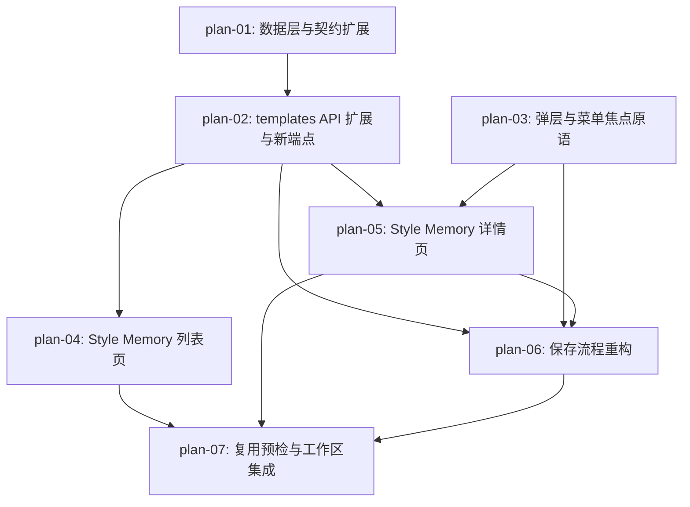

# 实现计划：可验证 Style Memory

## 1. 计划入口

把 Style Memory 从"提示模板库"升级为"用户确认、结果佐证、可理解且可安全复用的风格规则资产"：保存时确认代表结果与保留规则，服务端派生"用户已验证 / 待验证"状态；详情页统一承担理解、编辑、验证与治理；复用经预检进入工作区并保持来源身份与一致的生成准备结论。全部改动落在既有 Next.js 单体内（templates 表扁平扩展、2 个新 API 子资源端点、1 个新页面路由），不新增外部服务与数据表。

- 来源架构：`docs/14-可验证Style-Memory/14-1-架构文档-可验证Style-Memory.md`（经 3 轮 arch-check 收敛，r3 结论可进入开发）
- 上游需求：`docs/14-可验证Style-Memory/14-0-需求设计-可验证Style-Memory.md`（AC-01～AC-11 为验收 SSOT）
- 设计系统：`docs/design/DESIGN.md`（The Precision Frame）
- 核心闭环：保存 → 验证 → 复用（Memory → Verify → Reuse）
- 计划组织：功能维度，7 个 PLAN 文件
- 权威边界：README 只维护跨 PLAN 索引、验收追踪、执行拓扑和状态机；具体实现以各 `plan-*.md` 为准。

## 2. 执行拓扑



| 阶段 | 功能 | 目标 | 并行度 |
| --- | --- | --- | --- |
| Phase 1 | plan-01, plan-03 | 数据契约与交互基建就绪，互不依赖 | 2 |
| Phase 2 | plan-02 | 8 端点 API 契约落地 | 1 |
| Phase 3 | plan-04, plan-05 | 列表与详情两个用户界面并行 | 2 |
| Phase 4 | plan-06 | 保存流程（依赖详情路由作为保存成功跳转目标） | 1 |
| Phase 5 | plan-07 | 预检 + 工作区集成 + 最终验收回归 | 1 |

执行顺序说明：plan-01 与 plan-03 无依赖可并行；plan-02 消费 plan-01 的 repository 与类型；Phase 3 列表与详情并行（详情另需 plan-03 原语）；plan-06 的保存成功断言依赖 plan-05 的详情路由（AC-04"进入新详情"）；plan-07 接管列表与详情的"使用"入口、依赖保存链路就绪并做全量回归，必须最后执行。每个功能遵循 E2E-TDD：red spec 先行（当前步骤 red-e2e），red 证据有效后进入实现。

## 3. 验收标准追踪矩阵

| AC-ID | 需求原文 | 架构承接 | 计划承接 | 验证方式 | 当前状态 |
| --- | --- | --- | --- | --- | --- |
| AC-01 | 列表能够表达真实风格语义和验证状态 | §2.4 / §6.1 / §4.2-③ | plan-01, plan-02, plan-04 | plan-01/02 契约测试 + plan-04 验收标准（e2e/style-memory-list.spec.ts） | done |
| AC-02 | 搜索、筛选和可见信息保持一致 | §6.1（search 谓词与"来源说明"口径） | plan-02, plan-04 | plan-02 API 测试（谓词/组合筛选）+ plan-04 验收标准 e2e | done |
| AC-03 | 详情能够解释一条 Memory 为什么可信以及如何复用 | §6.2 / §4.2-④ | plan-02, plan-05 | plan-05 验收标准（e2e/style-memory-detail.spec.ts） | done |
| AC-04 | 用户可以诚实地保存已验证或待验证 Memory | §6.3 / §4.2-⑤ | plan-02, plan-06 | plan-02 状态派生测试 + plan-06 验收标准（e2e/style-memory-save-flows.spec.ts） | done |
| AC-05 | 编辑、重新验证、替换代表结果和复制不会制造虚假验证状态 | §6.4 / §3.3 写点矩阵 | plan-02, plan-05 | plan-02 回退/原子更新测试 + plan-05 验收标准 五连动作 e2e | done |
| AC-06 | 复用前后保持来源身份与一致的准备状态 | §6.5 / ADR-7 | plan-07 | plan-07 验收标准（e2e/style-memory-reuse.spec.ts）+ 最终回归（usage 聚合由 plan-01/02 内部支撑） | done |
| AC-07 | 取消或确认删除都有明确且安全的终点 | §6.4 / ADR-2 FK `SET NULL` | plan-01, plan-02, plan-05 | plan-01 迁移演练证据 + plan-05 验收标准 删除双分支 e2e | done |
| AC-08 | 弹层与操作菜单支持连续键盘操作 | ADR-6 / §4.2 交互链路 | plan-03, plan-04, plan-05, plan-06, plan-07 | plan-03 组件测试 + plan-04 验收标准（清除搜索按钮命中面积断言）+ plan-05/06/07 验收标准键盘断言 | done |
| AC-09 | 旧资产和部分来源缺失时仍保持诚实可用 | §3.3 迁移口径 / §6.2 分区缺失 | plan-01, plan-02, plan-05 | plan-01 回填测试 + plan-02 防御降级测试 + plan-05 验收标准 e2e | done |
| AC-10 | 空列表、未登录和服务异常均可恢复到原上下文 | §8.2 降级链 | plan-04, plan-05 | plan-04 验收标准 状态 e2e（含空态双入口）+ plan-05 详情错误态 e2e | done |
| AC-11 | 保存冲突或暂时失败后可以无损重试 | §6.3 / §8.2 L3 | plan-02, plan-06 | plan-02 409 统一测试 + plan-06 验收标准 冲突保留 e2e | done |

## 4. 功能索引

| 功能 | 文件 | 依赖 | 交付边界 |
| --- | --- | --- | --- |
| plan-01 | `plan-01-数据层与契约扩展.md` | 无 | templates 表扩展、迁移 0005、类型定义、repository 读写与状态派生就绪 |
| plan-02 | `plan-02-templates-API扩展与新端点.md` | plan-01 | 8 端点契约：扩展 POST/GET/PUT/duplicate、新增代表结果两端点、限流与 409 统一 |
| plan-03 | `plan-03-弹层与菜单焦点原语.md` | 无 | ModalDialog / DropdownMenu 焦点原语与 ≥44×44px 命中面积标准可复用 |
| plan-04 | `plan-04-StyleMemory列表页.md` | plan-02 | 新卡片、状态筛选、一致搜索、最近使用排序、空态双入口、导航术语统一 |
| plan-05 | `plan-05-StyleMemory详情页.md` | plan-02, plan-03 | 详情四分区 + 编辑/重验证/替换代表结果/复制/删除治理闭环 |
| plan-06 | `plan-06-保存流程重构.md` | plan-02, plan-03, plan-05 | Iteration 三步向导 + 工作区草稿保存，预填映射与失败无损保留 |
| plan-07 | `plan-07-复用预检与工作区集成.md` | plan-04, plan-05, plan-06 | 预检门、sessionStorage 握手、身份条、就绪结论统一、最终验收回归 |

## 5. 开发状态机

| FEAT | 当前步骤 | red_e2e | implement | green_e2e | review | 最近证据 | 阻塞原因 | 更新时间 |
| --- | --- | --- | --- | --- | --- | --- | --- | --- |
| plan-01 | done | done | done | done | done | `reviews/plan-01-review-2026-08-26-r2.md` | - | 2026-08-26 |
| plan-02 | done | done | done | done | done | `reviews/plan-02-review-2026-08-26.md` | - | 2026-08-26 |
| plan-03 | done | done | done | done | done | `reviews/plan-03-review-2026-08-26.md` | - | 2026-08-26 |
| plan-04 | done | done | done | done | done | `reviews/plan-04-review-2026-08-26.md` | - | 2026-08-26 |
| plan-05 | done | done | done | done | done | `reviews/plan-05-review-2026-08-26.md` | - | 2026-08-26 |
| plan-06 | done | done | done | done | done | `reviews/plan-06-review-2026-08-26.md` | - | 2026-08-26 |
| plan-07 | done | done | done | done | done | `reviews/plan-07-review-2026-08-26.md` | - | 2026-08-26 |

## 6. 全局护栏

1. **状态派生唯一**（架构 ADR-1）：`verificationStatus` 只能由服务端三个写点推导，任何请求体不得携带该字段；前端展示以响应 DTO 为准。
2. **引用不复制**（架构 ADR-2）：代表结果只存 `representative_generation_task_id` 引用；删除 Memory 不触碰 assets / analysis / generation 行。
3. **弹层必须用原语**（架构 ADR-6）：保存向导、删除确认、预检、更多菜单一律使用 plan-03 的 ModalDialog / DropdownMenu，禁止再手写 focus 管理；不引入 Radix 等新依赖。
4. **就绪结论单一来源**（架构 ADR-7）：任何面板不得自行推导"是否可生成/是否有证据"的相反结论，统一消费 `deriveRenderReadiness` 扩展结果。
5. **命名与术语**（架构 §7.6 / ADR-8）：API 路径与表名保留 `templates`；UI 统一 "Style Memory"；术语映射（代表结果/核心保留规则/排除约束/风格指纹/增强方向）以架构 §7.6 为准。
6. **schema 变更纪律**：数据库改动必须经 `pnpm db:generate` 产出迁移并在本地 `db:push` + `db:reset` 双演练；FK 由 `NO ACTION` 改 `SET NULL` 是 AC-07 硬前置。
7. **验证路由**（仓库 AGENTS.md）：库/repo/API 改动跑相邻 Vitest；组件改动跑相邻组件测试；用户可观察行为变更补 targeted e2e；最终跑 `pnpm verify:fast`，发布前 `pnpm verify:acceptance`。
8. **E2E 模式**：新 spec 遵循 `e2e/` 下现有 mocked 模式（路由拦截，不依赖 live provider），运行命令带 `--project=workspace`。

## 7. 执行前置与全局验证

环境前置（首次执行任一功能前）：

```bash
pnpm doctor
pnpm install --frozen-lockfile
pnpm db:up && pnpm db:push          # plan-01 落地后重跑 db:push 应用新迁移
pnpm exec playwright install chromium
```

全局验证：

```bash
pnpm verify:fast          # 每个功能完成后（workflow 契约 + type + lint + 单测/组件测试）
pnpm verify:acceptance    # plan-07 完成后的发布验收门（fast + build + targeted 全量）
pnpm workflow:check       # 本计划或任务状态变更后
```

## 8. 未决策项与变更记录

| 类型 | 日期 | 内容 |
| --- | --- | --- |
| 未决策项 | — | 无。架构文档 §5.9 已决策全部设计期问题（卡片规则摘要口径、仅"最近使用"排序、增强方向预填映射、旧数据不回填、代表结果默认不勾选）。 |
| 变更记录 | 2026-08-25 | 初始生成：从架构 14-1 拆出 7 个功能（plan-01～plan-07），AC-01～AC-11 全部映射。 |
| 变更记录 | 2026-08-25 | dev-plan-check r1 修复（报告见 reviews/）：补齐 7 个存量 e2e 影响清单（B1/B2/W1）；拓扑由 4 阶段调整为 5 阶段——plan-06 依赖 plan-05 详情路由、plan-07 依赖全部前端功能（W2）；iterations 页补 focus 定位支持（W5）；AC-08 矩阵补 plan-04、plan-07 授权存量 spec 兜底、章节引用与 NFR 口径修正（W3/W4/N1-N4）。 |
| 变更记录 | 2026-08-26 | plan-07 收口：style-memory-reuse 14/14 全绿（前两轮遗留 TC-6.2/TC-6.13 经探针复证为测试编排缺陷，按断言零改动口径修复并留痕，见 plan-07 执行补充记录第三轮与 green 证据 r2）；§3 追踪矩阵 AC-01～AC-11 回填 done；§5 状态机表未改动。 |
| 变更记录 | 2026-08-26 | 开发循环完成：plan-01～plan-07 全部经 red → implement → green → task-review 流转为 done（review 报告 7 份在 reviews/；E2E red/green 证据在 docs/e2e/evidence/）。verify:fast 109 文件 / 1004 用例绿；verify:acceptance 92/92 + build 绿。README status 由 in_execution 推进为 accepted（全部功能 done 且验收门通过）；下一步 UAT/release-readiness。 |

<!-- 保留目录：reviews/。当 task-review、dev-plan-check 等开始运行时创建。 -->
