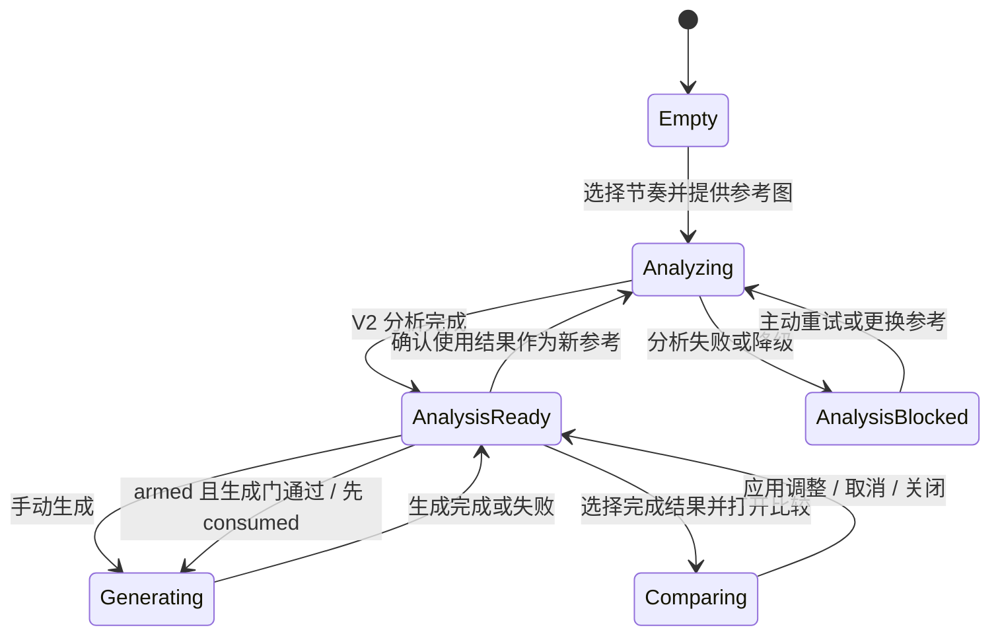
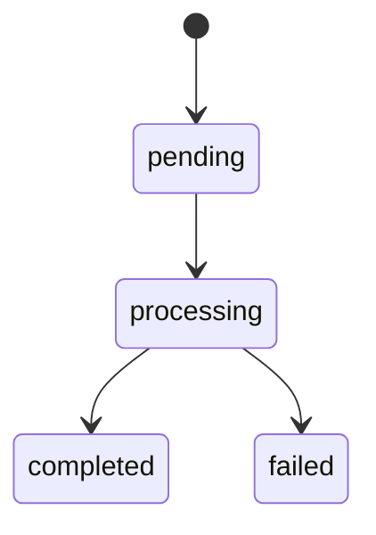

# 架构设计文档：Workspace 证据引导生成闭环

_本文件只保留当前版本真正影响实现的架构决策、边界和契约；完整 DDL、目录树、环境变量与开发故事不进入正文。_

## 1. 系统摘要

本架构在既有分析、生成、Iteration Memory 与 Style Memory 上补齐 **分析 → 比较 → 修正** 核心闭环：工作区以一次分析任务作为当前方向，提供双速入口、可解释 Prompt 控制、参考比例推荐、最近五个结果与用户主导的局部调整。首版不新增会话表、队列或外部服务，只扩展生成快照、现有查询与工作区会话状态。

## 2. 范围、非目标与成功标准

### 2.1 范围

1. 工作区新增“分析后编辑 / 快速复刻”节奏选择；快速复刻以持久化一次性授权闩锁保证每个新方向最多自动提交一次。
2. V2 Prompt 控制拆分为创作意图、表达程度和编辑方式，并对旧工作区快照提供迁移。
3. Prompt 编译器输出文本与可追溯片段；用户调整独立于模型分析事实保存，支持加强、放宽、替换和禁用。
4. 统一画幅常量与最近比例推荐算法，用户选择和 Iteration 恢复优先于推荐。
5. 以 `analysisTaskId` 作为当前方向标识，复用既有生成任务查询分别展示最近五个成功结果、当前进行中任务与最近失败任务，三类状态不共用五个成功结果名额。
6. 工作区内提供结果选择、首选、参考对比、局部修正、再次生成和“作为新参考”；成功结果不再通过阻断式弹层呈现。
7. 生成任务固化 Prompt 控制快照；旧任务无快照时诚实降级为全文上下文。
8. 从本次首选复用既有 Style Memory 保存和代表结果更新链路，保持第 14 期验证边界。
9. 分析、生成、结果列表、方向切换和键盘焦点均覆盖异常恢复与可观测状态。

### 2.2 明确不做

#### 2.2.1 P1 预留

- 单次 2 / 4 张生成、部分失败补全：等本次结果区与选择语义稳定后再扩展。
- 按人像、海报、产品图变化的分析适配视图：保留九维配方契约，本期不改变展示分组。

#### 2.2.2 其他非目标

- 不做浏览器插件、外部素材集成、独立关键词/提示词/色卡/作品资产库。
- 不做自动风格总分、自动偏差判定、自动循环优化或后台自动重试。
- 不改造完整 Iteration Memory 信息架构，不改变 Style Memory 验证定义或代表结果数量。
- 不新增模型、积分、计费体系，不建设新的队列、Worker、缓存服务或“方向/会话”数据表。
- 不做移动端工作台重设计；只保证现有专业画布的键盘与可见焦点契约。

### 2.3 成功标准

| 指标 | 首版目标 |
| --- | --- |
| 双速入口 | 分析后编辑不自动生成；快速复刻经明确授权后最多自动提交一次，阻塞或失败时不自动重试 |
| Prompt 控制 | 两种意图、三档表达和三种编辑方式可切换；手动全文不被静默覆盖；调整可回溯到真实证据或规则 |
| 画幅推荐 | 新参考图获得确定性的最近可用画幅；用户选择与历史恢复不会被推荐覆盖 |
| 结果闭环 | 当前方向最近五个成功结果、进行中和失败状态可在工作区查看；更早结果仍在 Iteration Memory |
| 比较与修正 | 参考与结果可并排；应用调整更新当前草稿但不自动生成；取消不改变草稿 |
| 记忆边界 | 本次首选不会自动改变 Style Memory 验证状态，只有既有确认写点可以更新代表结果 |
| 方向结果查询 | 单用户 500 条生成记录量级，最近五条方向查询 p95 ≤ 300ms |
| 键盘连续性 | 选择结果、打开比较、应用/取消调整和方向确认均有确定焦点去向，无结果通知夺焦点 |

### 2.4 验收标准承接矩阵

| AC-ID | PRD 原文摘要 | 承接模块 | 关键链路 / 状态 | 风险 / 降级说明 |
| --- | --- | --- | --- | --- |
| AC-01 | 可选择深入或快速节奏；快速确认披露意图、表达、画幅策略和生成设置，只自动生成一次且保留完整证据 | 工作区编排、任务 API | §6.1；确认时原子保存 `reconstruction / standard / reference_or_fallback / current default generationSettings`；`quickAuthorization: none → armed → consumed`；自动 task 必须读取该快照 | V2 分析不可用、快照无效或生成门未通过时把授权复位为 `none` 并停止自动提交；授权先消费后请求，页面重载不重复 |
| AC-02 | Prompt 按创作意图与表达程度组织，手动编辑不被误覆盖 | Prompt 控制与编译 | §6.2；三档均保留全部已启用规则，只改变补充观察数量和表达密度；`customPromptDirty` 切换确认分支 | 旧任务无控制快照时进入全文模式；自定义文本无法定位时显示“未找到对应表达” |
| AC-03 | 画幅推荐遵循参考、用户选择和恢复优先级 | 工作区编排、Prompt 控制与编译 | §6.3；比例推荐算法；`aspectRatioSource` | 无尺寸时回退 1:1 且不标推荐；Provider 适配必须覆盖所有公开选项 |
| AC-04 | 生成状态与最近结果在 Workspace 连续可见 | 方向结果与比较、任务 API、数据层 | §6.4；方向 feed 分别返回五个 completed、一个 active 与一个 latestFailure；任务轮询终态 | 查询失败不清空草稿；Provider 启动异常也回写 failed；旧结果留在 Iteration |
| AC-05 | 从结果偏差定位并调整对应风格规则 | Prompt 控制与编译、方向结果与比较 | §6.5；维度 → 真实 invariant → segment 映射；选定具体规则后才开放四类调整 | 维度无规则时仅允许“其他/全文编辑”，不伪造调整目标；自定义全文未命中时按明确降级算法处理 |
| AC-06 | 本次首选与 Style Memory 验证边界一致 | 工作区编排、方向结果与比较、既有 Memory 写点 | §6.7；`preferredIterationId` 仅会话保存并通过详情验证，不受五条 rail 窗口限制 | 首选任务必须 completed、同方向且归属当前用户；任何验证状态仍由第 14 期服务端写点派生 |
| AC-07 | 异常与方向切换不丢上下文 | 工作区编排、任务 API、数据层 | §3.2、§6.1、§6.4、§6.6；工作区 v4→v5 迁移；切换确认 | API/R2/Provider 失败均保留会话快照；确认切换后旧方向仍通过 Iteration 可达 |

## 3. 用户流程与状态

### 3.1 主流程

1. 空工作区默认 `analyze_edit`；新分析完成后的默认表达程度为 `standard`。用户可显式选择 `quick_recreate`，确认区逐项展示“贴近复刻 / 平衡 / 按参考图推荐画幅（不可读则 1:1）/ 当前默认生成设置 / 生成 1 张”，确认后把这些披露值冻结为本方向的快速授权快照。
2. 上传或选择既有结果资产后创建分析任务；完整 V2 分析进入 `analysis_ready`。
3. Prompt 控制将创作意图、表达程度、变量、风格调整编译为最终 Prompt 与来源片段；画幅控制显示参考推荐或更高优先级来源。
4. 手动生成直接提交；快速复刻先把一次性授权同步写为 `consumed`，再走同一个生成函数。
5. 当前方向以 `analysisTaskId` 查询方向 feed：最近五个成功结果、当前进行中任务与最近失败任务分别更新，不互相挤占名额。
6. 用户选择完成结果打开内联比较区；先选维度、再选该维度中的真实规则，应用调整回到当前草稿，生成仍需主动确认。
7. 用户可设定本次首选、把结果作为新参考，或进入既有 Style Memory 保存/代表结果确认链路。

### 3.2 关键分支

| 分支 | 入口 / 触发条件 | 架构处理方式 |
| --- | --- | --- |
| 快速复刻待确认 | 用户在选图前选择 `quick_recreate` | 从共享默认值创建预览但不授权；确认区展示 `reconstruction + standard + reference_or_fallback` 与当前默认 generation settings。确认时将同一对象原子写入授权快照并置 `armed`，取消零写入 |
| 分析期间取消快速复刻 | `quickAuthorization=armed` 且用户切回分析后编辑 | 同步改为 `none`；分析继续，完成后不自动生成 |
| armed 期间尝试修改已确认设置 | 用户尝试修改 intent、detail 或 generation settings | 相关控件只读并说明“自动任务将使用已确认设置”；用户先切回分析后编辑即可清除授权并恢复编辑，禁止静默改写授权快照 |
| 快速路径被阻止 | 分析非 V2 success、统一生成门失败或生成服务不可用 | 原子地把 `armed` 复位为 `none` 并 flush；不提交；显示同一 disabled reason，用户可修正后手动生成，或再次选择并确认快速路径 |
| 快速请求已开始 | 统一生成门通过 | 先将授权写为 `consumed` 并 flush，再 POST；网络失败也不自动恢复 `armed` |
| 手动全文后切换意图/表达 | `customPromptDirty=true` | 先保存 pending selection；确认后替换为新编译结果并清 dirty，取消则不变 |
| 当前方向查询失败 | 方向列表 GET 失败 | 保留现有缓存、参考、Prompt 与生成门；显示重试，不回退成空结果 |
| 排队转成功/失败 | 方向列表或任务详情返回终态 | 成功展示真实资产；失败展示错误摘要与主动重试，均不重复提交原任务 |
| 首选滚出五条成功窗口 | `preferredIterationId` 不在当前 completed rail | 通过 Iteration detail 校验归属、方向、completed 与资产；有效则保留并显示“首选已在 Iteration Memory”，无效才清除并说明原因 |
| 对旧结果应用调整 | 选中结果的 Prompt 快照与当前草稿不同 | 比较区展示该结果的历史表达，但调整只写入当前草稿；提示“正在调整当前草稿”，精确恢复旧上下文仍使用 Iteration 的“继续此方向” |
| 作为新参考 | completed 结果有归属当前用户的 `resultAssetId` | 先运行方向切换守卫；确认后复用既有 Asset 创建新分析，不复制或重传图片，创作节奏重置为分析后编辑 |
| 首选保存 / 更新 Memory | `preferredIterationId` 指向 completed 结果 | 无来源 Memory 时打开既有完成 Iteration 保存向导；有来源 Memory 时打开代表结果确认，服务端继续校验归属和关联 |
| 旧任务缺控制快照 | `promptControlSnapshot=null` | 详情恢复为 `same_style / standard / text`，`customPrompt=promptSnapshot`；不虚构历史变量或调整 |

### 3.3 状态机



关键规则：

- `quickAuthorization` 是独立闩锁，不扩张主状态枚举；`armed` 必须同时存在有效的 `quickGenerationAuthorizationSnapshot`。成功发起链路只允许 `none → armed → consumed`；生成门阻塞或退出快速路径时执行 `armed → none` 并清除快照，必须由用户再次确认才能重新 armed；更换方向重置为 `none`。
- 数据库任务仍使用 `pending → processing → completed | failed`；工作区只派生展示态，不创建第二套后端状态。
- 比较区是工作区内联区域，不是模态任务；打开时聚焦标题，取消/关闭回触发按钮，应用后聚焦更新的“保留 / 改变”摘要。
- 结果通知使用 polite live region，不主动移动正在编辑的焦点。

## 4. 系统上下文与模块职责

### 4.1 系统上下文

```text
┌──────────────────────────────── Browser / Next.js Client ────────────────────────────────┐
│ Workspace Session Controller ── Prompt Control & Compiler ── Direction Results & Compare │
│             │                         │                              │                     │
│             └──────── sessionStorage v5 / React Query cache ─────────┘                     │
└───────────────────────────────┬────────────────────────────────────────────────────────────┘
                                │ authenticated JSON / presigned upload
┌───────────────────────────────▼──────────── Next.js Server ────────────────────────────────┐
│ Analysis + Generation Routes ── Repositories ── PostgreSQL / R2                            │
│              │                                                                               │
│              └──────────────── Vision / Structurer / Image Providers                        │
└────────────────────────────────────────────────────────────────────────────────────────────┘
```

### 4.2 模块职责

| 模块 | 职责 | 上游输入 | 下游输出 |
| --- | --- | --- | --- |
| Workspace Session Controller | 扩展 `use-workspace-state` 与 Workspace page：持有节奏、一次性授权、快速确认快照、统一生成参数、首选结果和恢复来源；确认区从同一快照渲染披露值，armed 期间锁定相关控件；分析后用该快照与 Recipe 默认值构造自动请求，先消费授权再调用既有生成函数；负责方向守卫和焦点目标 | 文件/既有资产、分析轮询、共享默认生成设置、Memory/Iteration 恢复、用户操作 | 持久化工作区 v5、与披露一致的生成请求、方向查询 key、UI 派生状态 |
| Prompt Control & Compiler | 展示意图/表达/编辑方式，维护不可变分析事实之外的用户调整；编译文本与来源片段；派生“保留 / 改变”；手动全文切换时发出覆盖确认；比较动作回调只更新当前草稿并重算 Prompt | V2 recipe、Prompt 控制快照、证据 facets、调整动作 | 最终 Prompt、可追溯 segments、变量快照、调整上下文、生成门输入 |
| Direction Results & Compare | 按当前 `analysisTaskId` 读取五个 completed、一个 active 与一个 latestFailure；管理瞬时当前选择和会话首选；打开比较时加载详情，选择维度及真实 invariant 后回调调整；首选滚出 rail 后继续以详情验证并指向 Iteration Memory | 方向 feed、Iteration 详情、参考图、Prompt segments、键盘操作 | 结果选择、具体规则调整、首选 ID、作为新参考 / Memory 动作 |
| Analysis & Generation Routes | 在既有路由上支持“已有资产分析”、方向过滤、Prompt 控制快照与触发来源；验证用户归属、任务状态、枚举、长度和模型；维持原 Provider 调用与 webhook/同步完成链路 | 认证会话、上传/已有资产、生成请求、查询参数 | 分析任务、生成任务、方向结果 DTO、全状态 Iteration 详情 |
| Persistence & Repositories | 生成任务新增可空 Prompt 控制快照；按用户 + `analysisTaskId` 查询；读取用户拥有的 Asset；快照优先/旧数据回退；PostgreSQL 保存任务事实，R2 保存图片，sessionStorage 只保存当前草稿 | 路由校验后的数据、Provider 终态、工作区 v5 快照 | 任务/资产记录、方向结果、恢复快照、旧记录降级标记 |

### 4.3 需要刻意避免的过度设计

- 不建 `workspace_sessions` / `directions` 表：一次分析任务已是当前方向的稳定边界。
- 不为快速复刻引入工作流引擎、消息队列或服务端自动编排：一次客户端授权闩锁 + 既有异步任务足够。
- 不持久化当前选择、比较开关和所选维度：它们是瞬时视图状态；只持久化影响继续创作的首选 ID 与 Prompt 控制。
- 不引入向量相似度、视觉评分或新的 AI 调用：偏差由用户选择，调整通过确定性编译完成。
- 不复制生成图片为新参考 Asset：同一 Asset 可以作为下一次分析来源，类型字段保留 `generated`。
- 不新增结果保存 API：复用现有 Style Memory 保存向导与代表结果接口。

## 5. 关键架构决策（ADR）

### ADR-1：用 `analysisTaskId` 标识当前方向
- **选择**：方向结果均按当前分析任务查询，不新增方向实体。
- **理由**：同一参考分析下的所有生成天然共享证据与来源；新表会复制关系并增加同步失败点。
- **风险与对策**：旧任务也可被查询；只返回当前用户记录，结果区限制最近五条，完整历史仍由 Iteration Memory 管理。

### ADR-2：快速复刻采用客户端持久化一次性授权闩锁
- **选择**：确认时将 `reconstruction / standard / reference_or_fallback / current default generationSettings` 与 `armed` 原子保存；自动请求只读该不可变快照，生成前先同步写 `consumed`。
- **理由**：需求只要求一次显式授权后的单次提交，不需要更重的服务端编排或幂等任务表。
- **风险与对策**：armed 期间锁定已确认字段，避免 UI 与 task 竞态；生成门阻塞时立即 `armed → none` 并清快照；请求已开始后即使失败也保持 consumed，防止刷新重放；用户只能主动重试，服务端限流继续兜底。

### ADR-3：模型事实与用户调整分层，Prompt 由确定性编译器生成
- **选择**：Recipe 和 evidence 不可变；`InvariantAdjustment[]` 独立记录用户的加强、放宽、替换、禁用，并输出文本 segments。
- **理由**：直接改 Recipe 会混淆模型观察与用户意图；另建 Prompt 服务或调用 LLM 重写会增加成本和不可解释性。
- **风险与对策**：自定义全文使用 range 替换/删除或追加调整段的明确算法，找不到表达时如实提示。

### ADR-4：生成任务固化 Prompt 控制快照
- **选择**：`generation_tasks` 新增可空 `prompt_control_snapshot` JSONB，提交时与 Prompt 文本、Recipe 快照一同保存。
- **理由**：结果比较与继续需要知道当时的意图、表达、变量和调整；单独版本表对单次快照场景过重。
- **风险与对策**：服务端按 Recipe 校验引用 ID；旧记录为 null 时降级全文模式，不回填推测值。

### ADR-5：结果区复用既有 Generation 查询，不建会话结果存储
- **选择**：扩展 `GET /api/generation` 的方向视图，返回分组 DTO：最近五个 completed、至多一个 active 与至多一个 latestFailure；三组分别限额，不用 `status=all` 的混合分页冒充“五个结果”。
- **理由**：生成任务已经是 Iteration SSOT；额外结果表或缓存会造成状态双写。
- **风险与对策**：查询失败保留旧缓存和草稿；现有索引先满足首版，性能超目标后再评估复合索引。

### ADR-6：生成结果作为新参考时复用 Asset
- **选择**：`POST /api/analysis` 增加 `{ sourceAssetId }` 分支，服务端读取当前用户拥有的 Asset 元数据并创建新分析任务。
- **理由**：图片已经在 R2 和 assets 中，下载再上传会浪费带宽并产生重复资产。
- **风险与对策**：严格校验 userId、MIME、尺寸和文件 URL；不改变原 Asset 类型，原 Iteration 关系保持。

### ADR-7：比较区使用内联 focus-managed region，不用成功弹层或自动评分
- **选择**：结果与比较常驻工作区；打开比较聚焦标题但不 trap，关闭回触发器，应用后聚焦更新摘要。
- **理由**：用户需要同时看到三栏上下文；模态弹层会中断编辑，自动评分又不在 PRD 范围。
- **演进余地**：后续批量只扩展结果集合与选择规则，不改变比较与用户判断边界。

### 5.8 待确认问题

无。当前模块边界、接口扩展、Schema、状态机、失败恢复和验收口径均已收敛；`open_questions` 保持为空。

## 6. 运行链路

### 6.1 新方向、分析与快速复刻

1. 新方向初始化 `creationPace=analyze_edit`、`quickAuthorization=none`、`quickGenerationAuthorizationSnapshot=null`；任何新分析完成后的 Prompt detail 默认 `standard`，Iteration 恢复继续以历史快照优先。
2. 用户在选图前选择快速复刻时，确认区直接从拟保存对象展示：`intent=reconstruction`、`detailLevel=standard`、`aspectRatioPolicy=reference_or_fallback`、当前共享默认 `generationSettings` 与单张生成。画幅尚未可知时展示策略文案，不伪造具体比例。
3. 用户确认时将上述对象与 `creationPace=quick_recreate / quickAuthorization=armed` 原子写入并同步 flush；armed 期间 intent、detail 与 generation settings 只读。取消确认零写入；切回分析后编辑时改为 none、清除快照并恢复可编辑。
4. 上传参考图沿用预签名直传；结果作为新参考时只提交 `sourceAssetId`，服务端按 userId 读取 Asset，不 upsert、不改类型；随后创建分析任务并进入既有轮询。
5. 分析 V2 success 后，用授权快照的 intent/detail、Recipe 的全部默认 enabled invariants/variables/modifiers 编译 Prompt；按 `reference_or_fallback` 解析最近支持画幅，比例不可读才解析为 1:1；请求参数使用授权快照中的 generationSettings，而不是读取可能变化的当前草稿。
6. 统一生成门同时校验授权快照存在且值合法、Recipe/Prompt 已完成、解析后画幅受 Provider 支持，并断言待提交的 intent/detail/aspect ratio policy result/generation settings 与确认快照一致。任一条件失败都将 armed 原子复位 none、清除快照、同步 flush、显示阻止原因且不提交；条件恢复后仍需用户手动生成或重新确认快速复刻。
7. 满足条件时先将授权置为 `consumed`，同步 flush 工作区快照，再把步骤 5 形成的不可变请求对象交给与手动生成相同的 `submitGeneration`；POST 保存的 `promptControlSnapshot`、params 和 trigger 必须能回证确认披露值及画幅策略的解析结果。
8. POST 成功后记录 taskId 并刷新方向结果；失败保留 consumed、确认快照和全部草稿用于解释，用户决定是否主动重试；新方向重置时再清除该快照。

实现原则：快速与深入路径共享完整分析、Prompt 编译和生成 API，但快速自动提交只读确认快照，避免 analysis effect 与界面编辑竞态。确认 UI、统一生成门和 POST 请求必须消费同一 typed object，禁止复制三套默认常量；`consumed` 必须先于网络请求持久化，生成 route 的进程内用户限流只作成本兜底，不作为跨实例强一致幂等层。

### 6.2 Prompt 意图、表达与手动全文

1. `composePromptDocument(recipe, controls)` 先选择内容来源：reconstruction 使用原内容，same_style 使用变量模板。
2. 三档表达始终编入全部 `enabledInvariantIds`（含 hard 与 soft）、当前变量和已启用 modifiers，绝不因 detailLevel 删除用户已确认规则；差异只来自格式密度与补充 observation：concise 使用紧凑子句且不添加未覆盖 observation；standard 每个维度最多加入一条置信度 ≥ 0.7 的最高置信未覆盖 observation；professional 加入全部置信度 ≥ 0.5 的未覆盖 observations。相同置信度按 Recipe 原序稳定排序。
3. 对每条 invariant 读取唯一 adjustment：strengthen 生成“严格保留”；relax 生成“允许变化但以原规则为参考”；replace 使用用户替换值；disable 从模板中移除。
4. 编译器按既有维度顺序去重并生成 `CompiledPrompt{text, segments}`；segment 记录 source kind/id、dimension 和字符范围。
5. “保留”由未禁用 invariants 派生；“改变”由 content variables 当前值与默认值比较派生，归一化为 trim 后、压缩连续空格、大小写不敏感比较。
6. 用户手动修改全文后写 `customPromptDirty=true`；切换 intent/detail 只创建 pending selection，确认才用新编译文本替换并清 dirty，取消零写入。
7. structured 模式只读展示，不改变最终 Prompt；返回 variables/text 时恢复切换前的最终 Prompt 来源。

实现原则：V2 编译优先使用显式 segments；旧/自定义全文才使用现有 provenance 匹配。自定义全文应用调整时，命中 range 就只替换/删除该 range；未命中且动作非 disable 时追加 `Adjustments:` 段；未命中 disable 只停用规则并提示未找到可删除表达。

### 6.3 参考画幅推荐

1. 参考图片加载后得到 `referenceRatio=naturalWidth/naturalHeight`；无合法尺寸则跳到回退规则。
2. 对支持列表中的每个候选比例计算 `abs(log(referenceRatio / candidateRatio))`，取最小值；相同距离按列表稳定顺序取第一项。
3. 新方向且用户尚未选择时写推荐值与 `aspectRatioSource=reference`；UI 显示“参考图推荐”。
4. 用户改选后写 `aspectRatioSource=user`；后续图片重载、分析或 Prompt 编辑不得覆盖。
5. Iteration 恢复写 `aspectRatioSource=restore` 并优先于推荐；无尺寸且无恢复/用户值时回退 1:1 与 `fallback`，不显示推荐。
6. Provider 适配器必须显式映射所有公开画幅；fal 的 3:4 / 9:16 分别映射 portrait_4_3 / portrait_16_9，禁止未知值静默退回 square。

实现原则：支持列表只有一个共享常量源，Render Dock、推荐算法、请求校验和 Provider 单测共同消费；本期不因参考图比例新增模型不支持的画幅，4:5 参考在当前选项中推荐最近的 3:4。

### 6.4 生成、方向结果与首选

1. 手动或快速生成均提交最终 Prompt、negative constraints、params、sourceTemplateId、trigger 和 Prompt 控制快照。
2. 服务端校验分析任务 completed、Memory/Asset 归属、模型、画幅、快照枚举/长度以及 adjustment 引用；随后创建 generation task 并固化 Recipe、当前变量与 Prompt 控制快照。
3. generation task 创建并进入 processing 后，Provider 的启动/提交调用必须位于显式 try/catch 中；任何同步抛错或拒绝都先 best-effort 回写该 task 为 `failed` 与安全截断的 errorMessage，再返回可重试 Provider 错误。若终态写入本身失败，记录含 taskId/analysisTaskId/provider 的 critical 结构化日志，禁止只由外层 500 留下无诊断的 processing。
4. 前端以 `analysisTaskId` 请求 `view=direction&pageSize=5`；服务端按 userId 和方向分别查询：`completed` 最近五条、`active` 最近一条 pending/processing、`latestFailure` 最近一条 failed，均按 createdAt/id 倒序。三组不共享名额，普通 Iteration cursor/status 行为保持兼容。
5. 当前主动任务继续使用详情轮询；feed 存在 active 时也定时刷新。active 完成后进入 completed 并清空 active；active 失败后进入 latestFailure 并清空 active，页面重载仍以数据库事实恢复。
6. completed 返回真实 `resultAssetId/resultFileUrl`；failed 返回截断 errorMessage；第六个成功结果不进入首屏五张缩略图，但仍在全量 Iteration 查询中。
7. 新完成结果成为瞬时 `selectedIterationId`；`preferredIterationId` 只在用户明确操作后写入工作区会话。有效性通过详情接口验证当前用户、相同 analysisTaskId、completed 与 resultAssetId，不依赖当前五条 completed 窗口。
8. 再次生成只读取当前草稿，不自动恢复所选旧结果；需要精确恢复旧上下文时继续使用 Iteration Memory 既有恢复链路。

实现原则：数据库 GenerationTask 是状态 SSOT，React Query 只缓存；列表查询和任务详情均为既有接口的兼容扩展。移除成功 GenerationDialog，但保留任务失败的内联恢复动作。

### 6.5 参考比较与局部调整

1. 用户选择 completed 结果并打开比较；客户端按 iteration id 获取详情，参考 URL 缺失时显示真实缺失态。
2. 可选维度来自当前 Recipe 的 observations 或 invariants；“其他”直接聚焦全文编辑。
3. 选择维度后聚合 observations、该维度全部真实 invariants 与该结果的 Prompt segments/provenance。恰有一条 invariant 时可预选但必须可见；多条时四类动作保持 disabled，直到用户明确选择 `selectedTargetInvariantId`；零条时显示“该维度暂无可调整规则”，只保留“其他/全文编辑”，不得伪造 invariant 或 adjustment。
4. 选定真实 invariant 后，用户可选择 strengthen/relax/replace/disable；replace 必须有 trim 后非空且 ≤200 字符的值。
5. 应用动作按所选 invariantId 覆盖旧 adjustment，重编译当前草稿与“保留 / 改变”摘要；不自动提交生成。`selectedTargetInvariantId` 是比较区瞬时状态，不进入 Prompt 快照。
6. 取消/关闭不写 Prompt 控制，焦点回原结果的比较按钮；应用后焦点移动到对应摘要项并通过 polite live region说明变化。

实现原则：比较所选历史结果只提供证据上下文，调整目标始终是当前工作区草稿，避免隐式覆盖未完成编辑；UI 明示这个边界。模型 facts 不被修改，用户 adjustment 可随下一次生成快照审计。

### 6.6 结果作为新参考

1. 用户选择 completed 结果；客户端确认 `resultAssetId` 存在，否则提供打开 Iteration 或重试加载。
2. 方向切换守卫比较当前 Prompt、negative constraints、生成参数和当前来源；有不同未完成内容时显示确认。
3. 取消零写入并恢复焦点；确认后清除当前方向瞬时选择/首选，节奏重置为 analyze_edit。
4. POST `/api/analysis` 提交 `{sourceAssetId}`；服务端用 userId 查 Asset 并使用已存 URL、尺寸、MIME 创建新分析任务。
5. 工作区以结果图为参考进入 analyzing；旧方向与所有 GenerationTask 不变，仍可从 Iteration Memory 找回。

实现原则：不下载、不重新上传、不复制 Asset；服务端绝不接受客户端为 existing-asset 模式补写 fileUrl/尺寸，避免越权或元数据伪造。

### 6.7 首选结果与 Style Memory

1. Direction Results 总是通过 Iteration detail 验证 `preferredIterationId` 属于当前用户、相同 `analysisTaskId`、状态 completed 且有 `resultAssetId`；它不要求仍在当前五条 completed rail 中。无来源 Memory 时打开既有 `SaveStyleMemoryDialog`，预选该完成结果为代表结果。
2. 有 `currentTemplateId` 时，打开轻量代表结果确认；确认后调用既有 `POST /api/templates/[id]/representative-result`。
3. 服务端继续校验 generation task completed、resultAssetId 存在、用户归属与来源关系，再派生验证状态。
4. 首选滚出 rail 时保留 ID，并显示“首选已在 Iteration Memory”及打开详情动作；详情验证为无效或不可访问时才清除 ID并说明原因。Memory 写入成功后刷新 Memory 详情/候选与方向结果；写入失败保留 preferred 状态和工作区草稿，用户可重试。

实现原则：`preferredIterationId` 从不写 templates；只有第 14 期既有服务端端点可以改变代表结果和验证状态，避免“首选”成为第二个验证写点。

## 7. 领域对象与关键契约

### 7.1 核心对象

| 对象 | Source of Truth | Owner | 用途 |
| --- | --- | --- | --- |
| Visual Recipe / Evidence | `analysis_tasks.recipe` | Analysis pipeline | 模型观察、九维风格、invariants 与内容变量；用户调整不得修改 |
| Workspace Session v5 | `sessionStorage` 当前用户标签页 | Workspace Session Controller | 当前草稿、节奏、一次性授权、生成参数、首选和来源身份 |
| Prompt Control Snapshot | 当前草稿：Workspace Session；已提交：`generation_tasks.prompt_control_snapshot` | Prompt Control / Generation repository | 固化意图、表达、编辑方式、变量和用户调整 |
| Generation Task / Iteration | `generation_tasks` | Generation repository | 生成状态、结果资产、Prompt/Recipe/控制快照与来源 Memory |
| Direction Result Feed | GenerationTask 的按 `analysisTaskId` 分组查询投影 | Direction Results | 五个 completed、一个 active、一个 latestFailure，不独立存储且不共享成功结果名额 |
| Asset | `assets` + R2 object | Asset repository | 参考与生成图片元数据；生成 Asset 可直接成为分析来源 |
| Style Memory | `templates` | Template repository | 用户确认的长期规则与代表结果；本期只复用既有写点 |

### 7.2 推荐最小 Schema

```ts
type CreationPace = "analyze_edit" | "quick_recreate";
type QuickAuthorization = "none" | "armed" | "consumed";
type PromptIntent = "reconstruction" | "same_style";
type PromptDetailLevel = "concise" | "standard" | "professional";
type PromptEditorMode = "variables" | "text" | "structured";
type AdjustmentAction = "strengthen" | "relax" | "replace" | "disable";
type AspectRatioSource = "reference" | "user" | "restore" | "fallback";

interface InvariantAdjustment {
  invariantId: string;
  action: AdjustmentAction;
  replacementValue?: string;
}

interface PromptControlSnapshot {
  schemaVersion: 1;
  trigger: "manual" | "quick_recreate";
  intent: PromptIntent;
  detailLevel: PromptDetailLevel;
  editorMode: PromptEditorMode;
  customPromptDirty: boolean;
  enabledInvariantIds: string[];
  variableValues: Record<string, string>;
  enabledModifierNames: string[];
  modifierValues: Record<string, string>;
  adjustments: InvariantAdjustment[];
  customTemplate?: string;
}

interface QuickGenerationAuthorizationSnapshot {
  schemaVersion: 1;
  intent: "reconstruction";
  detailLevel: "standard";
  aspectRatioPolicy: "reference_or_fallback";
  generationSettings: Omit<GenerationParams, "aspectRatio">;
}

interface WorkspaceCreativeState {
  creationPace: CreationPace;
  quickAuthorization: QuickAuthorization;
  quickGenerationAuthorizationSnapshot: QuickGenerationAuthorizationSnapshot | null;
  promptControls: PromptControlSnapshot | null;
  generationParams: GenerationParams;
  aspectRatioSource: AspectRatioSource;
  preferredIterationId: string | null;
}

interface CompiledPromptSegment {
  sourceKind: "content" | "invariant" | "observation" | "modifier" | "adjustment";
  sourceId: string;
  dimension?: StyleDimension;
  startIndex: number;
  endIndex: number;
}

interface CompiledPrompt {
  text: string;
  segments: CompiledPromptSegment[];
}

interface DirectionIterationListItem extends IterationListItem {
  resultAssetId: string | null;
  errorMessage: string | null;
}

interface DirectionIterationFeed {
  completed: DirectionIterationListItem[]; // 最多 5 条成功结果
  active: DirectionIterationListItem | null; // 最近 pending/processing
  latestFailure: DirectionIterationListItem | null; // 最近 failed
}

// 仅存在于比较面板内，不持久化、不进入生成快照。
type SelectedTargetInvariantId = string | null;
```

数据库只新增 `generation_tasks.prompt_control_snapshot JSONB NULL`，不新增表。工作区存储版本从 4 升到 5：v4 有效快照按 `outputMode` 映射为新的 intent/detail/editorMode；无法识别的历史字段使用 `same_style / standard / variables`，保留 Prompt、变量、来源和生成参数，不清空整个快照。迁移不得从旧 pace 推测快速授权：缺少合法 `quickGenerationAuthorizationSnapshot` 时强制 `quickAuthorization=none`；新分析默认 detail 为 standard，快速授权则必须使用 Schema 中的固定 intent/detail/policy。

### 7.3 API 边界

| 接口 | 方法 | 用途 | 认证 | 关键请求字段与数据来源 |
| --- | --- | --- | --- | --- |
| `/api/analysis` | POST | 上传参考沿用原请求；新增生成 Asset 直接分析分支 | 必须登录 | 上传模式：`assetId/fileUrl/width/height/mimeType` 为 frontend_computed；已有资产模式：`sourceAssetId` 为 frontend_computed，元数据全部由服务端 derived |
| `/api/generation` | GET | 既有 Iteration 列表；`view=direction` 时返回当前方向分组 feed | 必须登录 | `analysisTaskId/view/pageSize` 为 frontend_computed；方向视图强制 userId，completed 限 1-5，active/latestFailure 各至多 1；普通列表继续使用 status/cursor |
| `/api/generation` | POST | 手动或快速生成并固化控制快照 | 必须登录 | `analysisTaskId/sourceTemplateId` frontend_computed；Prompt/negative/params 为 user_input + derived；`promptControlSnapshot` derived；task id/status system_generated |
| `/api/generation/[id]` | GET | 轮询、比较与恢复所选 Iteration | 必须登录 | `id` frontend_computed；返回 snapshot 优先、旧数据 fallback/missing 标记 |
| `/api/templates` | POST | 从首选完成结果保存 Style Memory | 必须登录 | 复用第 14 期请求契约；代表结果 id 为 user_input，验证状态 derived |
| `/api/templates/[id]/representative-result` | POST | 更新来源 Memory 的代表结果 | 必须登录 | Memory id frontend_computed；generationTaskId user_input；状态和关联校验 derived |

`GET /api/generation?view=direction&analysisTaskId=…&pageSize=5` 返回 `DirectionIterationFeed`；Repository 用三个有界查询分别取 completed、active 与 latestFailure，不能先取混合五条再在内存分组。未带 `view=direction` 时保持既有 cursor/status contract。`POST /api/generation` 的 `promptControlSnapshot` 最大 20 个变量、10 个 adjustment、单值 200 字符、customTemplate 6000 字符；服务端拒绝未知枚举、未知 invariant id 和非 Recipe 变量名。

### 7.4 状态流转



- 后端任务状态保持不变；`pending` 与 `processing` 在结果区均展示为 processing。
- `completed` 必须同时有 `resultAssetId` 才能提供比较、首选、作为新参考与 Memory 动作；缺失则展示来源异常，不伪造成功图。
- `failed` 保留 Prompt、Recipe、控制快照、参数和错误文本；重试创建新的 GenerationTask，不复活原任务。
- task 进入 processing 后的 Provider 启动/提交异常必须在 route 内捕获并回写 failed；外层统一错误处理不能成为 task 永久 processing 的唯一路径。
- Prompt 控制快照随任务创建后不可变，确保结果上下文可审计。

### 7.5 数据边界

| 数据层 | 负责 | 不负责 |
| --- | --- | --- |
| PostgreSQL | Analysis/Generation/Template/Asset 元数据、任务状态、提交时快照、来源关联 | 工作区瞬时当前选择、比较开关和焦点状态 |
| R2 | 原参考与生成图片二进制 | Prompt、用户调整、任务状态 |
| sessionStorage | 当前标签页的工作区草稿、快速授权、生成参数、首选、Memory 身份 | 长期历史、验证状态、跨设备同步 |
| React Query cache | 方向结果与详情的可失效读缓存 | 任务或 Memory 的事实写入 |

### 7.6 命名与标识规则

- ID 延用 26 字符 ULID；`analysisTaskId` 是方向 key，但不新增 `directionId`。
- TypeScript 使用 camelCase，数据库使用 snake_case，JSON API 使用 camelCase。
- UI “分析后编辑” ↔ `analyze_edit`；“快速复刻” ↔ `quick_recreate`。
- UI “贴近复刻” ↔ `reconstruction`；“同风格创作” ↔ `same_style`。
- UI “快速 / 平衡 / 详细” ↔ `concise / standard / professional`。
- UI “本次首选” ↔ `preferredIterationId`；“当前选择” ↔ 瞬时 `selectedIterationId`，禁止使用 `verified` 或 `representative` 命名。
- UI “加强保留 / 放宽 / 替换 / 不再保留” ↔ `strengthen / relax / replace / disable`。
- 负向内容继续统一使用 API `negativePromptText`、快照 `negativePromptSnapshot`，不引入第二套 `avoidText`。

## 8. 非功能需求、风险与运行策略

### 8.1 性能与吞吐量目标

| 指标 | 目标 | 预期并发 / 说明 |
| --- | --- | --- |
| Prompt 重编译与摘要派生 | 单次交互主线程 ≤ 50ms | 纯内存、至多 10 个 invariants 与 20 个变量 |
| 方向 feed 查询 | p95 ≤ 300ms | 三个有界查询合计返回至多 7 条；单用户 ≤500 条生成记录；现有 user/created 与 analysisTask 索引先行 |
| 比较详情加载 | p95 ≤ 500ms（不含图片传输） | 复用单条 Iteration 联查 |
| 结果区刷新 | processing 时 2-3 秒一次，终态后停止 | 每个打开工作区最多一个方向查询与一个主动任务详情轮询 |
| 工作区快照写入 | 300ms 防抖；快速授权消费使用同步 flush | 不将图片或结果列表写入 sessionStorage |

### 8.2 可靠性、错误处理与降级策略

| 级别 | 依赖 / 触发 | 系统行为 | 保留能力 |
| --- | --- | --- | --- |
| L1 | Prompt segment 无精确命中 | 回退现有 provenance；自定义全文按 range/append 算法，无法删除时明确说明 | 可编辑、可生成、证据仍可见 |
| L2 | 方向列表或单图加载失败 | 保留缓存与当前草稿；结果位显示重试/打开 Iteration；不显示假图 | 分析、Prompt、手动生成继续可用 |
| L3 | Image Provider 启动/提交不可用或任务失败 | task 已创建时先 best-effort 回写 failed 再返回错误；失败条目保留全部快照；请求已发起的快速授权保持 consumed；用户主动重试创建新任务 | 参考、证据、比较历史、Memory 保存草稿可用 |
| L4 | Vision/Structurer 降级、分析失败或生成门阻塞 | 快速复刻把 armed 复位 none 并停止；有原始分析时进入全文编辑降级，无可用分析则重试/换图 | 参考图与已输入内容保留，条件恢复后不会延迟自动生成 |
| L5 | PostgreSQL/R2 不可用 | API 返回统一可重试错误；sessionStorage 草稿不清除，不声称任务已创建 | 本地编辑与稍后重试 |

超时沿用现有策略：同步生成 120 秒、Replicate 异步 5 分钟；重试始终创建新任务。Provider 启动/提交异常的 failed 回写失败时记录 critical 日志供人工告警与修复；正常数据库可用场景不得留下永久 processing。页面重载后，方向 feed 按数据库事实恢复 active/completed/latestFailure，不依赖内存中的成功回调。

### 8.3 安全与反滥用策略

| 项目 | 首版策略 |
| --- | --- |
| 用户隔离 | 所有 Analysis、Generation、Asset、Template 读写均按认证 userId 校验；existing asset 分支不信任客户端 URL/尺寸 |
| Prompt 注入 | Vision 原始文本只进入既有 structurer 用户输入通道；system contract 与用户文本继续分离；用户调整只进入确定性 Prompt 编译，不进入系统指令 |
| 内容安全 | 继续依赖已选 Provider 的内容安全与拒绝策略；本期不绕过拒绝，也不新增自动重试其他 Provider |
| 输入约束 | Prompt/模板/替换值、数组长度、枚举、ULID、画幅与模型全部白名单校验；结果错误文本输出前截断 |
| Rate Limit | 在 Analysis 与 Generation POST 上启用既有用户级配置（分析 10/小时、生成 20/小时）；429 保留草稿并允许到期后主动重试 |
| API Key | Provider 与 R2 凭据仅服务端读取；客户端只获得预签名上传地址和公开结果 URL |
| 快速授权 | 授权闩锁只减少客户端重复提交；服务端仍独立执行认证、限流、任务状态和所有权校验 |

### 8.4 成本控制预期

| 模块 | 单次成本估算 | 首版控制策略 |
| --- | --- | --- |
| 参考分析 | 1 次 Vision + 1 次 Structurer 调用；费用沿用当前 Provider/模型实时单价 | 快速与深入共享同一分析，不做第二次“简化分析”；每用户 10 次/小时 |
| 图片生成 | 每次用户确认或手动点击 = 1 次单图生成；费用沿用当前模型实时单价 | 快速授权最多自动触发一次；每用户 20 次/小时；不批量、不自动重试 |
| 比较与调整 | 0 次 AI 调用，仅本地确定性编译与数据库读取 | 禁止自动评分和 LLM 改写 |
| 存储与查询 | 每个结果沿用 1 个 R2 对象和 1 条 generation task；新增 1 份小型 JSONB 快照 | 不复制结果为参考；方向 feed 仅取 5 个成功结果 + 1 个 active + 1 个 latestFailure |

每日/月度金额上限继续由当前 Provider 账户预算承担，不在代码中硬编码易过期价格；运行侧以账户预算 70%/90%/100% 为告警/停止线。达到 100% 时 Generation 降级为不可用，分析证据与 Prompt 编辑仍可使用。本期新增成本上界是每次快速授权的一次既有分析加一次单图生成，不产生新的外部服务费用。

### 8.5 可观测性

- 服务端结构化日志新增：`analysis_existing_asset_started`、`direction_iterations_queried`、`generation_request_received.trigger`、`prompt_control_snapshot_rejected`。
- 日志包含 userId/taskId/analysisTaskId/provider/model/status/duration，不记录 Prompt 全文、替换值、图片二进制或凭据。
- 方向 feed 记录 duration、completedCount、hasActive、hasLatestFailure；连续查询 p95 超过 300ms 时评估 `(user_id, analysis_task_id, status, created_at DESC, id DESC)` 复合索引。
- Provider 失败、超时和限流沿用现有错误码；新增 `generation_provider_start_failed` 与 `generation_failed_status_write_failed`（critical），后者必须包含 taskId/analysisTaskId/provider 但不含 Prompt；快速路径是否 consumed 可从任务 snapshot trigger 与客户端状态复现，不创建新遥测服务。
- 视觉验收继续使用 1440×900、1280×800、390×844 截图；重点检查结果区高度、横向溢出、比较焦点与 reduced motion。

### 8.6 主要风险

| 风险 | 影响 | 缓解方式 |
| --- | --- | --- |
| effect 重放导致快速重复生成 | 意外成本与重复 Iteration | consumed 先同步持久化、同一 submit lock、服务端限流；失败不自动 re-arm |
| 快速授权阻塞后延迟触发 | 用户未再次确认却在条件恢复后自动生成 | 生成门阻塞即 `armed → none` 并同步 flush；重新进入快速路径必须再次确认 |
| 确认披露与自动 task 漂移 | 用户确认的意图、表达、画幅策略或生成设置与结果上下文不一致 | 确认 UI、readiness 和 submit 共用 `QuickGenerationAuthorizationSnapshot`；armed 期间锁定字段；POST 快照一致性组件/E2E 断言 |
| 详情级别丢失 soft 规则 | 用户确认的规则因切换到 concise 被静默删除 | 三档始终包含全部 enabled invariants；测试同一控制快照在三档的 invariant ID 集合相同 |
| 自定义全文与规则调整冲突 | 用户以为禁用成功但旧文本仍残留 | segment/range 精确修改；未命中 disable 明确提示，不声称已删除表达 |
| 非成功任务挤掉结果缩略图 | processing/failed 占用五条配额，成功结果不足 | completed/active/latestFailure 分组有界查询，三组不共享配额 |
| 方向标识过宽 | 同一分析的旧结果混入当前结果区 | 这是“同一方向”的明确语义；completed 限制最近五条，当前选中与首选由用户控制 |
| Provider 启动异常留下永久 processing | Workspace 长期显示无法终止的任务 | route 捕获启动/提交异常并 best-effort 写 failed；写失败输出 critical 日志；路由测试断言终态写入 |
| 维度与调整目标歧义 | 多条规则时改错 invariant，零规则时伪造调整 | 维度后必须选择真实 invariant；多条未选禁用动作，零条只允许全文编辑 |
| 首选滚出 rail 被误清除 | 用户的明确首选随新结果产生而丢失 | 详情按用户、方向、completed、资产验证；窗口外保留并链接 Iteration Memory |
| Provider 画幅静默回退 | 推荐值与真实输出不一致 | 共享白名单；Provider 显式映射；未知值请求前拒绝，fal portrait 补齐单测 |
| Prompt 控制快照被伪造 | 恢复错误规则或未知变量 | 服务端对照 Recipe 校验 invariant/variable IDs、枚举和长度，快照不参与权限决定 |
| 旧任务缺快照 | 无法恢复当时的意图和调整 | 全文模式 + promptSnapshot 诚实降级，保留 Recipe/params/source，不推测补齐 |
| 使用结果作为参考越权 | 读取他人生成 Asset | 服务端 `findAssetByIdForUser`；忽略客户端元数据；不存在/不归属返回 404 |
| 结果区挤压三栏高度 | 影响专业画布可用空间 | 默认紧凑 rail，可展开比较；视觉回归覆盖三种尺寸，不将完整历史塞入工作区 |

## 9. 实施建议与技术选型

### Phase A：Prompt、画幅与工作区状态契约

1. `src/types/models.ts`：新增 CreationPace、PromptIntent、PromptDetailLevel、PromptEditorMode、InvariantAdjustment、PromptControlSnapshot、DirectionIterationListItem、DirectionIterationFeed；扩展 GenerationTask/IterationDetail 快照字段。
2. `src/lib/prompt-composer.ts`：收敛为 `composePromptDocument`，实现两种意图、三档表达、调整覆盖、segments 和既有 PromptOutputs 兼容导出；三档共享全部 enabled invariants，只按确定阈值改变补充 observations 与排版密度。
3. `src/lib/prompt-adjustments.ts`：新增维度聚合、四类 adjustment、keep/change 摘要与自定义全文 range/append 算法。
4. `src/lib/generation/aspect-ratio.ts`：建立唯一画幅白名单、对数距离推荐、来源优先级与校验；`src/lib/ai/providers/fal-image-gen.ts` 补齐 portrait 映射并拒绝未知值。
5. `src/hooks/use-workspace-state.ts`：升级 v5，迁移 v4；持久化 pace、authorization、`QuickGenerationAuthorizationSnapshot`、prompt controls、params、ratio source、preferred iteration；提供确认快照原子写入、消费授权、阻塞/退出清除授权和新方向重置的同步 action；无合法快照不得恢复 armed。
6. 相邻 Vitest：补新分析默认 standard、快速固定 reconstruction/standard、确认快照冻结当前默认 generation settings、画幅 policy 解析、Prompt 两轴组合、三档 invariant 集合恒等、手动全文确认、调整四动作、比例最近值/并列/回退、v4→v5、授权先消费后请求、阻塞时 armed 复位 none 等负向用例。

验证目标：不接 UI 也能证明 Prompt 编译确定、旧工作区不丢上下文、画幅无静默回退、快速授权只能消费一次。

### Phase B：持久化、API 与方向结果读取

1. `src/lib/db/schema.ts` 与 `drizzle/0006_<generated>.sql`：新增 nullable `generation_tasks.prompt_control_snapshot`，审查迁移只增列、不回填伪造数据。
2. `src/lib/repositories/generation-task-repository.ts`：保存/读取控制快照；新增 `getDirectionIterationFeed`，分别查询五个 completed、一个 active、一个 latestFailure；普通 `listIterations` 保持现有 cursor/status 行为。
3. `src/lib/repositories/asset-repository.ts`：新增 `findAssetByIdForUser`，不改变现有内部查询消费方。
4. `src/app/api/generation/route.ts`：GET 校验方向 view 并返回分组 feed；POST 校验 Prompt 控制快照、保存当前变量值、记录 trigger，并启用既有 generation rate limit；task 进入 processing 后显式捕获 Provider 启动/提交异常并回写 failed。
5. `src/app/api/generation/[id]/route.ts`：返回 `promptControlSnapshot`；旧记录明确 null。
6. `src/app/api/analysis/route.ts`：增加上传/已有资产判别联合；已有资产由服务端取元数据，并启用既有 analysis rate limit。
7. `src/hooks/use-direction-iterations.ts`：请求当前方向 feed；active 存在时刷新，终态停止；错误保留 previous data。
8. 路由/仓库测试：覆盖归属、未知 ID、旧快照、错误枚举/ID、方向过滤、五个 completed 不被 active/failed 挤占、Provider 启动异常回写 failed、已有 Asset、429 和 Provider 不被调用的拒绝路径。

验证目标：数据库与接口能完整恢复任意新 Iteration 的 Prompt 控制；结果区查询不泄露其他用户或其他方向；生成 Asset 可安全启动新分析。

### Phase C：Workspace 连续创作 UI

1. `src/components/workspace/creation-pace-selector.tsx`：新方向空态双入口与快速确认；确认区从 typed snapshot 预览贴近复刻、平衡、参考推荐/1:1 回退策略、当前默认生成设置和单张生成；armed 期间显示已确认设置并允许通过退出快速路径撤销。
2. `src/components/workspace/prompt-intent-controls.tsx`、`keep-change-summary.tsx`：意图/表达/编辑入口、全文覆盖确认、摘要定位与可聚焦更新项。
3. `src/components/workspace/output-card.tsx`：消费共享画幅定义，显示 reference/user/restore/fallback 来源；生成按钮继续消费统一 readiness。
4. `src/components/workspace/direction-result-rail.tsx`：展示五个成功结果以及独立 active/latestFailure 状态、当前选择、本次首选和结果动作；首选滚出 rail 时链接 Iteration Memory；失败内联恢复，完成结果不再打开 success dialog。
5. `src/components/workspace/result-comparison-panel.tsx`：复用 `comparison-view.tsx`，实现维度选择、真实 invariant 选择、零/单/多规则状态、历史 Prompt 上下文、四类调整和 focus-managed region。
6. `src/app/workspace/page.tsx`：编排快速 effect、统一 `submitGeneration`、方向查询、比较、首选、已有 Asset 分析、Memory 保存/更新；快速 effect 只能从授权快照 + Recipe 默认值派生不可变请求，不读取 live 草稿；移除 GenerationDialog 与 previous-result 单卡的 live 使用。
7. `src/components/iterations/save-style-memory-dialog.tsx` 与 `src/components/style-memory/representative-result-selector.tsx`：只抽取可复用入口/确认骨架，不改变第 14 期服务端语义。
8. 组件测试与 `e2e/workspace-evidence-guided-render-loop.spec.ts`：覆盖 AC-01～AC-07，并显式断言快速确认展示四类设置、分析期间控件锁定、比例 policy 解析、最终 task 的 intent/detail/params 与披露快照一致，同时覆盖快速阻塞后不延迟触发、零/单/多 invariant、首选滚出 rail 仍有效；更新 `e2e/workspace-generation-dialog.spec.ts` 为“成功不再弹层”的回归断言，并扩展视觉回归。

验证目标：两种入口、Prompt 控制、推荐画幅、五结果 rail、参考比较、局部修正、首选/Memory、作为新参考、异常和完整键盘旅程均可观察走通；`pnpm verify:acceptance` 通过。

## 10. 架构结论

第 15 期以现有 AnalysisTask 作为方向、GenerationTask 作为 Iteration SSOT、sessionStorage 作为当前草稿，形成最短的 **分析 → 比较 → 修正** 链路。新增的唯一数据库字段是 Prompt 控制快照；其余能力通过现有 API、Repository、Provider 与 Memory 写点的兼容扩展完成。

实现必须守住三个边界：快速复刻先消费授权且不自动重试；模型证据不被用户调整覆盖；本次首选不成为新的 Style Memory 验证写点。后续批量生成只扩展结果集合与失败补全，不需要重建方向、比较或 Prompt 控制架构。
