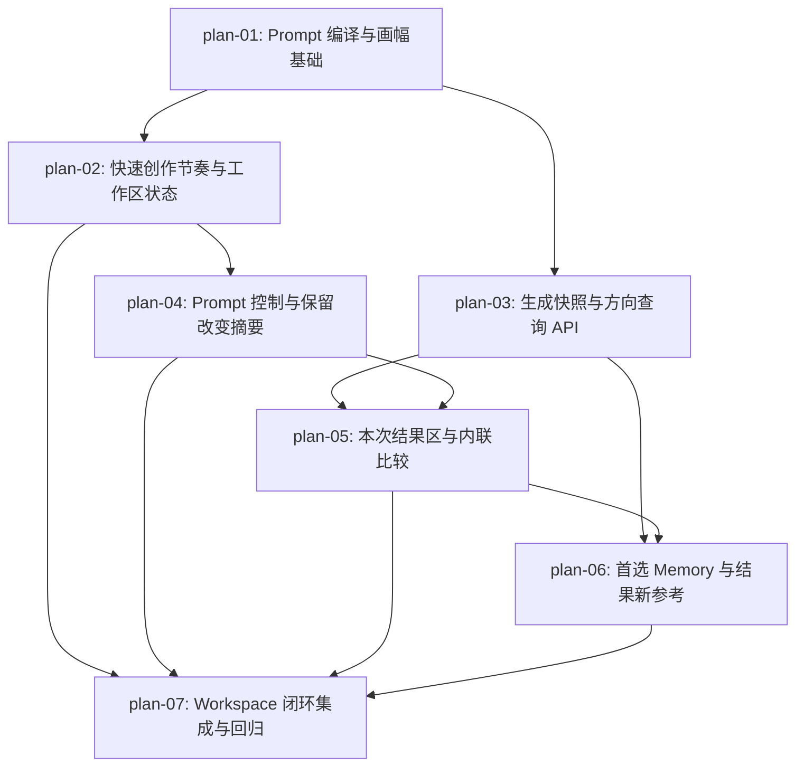

# 实现计划：Workspace 证据引导生成闭环

## 1. 计划入口

把已通过架构审核的 Workspace 主流程落地为连续的“分析 → 比较 → 修正”闭环：用户可在分析后编辑与快速复刻之间选择，使用可追溯 Prompt 与参考画幅生成结果，在当前方向内查看五个成功结果和任务状态，并通过真实证据完成比较、局部调整、首选、Style Memory 沉淀与新参考切换。实现复用现有 Next.js、PostgreSQL、R2、Provider 与 Memory 写点，只新增一个 GenerationTask JSONB 快照字段和兼容查询，不引入新表、队列或服务。

- 来源架构：`docs/15-Workspace证据引导生成闭环/15-1-架构文档-Workspace证据引导生成闭环.md`（最新 arch-check：Pass）
- 上游需求：`docs/15-Workspace证据引导生成闭环/15-0-需求设计-Workspace证据引导生成闭环.md`
- 设计系统：`docs/design/DESIGN.md`（The Precision Frame）
- 核心闭环：分析 → 比较 → 修正
- 计划组织：功能维度，7 个 PLAN 文件
- 权威边界：README 仅维护跨 PLAN 索引、验收追踪、执行拓扑与状态机；实现规格以各 `plan-*.md` 为准。

## 2. 执行拓扑



| 阶段 | 功能 | 目标 | 并行度 |
| --- | --- | --- | --- |
| Phase 1 | plan-01 | 确定性 Prompt、调整与画幅契约就绪 | 1 |
| Phase 2 | plan-02, plan-03 | 客户端快速授权状态与服务端任务事实并行落地 | 2 |
| Phase 3 | plan-04 | Prompt 两轴控制、摘要与专业入口交付 | 1 |
| Phase 4 | plan-05 | 方向 feed、本次结果区和真实规则比较闭环 | 1 |
| Phase 5 | plan-06 | 首选、Style Memory 与新参考切换闭环 | 1 |
| Phase 6 | plan-07 | 页面总编排、旧成功弹层退场和完整验收回归 | 1 |

执行顺序说明：plan-01 是两条分支共享的类型与纯函数基础；plan-02 与 plan-03 可并行；plan-04 消费工作区 v5 状态；plan-05 汇合 Prompt 控制和方向 API；plan-06 在可选择结果后接入首选/Memory/新参考；plan-07 最后统一页面行为并承担全旅程回归。每个用户可观察功能必须先产出 red E2E 证据，再实现到 green。

## 3. 验收标准追踪矩阵

| AC-ID | 需求原文 | 架构承接 | 计划承接 | 验证方式 | 当前状态 |
| --- | --- | --- | --- | --- | --- |
| AC-01 | 双速入口；快速确认披露设置，只自动一次且保留完整证据 | §2.4、ADR-2、§6.1 | plan-01, plan-02, plan-03, plan-07 | plan-02 §5/§6 快速路径 E2E + plan-03 快照契约测试 + plan-07 全流程回归 | done |
| AC-02 | Prompt 按意图和表达程度组织且不误覆盖手动编辑 | §2.4、ADR-3/4、§6.2 | plan-01, plan-04, plan-07 | plan-01 纯函数测试 + plan-04 §5/§6 组件与 E2E + plan-07 回归 | done |
| AC-03 | 画幅推荐遵循 reference/user/restore/fallback 优先级 | §2.4、§6.3 | plan-01, plan-04, plan-07 | plan-01 比例算法/Provider 测试 + plan-04 E2E + plan-07 回归 | done |
| AC-04 | 全状态内联，最近五个成功结果与 Iteration 连续可见 | §2.4、ADR-5、§6.4 | plan-03, plan-05, plan-07 | plan-03 repository/API 测试 + plan-05 §5/§6 结果区 E2E + plan-07 回归 | done |
| AC-05 | 从真实偏差维度定位并调整真实规则，不自动生成 | §2.4、ADR-3/7、§6.5 | plan-01, plan-04, plan-05, plan-07 | plan-01 adjustment 测试 + plan-05 比较 E2E + plan-07 回归 | done |
| AC-06 | 当前选择、本次首选与 Style Memory 验证边界保持一致 | §2.4、§6.4/6.7 | plan-05, plan-06, plan-07 | plan-06 §5/§6 首选/Memory E2E + plan-07 回归 | done |
| AC-07 | 异常、恢复和方向切换不丢创作上下文 | §2.4、§3.2/3.3、§6.1/6.4/6.6、§8.2 | plan-02, plan-03, plan-05, plan-06, plan-07 | 各功能边界测试 + plan-07 降级/焦点/切换 E2E 与 acceptance gate | done |

## 4. 功能索引

| 功能 | 文件 | 依赖 | 交付边界 |
| --- | --- | --- | --- |
| plan-01 | `plan-01-Prompt编译与画幅基础.md` | 无 | 两意图、三档表达、四类调整、来源 segments 与统一画幅算法成为稳定纯函数契约 |
| plan-02 | `plan-02-快速创作节奏与工作区状态.md` | plan-01 | 工作区 v5、快速确认快照、一次性授权与自动提交防重放闭环 |
| plan-03 | `plan-03-生成快照与方向查询API.md` | plan-01 | JSONB 快照、方向分组 feed、Provider 异常终态与已有 Asset 分析 API 就绪 |
| plan-04 | `plan-04-Prompt控制与保留改变摘要.md` | plan-02 | Prompt 两轴控制、三编辑模式、dirty confirm、保留/改变摘要和画幅来源可见 |
| plan-05 | `plan-05-本次结果区与内联比较.md` | plan-03, plan-04 | 五成功结果 + active/failure、选择/比较、真实 invariant 调整和焦点闭环 |
| plan-06 | `plan-06-首选Memory与结果新参考.md` | plan-03, plan-05 | 窗口外首选、既有 Memory 写点与结果 Asset 新方向切换闭环 |
| plan-07 | `plan-07-Workspace闭环集成与回归.md` | plan-02, plan-04, plan-05, plan-06 | 页面总编排、成功弹层退场、全旅程/降级/视觉/键盘验收收口 |

## 5. 开发状态机

| FEAT | 当前步骤 | red_e2e | implement | green_e2e | review | 最近证据 | 阻塞原因 | 更新时间 |
| --- | --- | --- | --- | --- | --- | --- | --- | --- |
| plan-01 | done | done | done | done | done | `reviews/plan-01-review-20260901.md` | — | 2026-09-01 |
| plan-02 | done | done | done | done | done | `reviews/plan-02-review-20260901.md` | — | 2026-09-01 |
| plan-03 | done | done | done | done | done | `reviews/plan-03-review-20260901.md` | — | 2026-09-01 |
| plan-04 | done | done | done | done | done | `reviews/plan-04-review-20260901.md` | — | 2026-09-01 |
| plan-05 | done | done | done | done | done | `reviews/plan-05-review-20260901.md` | — | 2026-09-01 |
| plan-06 | done | done | done | done | done | `reviews/plan-06-review-20260901.md` | — | 2026-09-01 |
| plan-07 | done | done | done | done | done | `reviews/plan-07-review-20260902-r2.md` | — | 2026-09-02 |

## 6. 全局护栏

1. **PRD/架构为 SSOT**：不得更改 AC-01～AC-07 语义；模型事实与用户 adjustment 分层，禁止修改 Recipe 伪装为用户确认。
2. **快速授权同源**：确认 UI、readiness 和 submit 必须消费同一个 `QuickGenerationAuthorizationSnapshot`；`armed` 无合法快照视为 `none`；请求前先持久化 `consumed`，阻塞/退出时清快照。
3. **任务事实唯一**：GenerationTask 是 Iteration/方向结果 SSOT；completed、active、latestFailure 分组不共享配额；不得新增会话结果表或客户端伪造终态。
4. **Memory 边界不变**：`preferredIterationId` 只表示会话偏好；只有第 14 期既有 templates 写点可以更新代表结果和验证状态。
5. **复用不复制**：生成结果作为新参考时只提交 `sourceAssetId`，服务端按 userId 读取 Asset 元数据，不下载、重传或复制对象。
6. **数据库纪律**：Schema 变更使用 `pnpm db:generate` 生成 `0006` 迁移，审查 meta 与 SQL，并在可丢弃本地库执行 apply/reset 证据；禁止伪造旧任务快照。
7. **E2E-TDD**：用户可观察功能先写 `e2e/workspace-evidence-guided-render-loop.spec.ts` red 场景；每个功能保留 red/green 证据，implementer 只在 red 有效后开工。
8. **设计与可访问性**：遵循 `docs/design/DESIGN.md`；内联结果/比较不遮挡三栏，确认/比较/调整/切换有确定焦点，状态通知只用 polite live region。
9. **安全与日志**：所有 API 强制认证与 userId 隔离；快照按 Recipe 白名单校验；日志不记录 Prompt 全文、替换值、图片或凭据；Provider 启动失败必须有 task 终态和 critical 兜底日志。
10. **范围纪律**：每次仍生成一张；不做自动评分、自动循环、后台自动重试、批量补失败、新 Provider 或移动端重设计。
11. **预算运行阈值不硬编码**：Provider 账户预算的 70%/90%/100% 阈值由部署与 release-readiness 核验，代码不写入易过期价格；100% 时只停止 Generation，分析证据和 Prompt 编辑继续可用。

## 7. 执行前置与全局验证

环境前置：

```bash
pnpm doctor
pnpm install --frozen-lockfile
pnpm db:up && pnpm db:push
pnpm exec playwright install chromium
```

全局验证：

```bash
pnpm workflow:check
pnpm verify:fast
pnpm verify:full
pnpm verify:acceptance
```

执行说明：每个功能完成最后一次编辑后先跑其 §6 聚焦命令，再跑 `pnpm verify:fast`；plan-03 追加可丢弃数据库迁移检查；plan-07 以 `pnpm verify:acceptance` 作为最终发布前验收门。现有 mocked E2E 不依赖 live Provider 或 R2 凭据。

部署/运营承接（架构 §8.4，部署阶段落实）：

| Provider 账户预算阈值 | 运行行为 | Owner | release-readiness 证据 |
| --- | --- | --- | --- |
| 70% | 发出预算预警，核对当期调用增长与剩余额度 | 发布负责人 / Provider 账户管理员 | 记录当前预算配置、已用比例与通知渠道；不记录密钥 |
| 90% | 发出高优先级预警，确认 Generation 停止预案和用户降级文案可用 | 发布负责人 / Provider 账户管理员 | 记录负责人确认与停止预案检查结果 |
| 100% | 停止新的 Generation；分析证据、已有结果与 Prompt 编辑保持可用 | 发布负责人执行，应用按既有 generation unavailable 降级展示 | release-readiness 保存停止线生效与非生成能力仍可用的 smoke 证据 |

上述阈值通过 Provider 账户/预算配置实施，不在仓库硬编码金额或实时单价；release-readiness 未绑定真实部署目标、当前 revision 和阈值证据时，不得宣称运行侧成本门已完成。

## 8. 未决策项与变更记录

| 类型 | 日期 | 内容 |
| --- | --- | --- |
| 未决策项 | — | 无。架构 frontmatter `open_questions: []`，最新 arch-check 的 blocker/high/medium/low 均为 0。 |
| 变更记录 | 2026-08-31 | 初始生成：从 15-1 架构拆出 7 个功能、6 个阶段，AC-01～AC-07 全量映射；计划状态 `review_ready`。 |
| 变更记录 | 2026-08-31 | dev-plan-check 修复：引用 plan-03 的 `[id]` zsh 路径；补可丢弃本地库 `db:reset → db:push` fresh apply 证据；补同步 120000ms / Replicate 异步 300000ms 超时 fake-timer 回归。 |
| 变更记录 | 2026-08-31 | dev-plan-check 二次修复：plan-06 补 Memory 写成功后的列表/详情/候选/direction feed 统一回读与部分刷新失败边界；README 补 Provider 预算 70%/90%/100% 的部署/release-readiness owner 与证据。 |

<!-- 保留目录：reviews/。首次 dev-plan-check / task-review 时创建。 -->
