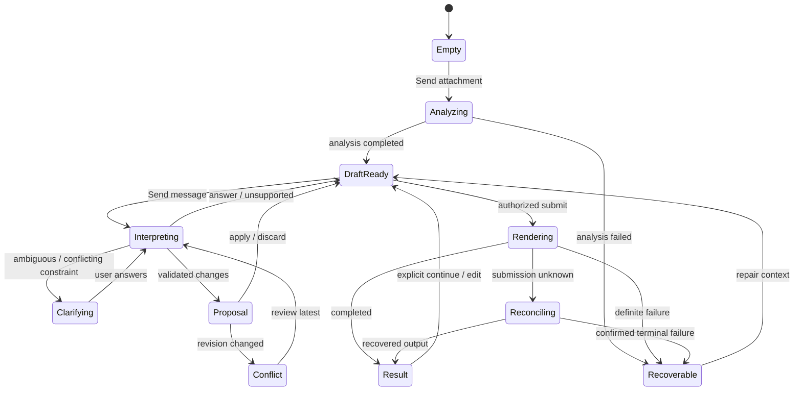
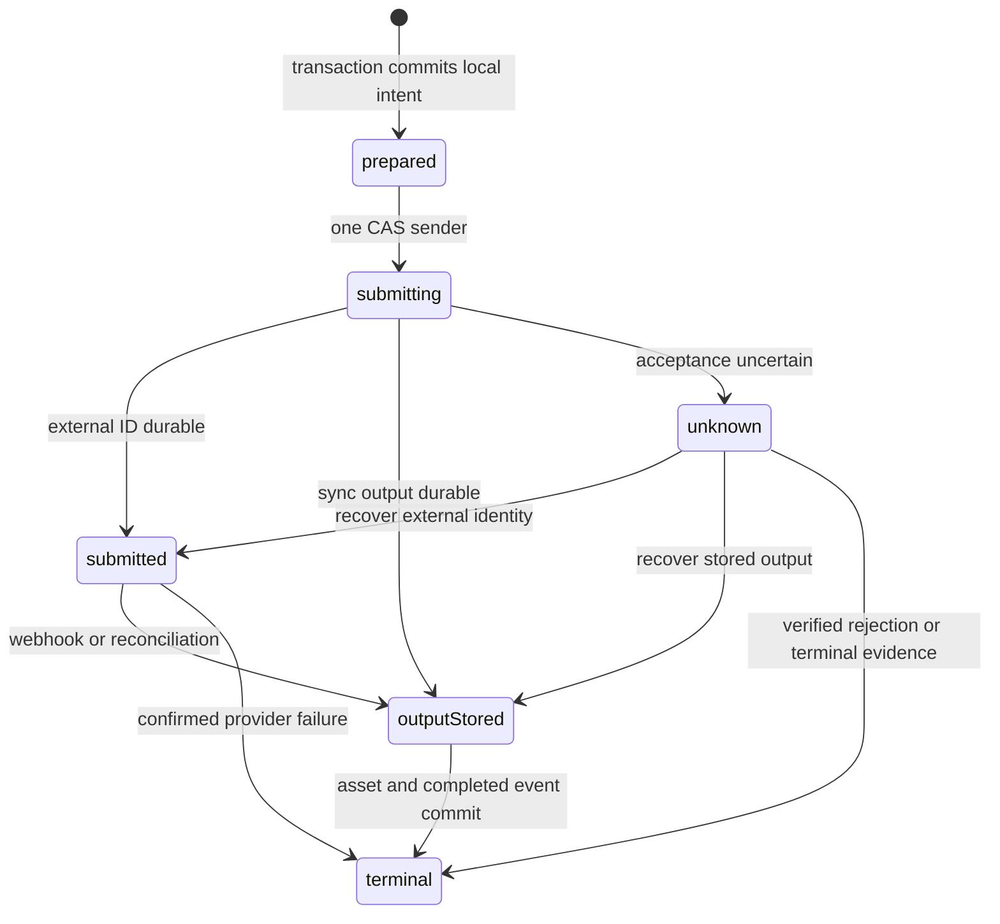

# 16-1 架构文档：Workspace Agent 对话式创作

## 1. 系统摘要

核心闭环：**Reference → Conversation → Render**。保留现有分析与提示编译链路，以持久化创作方向连接多轮对话、可检查修改和固定生成快照。Agent 只产出受校验的回答或操作意图；草稿变更与生图执行由确定性服务控制。前端采用对话与视觉双栏，生成按钮固定在输入框下方，与模型、画幅和质量同区。

## 2. 范围、非目标与成功标准

### 2.1 范围

承接配对 PRD 全部 22 条 AC：真实多轮理解、提案及冲突保护、独立生成入口、快速一次授权、结果比较、方向恢复和 Memory 语义。正文区分现有 owner 与拟新增模块，不将原型模拟行为视为实现依据。

### 2.2 明确不做

不新增聊天管理中心、跨设备协作、向量检索、自动循环 Agent、消息队列或独立 Worker；不新增模型产品、批量图像或局部重绘。既有列表/详情继续复用，只增加方向返回入口及必要兼容字段。

### 2.3 成功标准

| 目标 | 通过口径 |
| --- | --- |
| 对话有真实作用 | 不同表述和引用能得到正确回答/差异，歧义及范围外请求不产生错误写入 |
| 草稿受保护 | 版本冲突不覆盖，旧结果查看不恢复，手写提示不被静默重写 |
| 生成可核对 | 一个授权只对应一个本地任务，未知外部提交不盲目重发 |
| 可恢复 | 同一浏览器重开可恢复消息、方向和真实任务，旧消息不再次执行 |
| 交互完整 | 各尺寸主题下输入与下方生成栏可达，来源与用户验证语义不变 |

### 2.4 验收标准承接矩阵

| AC-ID | PRD 原文摘要 | 承接模块 | 关键链路 / 状态 | 风险 / 降级说明 |
| --- | --- | --- | --- | --- |
| AC-01 | 附件发送、输入限制、不自动生成 | M1/M4 | 6.1 上传 | 保留 Blob/目标，仅重试失败步骤 |
| AC-02 | 首页合流、真实来源恢复 | M1/M6 | 6.1 进入 | 无旧事件只记 restored |
| AC-03 | 真实多表述理解及范围外说明 | M3 | 6.2 单次解释 | 结构与引用双校验，失败不应用 |
| AC-04 | 歧义、约束冲突及失效引用 | M2/M3 | 6.2 clarify | 先澄清，不猜对象 |
| AC-05 | 提案编辑/应用/放弃/撤销 | M1/M2/M5 | 6.2 CAS | 原子应用，放弃无草稿写入 |
| AC-06 | 旧提案/撤销不覆盖新修改 | M2/M5 | 6.2 revision conflict | 409 保留新稿 |
| AC-07 | 固定 Send 与下方生成位置 | M1 | 4.2 / 6.3 GenerationBar | 空消息禁发，无输入切换语义 |
| AC-08 | 未发送内容、提案及缺项阻塞 | M1/M2 | 6.3 readiness | 前后端各自检查可知条件 |
| AC-09 | 一次提交与不变快照 | M2/M4/M5 | 6.4 dispatch | 唯一键/锁，后续编辑不改任务 |
| AC-10 | 明确语言执行及修改不执行 | M2/M3 | 6.2 render_request | 无 changes+摘要+版本+明确意图 |
| AC-11 | 快速授权一次与清除 | M1/M2 | 6.3 quick / 6.4 | epoch 与原子消费，恢复不重放 |
| AC-12 | 证据、变量、全文与实际溯源 | M1/M2/M4 | 6.2 / 6.3 | before/after 精确比较，无坐标不虚构 |
| AC-13 | 结果完成不抢选择，继续才恢复 | M1/M6 | 4.2 / 6.4 / 6.1 | view 与 draft 分开 |
| AC-14 | 两种比较、历史、下载及新参考 | M1/M6 | 4.2 / 6.5 | 缺对象说明，首选不验证 |
| AC-15 | 较早对话和任务跨关闭恢复 | M1/M5 | 6.1 / 7.5 | DB 事件分页，读取不执行 |
| AC-16 | 未保存保护和失效来源 | M1/M2/M6 | 6.1 restore | 取消零写入，旧任务留原方向 |
| AC-17 | 草稿/代表保存与目标确认 | M2/M6 | 6.5 | 复用验证写点 |
| AC-18 | 保存失败与回读失败区分 | M5/M6 | 6.5 / 7.5 | 命令回执与 committed ID，Local draft 诚实 |
| AC-19 | 上传/分析/对话分步恢复 | M1/M3/M4 | 6.1 / 6.2 / 8.2 | 保留前序，不连带重做 |
| AC-20 | 未知提交核对及两类重试 | M2/M4 | 6.4 unknown | 无证据不重发；确定终态才新意图 |
| AC-21 | 媒体/历史/登录/服务恢复 | M1/M4/M6 | 6.5 / 8.2 | 只重试读取，不登录后重放 |
| AC-22 | 尺寸主题输入法与焦点 | M1 | 4.2 / Phase C | 公共输入/生成栏不被页签卸载 |

## 3. 用户流程与状态

### 3.1 主流程

PRD A1–A7 为唯一用户旅程；架构将其拆为互不替代的三种状态：持久草稿、一次对话请求、一次图像任务。`selectedIterationId` 只控制观看，`draftRevision` 才决定修改/生成的输入。聊天不是新的生成事实来源。

### 3.2 关键分支

| 触发 | 处理 |
| --- | --- |
| 首页上传/空白附件 | 直传完成后关联分析，发送键始终为 Send；附件不是生成授权 |
| 快速复刻 | 保存一次性授权和参考/设置摘要；当前浏览器活动方向分析完成后，提交同一个授权键一次 |
| 旧结果/Memory 恢复 | 先取完整详情和差异，确认后新建方向或修改当前草稿；无历史事件则只记 restored 事件 |
| Agent 返回期间用户改稿 | 提案保留原 baseRevision，应用返回冲突；回答可看，不获得覆盖新稿的权限 |
| 生成完成时正在比较 | 只增加未读结果提示，维持选中与焦点 |
| 页面关闭/重新打开 | 读状态和事件，不自动重放命令；未消费 quick 授权清除 |

### 3.3 状态机



图为主显示状态，生成中仍允许更新下一轮草稿；不能用单一 `generating` 布尔值禁用整个编辑区。界面将 `draftSaveState`、`turnState`、`generationState`、`viewState` 分开。正在理解请求时禁止第二个 turn；图像生成中可发送解释/修改请求，但执行闸门禁止第二个图像任务。

## 4. 系统上下文与模块职责

### 4.1 系统上下文与现有依据

Next.js 应用保留 Auth.js 用户身份、PostgreSQL/Drizzle、R2 直传及现有 Provider 绑定。新接口在 Node runtime 内执行，不依赖响应后未等待的后台 Promise；默认运行在支持最长 240 秒请求的 Node 服务。有限请求内没完成的外部异步任务由原 webhook 和用户读取时的状态核对完成，不引入常驻调度器。

核对的现有 owner：

- `src/hooks/use-workspace-state.ts`：v5 工作区目前写入 sessionStorage，不能独自满足关页重开及多个方向保留。
- `src/lib/ai/providers/types.ts` 与 `index.ts`：只有 vision/structurer/imageGen，无自由对话契约；`structure()` 固定分析提示，不可挪作聊天接口。
- `src/lib/ai/models.json`、`model-config.ts`：模型和 Provider 绑定 SSOT，默认 Gemini 2.5 Flash 分析/结构化经 Replicate，默认生图 FLUX.2 [dev]。
- `src/app/api/generation/route.ts`：先建任务再调 Provider，但无请求唯一键；同步结果落盘使用未等待的 Promise，异常统一 failed，不能证明外部未接收。
- `src/lib/ai/webhook-utils.ts`：进程定时器不是可靠持久任务终态依据。
- `src/lib/prompt-composer.ts`、`render-readiness.ts`、`generation/aspect-ratio.ts`：复用提示派生、就绪及画幅逻辑。现有画幅不含原型示例 4:5，实施使用真实白名单最近比例，不以示例新增模型能力。
- `src/lib/db/schema.ts`：已有生成快照与来源关系，但无方向实体/会话消息；新增字段不伪造旧记录。

### 4.2 模块职责

| 模块 | 上游输入 → 职责 → 下游输出 |
| --- | --- |
| M1 Workspace UI | 用户输入/查看 → 分离 Conversation、Canvas、Inspector、Composer、GenerationBar → 事件命令和视图状态 |
| M2 Workspace service | 身份、命令、版本 → 校验归属、CAS 修改、授权与就绪门控 → 持久方向/事件、M4 提交 |
| M3 Agent interpreter | 受控上下文和当前消息 → 单次模型推理、结构验证、引用核对 → answer/clarify/proposal/render_request/unsupported |
| M4 Analysis & Generation | 已确认输入 → 复用分析、编译、Provider 执行、固定快照和核对 → 任务/结果事实 |
| M5 Workspace repository | 事务及读取请求 → 方向、事件、去重、分页和版本条件写 → 可恢复记录 |
| M6 History & Memory bridge | 用户选择及真实详情 → 复用既有历史、保存/代表结果确认 → 新草稿来源与可验证 Memory |

M1 交互契约（触发 → 回调 → 更新）：

- Send：非空文字/附件 → `sendTurn` 或上传分析动作 → 自己的消息立即保留，服务确认后绑定事件 ID；失败原位 Retry，不生成图片。
- Proposal 的 Edit/Apply/Discard：编辑只改提案副本；Apply 调 `applyProposal(baseRevision)`，成功同时更新草稿与应用回执，Discard 只改提案状态；409 保留新草稿并显示 Review against latest draft。Undo 绑定结果 revision。
- Evidence 点击：设置 `selectedEvidenceId` → Canvas Reference 和 Prompt 真实支持片段联动；无定位时显示不可定位。Ask about this 添加 typed reference，手机切 Canvas 时保留 Back to conversation 焦点锚点。
- GenerationBar：在 Composer 外、下方常驻；设置修改走 `saveDraft`，生成走 `submitGeneration`；未发送内容/附件仅由浏览器可知，前端先禁用，服务端另核对所有权、revision、提案、任务与参数。快速/重试也只在此栏执行，消息只定位栏。
- Canvas：Reference/Result/Compare 及 Evidence/Draft/Prompt 各自保留选择。点击缩略图只更新 view；Continue 调来源预览并经守卫后更新草稿。比较使用两个对象 ID，图像 contain，不计算相似度分数。
- Memory：Save draft 打开内联表单；Save result 绑定明确代表图与确认；调用既有写接口，成功刷新失败仅重读。Preferred 只写方向偏好，不能调用验证写接口。
- 视窗：桌面双栏、手机页签内容独立滚动，Composer 与 GenerationBar 在内容切换区之外共用一个实例；100dvh、安全区和键盘避让。输入法 composition 守卫、aria-live、不抢焦点、reduced-motion、英文固定文案继承 DESIGN.md。

### 4.3 需要刻意避免的过度设计

新增两个领域表，不拆 proposal/receipt/authorization 三套辅助表；它们属于事件或方向。保留单应用部署与数据库，不引入 Agent 框架、向量库、Redis、通用工具市场或任意代码执行器。一次请求一次结构化模型调用，首版无自动反思/修复推理循环。草稿版本仅用于 CAS 和快照，非通用版本管理系统。

## 5. 关键架构决策（ADR）

### ADR-1：持久方向与事件

- **选择**：新增 `workspace_directions`、`workspace_events`，PostgreSQL 是提交内容和消息 SSOT；IndexedDB 保存未提交草稿/附件与本机方向指针。
- **理由**：满足关页恢复和旧消息读取；不做完整会话产品或协作层。
- **风险与对策**：服务不可用只声明 Local draft；重连 CAS，不让本机旧副本覆盖服务端。

### ADR-2：单次解释，不让模型写业务数据

- **选择**：新增 AgentProvider 契约，复用现有 `resolveStructurerModel()` 的绑定与凭据，独立 prompt/schema；每轮只返回受限意图。
- **理由**：同一已配置模型承担语言理解，无需新增注册中心/工具循环；不用固定 structurer 提示冒充对话。
- **风险与对策**：语义歧义、引用不实和不合法操作进入 clarify/failed；执行只能经 M2。

### ADR-3：草稿版本与提交快照隔离

- **选择**：所有草稿修改 CAS `draftRevision`；提案保留 baseRevision，生成从已保存草稿编译不可变快照。
- **理由**：覆盖并发修改和历史回看；不引入任意分支合并引擎。
- **风险与对策**：冲突展示差异，明确重提；不自动覆盖用户全文。

### ADR-4：数据库先记意图，外部只发一次

- **选择**：请求键唯一约束、方向行锁及生成任务提交阶段；按钮、自然语言、quick 共用 submit 服务。
- **理由**：防重不能依靠 UI 或内存锁；无需新队列即可保证本地意图只建一个任务。
- **风险与对策**：数据库与 Provider 非原子，外部接受未知时禁止自动重发，按 §6.4 核对，不承诺分布式 exactly-once。

### ADR-5：响应期执行与被动核对

- **选择**：Agent 同步有界执行；Replicate 异步生图复用 webhook 并加读取核对；同步 Provider 在响应前等待结果转存。
- **理由**：不使用 fire-and-forget 或仅进程定时器保证完成，不为轮询闭环新建 Worker。
- **风险与对策**：崩溃按持久阶段恢复；离线且无回调时延后到再次查看核对，未知提交进入隔离而非假失败。

### ADR-6：单一控件与真实能力

- **选择**：UI 改为对话/画布，生成栏固定在输入下方；画幅与模型来自现有目录，增加能力投影。
- **理由**：用户已确认操作位置；不为原型示例扩张 API 或模型能力。
- **风险与对策**：当前 Provider 忽略 quality/negativePrompt 的项不能假装生效；未映射能力明确提示，恢复时显示待替换设置。

### ADR-7：来源与验证沿用现有闭环

- **选择**：新方向绑定既有 analysis/iteration/template；保持旧任务快照回退语义及代表结果明确确认。
- **理由**：对话是创作入口，不新造资产或用户验证体系。
- **风险与对策**：旧记录无消息只写恢复事件，失效引用不补假图/假证据，保存回读失败不重写。

### 5.8 待确认问题

无待用户选择的架构问题。技术默认值已决策：复用 structurer 模型绑定、两张新表、数据库 CAS、同一浏览器可恢复、未知提交保留隔离态。预算为 §8.4 的建议部署配置，不是用户消费授权；Provider 价格不确定不改变契约，使用保守预约值且部署时校准。

## 6. 运行链路

### 6.1 进入、上传与恢复

1. M1 从 URL `directionId` 或按登录用户命名空间的本机指针找方向；无指针则创建。未登录可保留本机草稿，付费分析/对话/生成仍沿用现有 401，不扩展匿名付费链路。
2. 文件校验后将附件 Blob 和目标先保存本机；Send 请求既有 presign 并直传 R2，保留 assetId。首页已上传的文件复用标识，不重复上传。
3. `POST /api/analysis` 增加 directionId/requestKey，事务写入 analysis 关联后调用既有分析流程；相同键返回原任务，明确失败后的重试使用新键并复用已上传资产。分析结果只初始化绑定方向且尚未由用户替换的草稿，已编辑内容先形成提案。
4. 新建/替换/历史恢复先取真实详情，前端展示差异；取消不写入。确认保留时先 flush 原方向再创建新方向，确认替换只替换指定方向草稿，活动旧任务仍带原 directionId。
5. 历史入口有可访问 directionId 则提供“返回此方向”；“从此结果继续”明确创建新草稿。老任务无 directionId 时创建方向及 restored 事件，不回填伪消息；本机方向菜单仅最近使用快捷返回，不成为新聊天列表。

**实现原则**：字段恢复按服务端真实详情白名单映射；缺参数/模型不猜测。现有 v5 sessionStorage 只进行一次导入：新方向成功持久后标记 migrated；不能删旧数据后再请求。导入先按旧 analysis 来源创建方向，再把旧本机编辑转换为白名单 PATCH；两步均成功才记 migrated，原数据保留到导入确认完成。原始附件不经业务 API。文件直传约束和归属检查复用既有 owner。

### 6.2 多轮理解、提案与专家编辑

1. 浏览器 flush 当前草稿，携带 baseRevision、文本、typed references 和当前显示的生成摘要凭据，生成稳定 requestKey。M2 锁方向、检查权限及单个活跃 turn，插入事件，然后释放事务进行推理。
2. M3 读取当前配方、变量、手写全文、保留约束、显式引用及最近完整轮次。上下文组装顺序：不可丢的当前草稿/约束 → 当前引用 → 最近轮次；去重按引用类型+ID，排序稳定。总输入上限 12k tokens（无法可靠计数时按保守字节上界），不足只剔除最旧完整轮次，不截断当前约束；核心上下文超限返回可纠正错误。
3. 用户显式引用较早消息时按事件 ID 回读该轮；全部消息仍保存在 DB，模型只看有限窗口必须诚实表述，不伪称记得全部历史。对参考/结果的视觉问题仅加载已验证归属的最多两张图；无图时只讨论已有证据，不编造新视觉观察。
4. 单次 AgentProvider 调用使用独立 system instruction 和 JSON 输出约束，支持 Replicate `images` 或 Gemini fileData。输出必须匹配 §7.2，校验 kind、长度、操作白名单、变量/规则 ID 与引用集合；拒绝未知键/原型污染路径。非法输出记录 failed，不自动追加一次修复推理。
5. answer/unsupported 只完成回复；clarify 保存问题/候选及原请求，下一轮引用澄清事件；proposal 保存 baseRevision 与差异，不写草稿；同方向仅一个当前 pending 提案，新提案替代时将旧提案标 stale 并保留历史，避免隐藏提案永久阻塞生成。render_request 仅在当前用户原文明确授权、没有混合修改/冲突/未决提案、版本和展示凭据匹配时由 M2 走 §6.4；否则形成澄清或生成摘要。语言授权通过后，先在生成意图建任务的同事务内完成 turn 并关联 task，之后再等待同步 Provider；该事务只豁免当前已验证 render_request 自己的活跃 turn，其他活跃 turn 仍阻塞；60s turn 租约只约束解释阶段，不能在图像生成阶段把已完成 turn 判失败。
6. Apply 重新校验差异，在事务中验证 revision 与操作前值；一次性应用全部操作，重编译提示并递增 revision，标记 proposal 已应用及 inverse 操作。Discard 只关闭提案。直接编辑、全文模式切换同样走 CAS，待应用提案因此变 stale。
7. Undo 要求当前 revision 等于该应用后的 revision；成功写反向操作并生成新 revision。否则 409，只有“按当前版本生成恢复提案”。手写全文使用整体 before/after 精确比较，不使用模糊字符串替换；结构化规则按 ID 更新、不通过全局文本替换。

**实现原则**：Agent 不执行任意工具，M2 不把模型声称的“用户授权”当独立权限凭证。明确生成的语义判断由当前消息意图分类与无 changes 约束共同完成；含“先修改再生成”的请求先给提案。租约超时或响应丢失先查事件，迟到回复不可覆盖较新状态，更不能恢复已失效授权。

### 6.3 设置、就绪与快速授权

1. M1 维护未发送文本/附件与网络保存状态，扩展 `deriveRenderReadiness` 加入未提交编辑、活跃提案/turn、generation dispatch；M2 用已存草稿重新检查必填项、analysis 完成、模型有效及预算。
2. 画幅仍用 `SUPPORTED_ASPECT_RATIOS` 和 `abs(log(reference/candidate))` 最近值，恢复/用户优先，tie 用既有数组序。4:5 示例实际推荐 3:4，不硬编码示例比例。
3. 模型能力由 provider binding 投影为可用参数；quality 若适配器尚无实际效果，仅 Standard 可选，HD 显示未支持，旧 HD 恢复必须用户改选；negative prompt 保留编辑与快照，但不支持的 Provider 明示未单独应用，不悄悄声称生效。新增有效映射需 Provider 契约测试，不扩展模型清单。
4. 展示生成摘要后使用服务端签名凭据 `directionId/revision/draftHash/modelBindingHash/expiresAt`（15 分钟）。它仅证明摘要对应版本，浏览器展示回调才可随执行发送；所有摘要相关修改使其失效。
5. quick 授权存于方向，绑定 source、设置 hash、固定 intent/detail、authorizationId 和当前页面 activationId。只有该活动页面分析完成事件可用原授权 ID 提交；原授权原子消费和生成建任务同事务。清除/恢复/换方向增加 authorizationEpoch，旧页面回调无法再执行。

**实现原则**：自动分析造成的预期草稿初始化可以承接 quick；用户修改则撤销。分析失败、退出、登录失效都清授权。刷新只 invalidate/read，不补发 quick。未知提交重复使用同一 requestKey 查询；不能因凭据过期而把已存在任务当作新提交。

### 6.4 生成提交、核对与结果落盘

1. 浏览器在发送前把 requestKey 和摘要写 IndexedDB。M2 按 `(userId,requestKey)` 先查原生成意图：hash 相同返回原任务，hash 不同 409。新意图在方向行锁内检查无活动/未知任务，CAS revision，读取真实 analysis、template 归属，用共享编译器固化最终 prompt、negative、变量/配方/参数和 binding。
2. 同事务保存唯一 generation task、事件回执、预算预约及一次授权消费，`dispatchState=prepared`。事务外通过 CAS `prepared→submitting` 取得一次发送权，写入 attemptedAt/deadline；其他请求只能读，不再调用 Provider。
3. Replicate 在请求期取得 externalId 后保存 `submitted`，返回 201；webhook 复用签名验证，并以 taskId+externalId 条件匹配；回调先于 create 响应时，在签名和预期 Provider/model 校验后仅允许 externalId 为空的原任务原子绑定，后续响应必须一致。已知 externalId 时补充 `predictions.get` 核对。fal 首版保留现有同步 subscribe 路径；Gemini 同步响应也在当前请求内等待完成转存，不在返回后依赖未等待 Promise。
4. 同步图片响应先写确定 R2 key，持久 `outputStored` 与预分配 resultAssetId，再事务 upsert asset、完成任务及插入唯一结果事件。重试落盘只复用既有输出，绝不再调用生成；异步输出保存 descriptor 后同样处理。R2 写入成功但 DB 失败时按确定 key HEAD 恢复，不重复创建 asset。
5. 响应超时/连接断开：浏览器按 requestKey 查询。无本地任务时再次确认原键请求，不换键；有任务则只读/核对。`prepared` 可经显式恢复命令重新争取发送权；`submitting` 后一律不靠超时认定“未发送”。确定 Provider 拒绝且无任务才标 failed；其他进入 unknown。
6. unknown 核对顺序：读取已存输出 → 已知 externalId 查询 → Replicate 已签名回调关联 taskId → 仍无证据则保持隔离。默认不自动用输入近似匹配 Provider 列表，不把任意超时改成 failed。无查询能力且响应永久丢失时，运维通过 `scripts/reconcile-generation.mjs` 录入 Provider 查询/工单的确定终态或未接收证据，写审计事件后解除；无法证明就继续保留隔离，只允许其他方向创作。该脚本是人工故障修复，不是定时 Worker。
7. 明确 failed 后 Retry original 从旧 task 快照建立新 requestKey，新任务明确标 retryOf；Generate current draft 则用当前 revision。二者在下方栏展示摘要再提交。Retry original 保留原参数和模型绑定；绑定已不可用时先展示不可执行原因，用户改选后属于 current 新提交，不静默切模型。迟到结果仍归原 task/方向，终态更新用 CAS 防止覆盖另一轮。
8. UI 由任务事实渲染结果，手动选择已锁住的旧结果/比较不自动切换。Readiness 只阻塞该方向，返回原方向仍可见进度或隔离原因。

**实现原则**：新增 `dispatchState` 是内部提交阶段，不扩张现有公开 pending/processing/completed/failed 枚举；unknown 对外仍 processing 加 `submissionState=unknown` 和明确禁重试说明。不可能以本地事务保证 Provider 的分布式 exactly-once；设计保证同一意图不自动重复外呼，并诚实保留不可核对状态。GET 可以核对已有外部任务及完成已知输出，不能触发新收费推理。

### 6.5 Memory、保存与回读

1. Save draft 从服务端当前 draft 构造既有模板保存 payload；Save result 取选中任务快照和代表图，用户确认后调用既有代表结果写点。名称预填、标签编辑保留。
2. 缺少可访问分析上下文的 Memory 可继续编辑/保存，生成需先补参考并分析，不制造 completed 分析记录来跳过缺项。sourceTemplateId 由真实来源确定，显式新建副本/更新目标；preferredIterationId 只写方向，不能派生 verificationStatus。
3. Memory 写入与对应 workspace memory 命令回执同一数据库事务提交；重复请求先返回回执。写接口成功后保存 committedMemoryId，再刷新详情/列表；回读失败仅 retry read。为模板 create/duplicate/代表结果写点补可选 requestKey（事件记录存目标及返回 ID），网络结果未知先查该命令，不盲目重建 Memory。
4. 查询历史、下载和图片预览的失败分别重试原读取/下载。恢复详情未齐前，不向草稿 reducer 发送 restore；M6 把旧 recipe/prompt 快照转换为新方向初稿而不伪造观察。

**实现原则**：保持现有 templates 验证定义、用户归属和删除规则，不把 Agent 反馈存成用户验证。方向的 last committed save 与视觉未读状态分开，避免“刷新失败”抹掉成功事实。

## 7. 领域对象与关键契约

### 7.1 核心对象与存储 owner

| 对象 | SSOT / owner | 增量 |
| --- | --- | --- |
| WorkspaceDirection | 新 `workspace_directions` / M5 | 当前草稿、revision、来源、偏好、quick 授权与修改保护 |
| WorkspaceEvent | 新 `workspace_events` / M5 | 一轮输入/输出或确定性命令回执；提案、逆操作、提交关联均内聚 |
| AnalysisTask | 原 `analysis_tasks` / M4 | 可空 directionId/requestKey，分析预算预约与最后核对时间 |
| GenerationTask | 原 `generation_tasks` / M4 | 可空 directionId/requestKey/draftRevision，提交阶段、hash、deadline、预约成本、输出恢复信息 |
| Asset / Style Memory | 原 assets/templates / M4、M6 | asset 增加可空 sourceGenerationTaskId 唯一；Memory 不改变验证定义 |
| BrowserDraft | IndexedDB / M1 | 未发送文字/Blob、未确认 CAS 编辑、方向快捷指针与命令键；不是已提交事实来源 |

方向创建与保存均按 userId 归属，未登录只有本地副本。服务端保存成功显示 Saved；仅本机数据为 Local draft。DB 保留同一用户的历史方向，但本期不提供跨设备同步 UX 或协作语义。

### 7.2 最小 Schema

以下为拟新增应用契约，日期均 ISO 字符串；数据库使用带时区时间和 JSONB。`PromptControlSnapshot`、`GenerationParams`、`StoredVisualRecipe`、`QuickGenerationAuthorizationSnapshot` 沿用现有类型，不复制更深的 recipe schema。新 envelope 两层内；既有复杂配方只按引用读入或沿用原任务快照，属于兼容例外。

```typescript
interface DraftPatch {
  target: 'variable' | 'invariant' | 'constraint' | 'intent' | 'detail'
    | 'customPrompt' | 'negativePrompt' | 'model' | 'aspectRatio' | 'quality';
  key: string;            // variable name / invariant ID；标量用空字符串
  action: 'set' | 'strengthen' | 'relax' | 'disable' | 'replace';
  before: string | null;
  after: string | null;
}
interface ContextReference {
  kind: 'asset' | 'iteration' | 'evidence' | 'event';
  id: string;
  analysisTaskId: string | null;  // evidence 必填，用于定位规则集合
}
interface WorkspaceDirection {
  id: string;
  userId: string;
  title: string;
  creationRequestKey: string;
  draftRevision: number;
  analysisTaskId: string | null;
  sourceAssetId: string | null;
  sourceTemplateId: string | null;
  sourceIterationId: string | null;
  preferredIterationId: string | null;
  draft: WorkspaceDraft;
  quickAuthorizationId: string | null;
  quickState: 'none' | 'armed' | 'consumed';
  quickSettingsHash: string | null;
  quickSnapshot: QuickGenerationAuthorizationSnapshot | null;
  quickActivationId: string | null;
  authorizationEpoch: number;
  createdAt: string;
  updatedAt: string;
}
interface WorkspaceDraft {
  control: PromptControlSnapshot | null;
  params: GenerationParams;
  customPrompt: string | null;
  negativePromptText: string;
  constraints: string[];
  aspectRatioSource: 'reference' | 'user' | 'restore' | 'fallback';
}
interface WorkspaceEvent {
  id: string;
  directionId: string;
  userId: string;
  sequence: number;
  requestKey: string;
  requestHash: string;
  kind: 'turn' | 'restored' | 'draft_change' | 'generation' | 'memory' | 'authorization';
  state: 'processing' | 'completed' | 'failed';
  baseRevision: number | null;
  resultingRevision: number | null;
  inputText: string | null;
  replyText: string | null;
  responseKind: 'answer' | 'clarify' | 'proposal' | 'render_request' | 'unsupported' | null;
  references: ContextReference[];
  changes: DraftPatch[];
  inverseChanges: DraftPatch[];
  choices: string[];
  proposalState: 'none' | 'pending' | 'applied' | 'discarded' | 'stale';
  generationTaskId: string | null;
  memoryId: string | null;
  relatedEventId: string | null;
  deadlineAt: string | null;
  reservedCostUsd: string; // 十进制金额，不用浮点累计
  errorCode: string | null;
  createdAt: string;
  updatedAt: string;
}
interface AgentReply {
  kind: 'answer' | 'clarify' | 'proposal' | 'render_request' | 'unsupported';
  text: string;
  changes: DraftPatch[];
  evidenceIds: string[];
  choices: string[];
}
interface GenerationDispatchFields {
  directionId: string | null;
  requestKey: string | null;
  requestHash: string | null;
  draftRevision: number | null;
  dispatchState: 'prepared' | 'submitting' | 'submitted' | 'unknown' | 'outputStored' | 'terminal' | null;
  attemptedAt: string | null;
  deadlineAt: string | null;
  lastReconciledAt: string | null;
  retryOf: string | null;
  outputUrl: string | null;
  outputObjectKey: string | null;
  outputMimeType: string | null;
  outputWidth: number | null;
  outputHeight: number | null;
  reservedResultAssetId: string | null;
  reservedCostUsd: string | null;
}
```

`AgentProvider.interpret(context, signal): Promise<AgentReply>` 与 `StructurerProvider.structure` 分开，context 由 M3 组装；服务端 normalize JSON 后再完整验证，不能直接信任类型断言。所有创建型 Provider HTTP 调用关闭 SDK/传输层隐式重试；只允许查询请求自动重试，防止应用唯一键被 SDK 重发绕过。生成 `render_request` 必须 changes=[]、choices=[]，proposal 必须有 changes，clarify 不包含可执行 changes。

编译新增 constraints 时保留用户原文与顺序，按 trim 后的完整字符串用 Set 去重；作为用户约束片段加入最终 prompt/negative 的明确目标区，不伪标为模型证据。规则调整映射既有 InvariantAdjustment，变量映射 variableValues，全文模式以 customPrompt 为生成主文，不重复叠加旧派生正文。

变更白名单：variable key 必须在 contentVariables/兼容模板变量集合内；invariant key 必须在本 recipe.styleInvariants 内，constraint key 为已存在约束的稳定摘要或新建标识；标量枚举复用现有模型/意图/详细度定义。每次最多 32 个操作、同 target/key 不允许重复，before 与当前规范值精确一致才应用；不接收 JSON path、任意删除字段或任意 URL。

本期唯一约束：方向 ID 全局 ULID；事件 `(userId,requestKey)`、`(directionId,sequence)` 唯一；generation `(userId,requestKey)` 非空唯一、`directionId` 在 active/unknown 阶段部分唯一；analysis `(userId,requestKey)` 非空唯一。sequence 在方向锁内按 max+1 分配，命令失败不占据已完成记录。事件 completed 和 proposal pending 是不同维度，不能视 completed 为已应用。

### 7.3 API 边界

新增 6 个方法/路径组合；扩展既有 generation 3 个及 analysis 1 个，共 10 个主要契约。既有 upload、Memory、iteration/webhook 路径继续用原端点，不平行新增同义 API。它们的请求键/返回方向字段扩展列为兼容工作，不计作新端点。

| 方法与路径 | 请求字段及来源 | 响应/消费者 |
| --- | --- | --- |
| POST `/api/workspace/directions` | requestKey：system_generated；title：user_input；sourceKind（empty/analysis/iteration/template）/sourceId：frontend_computed 选中来源；sourceRevision：frontend_computed | 201 方向及初稿；从来源按 userId 重读，不接收任意 recipe；重复键返回原方向 |
| GET `/api/workspace/directions/{id}` | id：frontend_computed；无需 body | 当前 revision、来源、readiness、summaryToken、活动任务；新方向/恢复/轮询 |
| PATCH `/api/workspace/directions/{id}` | requestKey：system_generated；baseRevision：frontend_computed；changes/title/preferredIterationId：user_input（选择 ID）；所有值服务校验 | CAS 200/409，返回 revision、规范 draft 和 summaryToken；设置/直接编辑/命名/首选 |
| GET `/api/workspace/directions/{id}/events` | page/pageSize：frontend_computed，默认 1/20，最大 50；throughSequence：首次由服务派生后随请求传回；requestKey：frontend_computed 可选且与分页互斥 | 按 sequence 降序稳定分页，返回 total/hasMore/throughSequence；首次页最后倒序显示，加载更早不因新消息导致重叠遗漏；requestKey 模式返回对应命令回执，供未知 Memory 保存核对 |
| POST `/api/workspace/directions/{id}/turns` | requestKey：system_generated；baseRevision/references/summaryToken：frontend_computed；text：user_input；retryOf：frontend_computed 可选失败事件 ID | 完整 event；处理未完的重复键返回 202；answer/clarify/proposal/生成回执给对话 |
| POST `/api/workspace/directions/{id}/commands` | requestKey：system_generated；action：user_input；baseRevision/eventId/activationId：frontend_computed；changes：user_input 编辑提案；targetId：frontend_computed | 确定性命令与结果；apply/discard/undo/restore/armQuick/clearQuick/reconcile，按 action 禁止多余字段 |
| POST `/api/generation`（扩展） | directionId/baseRevision/summaryToken/authorizationId：frontend_computed；requestKey：system_generated；mode：user_input 的 current/retryOriginal/quick；retryOf：frontend_computed | 201/200 原任务；新方向输入服务端编译，客户端 prompt 不能覆盖；兼容原调用体走同一执行服务 |
| GET `/api/generation`（扩展） | requestKey：frontend_computed，与既有列表参数互斥；或 view=direction&directionId | 单键返回存在/不存在及原 task；不存在只是本地事实，不能据此换新键；方向列表按 directionId，不再混同 analysisTaskId |
| GET `/api/generation/{id}`（扩展） | id：frontend_computed，原轮询/详情调用 | 原字段超集增加 directionId/draftRevision/submissionState；unknown 仍为 processing，详情按真实阶段显示，不自动重试 |
| POST `/api/analysis`（扩展） | 原上传/已有资产请求 + directionId：frontend_computed；requestKey：system_generated | 原分析任务响应 + directionId，创建和关联同事务；首页/已有资产复用 |

所有新接口要求 Auth.js 用户；userId 仅来自服务端 session。引用不存在/非本人均 404；输入错误 400；版本/不同 hash 同键/忙冲突 409；限流 429；外部失败 502/503；结构错误返回明确 `AGENT_OUTPUT_INVALID`。失败响应包含 code、retryable、eventId/taskId（若已创建）、preservedContext，不返回完整 Provider 报错。

commands 动作定义：apply(eventId,changes,baseRevision)，discard(eventId)，undo(eventId,baseRevision)，restore(targetId,baseRevision)（只可本用户完整 iteration），armQuick(activationId,baseRevision,已保存设置摘要)，clearQuick(activationId)，reconcile(targetId)。targetId 随动作仅允许本方向 task 或恢复来源 iteration。Memory 创建/重复/代表写入的 requestKey 在原路由处理，不经任意通用工具转发。

新增创建方向请求键存 direction 的 creationRequestKey 唯一；PATCH/commands 写回执事件实现可重试命令。所有请求 hash 采用明确字段清单、键排序和原始文本（不 trim 改变语义），数组顺序保留，排除临时展示凭据。派生系统事件键使用 `generation:{requestKey}` / `result:{taskId}` 等命名空间，避免与原 turn 的键冲突；结果事件唯一键防回调重复插入。相同键先返回已接受事实再检查凭据时效，避免重试被当新动作。

### 7.4 生命周期与兼容边界



公开 task status 与 dispatchState 映射：prepared→pending；submitting/submitted/unknown/outputStored→processing；已落盘成功或确定失败→completed/failed。deadline 到达只进入核对，不等于 Provider 已失败。

Turn 的 `processing` 超过 60 秒租约可标 failed，必须同 revision/事件状态条件写，迟到输出只能记诊断不执行；LLM 响应无业务副作用，用户可主动新建 retryOf turn。旧 task 的 dispatchState=null 走兼容读取；不能推断旧请求键或“恰好一次”保证。老 clients 不带 direction 时采用 analysis 作为兼容方向锁键；全新 Workspace 必带 directionId，当前方向单活跃约束按 directionId。两条不同方向共享同 analysis 不合并结果。

### 7.5 数据边界、迁移与恢复

- **PostgreSQL**：消息全文、已提交草稿/版本、约束、提案、命令回执、外部提交事实；所有事务锁按全局预算锁→用户锁→方向锁固定顺序，不跨外部调用持锁。
- **IndexedDB**：按 userId/directionId 的未发送文字、Blob、pending save、requestKey、lastViewed；300ms debounce，发送/导航前必须 flush。本机最近方向菜单仅用于回到已有方向，服务端逐 ID 验证权限。存储不可用提示未保存并可复制/导出；退出登录隐藏其他账户缓存。
- **R2**：原始/生成图片；asset 行是归属 SSOT。结果 key 确定且 assetId 预留，文件写成功数据库失败可恢复；不把图片 base64 放事件表。引用删除后不扩大访问权限。
- **查询快照**：首次事件分页固定 throughSequence；新轮通过方向查询获最新 sequence 再加载新增区，按 eventId 去重。事件正文不可物理裁到最近 N 条；模型上下文窗口与 UI 历史保留是不同约束。
- **增量迁移**：新增两表、可空 task 关联/提交字段、asset 生成唯一引用及索引；旧记录不补虚构快照/消息。新方向首次访问按 §6.1 导入，分析和生成来源的 FK 保留，不改 verificationStatus。存量 nullable 字段使旧读端可工作，但不可将新 unknown 任务误作可重试失败。

### 7.6 命名与标识规则

数据库 snake_case，TypeScript/JSON camelCase，ULID 沿用项目。UI“方向”对应 WorkspaceDirection，不再把 analysisTaskId 当完整方向 ID；“迭代/结果”仍为 GenerationTask；“Style Memory”仍为 templates。“保留”对应 invariant/constraints，“改变”对应 DraftPatch。沿用 `negativePromptText`（草稿）、`negativePromptSnapshot`（任务），Provider 参数仍 `negativePrompt`，转换只有编译/提交边界。详细度 Concise/Balanced/Detailed 映射 concise/standard/professional，不创建新的枚举。

## 8. 非功能需求、风险与运行策略

### 8.1 性能与吞吐量目标

| 项目 | 首版工程目标（非实测承诺） |
| --- | --- |
| 方向/事件读取及纯命令 | 排除外部推理时 p95 < 500ms，事件页 20 条 |
| 对话 | 单次外呼 deadline 45s，turn 租约 60s；不输出虚构进度或思考 |
| 图像 | 原同步 120s 上限，异步 300s 后核对；Node/反向代理请求时限至少 240s（覆盖 45s 解释+120s 同步生图+30s 转存余量） |
| 并发 | 同方向一个 mutating turn 和一个 active/unknown 图像；用户每分钟 10 turns、小时 60 turns，生图沿用 20/小时 |
| 轮询 | 前台 2s→5s，后台暂停；回前台先读事实。单任务 Provider 核对至少间隔 5s，DB 时间戳 CAS 限并发 |

### 8.2 可靠性与依赖降级链

| 影响级别 | 依赖/故障 | 行为与恢复 |
| --- | --- | --- |
| 小 | 图片 CDN/下载不可达 | 保留 task completed、提示与其他图；重载图/下载，不生成 |
| 中 | Agent Provider/输出不合法 | 保存用户消息与错误，草稿不变；可直接字段编辑或主动重试 turn |
| 中 | vision/structurer 部分失败 | 沿用 ready/partial/fallback 与既有 recipe 降级，只允许真实就绪动作；重试对应阶段 |
| 中 | Memory 回读失败 | committed ID 保留，显示已保存，只 GET 重读 |
| 大 | generation Provider/回调丢失 | 已知 ID 核对，未知提交隔离，确定失败才允许新图像意图 |
| 大 | R2 写失败 | 上传保留 Blob；输出保留 descriptor/确定 key，重试存储阶段，不重做推理 |
| 大 | Auth.js/登录失效 | 401 暂停付费与服务端写，保留本机编辑，清 quick；重新登录不重放 |
| 大 | PostgreSQL 不可用 | 不调用收费 Provider、不报 Saved；本机保留输入与待提交副本，可复制/导出 |

analysis 在持久 deadline 后通过现有 ID 查询确认；旧进程 timer 改为触发核对提示，不直接覆盖已有成功。Provider 未提供查询时不发明能力。同步请求崩溃后无法取回的响应按 unknown 处理；人工核对入口是已决策恢复路径，不以自动重试掩盖失败。

### 8.3 AI 安全、身份与反滥用

| 项目 | 首版策略 |
| --- | --- |
| 身份 | 复用 Auth.js；方向、事件、所有 asset/iteration/template/evidence 引用逐个归属校验；跨用户请求统一 404 |
| Prompt 隔离 | system 只含服务规则；用户输入、图片 OCR 和历史消息为低信任数据段；模型不能更改安全规则、预算或验证状态 |
| 执行权限 | 无 shell/network 自由工具；DraftPatch 白名单、CAS、服务端编译；Memory 验证仅人工确认写点 |
| 内容安全 | 沿用所选模型内置安全策略，不关闭过滤；拒绝结果转为明确不可执行状态，不换 Provider 绕过；危险 HTML 只以文本渲染 |
| 密钥/媒体 | 凭据仅服务端；附件和远程输出限制协议、主机及大小，重定向逐跳校验，避免以输入 URL 访问内网 |
| 限流/额度 | 现有内存限流只作快速挡板；新增付费调用预约使用数据库事务与 user/global 锁，多实例共享；相同 requestKey 查询不重复扣预约 |

### 8.4 成本控制预期

以下均为部署建议和估算，不是充值或消费授权。按量依赖包括 Replicate（vision、structurer、Agent、image）、Gemini 直连（启用时）、fal 生图（启用时）、R2 存储/请求；Google 登录及本地 PostgreSQL 无逐次推理计价，托管费用另算。

| 业务动作 | 估算与预约 | 控制 |
| --- | --- | --- |
| Gemini 2.5 Flash 直连 Agent | 6k 输入+1k 输出约 $0.0043；12k+2k 约 $0.0086，图片/thinking 另计；每 turn 预约 $0.02 | 输出最多 2k tokens，禁自动重试/二次修复 |
| Replicate Agent / 分析 | 当前公开读取未取得可核实单价，不将 Gemini 直连价格当转售价格；规划 $0.02/turn、$0.05/完整分析预约值，不是报价 | 模型/Provider 成本系数部署核准，保留 uncertainty；输入/输出上限一致 |
| Replicate/fal/Gemini 生图 | 规划 $0.20/单张预约，不声称各模型同价；实际按所选绑定计费 | 一次一张，绑定变化重算，未核准绑定标服务不可用 |
| R2 | Standard $0.015/GB-month；A $4.50/百万、B $0.36/百万；5MB 约 $0.000075/月（不计免费层及账单取整） | 文件限额沿用现有上传约束；不重复存对话图片 |

直连 token 基准来自 [Gemini 官方价格](https://ai.google.dev/gemini-api/docs/pricing)，存储基准来自 [R2 官方价格](https://developers.cloudflare.com/r2/pricing/)，读取日期 2026-09-08。估算用量是本方案假设，不是线上消耗记录；未知单价在服务配置中显式标记估算，不伪装实际账单。

建议**项目级预约上限 $10/UTC 日、$100/UTC 月**，80% 告警、达到预约上限拒绝新收费动作，编辑/历史/状态核对保留。预算不是供应商账单绝对上限，运营同时设置可用的供应商支出限制并核对价格变化。预约记录复用 analysis/generation task 和 Agent event 的 reservedCostUsd，不新增独立计费表；全局 advisory lock 内聚合当日/当月预约后再插入，所有收费入口（包括旧路由）共用准入函数。未知提交不释放预约，只有确认未收费的拒绝可释放；生成回执事件成本为 0，成本只记 generation task，避免与 turn 预约重复累计；实际消费可用于调高预约系数，不事后扩大已承诺预算。

### 8.5 可观测性

记录 directionId、eventId、taskId、requestKey 摘要、base/currentRevision、Provider/model binding、阶段、耗时、预算预约及 errorCode；不默认记录用户全文、签名 URL 或凭据。关键事件：proposal_stale、duplicate_request_reused、submission_unknown、output_recovered、memory_saved_refresh_failed、budget_blocked。错误日志交给现有平台采集，unknown/预算阈值告警带关联 ID；不是每次轮询重复告警。

### 8.6 主要风险与验证门槛

| 风险 | 对策与验证 |
| --- | --- |
| Provider 无已证实幂等能力 | 应用只发一次；故障注入验证 DB 前后/外呼前后/回调重复，不用自动重发兜底 |
| 单次语义分类误判执行 | 明确语义+无 changes+展示摘要+版本+无阻塞共同门控；测试否定、转述、混合意图和同义表达 |
| 同步宿主超时 | 本期以长请求 Node 服务为部署前提；短函数平台不声明受支持，部署前验证请求上限，不悄悄引入后台 Promise |
| 老入口绕过准入 | 旧 generation/analysis/Memory 写点一起接统一服务和预约；兼容回归覆盖旧请求形态 |
| UI 原型与真实能力不同 | 以 catalog/aspectRatio SSOT 和参数能力为准；未映射 HD 明示，保留专家编辑但不虚构生效 |
| 模型供应商变化 | 默认绑定复用当前已配置模型，契约测试校验真实输入/输出；不因新模型宣传擅自迁移 |

Replicate 的异步 ID、查询和“等待超时不等于预测取消”的区别依据 [官方预测创建文档](https://replicate.com/docs/topics/predictions/create-a-prediction)。本方案不据此假定外部创建请求具备幂等保证。

## 9. 实施建议与技术选型

### Phase A：持久状态与确定性执行基础

1. `src/lib/db/schema.ts`、`drizzle/`：两张新表、task 提交/关联字段、约束和索引；兼容迁移，不回填虚构消息。
2. 新 `src/lib/repositories/workspace-repository.ts`、`src/lib/workspace/service.ts`、`contracts.ts`：CAS、命令键、事件分页、来源归属和 quick epoch；新 `src/app/api/workspace/directions/` 路由承接 §7.3。
3. `src/app/api/generation/route.ts`、`src/app/api/generation/[id]/route.ts`、`src/lib/repositories/generation-task-repository.ts`、新 `src/lib/generation/submission.ts` 与 `reconciliation.ts`：共用提交服务、方向唯一活跃、未知状态和请求键查询。
4. `src/lib/ai/generation-completion.ts`、`webhook-handler.ts`、`webhook-utils.ts`：确定 asset/key、条件终态更新及读取核对；`src/app/api/analysis/route.ts` 补键及方向关联。
5. 新 `src/lib/ai/cost-guard.ts`、`src/lib/ai/cost-policy.ts`、`scripts/reconcile-generation.mjs`：付费预约、保守预算与确定证据人工解除隔离；原付费入口一并接入。

验证目标：真实可丢弃数据库迁移应用与回退审阅；相同键不重建、不同 hash 冲突、跨用户拒绝、并发 CAS、unknown 不外呼、重复 webhook 不重复 asset，现有 API/Memory 回归通过。

### Phase B：真实 Agent 与可恢复草稿

1. 新 `src/lib/ai/agent.ts`、`agent-prompt.ts`、`agent-schema.ts`、`providers/replicate-agent.ts`、`providers/gemini-agent.ts`：单次解释、限制输出、真实图片引用、复用模型绑定；`providers/types.ts` 增 AgentProvider。
2. 新 `src/hooks/use-workspace-agent.ts`、`src/lib/workspace/draft-store.ts`：IndexedDB 未提交恢复、旧 v5 导入、事件加载与引用、版本受限撤销；`use-workspace-state.ts` 收敛为适配层，避免两份独立草稿写者。
3. `src/lib/prompt-composer.ts`、`render-readiness.ts`、`src/lib/ai/model-config.ts`：服务端共享编译、前端额外就绪原因和可用能力投影；手写全文 merge preview。
4. `src/app/api/templates/` 既有写点及相关 repository：requestKey 回执与只读恢复，不改变验证语义。

验证目标：真实 Provider 契约样例与 mock 分开；同义请求/歧义/注入/失效引用/冲突/手写 merge/恢复旧消息均覆盖；真实付费验证需既有凭据与明确运行范围，文档阶段不进行调用。

### Phase C：完整交互整合与验收

1. `src/app/workspace/page.tsx`、新 `src/components/workspace/agent-conversation.tsx`、`generation-bar.tsx`、`workspace-agent-layout.tsx`：替换三栏组合，消息/输入/生成控件职责分开，共享下方栏。
2. 现有 `recipe-card.tsx`、`prompt-card.tsx`、`direction-result-rail.tsx`、`result-comparison-panel.tsx` 及 Memory/History 组件：按 §4.2 接线，补双结果比较与方向返回、内联保存和 focus 恢复。
3. `docs/design/DESIGN.md`：同步已确认三栏替换、输入下方生成栏与手机双页签规范；不追溯改旧验收结果。
4. 相邻 Vitest、目标 Playwright 和 `e2e/` 第 16 期场景：按 AC-01–22 覆盖，不以原型截图替代真实状态联动。

验证目标：1440×900、1280×800、390×844 浅/深主题，以及更窄屏无溢出、软键盘/输入法/减少动效；运行 `pnpm verify:acceptance`。本期涉及 UI、API、DB 与 Provider，计划必须包含各聚焦证据、生产构建与关键 smoke；如 acceptance 不包含 smoke 则另跑 `pnpm e2e:smoke`，不重复已经覆盖的检查。

## 10. 架构结论

两张新表连接方向和对话，确定性服务控制修改及生成，复用原分析/编译/Memory 链路。最重要的新增工作是恢复语义与外部提交核对，不是聊天气泡本身。后续实现计划应按 Phase A–C 拆分、逐条沿用 AC，不在此生成详细任务或开始实现。

### 需求变更

本架构未修改 PRD 的范围和 AC；技术上补齐当前 sessionStorage、无请求唯一键、响应后 Promise 及进程 timeout 的不足。原型 4:5/HD 只作示例，实际设置受真实能力约束。unknown 隔离、成本预约及人工核对是为了兑现不重复执行的恢复边界，不表示已部署这些机制。
