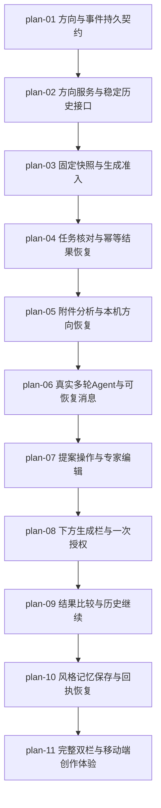

# Workspace Agent 对话式创作实现计划

## 1. 计划入口

交付 Reference → Conversation → Render：持久方向与完整消息、受校验提案、固定生成快照、可核对提交、比较恢复与Style Memory。**Send在输入框内，生成在输入框外下方，与模型、画幅、质量同区**，继承已确认交互。

- 来源：[需求](../16-0-需求设计-Workspace-Agent对话式创作.md)、[架构](../16-1-架构文档-Workspace-Agent对话式创作.md)、[确认原型](../design/workspace-agent.html)；设计系统：`docs/design/DESIGN.md`。
- 11个功能任务，3阶段；README只拥有调度、追踪与全局护栏，实施规格以任务文件为准。
- 实施已启动；任务状态和验证证据以各任务文件为准，汇总视图使用 `pnpm workflow:status`。

## 2. 执行拓扑



| 阶段 | 功能 | 目标 | 并行度 |
| --- | --- | --- | --- |
| A | plan-01–04 | 持久契约、来源接口、提交准入及结果恢复 | 1 |
| B | plan-05–07 | 可恢复附件/方向、真实Agent、提案与专家编辑 | 1 |
| C | plan-08–11 | 下方生成栏、历史比较、Memory和完整响应式体验 | 1 |

串行是实施顺序约束：各任务持续修改共享service/hook/page，不安排并发写同一状态机。每个任务以前置done为入口，独立验收当前子能力；联合AC由所有承接功能及最终旅程共同闭合。内部持久层只有plan-01使用E2E例外，公开API不因属于后端而豁免。

## 3. 验收标准追踪矩阵

| AC-ID | 需求原文 | 架构承接 | 计划承接 | 验证方式 |
| --- | --- | --- | --- | --- |
| AC-01 | 空白方向；上传/拖放/粘贴单图并发送，另以无图文字、多文件和无效图片尝试；正常启动分析；其余保留目标并明确缺项/限制，无静默忽略或自动生成 | M1/M4；6.1 上传 | plan-05, plan-11 | [plan-05](plan-05-附件分析与本机方向恢复.md#验收标准)、[plan-11](plan-11-完整双栏与移动端创作体验.md#验收标准) |
| AC-02 | 首页已提交参考或历史/风格记忆入口；进入 Workspace；前者不重复发送；后者显示真实来源、可恢复内容与缺项，无虚构过去对话 | M1/M6；6.1 进入 | plan-02, plan-05, plan-09, plan-10, plan-11 | [plan-02](plan-02-方向服务与稳定历史接口.md#验收标准)、[plan-05](plan-05-附件分析与本机方向恢复.md#验收标准)、[plan-09](plan-09-结果比较与历史继续.md#验收标准)、[plan-10](plan-10-风格记忆保存与回执恢复.md#验收标准)、[plan-11](plan-11-完整双栏与移动端创作体验.md#验收标准) |
| AC-03 | 已有参考和草稿；用不同表述要求替换主体、解释证据、调整规则，并发出超范围请求；按实际上下文回答/提案，显示真实依据；超范围明确说明，无预置回应冒充完成 | M3；6.2 单次解释 | plan-06, plan-11 | [plan-06](plan-06-真实多轮Agent与可恢复消息.md#验收标准)、[plan-11](plan-11-完整双栏与移动端创作体验.md#验收标准) |
| AC-04 | 已有保留约束或对象引用；提交含糊目标、冲突修改或失效引用；明确澄清维度/约束/对象，在确定前不改变草稿 | M2/M3；6.2 clarify | plan-06, plan-07, plan-11 | [plan-06](plan-06-真实多轮Agent与可恢复消息.md#验收标准)、[plan-07](plan-07-提案操作与专家编辑.md#验收标准)、[plan-11](plan-11-完整双栏与移动端创作体验.md#验收标准) |
| AC-05 | 可应用提案；编辑提案后应用、放弃或撤销；应用更新相应内容并保留其余项；放弃零修改；撤销恢复匹配版本且不生成 | M1/M2/M5；6.2 CAS | plan-07, plan-11 | [plan-07](plan-07-提案操作与专家编辑.md#验收标准)、[plan-11](plan-11-完整双栏与移动端创作体验.md#验收标准) |
| AC-06 | Agent 处理期间草稿已更新；应用旧提案或执行旧撤销；不覆盖新内容，要求按最新草稿重新对照或形成新提案 | M2/M5；6.2 revision conflict | plan-01, plan-02, plan-07, plan-11 | [plan-01](plan-01-方向与事件持久契约.md#验收标准)、[plan-02](plan-02-方向服务与稳定历史接口.md#验收标准)、[plan-07](plan-07-提案操作与专家编辑.md#验收标准)、[plan-11](plan-11-完整双栏与移动端创作体验.md#验收标准) |
| AC-07 | 任意页面状态；查看输入区及操作栏，发送文字和空消息；Send 始终在输入框内且不切为生成；生成在下方模型/画幅/质量区，空消息不能发送 | M1；4.2 / 6.3 GenerationBar | plan-08, plan-11 | [plan-08](plan-08-下方生成栏与一次授权.md#验收标准)、[plan-11](plan-11-完整双栏与移动端创作体验.md#验收标准) |
| AC-08 | 未发送内容、待应用提案、缺项或执行限制；尝试生成并修复阻塞；显示具体原因与修复路径，修复后可生成；允许的编辑保持可用 | M1/M2；6.3 readiness | plan-03, plan-08, plan-11 | [plan-03](plan-03-固定快照与生成准入.md#验收标准)、[plan-08](plan-08-下方生成栏与一次授权.md#验收标准)、[plan-11](plan-11-完整双栏与移动端创作体验.md#验收标准) |
| AC-09 | 当前草稿就绪；点击生成并重复点击，随后修改草稿和参数；只提交一次，显示固定原提交记录；后续编辑只影响下一轮 | M2/M4/M5；6.4 dispatch | plan-01, plan-03, plan-04, plan-08, plan-11 | [plan-01](plan-01-方向与事件持久契约.md#验收标准)、[plan-03](plan-03-固定快照与生成准入.md#验收标准)、[plan-04](plan-04-任务核对与幂等结果恢复.md#验收标准)、[plan-08](plan-08-下方生成栏与一次授权.md#验收标准)、[plan-11](plan-11-完整双栏与移动端创作体验.md#验收标准) |
| AC-10 | 当前内容及参数已展示；明确用自然语言授权生成；另发送仅修改的请求；前者无歧义且就绪时执行一次，后者仅提案；对话内不新增图像执行按钮 | M2/M3；6.2 render_request | plan-06, plan-08, plan-11 | [plan-06](plan-06-真实多轮Agent与可恢复消息.md#验收标准)、[plan-08](plan-08-下方生成栏与一次授权.md#验收标准)、[plan-11](plan-11-完整双栏与移动端创作体验.md#验收标准) |
| AC-11 | 待分析参考；核对快速复刻并从下方操作栏确认；另测试退出/改设置/失败/恢复；正常完整分析后最多自动一张，其他分支清除未消费授权，不声称取消已提交任务 | M1/M2；6.3 quick / 6.4 | plan-08, plan-11 | [plan-08](plan-08-下方生成栏与一次授权.md#验收标准)、[plan-11](plan-11-完整双栏与移动端创作体验.md#验收标准) |
| AC-12 | 已有证据和手写提示；查看证据、直接改变量、调整详细度、修改全文并接受/取消合并；来源与用户修改区分；草稿一致；手写内容未经预览同意不被替换，缺定位信息不虚构 | M1/M2/M4；6.2 / 6.3 | plan-07, plan-11 | [plan-07](plan-07-提案操作与专家编辑.md#验收标准)、[plan-11](plan-11-完整双栏与移动端创作体验.md#验收标准) |
| AC-13 | 已有旧结果且正查看/比较；新一轮完成，再选择旧结果和显式继续编辑；完成不抢选择/焦点；仅查看不恢复草稿；继续才恢复原内容与参数为新草稿 | M1/M6；4.2 / 6.4 / 6.1 | plan-09, plan-11 | [plan-09](plan-09-结果比较与历史继续.md#验收标准)、[plan-11](plan-11-完整双栏与移动端创作体验.md#验收标准) |
| AC-14 | 多轮结果；切换两种比较，引用偏差，查看较早记录、下载、设首选及作为新参考；比较对象明确、图像完整；偏差进入修改；较早记录可达；首选不验证；换参考保护原方向 | M1/M6；4.2 / 6.5 | plan-09, plan-11 | [plan-09](plan-09-结果比较与历史继续.md#验收标准)、[plan-11](plan-11-完整双栏与移动端创作体验.md#验收标准) |
| AC-15 | 当前对话含较早消息和活动任务；刷新、关闭后重新打开、返回原方向；对话/草稿/来源/真实任务状态恢复，较早消息可读，不重新执行历史动作 | M1/M5；6.1 / 7.5 | plan-01, plan-02, plan-05, plan-11 | [plan-01](plan-01-方向与事件持久契约.md#验收标准)、[plan-02](plan-02-方向服务与稳定历史接口.md#验收标准)、[plan-05](plan-05-附件分析与本机方向恢复.md#验收标准)、[plan-11](plan-11-完整双栏与移动端创作体验.md#验收标准) |
| AC-16 | 未保存更改或失效来源；新建/替换/恢复，分别取消与确认；取消保留原内容；保留或替换选择明确；旧任务归属不变；缺项不被伪造补齐 | M1/M2/M6；6.1 restore | plan-02, plan-05, plan-09, plan-11 | [plan-02](plan-02-方向服务与稳定历史接口.md#验收标准)、[plan-05](plan-05-附件分析与本机方向恢复.md#验收标准)、[plan-09](plan-09-结果比较与历史继续.md#验收标准)、[plan-11](plan-11-完整双栏与移动端创作体验.md#验收标准) |
| AC-17 | 草稿或选定结果；保存风格记忆、新建副本或更新代表结果；目标与名称明确；无代表草稿待验证，有代表仅经用户确认才验证 | M2/M6；6.5 | plan-10, plan-11 | [plan-10](plan-10-风格记忆保存与回执恢复.md#验收标准)、[plan-11](plan-11-完整双栏与移动端创作体验.md#验收标准) |
| AC-18 | 保存失败或已保存但刷新失败；重试；前者保留表单可提交；后者明确已保存且只刷新；本机保存不称已同步 | M5/M6；6.5 / 7.5 | plan-10, plan-11 | [plan-10](plan-10-风格记忆保存与回执恢复.md#验收标准)、[plan-11](plan-11-完整双栏与移动端创作体验.md#验收标准) |
| AC-19 | 上传、分析或对话分别失败；重试失败步骤；输入及已完成上下文保留，只重试对应步骤，未应用修改不显示成功 | M1/M3/M4；6.1 / 6.2 / 8.2 | plan-04, plan-05, plan-06, plan-11 | [plan-04](plan-04-任务核对与幂等结果恢复.md#验收标准)、[plan-05](plan-05-附件分析与本机方向恢复.md#验收标准)、[plan-06](plan-06-真实多轮Agent与可恢复消息.md#验收标准)、[plan-11](plan-11-完整双栏与移动端创作体验.md#验收标准) |
| AC-20 | 提交结果未知或生成明确失败；核对/重试原提交/按现草稿生成；未知先核对不重复提交；失败恢复区分内容与参数，执行仍位于下方操作栏 | M2/M4；6.4 unknown | plan-03, plan-04, plan-08, plan-11 | [plan-03](plan-03-固定快照与生成准入.md#验收标准)、[plan-04](plan-04-任务核对与幂等结果恢复.md#验收标准)、[plan-08](plan-08-下方生成栏与一次授权.md#验收标准)、[plan-11](plan-11-完整双栏与移动端创作体验.md#验收标准) |
| AC-21 | 图片预览/下载/历史加载失败，或登录/服务限制；恢复可用操作并重试；不连带重新生成，不覆盖当前草稿；登录或服务恢复不自动重放任务 | M1/M4/M6；6.5 / 8.2 | plan-04, plan-05, plan-09, plan-10, plan-11 | [plan-04](plan-04-任务核对与幂等结果恢复.md#验收标准)、[plan-05](plan-05-附件分析与本机方向恢复.md#验收标准)、[plan-09](plan-09-结果比较与历史继续.md#验收标准)、[plan-10](plan-10-风格记忆保存与回执恢复.md#验收标准)、[plan-11](plan-11-完整双栏与移动端创作体验.md#验收标准) |
| AC-22 | 桌面、中屏、手机及浅/深主题；切页签、编辑、键盘操作、中文候选确认、软键盘输入；无水平溢出/遮挡；对象与输入保留；生成栏在输入框外下方；候选确认不发送；焦点和状态可理解 | M1；4.2 / Phase C | plan-11 | [plan-11](plan-11-完整双栏与移动端创作体验.md#验收标准) |

## 4. 功能索引

| 功能 | 文件 | 依赖 | 交付边界 |
| --- | --- | --- | --- |
| plan-01 | [方向与事件持久契约](plan-01-方向与事件持久契约.md) | 无 | 仓储可以保存方向、完整事件和提交阶段，并在并发写入时拒绝旧版本 |
| plan-02 | [方向服务与稳定历史接口](plan-02-方向服务与稳定历史接口.md) | plan-01 | 调用者可以从真实来源创建方向并读取草稿及较早消息 |
| plan-03 | [固定快照与生成准入](plan-03-固定快照与生成准入.md) | plan-02 | 生成入口会固化提交内容和模型绑定，重复意图返回原任务 |
| plan-04 | [任务核对与幂等结果恢复](plan-04-任务核对与幂等结果恢复.md) | plan-03 | 已知外部任务可以由回调或读取核对恢复完成，重复回调只有一张资产和一条结果事件 |
| plan-05 | [附件分析与本机方向恢复](plan-05-附件分析与本机方向恢复.md) | plan-04 | 空白方向可发送单张参考，分析失败保留图片和目标，只重试失败阶段 |
| plan-06 | [真实多轮Agent与可恢复消息](plan-06-真实多轮Agent与可恢复消息.md) | plan-05 | 用户以不同说法提出修改或询问证据，会看到基于当前草稿的回答、澄清或待应用提案 |
| plan-07 | [提案操作与专家编辑](plan-07-提案操作与专家编辑.md) | plan-06 | 用户可以编辑提案后应用、放弃或撤销，看到具体差异 |
| plan-08 | [下方生成栏与一次授权](plan-08-下方生成栏与一次授权.md) | plan-07 | 输入框内始终是Send，生成按钮位于框外下方的模型、画幅、质量区域 |
| plan-09 | [结果比较与历史继续](plan-09-结果比较与历史继续.md) | plan-08 | 结果完成只提示有新图，不抢走用户正在查看的旧图或焦点 |
| plan-10 | [风格记忆保存与回执恢复](plan-10-风格记忆保存与回执恢复.md) | plan-09 | 草稿和选定结果能分别保存为Style Memory，目标名称与代表图确认明确 |
| plan-11 | [完整双栏与移动端创作体验](plan-11-完整双栏与移动端创作体验.md) | plan-10 | 桌面以对话和画布双栏呈现完整创作流程，手机通过页签切换且输入与生成栏始终可达 |

## 5. 开发状态机

运行 `pnpm workflow:status` 从任务文件生成状态视图，不手写步骤状态表。执行遵循 red→implement/green→独立task-review；implementer最多推进review，只有task-review可推进done。计划accepted还要求最终验收门通过，不能仅凭全部任务done推断已验收或已发布。

## 6. 全局护栏

- ADR-1/3：两张新表，DB为提交事实SSOT、IndexedDB仅未提交；CAS版本与观看状态分离，不新增协作/会话产品。
- ADR-2：单次受约束Agent调用，复用structurer绑定，不直接写业务数据、不自动修复循环、不自由调用工具。
- ADR-4/5：稳定requestKey、事务意图、唯一发送权；unknown隔离，读操作不触发付费创建；await响应期工作，不引入队列/Worker或后台Promise。
- ADR-6：固定下方生成栏；真实model/aspect SSOT、未映射HD不可用、negative能力诚实，原型4:5不新增模型能力。
- ADR-7：真实来源和已有Memory验证定义；查看不恢复、首选不验证、回读失败不重新保存。
- 领域枚举、状态机及10个主要API契约完整继承架构§7，新增upload/Memory兼容字段仍由原路由拥有。不能只按AC摘要省略字段校验、归属或失败语义。
- 预算为建议配置，不是消费授权；本文不运行真实收费推理。跨用户引用、模型低信任输入、媒体URL和敏感日志约束适用于全部相关任务。
- 必需相邻测试、类型、fixture、配置允许按任务记账；create仅一个owner，下游modify前置产物须已交付。schema迁移序号竞争只调整实际文件路径并记录，不能覆盖既有迁移。

NFR落点（具体实现与验收只由所列任务拥有，最终布局回归不重复实施）：

| 架构约束 | 主要owner | 证据 |
| --- | --- | --- |
| §8.1 读取/命令p95<500ms | plan-02 | 真实DB API采样 |
| §8.1 45s/60s，§8.4 12k/2k | plan-06 | 解释器计数/假时钟/超限测试 |
| §8.1 120s/300s/查询≥5s | plan-04 | 恢复故障注入与CAS测试 |
| §8.1 前台2→5s/后台暂停 | plan-05 | hook时钟与可见性测试 |
| §8.1 单活跃与10/min、60/hour、20gen/hour，§8.4预算 | plan-03 | 真实DB并发与额度临界测试 |
| §7.5 本机300ms/动作前flush | plan-05 | IndexedDB恢复和关闭重开 |
| §8.2 完整降级呈现 | plan-11 | journey故障场景，visual可达性 |
| §8.3 安全与§8.5日志 | 各API所属任务 | 所有权/非法输入/日志脱敏测试 |
| §8.6 部署请求≥240s及预算校准/告警 | plan-04记录边界，部署阶段落实 | 部署前核验，不以代码测试冒充 |

## 7. 执行前置与全局验证

1. `pnpm doctor`与冻结依赖安装；Node25.9.0/pnpm11.11.0，Chromium。仅缺环境时补齐，不重复初始化或读取凭据值。
2. plan-01交付`node scripts/test-workspace-db.mjs`：通过独立临时PostgreSQL测试库运行仓储integration；支持`--e2e <spec>`设置测试DATABASE_URL和专用随机AUTH_SECRET，启动独立Next测试服务，再调用指定workspace spec，finally销毁仅本次库。隔离服务必须不复用现有开发server，可在运行器生成临时Playwright配置/端口；不要修改现有用户数据库或依赖默认真实用户。plan-02补测试用户/来源fixture。运行器可在临时目录生成配置，新增持久fixture按邻近配置许可记录。
3. API E2E覆盖真实HTTP、Auth.js归属与DB事实，禁止mock被测端点；其不收费的种子任务/重用/拒绝路径与外部边界mock的服务integration互补。UI E2E按现有mock-api模式可重复运行；两类报告不得混称真实Provider已通过。
4. 任务验证记录包含实际red命令/退出码/缺失行为、最终green命令/退出码/文件状态、可访问报告。环境失败不算red；文件变更后旧green不能复用。内部例外只有plan-01，仍须integration red/green和独立review。
5. 无额外人工UAT门。真Provider实测、部署、生产健康及其运行预算在后续授权范围内单独记录，未运行不声称完成。浏览器IME/键盘自动化无法覆盖设备行为时记录具体剩余设备验证，不伪造真机通过。

全局验证（实施阶段最终状态）：

```bash
pnpm workflow:check
pnpm test:workflow
pnpm verify:fast
node scripts/test-workspace-db.mjs
node scripts/test-workspace-db.mjs --e2e e2e/workspace-agent-directions-api.spec.ts
node scripts/test-workspace-db.mjs --e2e e2e/workspace-agent-submission-api.spec.ts
node scripts/test-workspace-db.mjs --e2e e2e/workspace-agent-recovery-api.spec.ts
pnpm verify:acceptance
pnpm e2e:smoke
```

verify:acceptance包含verify:fast与build时可复用同一次最终检查，不机械重复；它不含完整smoke，需补跑。plan-11将新UI specs纳入e2e:targeted，API真实DB测试通过专用运行器单独必跑。各中间UI任务在发生布局变化时即将自己的spec加入targeted并完成视觉门，plan-11负责最终集合核对。跨层任务的verify:full可由相同最终状态下fast+build+smoke证据覆盖。只有全部非deprecated任务done、AC全闭合、上述适用门通过才可accepted；本计划未部署，不能设released。

## 8. 未决策项与变更记录

open_questions为空：架构方案已确定，没有需要用户补选的产品决策。测试库、fixture与串行顺序是可逆实施细节；真实部署请求时限/价格/告警配置在部署阶段核验，不阻塞本次计划交付。

### 需求变更

未改变已确认PRD、架构或交互范围。本次仅按功能拆分文件owner、依赖、验收及证据，未修改应用代码或执行开发任务。

| 类型 | 日期 | 内容 |
| --- | --- | --- |
| 新建 | 2026-09-08 | v2计划，11个任务、3阶段，保留全部22条AC及9个US |
| 实施细化 | 2026-09-08 | 明确隔离DB/API测试运行器、一次create owner与串行共享文件策略 |

### 2026-09-11 需求变更：移除移动端兼容

用户于 2026-09-11 决定项目不涉及移动端：移除 <768px Conversation/Canvas 页签、软键盘/安全区避让与移动端测试及视觉基线；DESIGN.md 已标注仅桌面端。此变更不改变桌面端已确认交互（Send 在输入框内，生成在下方模型/画幅/质量区）。
