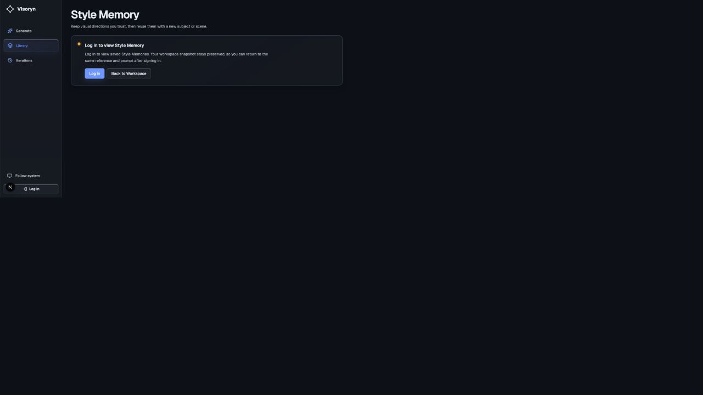
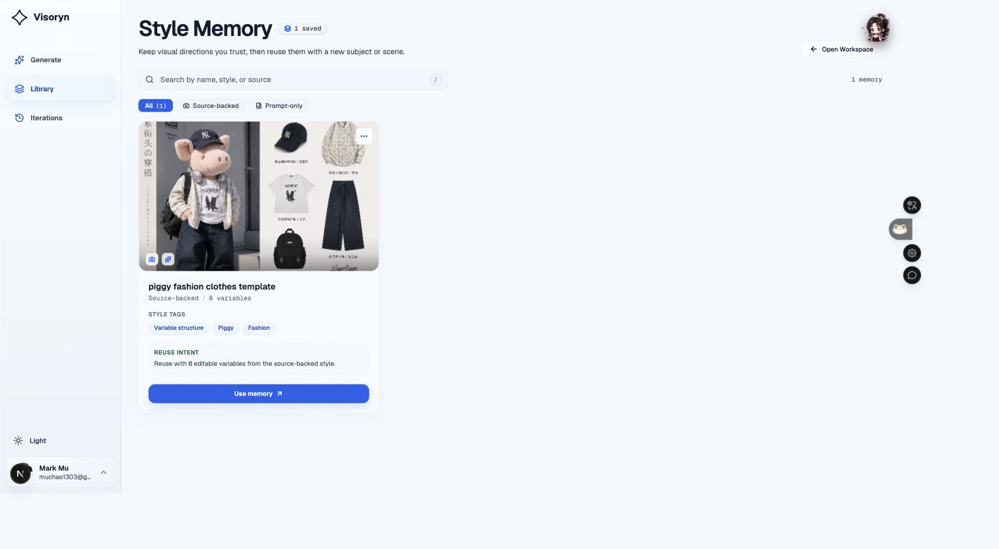
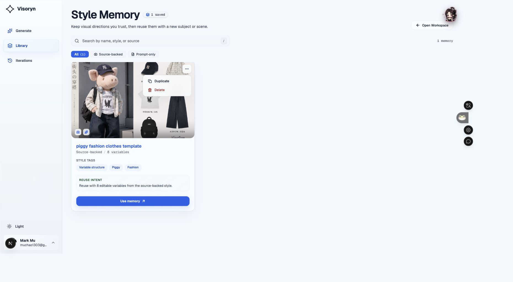
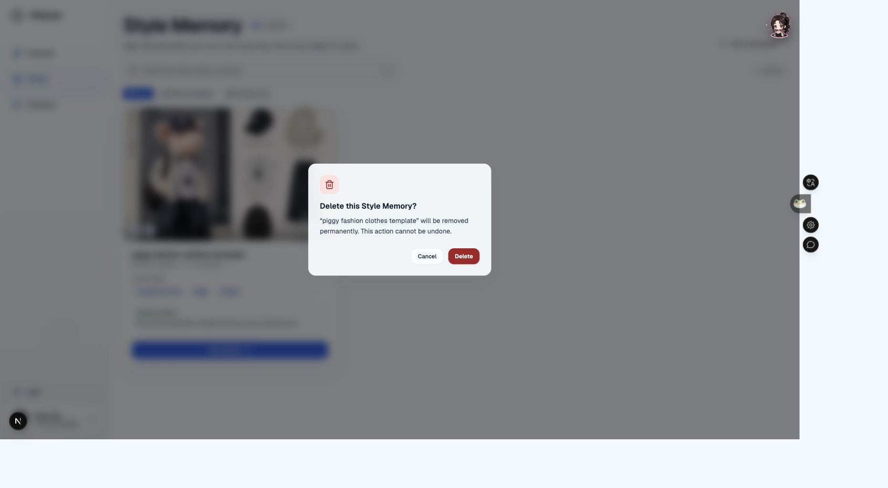
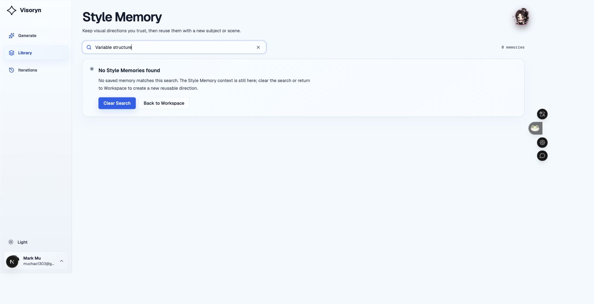
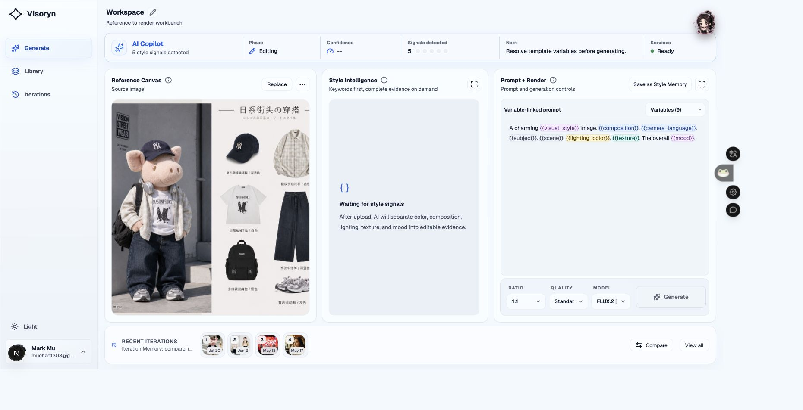
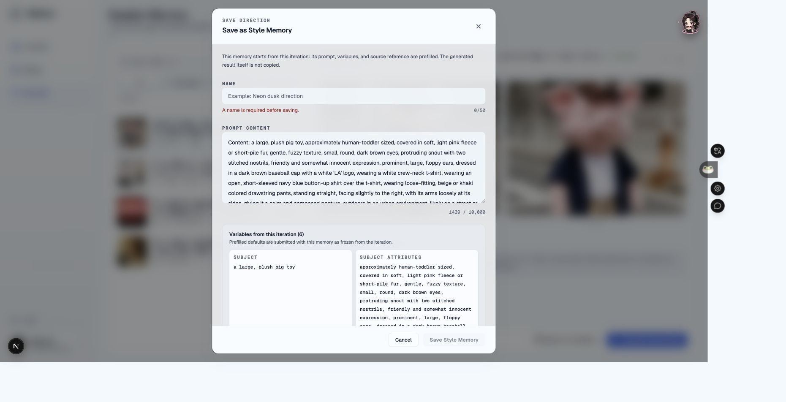

# Style Memory 产品设计、交互设计与可访问性联合审查

- 审查日期：2026-08-24
- 审查模式：Combined audit（产品语义、交互、视觉层级、可访问性）
- 审查对象：当前 `Style Memory` 核心体验
- 主要用户目标：找到可信的可复用风格资产，理解它保留了什么、由什么结果验证，并安全地继续创作
- 设计基准：[PRODUCT.md](../../../PRODUCT.md)、[The Precision Frame](../../design/DESIGN.md)、[Viko 竞品调研](../../13-需求调研-Viko竞品分析与style-gen优化机会.md)

## 总体结论

**当前 Style Memory 已经是一个完成度不错的“模板库外壳”，但还没有成为用户能够理解和信任的“风格记忆”。**

页面在视觉上安静、清晰，入口、卡片、主操作和异常状态基本连通；从成功 Iteration 保存、从 Memory 返回 Workspace 也已经能走通。然而，核心信息架构仍然主要围绕“来源图 + Prompt + 变量数”组织，无法稳定回答三个最重要的问题：

1. 这条 Memory 具体保留了哪些可迁移风格？
2. 哪个生成结果证明这套风格方向有效？
3. 再次使用时，哪些内容会保留、哪些内容需要替换？

因此，当前产品语义更接近“带来源图的 Prompt Template”，与 Iteration Memory、普通模板和最终作品的差异主要依赖文案解释，而没有被数据、页面结构和复用过渡共同证明。

综合健康度：**2.5 / 5，建议在扩大批量、插件或更多资产类型之前，先完成 Style Memory 的语义与可信复用闭环。**

## 审查范围与证据方法

本次所有截图均为 2026-08-24 在本地当前版本中重新捕获并逐张检查的实际界面：

- 在应用内浏览器捕获未登录状态。
- 在用户已有登录状态的 Chrome 本地会话中只读检查真实 Memory、真实 Iteration 和 Workspace 恢复结果。
- 未执行 Duplicate、最终 Delete、最终 Save、Generate 等会改动持久数据或产生费用的动作。
- 代码和产品文档只作为截图结论的辅助解释，不替代截图证据。

## 编号步骤与健康度

| 步骤 | 场景 | 健康度 | 结论 |
| --- | --- | --- | --- |
| 01 | 未登录进入 Style Memory | 良好 | 清楚说明需要登录、工作区上下文仍会保留，以及下一步动作。 |
| 02 | 已登录资产列表与卡片 | 需改进 | 页面层级清晰，但卡片展示的是来源图、名称派生标签和变量数，缺少真实风格语义与验证证据。 |
| 03 | 卡片更多操作 | 较差 | 仅有 Duplicate 和 Delete；没有查看详情、编辑、重命名或审查保存内容的入口。 |
| 04 | 删除确认 | 一般 | 不可逆后果表达清楚，但没有说明来源 Iteration、结果和 Workspace 是否仍会保留；焦点管理失效。 |
| 05 | 搜索可见标签 | 较差 | 搜索框承诺按 style 搜索，但输入卡片上可见的 `Variable structure` 返回 0 个结果。 |
| 06 | Use memory 进入 Workspace | 较差 | 上下文确实恢复，但 Memory 身份消失，页面同时显示“5 style signals detected”和“Waiting for style signals”。 |
| 07 | 从成功 Iteration 保存 Memory | 一般 | 来源、Prompt、变量被清楚预填，但成功 Result 明确不会被保存，且没有不变量/排除项的复核与验证状态。 |

## 截图证据

### Step 01 - 未登录态



优点：符合三段式状态语言——发生了什么、什么仍被保留、下一步是什么。

### Step 02 - Style Memory 资产列表



可见信息为来源图、名称、`Source-backed`、变量数、名称派生标签和通用 Reuse intent。页面看起来专业，但信息不足以判断这是不是一条经过验证的风格方向。

### Step 03 - 卡片操作菜单



菜单只有 Duplicate 和 Delete，没有详情或编辑入口。用户无法在不进入 Workspace 的情况下确认 Prompt、变量默认值、来源 Iteration、成功 Result 或删除影响。

### Step 04 - 删除确认



危险动作视觉明确，但说明只强调永久删除，没有解释“只删除 Memory，来源 Iteration 和生成结果仍保留”之类的边界。

### Step 05 - 可见标签无法搜索



卡片中可见的 `Variable structure` 被输入到“Search by name, style, or source”，结果为 0。用户会推断搜索索引与页面信息并非同一事实源。

### Step 06 - 从 Memory 继续创作



来源图和 9 个变量已恢复，但 Workspace 没有显示当前使用的 Memory 名称或来源。AI Copilot 显示“5 style signals detected”，Style Intelligence 却显示“Waiting for style signals”；Generate 被禁用，但没有指出具体缺失变量。

### Step 07 - 从成功 Iteration 保存



对话框诚实说明“生成结果本身不会复制”，并预填 Prompt 与 6 个变量。但这也意味着用户从成功结果发起保存后，Library 仍无法证明该 Memory 曾被哪个结果验证。

## 按严重度排序的问题

### P0-1：核心产品语义尚未成立

证据：Step 02、Step 06、Step 07。

当前卡片没有真实 Style Fingerprint、不变量、Negative Constraints、代表 Result、来源 Iteration、最近使用或派生次数。可见标签中的 `Piggy`、`Fashion` 更接近名称或主体词，而不是可迁移风格规则；`Reuse with 8 editable variables...` 是规则文案，不是用户确认的复用意图。

结果是：用户能知道“它有来源图和 8 个变量”，但不知道“应该信任它保留什么”。这与 PRODUCT.md 的“证据先于信任”不一致。

### P0-2：Use Memory 后丢失来源身份，并出现互相矛盾的系统状态

证据：Step 06。

进入 Workspace 后，页面没有持续显示 `Using: piggy fashion clothes template`，也没有将 Memory 来源、版本和保存时的验证结果带入当前方向。与此同时：

- AI Copilot：`5 style signals detected`
- Style Intelligence：`Waiting for style signals`
- Next：`Resolve template variables before generating`
- Generate：disabled，但未标出具体未完成项

用户无法判断 Memory 是否完整恢复、风格证据是否存在、系统为何不可生成。这是可信度和任务连通性的结构性问题，不是文案润色问题。

### P0-3：模态对话框没有把键盘焦点移入并锁定在对话框内

证据：Step 04、Step 07；本次实时键盘检查确认。

- 打开删除确认后，`document.activeElement` 为 `BODY`。
- 打开保存对话框后，焦点仍停留在背景中的 `Save as Style Memory` 按钮。
- 再按一次 Tab，焦点移动到背景中的 `Continue this direction`，而不是对话框内控件。

虽然 DOM 中存在 `role="alertdialog"/"dialog"` 与 `aria-modal="true"`，但背景仍可进入键盘顺序。键盘用户和屏幕阅读器用户可能在看见模态层时继续操作被遮挡的页面。

### P1-1：搜索承诺与实际可搜索信息不一致

证据：Step 02、Step 05。

搜索框写着“name, style, or source”，但卡片可见的 `Variable structure` 不能搜索。当前页面信息与搜索索引脱节，会让用户无法形成稳定的检索模型。随着 Memory 增多，这会快速成为复用率瓶颈。

### P1-2：缺少查看、编辑和解释 Memory 的详情层

证据：Step 03。

用户只有 `Use memory`、Duplicate、Delete，无法执行：

- 查看完整 Prompt 与变量默认值。
- 查看来源 Iteration、Reference、代表 Result。
- 修改名称、复用意图或变量默认值。
- 确认删除会影响哪些关联资产。

这使 Library 只能“启动使用”，不能承担资产治理与信任建立。

### P1-3：保存流程强调 Prompt 文本，却没有让用户确认“风格记忆”

证据：Step 07。

保存对话框的视觉重心是 1439 字符 Prompt 和长变量列表。用户没有机会确认：

- 哪 3-5 条规则必须保留。
- 哪些内容是主体/场景变量。
- 哪些内容应该排除。
- 当前成功 Result 是否作为验证证据。
- 这是一条草稿 Memory 还是用户认可的 Verified Memory。

此外，“A name is required before saving”在对话框刚打开、用户尚未操作时就以错误色出现，属于过早报错；此时更适合作为中性帮助文案。

### P1-4：删除说明没有遵循“什么仍被保留”的信任规则

证据：Step 04。

确认层说明“永久删除且不可恢复”，但没有说明来源 Reference、Iteration、Result、Workspace 是否会受到影响。对于存在关联关系的资产，用户需要知道删除边界，而不只是不可逆性。

### P1-5：从 Library 到 Workspace 缺少复用预检

证据：Step 02、Step 06。

`Use memory` 直接跳转并恢复旧主体、旧场景和旧变量。页面说明声称 Memory 用于“new subject or scene”，实际没有先让用户选择哪些变量要替换、哪些不变量要锁定，也没有展示当前 Workspace 是否会被替换。即使数据正确，用户也需要重新理解一个复杂工作台。

### P2-1：`Library`、`Style Memory`、`Source-backed` 和 `Prompt-only` 的词汇层级不够统一

证据：Step 02。

侧栏可见名称是 `Library`，页面名称是 `Style Memory`；筛选条件又采用偏实现语义的 `Source-backed` / `Prompt-only`。这些词都能理解，但没有共同解释“这是可复用的风格规则，而不是作品库或历史记录”。

### P2-2：卡片空间使用适合图库，但不适合快速比较可信度

证据：Step 02。

来源图占据最强视觉权重，而来源图不是验证成功的 Result。卡片真正影响复用决策的信息较弱，单条 Memory 时页面又出现大量空白。未来扩容时应优先比较“风格规则、验证状态、使用情况”，而不是仅扩大图片网格。

## 已确认的优点

1. **入口清楚**：侧栏 Library、页面标题和 `Open Workspace` 形成稳定导航（Step 02）。
2. **状态恢复文案成熟**：未登录态和搜索无结果态都说明上下文仍保留以及下一步（Step 01、Step 05）。
3. **卡片只有一个主 CTA**：`Use memory` 足够醒目，没有多个同级主操作竞争（Step 02）。
4. **删除风险表达明确**：红色危险动作、对象名称和不可撤销说明均清晰（Step 04）。
5. **保存来源说明诚实**：明确说明 Prompt、变量、来源 Reference 会预填，而生成 Result 不会复制，没有虚构保存内容（Step 07）。
6. **从 Memory 恢复数据已连通**：真实测试中来源图、Prompt 模板和变量成功进入 Workspace（Step 06）。

## 可访问性风险

### 已确认风险

- **对话框焦点未管理（高）**：保存与删除对话框打开后焦点不进入弹层，且能 Tab 到背景控件（Step 04、Step 07）。
- **更多操作菜单语义不足（中）**：触发器声明 `aria-haspopup="menu"`，实际快照中 Duplicate/Delete 仍是普通按钮，未形成可识别的 menu/menuitem 结构（Step 03）。
- **触控目标偏小（中）**：卡片 More actions 约 32×32，搜索 Clear 约 24×24，可能低于舒适触控目标（Step 02、Step 05）。
- **状态矛盾影响辅助技术理解（高）**：同屏的“检测到 5 个信号”和“等待风格信号”会让线性阅读更加困惑（Step 06）。

### 已确认的可访问性优点

- 页面有单一 H1，主区域、搜索区域、列表和详情区域具备可识别结构。
- 图片提供与 Memory 名称相关的替代文本。
- 搜索结果数量与状态区使用 live region 语义。
- Delete 使用 alertdialog，Save 使用 dialog，并声明 aria-modal；基础语义存在，只需补齐焦点和背景隔离。

## 推荐方案

### P0：先把 Style Memory 定义为“被结果验证过的可复用风格规则”

新增统一详情模型，至少包含：

1. **Preserved style**：真实 Style Fingerprint、用户确认的不变量、modifiers、Negative Constraints。
2. **Validated by**：来源 Reference、保存来源 Iteration、代表 Result、用户认可时间；区分 Draft / Generated / User validated。
3. **Reuse contract**：可编辑变量、默认值、锁定项，以及再次使用会保留和替换什么。
4. **Usage evidence**：最近使用、复用次数、派生 Iteration 数。

卡片只展示决策最需要的 3-5 个真实信号：验证状态、代表 Result/来源 Reference、核心不变量、变量数、最近使用。移除由名称推导、却看起来像事实的标签。

### P0：修复复用过渡和状态一致性

`Use memory` 后应在 Workspace 持续显示：

- `Using Style Memory: {name}`
- 版本或保存时间
- 已恢复的不变量数量
- 尚未填写的变量列表
- 来源和代表 Result 的入口

在跳转前提供轻量复用预检：选择“打开为新方向”或“替换当前 Workspace”，并让用户先改 Subject/Scene。所有状态栏从同一份 readiness 事实派生，避免 Copilot 与 Style Intelligence 冲突。

### P0：把对话框焦点作为发布阻断项修复

- 打开后把焦点移到标题或第一个可操作控件。
- 背景使用 `inert` 或等效机制移出键盘与辅助技术树。
- Tab/Shift+Tab 锁定在对话框内。
- Escape 关闭后将焦点还给触发按钮。
- 删除弹层优先聚焦 Cancel，保存弹层优先聚焦 Name。

### P1：建立 Memory 详情、编辑和可解释搜索

- 点击卡片或菜单中的 View details 打开统一详情。
- 支持 Rename、Edit reuse defaults、Replace representative result。
- 搜索真实索引：名称、Style Fingerprint、不变量、变量、来源和用户标签。
- 筛选优先支持 Validated / Draft、最近使用、Source-backed / Prompt-only；筛选项与卡片同一事实源。

### P1：重构从 Iteration 保存的决策顺序

保存对话框第一屏建议按以下顺序：

1. Reference 与成功 Result 并排。
2. “这次保留成功的风格”——默认选中 3-5 个高置信不变量，允许用户确认。
3. “下次可替换的内容”——Subject、Scene 等变量。
4. Name 和 Save。
5. Prompt 全文进入 Advanced disclosure，而不是成为第一视觉重心。

如果 Result 不保存，应明确将 Memory 标为 Draft；如果用户从成功 Iteration 发起并选择代表 Result，则标记为 User validated。

### P1：明确删除边界

改为类似：

> Delete this Style Memory? The reusable recipe will be removed. Its source Iteration, Reference, and generated Result will stay in Iteration Memory.

若事实并非如此，则必须按真实关联关系写明影响。

### P2：统一产品语言和视觉比较密度

- 侧栏可见名称优先使用 `Style Memory`，或在 Library 下明确分区，避免与未来作品库混淆。
- 将 `Source-backed / Prompt-only` 转译为用户价值，例如 `Reference + evidence / Prompt only`。
- 单条资产时缩短卡片宽度并加入“如何形成高质量 Memory”的引导；多资产时提供列表/网格切换以提高信息比较效率。
- 将 More actions、Clear Search 等高频小控件扩展到至少 40-44px 舒适目标。

## 建议的目标心智模型

| 对象 | 用户问题 | 产品应提供的答案 |
| --- | --- | --- |
| Reference | 我从什么图开始？ | 原始观察依据，不代表成功结果。 |
| Iteration Memory | 这一次具体尝试发生了什么？ | 当次 Evidence、Prompt、参数、状态与 Result。 |
| Result | 我得到了什么作品？ | 一张具体输出，可被选择为代表结果。 |
| Style Memory | 什么风格值得再次复用？ | 被用户确认、由 Result 验证、可编辑且可追溯的风格规则。 |

## 推荐目标流程

```text
成功 Iteration
  → 选择代表 Result
  → 确认保留的不变量与排除项
  → 定义可替换变量
  → 保存为 Draft / User validated Style Memory
  → 在 Library 查看证据与使用情况
  → Use memory 复用预检
  → Workspace 持续显示 Memory 来源与缺失变量
  → 新 Iteration 自动关联回 Memory
```

## 证据限制与未覆盖项

- 当前账号只有 1 条 Style Memory，未能通过截图验证大量资产下的分页、排序、密集比较和性能表现。
- Duplicate 会创建新数据，因此只检查到菜单入口，没有执行完成态或失败态。
- Delete 会永久删除数据，因此只检查确认层，没有执行成功/失败反馈。
- Save 会创建新 Memory，因此只检查预填、校验和对话框状态，没有提交。
- Generate 可能产生外部调用和费用，因此未执行从 Memory 到新 Result 的最终生成链路。
- 当前真实数据没有 prompt-only Memory，未截图验证该卡片类型。
- 未获得真实服务错误、完全空库、处理中或保存冲突状态的截图。
- 尝试检查 390×844 响应式状态时，外部浏览器没有实际应用视口覆盖；该截图已拒绝，不对移动端重排作确认结论。
- 截图和有限键盘测试不能证明完整 WCAG 合规；颜色对比、200%/400% 缩放、屏幕阅读器朗读、reduced motion、触控设备和多语言仍需专项验证。

## 建议优先级小结

1. **P0**：真实 Style Memory 语义与验证证据。
2. **P0**：复用来源持续可见、readiness 状态一致。
3. **P0**：所有对话框焦点进入、锁定和恢复。
4. **P1**：详情/编辑/可解释搜索。
5. **P1**：从成功 Iteration 保存时确认代表 Result 与不变量。
6. **P2**：产品语言、触控目标和资产密度优化。
